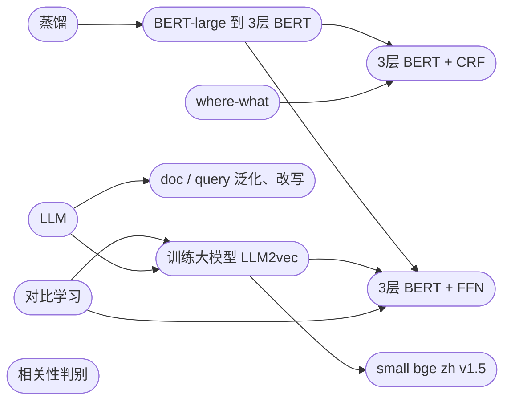


蒸馏(BERT类)、对比学习、NER、相关性、向量表示(文本向量、u2i、i2i 的方案)

引导(无结果、空搜(前置页、sug中间页）、有词搜索、默认词、列表页引导)

摘要生成

query 泛化、doc 泛化、长难 query 理解

​  

​  

1.  地标

1.  **技术迭代**

1.  **where-what**

1.  **传统的NER信号拼接 -> textCNN -> BERT-CRF(对抗的哪些迭代 + 蒸馏) ->** **大模型的应用**
2.  **评估数据集是怎么构建的，类型有哪些，交叉业务怎么定义的，最终指标**

2.  **相关性**

1.  **编辑距离+Jaccard 等规则 -> xgb 模型(挖掘特征，如名称、地址) -> 改造版 ESIM -> 在线 BERT(蒸馏版) ->** **融合大模型的应用**
2.  **评估数据集是怎么构建的，类型有哪些，最终指标**

3.  **混合排序**

1.  **base 就是 xgb 模型，挖掘特征，文本特征、热度特征、点击分布特征、位置距离特征**

2.  产品迭代

1.  **地标框架迭代(百花园 -> Feed 流样式)**
2.  美团前置页地标直达(mock 数据)
3.  Sug POI 直达列表页(mock 数据)
4.  **地标下的筛选器优化(新增地标+X 情况下 ,X部分的意图识别能力)**
5.  地标框架下各业务的优化

1.  **医疗新动线(医院识别优化、露出科室相关信息)**
2.  商场新动线(接入商场内外筛选项、商场分部展示优化)
3.  **酒店业务优化(扩大召回半径，cell 展示优化，接入民宿供给)**
4.  接入到家供给(外卖、小象超市)
5.  **旅游业务优化，精搜信号的识别**

3.  各业务接入：**针对业务特点，在大搜的基础上，做了补充识别，突出不同点**

1.  酒店列表页接入地标
2.  民宿接入地标
3.  美食频道内接入地标
4.  酒店 sug 接入地标（和业务定义一致）
5.  大搜 sug 接入地标（和大搜定义一致）

4.  指标

1.  地标主点的QV、UV、UVCTR
2.  列表页的点击 QV、UV、UVCTR、UVCVR
3.  主点类型分布，各类型下的指标，尤其是商场、景点、医院下的指标，特殊召回策略
4.  地标样式下，各bu供给的指标，如酒店的曝光量，占比啥的
5.  各个频道内的地标流量占比，转化情况
6.  纯地标、地标+x 的流量占比，where 平均长度之类的数据
7.  ndcg、badcase 指标，以及任内的变化情况

2.  酒店优化

1.  **酒店业务的指标**

1.  **（瑞晶那个）、大搜的指标（UV多少，占大搜的比例，与频道内的流量占比、各种类型的搜索词的流量占比）**

2.  **技术迭代**

1.  **向量相关**

1.  **i2i 召回**
2.  **u2i 召回**
3.  **query 向量召回(腾达搞的那个)**
4.  **交互式推荐**

2.  **个性化引导相关**

1.  **快捷指令**
2.  **实时 summary 摘要base 版：场景 2/3/4/5**
3.  **空搜 summary 投放**
4.  **默认词：geohash 召回周围200m 内poi，热门地标、全域实时点击行为、（加入 AI 投放词）**
5.  **AI 投放词：中间页、前置页、sug 投放**
6.  **民宿的 AI：**

1.  **sug 投放 + summary 摘要**

3.  **区域召回**

1.  **目的地推荐**
2.  **热区召回**
3.  **跨城召回**

4.  **召回链路优化**

1.  **标签挖掘 && 标签链接**
2.  **doc 泛化**
3.  **query 泛化(bge 向量相关性召回、大模型在线生成)**
4.  **在线查询理解**

5.  **异地识别优化**

3.  酒店产品迭代

1.  接入真便宜供给

1.  初版接入
2.  接入搜索功能
3.  接入 POI 主链路

2.  接入团购
3.  接入门票免费 POI 供给
4.  接入住吧中插卡到主链路

4.  非我主导的项目信息

1.  DQU 八大信号是如何做的，从数据集构建到模型结构、评估体系、指标变化等
2.  酒店排序时如何做的

