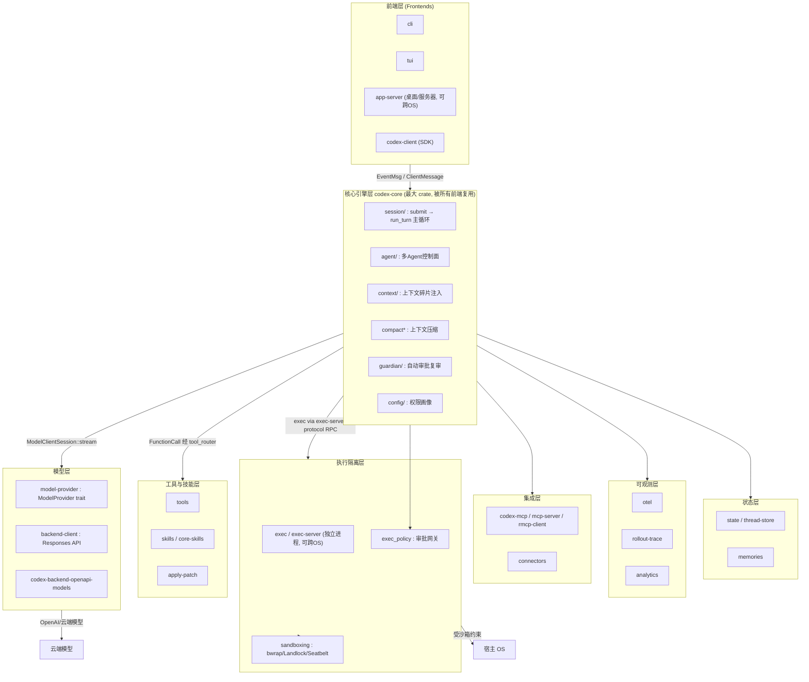
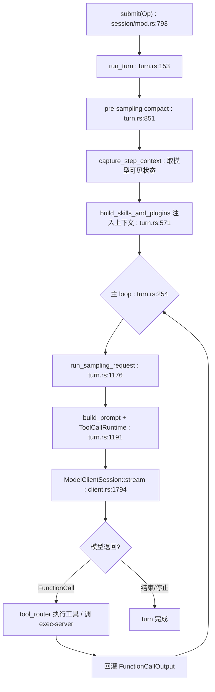


> 《Codex Agent / Harness 深度解剖》系列 · 第 1 篇  
> 源码基准：OpenAI Codex（Apache-2.0，Rust monorepo）`codex-rs/`、`codex-rs/Cargo.toml`、`codex-rs/core/src`、`codex-rs/protocol/src`  
> 阅读方式：本文由直觉到实现逐步推进，不分层级，可随读随停。

---

# 1\. Harness 解剖学：model + harness 与 Codex 全景架构

> 一句话：**模型是大脑，Harness 是身体与操作系统。** 框架给你乐高积木，harness 直接给你一台能上路的车——Codex 就是后者。

---

## 三个词为什么总被混用

今天谈 Agent，工程师口头上把三个词换来换去：**framework、runtime、harness**。它们不是同义词，边界一旦模糊，架构讨论就变成鸡同鸭讲。

-   **Framework（框架）** 提供可组合的**编程原语**——链、图、记忆抽象、retriever 接口。LangChain 的 `Chain`/`Runnable`、LangGraph 的 `StateGraph` 是典型。它的价值在"怎么把逻辑拼起来"，对"模型如何落地成一个可执行进程"几乎不负责任：进程生命周期、沙箱、审批、流式协议都交给调用方。

-   **Runtime（运行时）** 把"跑一次 agent"这件事托管起来——会话管理、并发、取消、流式事件分发。它是一个**托管环境**，本身不含"如何驱动模型"的策略。

-   **Harness（具身套件）** 把"大脑"和"身体"缝合成一个能干活的整体。模型负责推理，harness 负责**把推理翻译成对真实世界的动作**：调用工具、执行命令、读写文件、请求审批、在沙箱里隔离副作用，再把结果喂回模型。它既是 runtime，又比 runtime 多一层**领域语义**——它知道"编码 agent"意味着什么。

一句话心智模型：

> **Model 是大脑，Harness 是身体与操作系统。Framework 只给你乐高积木；Harness 直接给你一台能上路的车。**

Codex 的定位正落在 **runtime + harness** 这一格（类比 Anthropic 的 Claude Agent SDK），而不是 LangChain 式 framework。它的核心交付物不是"一套可组合的抽象"，而是一个**可复用的 Agent 引擎** `codex-core`，上层挂任意前端，底层用沙箱 + 审批 + Guardian 复审约束"模型执行外部命令"这个高危动作。仓库自述 `AGENTS.md:74` 明确写道 `codex-core` "is the largest crate"，官方要求 **"resist adding code to codex-core"**（`AGENTS.md:76`）——这本身就说明 Codex 的架构哲学：**harness 能力不断从 core 向外抽，core 只保留引擎本质**。

---

## model + harness：把 agent 拆成"大脑"和"身体"

`model + harness` 把 agent 拆成两半，二者通过**一份结构化协议**对话：

```plain
┌─────────────── model（大脑）──────────────┐      ┌──────── harness（身体）────────┐
│ 接收上下文 → 输出 reasoning + tool_call      │ ←→  │ 接收 tool_call → 执行 → 回灌结果   │
│ 不知道 OS、不持有文件句柄、不碰网络策略       │      │ 不知道"下一步该想什么"，只管"做"   │
└───────────────────────────────────────────┘      └─────────────────────────────────┘
```

模型**全程不接触宿主机的真实副作用**；所有"动作"都降级成对 harness 的结构化请求（function call / tool call），由 harness 在受控环境里执行后再把观测结果（stdout、diff、文件树）序列化回模型。这正是 Codex 把"推理"与"执行"彻底分离的工程含义：

1.  **模型可替换**：只要 provider 遵循同一份 `tool_call` 协议，换模型不换 harness。

2.  **执行可隔离**：命令在独立 `exec-server` 进程里跑，沙箱策略（bwrap/Landlock/Seatbelt）与模型进程物理隔离。

3.  **安全可审计**：所有副作用都经过 `exec_policy` 审批网关，模型"想干坏事"也要先过 harness 的关卡。

Framework 让你"编排图"，harness 让你"跑一个会自己做事的进程"。Codex 的主循环不是一张用户定义的图，而是内置的 `run_turn` 状态机（见下）。用户无法、也无需重排节点；他能配置的是权限画像、可用工具、沙箱强度。这种"策略内聚、编排固化"正是 harness 而非 framework 的标志。

---

## 走进仓库：cargo workspace 与分层 crate 地图

`codex-rs/Cargo.toml` 第一行就是 `[workspace]`（line 1），`members` 列出 110+ 个 crate。按职责分层如下（节选关键 crate）：

| 层 | 代表 crate | 职责 |
| --- | --- | --- |
| 前端层 | `cli`、`tui`、`app-server`、`app-server-client`、`codex-client` | 终端/桌面/Web 壳；`codex-client` 是供前端复用的客户端 SDK |
| 核心引擎层 | `core`**（**`codex-core`**）** | Agent 引擎：会话、turn 主循环、上下文、工具路由、审批、压缩、Guardian |
| 模型层 | `model-provider`、`backend-client`、`codex-backend-openapi-models` | `ModelProvider` trait 与各家实现（OpenAI/Bedrock…）、Responses API 客户端、OpenAPI 模型定义 |
| 执行隔离层 | `exec`、`exec-server`、`exec-server-protocol`、`sandboxing`、`linux-sandbox`、`bwrap`、`windows-sandbox-rs` | 命令在独立进程执行；`exec-server` 跨进程/跨 OS；`sandboxing` 提供 bwrap/Landlock/Seatbelt 策略 |
| 工具与技能层 | `tools`、`skills`、`core-skills`、`apply-patch` | 工具定义/发现/执行、`apply_patch` 补丁应用、技能系统 |
| 集成层 | `codex-mcp`、`mcp-server`、`rmcp-client`、`connectors` | MCP 协议接入、外部 connector（如 GitHub/Slack） |
| 可观测层 | `otel`、`rollout-trace`、`analytics` | OpenTelemetry、rollout 轨迹追踪、匿名使用统计 |
| 状态层 | `state`、`memories`、`thread-store` | 会话状态、`ThreadStore` 持久化、记忆读写 |

要点：

-   `codex-core` **是最大 crate**，被所有前端复用（`AGENTS.md:74`）。

-   `app-server` **与** `exec-server` **可跨 OS 运行**：前者是桌面/服务器前端网关（`app-server/src`），后者是隔离的命令执行进程（`exec-server/src/server.rs`），二者通过 `exec-server-protocol` 定义的 RPC 通信。官方架构文档 `CODEX_AGENT_ARCHITECTURE.md:58` 指出二者"甚至可以跑在不同操作系统上"，Agent 引擎与命令执行在物理上解耦。

Codex 同时用两套构建系统：

-   `codex-rs/Cargo.toml` 定义 cargo workspace，`members` 从 `[workspace]`（line 1）起列举全部 crate。

-   仓库根 `BUILD.bazel:1` 以 `load("@apple_support//xcode:xcode_config.bzl", "xcode_config")` 起头，配合 `MODULE.bazel`/`defs.bzl` 提供 Bazel 规则。Bazel 的意义在于**远程执行与可重现的二进制缓存（RBE）**，便于在 CI 中对 110+ crate 做增量构建与跨平台交叉编译。

对"多前端共享一个引擎"的意义：**workspace 让** `codex-core` **成为单一事实来源**——CLI、TUI、app-server 都以 `codex-core` 为依赖（各自 `Cargo.toml` 里 `codex-core = { path = "../core" }`），而不是各自复制一份 agent 逻辑。Bazel 则保证这套共享在大规模 crate 下依然可高效、可重现地构建与发布。

---

## 引擎心脏：run\_turn 主循环

引擎的心脏是 `codex-core` 的会话与 turn 循环。入口是 `Session::submit`（`core/src/session/mod.rs:793`），它把用户操作 `Op` 投递进队列；真正的推理/执行闭环在 `run_turn`（`core/src/session/turn.rs:153`）：

```rust
// core/src/session/turn.rs:153
pub(crate) async fn run_turn(
    sess: Arc<Session>,
    turn_context: Arc<TurnContext>,
    turn_extension_data: Arc<codex_extension_api::ExtensionData>,
    input: Vec<TurnInput>,
    prewarmed_client_session: Option<ModelClientSession>,
    cancellation_token: CancellationToken,
) -> CodexResult<Option<String>> {
```

`run_turn` 在 `turn.rs:254` 进入主 `loop`：逐步 `capture_step_context` → 构建 prompt → `run_sampling_request` → 处理模型返回的 `FunctionCall` → 把 `FunctionCallOutput` 回灌，直到模型不再请求工具或触发停止条件。采样请求本身在 `run_sampling_request`（`turn.rs:1176`）里，它通过 `ToolCallRuntime::new`（`turn.rs:1191`）把工具路由器 `tool_router` 接入本次采样：

```rust
// core/src/session/turn.rs:1191
let tool_runtime = ToolCallRuntime::new(
    Arc::clone(&router),
    Arc::clone(&sess),
    Arc::clone(&step_context),
    Arc::clone(&turn_diff_tracker),
);
```

`Session` 的能力通过 `SessionServices`（`core/src/state/service.rs:43`）聚合，关键字段暴露了 harness 的"身体"组成：

```rust
// core/src/state/service.rs:43
pub(crate) struct SessionServices {
    pub(crate) mcp_runtime: Arc<McpRuntime>,          // :45
    pub(crate) hooks: ArcSwap<Hooks>,                  // :53
    pub(crate) user_shell: Arc<crate::shell::Shell>,   // :55
    pub(crate) exec_policy: Arc<ExecPolicyManager>,    // :57 审批网关
    pub(crate) auth_manager: Arc<AuthManager>,         // :58
    pub(crate) skills_service: Arc<SkillsService>,     // :64
    pub(crate) mcp_manager: Arc<McpManager>,           // :67
    pub(crate) thread_store: Arc<dyn ThreadStore>,      // :83 状态层
    pub(crate) model_client: ModelClient,              // :87 模型层入口
    pub(crate) turn_environments: Arc<ThreadEnvironments>, // :90
}
```

注意 `model_client: ModelClient`（:87）与 `exec_policy: Arc<ExecPolicyManager>`（:57）同处一个 struct——这正是"模型（大脑）与执行管控（身体约束）在同一次会话里缝合"的源码印证。模型客户端本身：`ModelClient`（`client.rs:253`）、`ModelClientSession`（`client.rs:273`，turn 级、缓存 WebSocket 与 sticky 路由）、`stream`（`client.rs:1794`，真正的流式采样）。

---

## 模型层：ModelProvider trait 与多后端

推理侧被抽象为 `trait ModelProvider`（`model-provider/src/provider.rs:101`），它定义 `info()`、`auth()`、`api_provider()`、`api_auth()` 等，把"如何对接一家后端"收敛到一个 trait 上。`AmazonBedrockModelProvider` 是其实现之一（`model-provider/src/amazon_bedrock/mod.rs:118`）；OpenAI 第一方路径通过 `BearerAuthProvider`（`model-provider/src/bearer_auth_provider.rs:7`）与 `backend-client` 的 Responses API 客户端完成。

工程含义：模型层对 harness 只暴露统一接口，新增一家 provider 只需实现 `ModelProvider`，**不改动** `run_turn` **主循环**——这是"推理/执行分离"在上游的体现。

---

## 执行隔离层：exec-server 与 sandboxing

模型产生的命令不在核心进程里跑。`Session` 直接依赖 `codex_exec_server::Environment` / `EnvironmentManager`（`session/mod.rs:59-60`）；实际执行在 `exec-server/src/server.rs` 托管的独立进程，跨进程通过 `exec-server-protocol` 的 RPC 通信。隔离策略集中在 `sandboxing` crate：

-   `bwrap.rs`（Linux 用 Bubblewrap）、`landlock.rs`（Landlock LSM）、`seatbelt.rs`（macOS Seatbelt，附 `.sbpl` 策略文件）、`windows.rs`（Windows 受限令牌）。

侧信道由 `exec_policy`（`SessionServices.exec_policy`，`service.rs:57`）把关：每条命令先过 `ExecPolicyManager`，命中拒绝规则或被要求人工审批才放行。这就是 harness"身体约束"的硬边界。

---

## 协议与多前端

前端与引擎之间以结构化事件通信。`protocol` crate 定义流式事件词表 `enum EventMsg`（`protocol/src/protocol.rs:1279`），它是 server→client 的事件全集（turn 生命周期、流式 token、工具调用、审批请求等）。各前端（cli/tui/app-server）消费同一份 `EventMsg`，`codex-client` 把它封装成可复用的客户端 SDK，使"换壳不换脑"成为可能。

---

## 工具与技能层

工具定义/发现/执行在 `tools` crate（`tool_definition.rs`、`tool_executor.rs`、`tool_discovery.rs`）；`apply-patch` 负责把模型的 diff 落成文件改动；`skills`/`core-skills` 提供可插拔技能。`run_turn` 在采样前会 `build_skills_and_plugins`（`turn.rs:571`）把可用技能/插件注入上下文，并把工具集通过 `tool_router` 暴露给 `ToolCallRuntime`——工具是 harness"手"的具体形态。

---

## 全景架构图



## run\_turn 主循环



---

## 可迁移经验

1.  **先问"我需要 framework 还是 harness"**。要的是可编排的实验性图，用 LangGraph；要的是"能上路的车"——一个会自己读写执行的安全 agent，就需要 harness。Codex 选了 harness，把编排固化在 `run_turn`，把策略外置到配置与权限。

2.  **推理/执行分离不是口号，是可验证的架构边界**：模型进程不碰副作用，`exec-server` 独立进程 + `sandboxing` 物理隔离 + `exec_policy` 审批网关三道防线。任何严肃 agent 都该有这条边界。

3.  **共享引擎靠 workspace 而非复制**：`codex-core` 作为单一事实来源被多前端复用，Bazel 保证大规模 crate 的可重现构建。做多形态产品（CLI/桌面/Web）时，把引擎抽成独立 crate 是正确投资。

4.  **harness 能力应持续外抽**：Codex 官方明确要求"resist adding code to codex-core"（`AGENTS.md:76`）。core 越大越难复用与测试，能成 crate 就外移——这是 monorepo 演化的健康信号。

5.  **协议是前后端解耦的契约**：`EventMsg`（`protocol.rs:1279`）定义事件词表，前端只是消费方。设计自己 agent 时，先定协议，再写前端。

---

## 与同类系统的对照

| 维度 | **Codex**（OpenAI） | **Claude Agent SDK**（Anthropic） | **LangGraph**（LangChain） | **WorkBuddy** | **OpenClaw** |
| --- | --- | --- | --- | --- | --- |
| 归类 | runtime + harness | runtime + harness | framework | harness（agent 工作台） | harness（按既有定位） |
| 引擎复用 | `codex-core` 被多前端复用 | SDK 被多客户端复用 | 图由用户定义，无单一引擎 | 单引擎 + 多前端壳 | 单引擎 + 多前端壳 |
| 编排方式 | 内置 `run_turn` 状态机（固化） | SDK 内置 agent loop | 用户定义 `StateGraph`（可编程） | 内置 loop + 可插拔技能/工具 | 内置 loop + 工具 |
| 推理/执行分离 | 强：`exec-server` 独立进程 + 沙箱 | 强：工具沙箱 | 弱：执行在用户图节点内 | 强：隔离执行层 | 强：隔离执行层 |
| 模型耦合 | `ModelProvider` 多后端可换 | 绑定 Claude | 任意 LLM | 多模型可配 | 多模型可配 |
| 安全边界 | `exec_policy` + sandboxing + Guardian | 权限/沙箱 | 依赖用户实现 | 审批 + 沙箱 | 审批 + 沙箱 |
| 源码形态 | Rust monorepo（cargo + Bazel） | TS/Python | Python | （依实现） | （依实现） |

> 注：WorkBuddy 与 OpenClaw 的内部实现细节超出本仓库源码范围，表中对应列基于其产品定位概述，未作源码指证；Codex / Claude Agent SDK / LangGraph 三类均依据公开架构与其仓库事实。

---

## 自测题（检验你是否真懂）

1.  framework、runtime、harness 三者的边界分别是什么？为什么说 Codex 是 harness 而非 framework？

2.  "模型全程不接触宿主机真实副作用"在 Codex 里靠哪三道防线落地？

3.  `SessionServices` 里为什么 `model_client` 和 `exec_policy` 要放在同一个 struct？这印证了什么设计？

4.  cargo workspace + Bazel 一起用，各自解决了什么问题？

5.  `run_turn` 是"状态机"还是"固化循环"？它为什么不让用户重排节点？

---

## 延伸阅读

-   **Codex 仓库架构文档**：`CODEX_AGENT_ARCHITECTURE.md`（app-server / exec-server 跨 OS、物理解耦）

-   **Codex 贡献约定**：`AGENTS.md`（"resist adding code to codex-core" 与上下文工程规则）

-   **Claude Agent SDK 文档**（runtime + harness 范式，与 Codex 同格）：docs.claude.com

-   **LangGraph 文档**（StateGraph 可编程编排，framework 范式对照）：langchain-ai.github.io/langgraph

-   **ReAct 论文**（Thought-Action-Observation，agent loop 的理论源头）：Yao et al., 2022

---

## 关键符号速查

| 符号 | 位置 |
| --- | --- |
| `run_turn` | `codex-rs/core/src/session/turn.rs:153` |
| `Session::submit` | `codex-rs/core/src/session/mod.rs:793` |
| `SessionServices` | `codex-rs/core/src/state/service.rs:43` |
| `run_sampling_request` | `codex-rs/core/src/session/turn.rs:1176` |
| `ToolCallRuntime::new` | `codex-rs/core/src/session/turn.rs:1191` |
| `build_skills_and_plugins` | `codex-rs/core/src/session/turn.rs:571` |
| `ModelClient` / `ModelClientSession` / `stream` | `codex-rs/core/src/client.rs:253` / `:273` / `:1794` |
| `EventMsg` | `codex-rs/protocol/src/protocol.rs:1279` |
| `trait ModelProvider` | `codex-rs/model-provider/src/provider.rs:101` |
| `AmazonBedrockModelProvider` | `codex-rs/model-provider/src/amazon_bedrock/mod.rs:118` |
| `BearerAuthProvider` | `codex-rs/model-provider/src/bearer_auth_provider.rs:7` |
| `codex_exec_server::Environment` | `codex-rs/core/src/session/mod.rs:59-60` |

