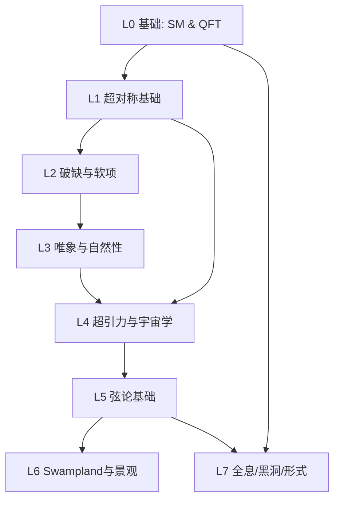


> 这是配套学习指南的**总入口**。原来那份"大块头"已拆成 8 个分层细读文档，每个方向再分成若干**小而具体的知识点**。点下面的链接进入对应层。  
> 配套综述：SUSY 理论进展（2023–2026）、超弦理论进展（2023–2026）、两篇精确译文（2603.04664 / 2601.06358）。

## 知识树（依赖关系）

## 分层细读文档（点进去）

-   [L0 · 标准模型与 QFT 基础](/yuqueyonghuyit3fz/mn2p4s/kb_l0_smqft) — 规范理论、Higgs/EWSB、等级问题、群论表示、EFT

-   [L1 · 超对称（SUSY）基础](/yuqueyonghuyit3fz/mn2p4s/kb_l1_susy) — 代数、超空间/超场、超势、R 对称/R 宇称、WZ 模型、MSSM

-   [L2 · SUSY 破缺与软项](/yuqueyonghuyit3fz/mn2p4s/kb_l2_breaking) — 为何破缺、O'Raifeartaigh/FI、隐藏扇区、三种媒介、软拉氏量、RGE

-   [L3 · 唯象、自然性与信号](/yuqueyonghuyit3fz/mn2p4s/kb_l3_pheno) — 自然性度量、自然 SUSY、压缩谱、消失径迹、软双轻子、RPV、DM

-   [L4 · 超引力（SUGRA）与宇宙学](/yuqueyonghuyit3fz/mn2p4s/kb_l4_sugra) — N=1 SUGRA、模场、引力微子问题、暴胀、dS、轴子

-   [L5 · 弦论基础](/yuqueyonghuyit3fz/mn2p4s/kb_l5_string) — 弦、D-膜、紧致化、CY、F-理论、杂化、G₂、通量、对偶

-   [L6 · Swampland 纲领与景观](/yuqueyonghuyit3fz/mn2p4s/kb_l6_swampland) — 距离/WGC/dS/tadpole 猜想、KKLT/LVS、正性出超引力

-   [L7 · 全息、黑洞与形式理论](/yuqueyonghuyit3fz/mn2p4s/kb_l7_formal) — AdS/CFT、黑洞/岛、振幅/双拷贝、可积、自举/天球、无张力弦

## 每层包含哪些"小知识点"（速览）

-   **L0**：① 规范对称性 ② 规范玻色子与场强 ③ 对称性自发破缺 ④ Higgs 机制 ⑤ 电弱对称性破缺(EWSB) ⑥ 等级问题 ⑦ 弱混合角与 Yukawa ⑧ 群表示入门 ⑨ 有效场论(EFT)

-   **L1**：① SUSY 代数与反对易子 ② 超空间与 Grassmann 坐标 ③ 手性超场 ④ 矢量超场与 gaugino ⑤ 超势 holomorphic 性 ⑥ R 对称性 ⑦ R 宇称 ⑧ Wess–Zumino 模型 ⑨ MSSM 构造 ⑩ 双 Higgs 双重态

-   **L2**：① 为何 SUSY 必须破缺 ② O'Raifeartaigh 模型 ③ Fayet–Iliopoulos 项 ④ 隐藏扇区思路 ⑤ 引力媒介(mSUGRA/CMSSM) ⑥ 规范媒介(GMSB) ⑦ 反常媒介(AMSB) ⑧ 软破缺拉氏量 ⑨ RGE 跑动

-   **L3**：① fine-tuning 度量 ② little hierarchy ③ stop 混合 ④ 自然 SUSY ⑤ 压缩谱 ⑥ 消失径迹 ⑦ 软双轻子 ⑧ 软位移径迹 ⑨ RPV 三项(λ/λ'/λ'') ⑩ 双线性 μᵢ ⑪ 长寿命 NLSP ⑫ neutralino/gluino/higgsino DM ⑬ A×ε

-   **L4**：① N=1 局域超对称 ② 引力微子 ③ 模场 ④ 模稳定化 ⑤ 引力微子问题 ⑥ SUGRA 暴胀 ⑦ 暗能量与 dS ⑧ 轴子与 axino ⑨ SUGRA 标量势(no-scale)

-   **L5**：① 开/闭弦 ② 自旋 2 与引力 ③ D-膜 ④ 紧致化概念 ⑤ Calabi–Yau ⑥ F-理论 GUT ⑦ 杂化线丛 ⑧ G₂ 流形 ⑨ 通量与景观 ⑩ 对偶(M 理论)

-   **L6**：① 景观 vs Swampland ② 距离猜想 ③ 弱引力猜想(WGC) ④ dS 猜想 ⑤ tadpole 猜想 ⑥ emergent string / cobordism ⑦ KKLT ⑧ LVS ⑨ 由正性出超引力

-   **L7**：① AdS/CFT 对偶 ② 黑洞熵微观态 ③ 岛与 Page 曲线 ④ 散射振幅 ⑤ 双拷贝(BCJ) ⑥ CHY/散射方程 ⑦ ambitwistor 弦 ⑧ N=4 SYM 可积 ⑨ 共形自举 ⑩ 天球全息 ⑪ 无张力弦

> 每个"小知识点"在对应层文档里都是独立小节，遵循统一格式：**是什么 / 关键公式或图像 / 为什么重要 / 常见误区 / 关联论文**。读不懂某篇综述时，按"关联论文"反查所在层，再顺依赖往上补。

