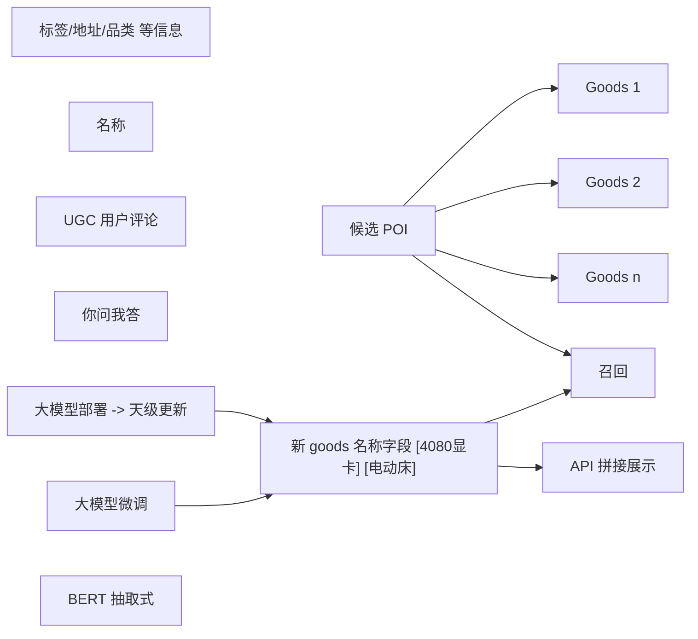


# 背景

酒店 goods 名称长度较长，但有效信息可能不足，如商户 goods 标题写 “电竞三人间”，但用户评论里提到具体的显卡型号，如 4080，那用户搜索 4080显卡时，在频道内就可以召回该酒店。因此可以考虑通过对用户 UGC 内进行挖掘，并结合原有标题，生成新的候选标题，当用户点击进入酒店时，显示与搜索词最相关的 goods 名称，防止出现无召回或者点进酒店找不到相应房型的情况。

整体是一个抽取式任务

# 目标

-   搜索体验优化：酒店体验 NDCG指标提升

-   点进详情页，能看到相关 goods

-   无结果率下降

# 实验效果

# 技术方案

## 策略流程图示




# 项目拆解

## 基于 UGC 的 goods 扩展字段挖掘

要挖掘哪些类型：

-   附近热门地理位置：近胖东来、滑雪方便
-   房间内部设施：有冰箱、吊床、沙发
-   房间提供的服务：叫醒服务
-   房间的固有属性：安静、隔音好

### 模型选取

模型选用 chatglm-6B(23 年3月 14 日，chatglm2 是6月25日）

-   模型评估时，都选取了哪些模型
-   是怎么做对比的，为什么最终选这个
-   参数量级是怎么定的？

### 数据构建

样本来源：

-   用户评论数据
-   大家都在问数据

数据格式：

prompt 设计：

角色定义 + 任务定义

```c
你是一个生活服务助手。可以从用户的评论里找到酒店房间的一些标志性信息，如内在设备、服务类型、附近知名地点等。用户评论如下
    “就要忘了感受了….，华住会旗下在许昌唯一一家“豪华型”的酒店，春节期间价格不贵，豪华双床也只要260上下，位置会稍微偏一点，在建安去北海公园附近，旁边不远的地方就是一家胖东来，可惜的是我们去的那天不营业，附[NL]器，但是打开看下卫生情况堪忧，房间的小冰箱里有巴马铂泉、雪碧和可乐，纯水喝完了想再要一瓶，工作人员只给拿了今麦郎…其实这个大可不必…，早餐的话还是略简单了一些，可以选择的种类很少，洗衣房只有>一[NL]” 。
    请你用一些词来总结每个标志性信息。如 近胖东来、有冰箱等
```

ChatGPT 结果

```c
华住会豪华型
春节价格亲民
260元豪华双床
地理位置偏
近北海公园
近胖东来
卫生堪忧
房内小冰箱
提供巴马铂泉
限量纯水
早餐简单
洗衣房设施(信息不全)
```

训练数据来源：之前酒旅图谱挖掘的数据和相应来源的 evidence UGC 数据构成 <ugc, tag> 对。但该数据的问题是之前挖掘的标签太狭隘，打标也比较少。因此对该部分数据先调用 chatGPT 得到 chatgpt 脑洞得到的标签。再进行人工标注移除不适合作为扩展词的结果：

1.  覆盖率特别高的，如屋内有矿泉水
2.  负面标签，如地理位置偏
3.  和酒店业务无关的（酒店周围的美食评价，附近美食好吃）
4.  和本酒店无关的（隔壁酒店有冰箱）

最终得到标注的扩展数据 1w 条。

### 模型训练

SFT 微调：

对 6B 模型进行全参数微调。

-   具体参数怎么样？

-   序列长度 512， epoch 3，学习率 2e-5， batch\_size=64。GPU 80G。

-   用什么框架训练的？

-   DeepSpeed

-   训练多少轮？

-   3

-   效果是怎么评估的？

-   用美团NLP中心构建的评估数据集，从近20 个公开数据集上获取的评测数据，每个里面取 200 条数据，共3000多条数据，包含如 [CEVAL](https://github.com/hkust-nlp/ceval)、[Big-Bench](https://github.com/google/BIG-bench/tree/main/bigbench/benchmark_tasks)、[CLUE](https://github.com/CLUEbenchmark/CLUE) 这些

### 模型部署

模型采用 FastTransformer 进行后端部署。在用 hf 代码训练完成后，用大模型平台提供的组件转换为 ft 格式。精度采用 fp16，

### 存入缓存/更新

通过内部 Augur 平台对模型部署后，得到一个 APPKEY，通过离线 spark 任务调用该接口，将得到的结果写入到 hive 表中。

问题：

1.  对大模型的输出结果，怎么进行处理，才能得到进入索引的结果

1.  首先对每个评论进行抽取
2.  抽取出出现次数排名 top20 的字段，对齐进行文本通顺度评估（？）、sakos 风险检测等评估
3.  对符合要求的字段，选取 top 10 进行存储

## 基于 UGC 扩展 goods 的召回策略设计

-   什么情况下触发该路召回

-   主链路无结果时，二查触发，但优先级比丢词高

-   怎么排序：

-   只影响相关性，会把所有挖掘到的字段都返回

-   对于误召回的case 怎么办？

-   因为在无结果之后触发，所以误召回可以接受

## API 可解释性拼接策略

-   对于通过正常渠道召回的

-   将标签字段对应的中文附加上

-   对于通过 UGC 扩展召回的

-   将召回时命中的扩展字段附加上

# 项目复盘

