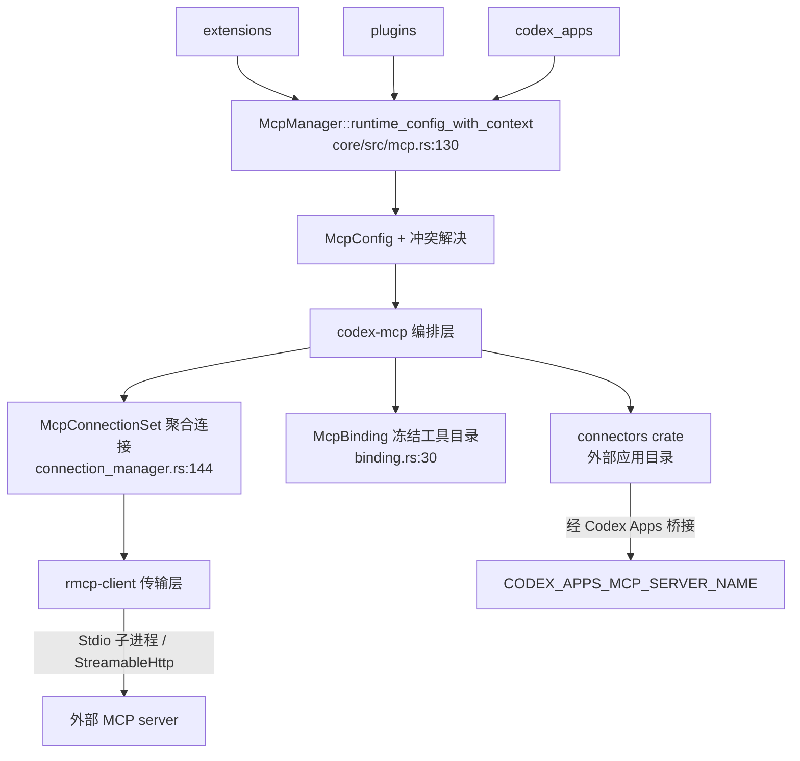


> 《Codex Agent / Harness 深度解剖》系列 · 第 4 篇  
> 源码基准：OpenAI Codex（Apache-2.0，Rust monorepo）`codex-rs/codex-mcp`、`codex-rs/rmcp-client`、`codex-rs/mcp-server`、`codex-rs/core/src/mcp*.rs`、`codex-rs/connectors`  
> 阅读方式：本文由直觉到实现逐步推进，不分层级，可随读随停。

---

> 一句话：**MCP 不是"又一个工具格式"，而是 Agent 与外部世界之间的"能力总线"——Codex 用一层统一协议，把任意外部工具/数据源变成模型一眼能看见、且同样受审批与沙箱约束的一等公民。**

---

## 从"给工程师配一台能联网的电脑"说起

一个裸 LLM 只有权重，没有"手"。Agent 的价值，是把模型输出翻译成对外部环境的可执行动作：读文件、查数据库、发 PR、订日历。最朴素的做法是**为每一个外部系统写一段"直接调 API"的胶水代码**——也就是 Codex 里 `core/src/tools/handlers/` 下那些 `exec_command`、`shell_command` 之类的专用 handler。

想象你给一位远程工程师配电脑：每接一个 SaaS，你就得自己写一套客户端、一套配置、一套权限逻辑。接三个 SaaS、团队里五个人要用，你就得维护 15 套整合。这就是"直接调 API"的结构性代价：**每接一个后端，harness 内部就多一块与世隔绝的私有代码。**

---

## "直接调 API"为什么撑不住

朴素整合有三个绕不开的坑：

1.  **耦合爆炸**：N 个工具 × M 个后端 = N×M 的集成成本，每个后端都要单独写 handler、配置、审批、沙箱。

2.  **模型侧不可枚举**：工具 schema 硬编码在 harness 里，模型看不到"外部还能做什么"，第三方也没法给它扩展新能力。

3.  **信任边界碎片化**：每个 handler 自己实现权限、超时、错误归一，安全语义各写一套。

MCP 给出的答案是：**把"工具发现、调用、结果回传"标准化成一组 JSON-RPC 方法**，让"谁提供工具"（server）和"谁消费工具"（client/harness）彻底解耦。Agent 不再为每个后端写专用代码，而是**接一个"会讲 MCP 的进程"**。这正是 Codex 在 `codex-mcp` + `rmcp-client` 两个 crate 里做的事——harness 只实现一个 MCP client，外部能力由社区或厂商以 MCP server 形式提供。

> 直觉闭环：直接调 API 是 client→backend 的**私有契约**；MCP 是 client→server→backend 的**两段式**——server 成为 backend 的"协议翻译器"，harness 只认 MCP 这一份契约。代价是多一跳进程或网络，收益是标准化、可组合、可审计。

---

## MCP 是什么：把"能力总线"标准化

MCP 是围绕 **JSON-RPC 2.0** 的客户端/服务端协议，跑在某个"传输层"之上。核心原语只有几个：

-   `tools/list` —— server 声明自己能提供哪些工具，返回每个工具的 `name`、`description`、JSON Schema 化的 `inputSchema`，以及 `annotations`（`readOnlyHint` / `destructiveHint` / `openWorldHint`）。这是模型"看见能力"的来源。

-   `tools/call` —— client 传 `(tool, arguments)`，server 返回 `content`（文本/图片/资源）、`isError` 与 `_meta`。

-   `resources` **/** `prompts` —— 额外的数据面与提示面（Codex 也实现了 resource 读取，见 `core/src/tools/handlers/mcp_resource/`）。

-   **生命周期**：`initialize`（协商协议版本与能力）→ `notifications/initialized` → 常规请求。

**传输层**由配置枚举决定（`codex_config::McpServerTransportConfig`，`config/src/mcp_types.rs:435`）：

-   `Stdio`（`mcp_types.rs:437`）：harness 以**子进程**方式拉起 server，通过 stdin/stdout 交换换行分隔的 JSON-RPC。进程隔离天然是一道安全边界。

-   `StreamableHttp`（`mcp_types.rs:449`）：指向一个 **HTTP(S) 远程端点**，支持 bearer token（`bearer_token_env_var`）与自定义 `http_headers`/`env_http_headers`，覆盖"远程/云 MCP server"。

> 说明：协议规范 2025-06-18 已用 Streamable HTTP 取代旧的 SSE 传输。Codex 配置枚举里只有 `Stdio` 与 `StreamableHttp`，**源码中未见 SSE 变体**——远程接入统一走 Streamable HTTP。

---

## Codex 怎么把 MCP 接进来：三层叠加与三个 crate

### 配置从哪来：extensions / plugins / apps 三层叠加

Codex 的 MCP server 清单不是单一配置文件，而是\*\*多来源叠加（overlay）\*\*出来的。入口在 `core/src/mcp.rs` 的 `McpManager::runtime_config_with_context`（`core/src/mcp.rs:130`）：

1.  **扩展贡献（extensions）**：`self.extensions.mcp_server_contributors()`（`mcp.rs:143`）遍历各扩展，产出 `McpServerContribution::Set` / `Remove` / `SelectedPlugin` / `SelectedPluginPackage`（`mcp.rs:146-191`），按全局 `contribution_order` 排成 `OrderedMcpOverlay` 队列，后写覆盖先写。

2.  **插件（plugins）**：`plugins_manager.plugins_for_config(...)`（`mcp.rs:196`）加载用户/宿主插件声明的 server；`config.to_mcp_config_with_loaded_plugins(...)`（`mcp.rs:202`）合并进 `McpConfig`。

3.  **内置 Codex Apps**：当 `mcp_config.apps_enabled` 为真时，以兼容性注册方式注入 `CODEX_APPS_MCP_SERVER_NAME`（`mcp.rs:205-220`），把外部连接器作为"宿主自有 MCP server"暴露。

最终落到 `mcp_config.mcp_server_catalog`（带冲突解决的 `McpCatalogBuilder`），同名冲突打 `warn` 并采用 resolved outcome（`mcp.rs:243-251`）。`McpManager` 对外暴露 `configured_servers` / `runtime_servers` / `effective_servers`（后者再过一道 auth gating，`mcp.rs:265-284`）。

### 三个 crate 的分工

Codex 把"消费外部 MCP"和"自身作为 MCP server"严格分开：

-   `rmcp-client`（client 侧传输/会话层）：对开源 `rmcp` Rust SDK 的**加固封装**。核心类型 `RmcpClient`（`rmcp-client/src/lib.rs:43`），并封装了 `stdio_server_launcher`（`lib.rs:47`，含 `LocalStdioServerLauncher`/`ExecutorStdioServerLauncher`）拉起 stdio 子进程；`http_client_adapter` 模块（`rmcp-client/src/http_client_adapter.rs`）与 `streamable_http_retry` 模块（`rmcp-client/src/streamable_http_retry.rs`）负责远程流式 HTTP 带重试；`in_process_transport`（`lib.rs:27`）提供进程内传输（测试/嵌入式）；外加 `perform_oauth_login`（`lib.rs:35`）、`auth_status`、elicitation 客户端服务，把 OAuth 登录、认证态发现、用户交互也收进 client。

-   `codex-mcp`（宿主侧编排层）：真正被 harness 调用的"MCP 运行时"。`McpRuntime` / `McpRuntimeInput`（`codex-mcp/src/lib.rs:13,15`）是运行时入口；`McpConnectionSet`（`codex-mcp/src/connection_manager.rs:144`）**聚合所有 server 连接、启动状态、工具目录**，其 `new`（`connection_manager.rs:159`）对每个 enabled server 起一个 `AsyncManagedClient`，并发启动并收集 `McpStartupCompleteEvent`；`McpBinding`（`codex-mcp/src/binding.rs:30`）**冻结某一次模型采样请求所看到的工具目录与调用句柄**，提供 `prepare_call(server, tool)`（`binding.rs:84`）；另有 `catalog`、`codex_apps`（连接器工具名归一化 `normalize_codex_apps_callable_name`，`codex-mcp/src/codex_apps.rs:31`）、`tool_catalog_cache`、`elicitation`。

-   `mcp-server`（**导出侧**：Codex 自身作为 MCP server）：`run_main`（`mcp-server/src/lib.rs:60`）实现一个 prototype MCP server——通过 stdin/stdout 收发 JSON-RPC（`lib.rs:127-202` 三个 task：读 stdin、process、写 stdout），把 Codex 原生能力（`codex_tool_runner`、`exec_approval`、`patch_approval`）反向以 MCP 工具暴露出去。它让"别的 MCP client 来调用 Codex"成为可能，方向与 `codex-mcp` 正好相反。



---

## 工具怎么进模型的视野：exposure

工具暴露发生在"为某次请求构造 `McpBinding`"时。`build_mcp_tool_runtimes`（`core/src/mcp_tool_exposure.rs:20`）把 `all_mcp_tools: &[ToolInfo]` 转成可被模型调用的 `CoreToolRuntime`：

-   非 Codex Apps 的工具：`filter_non_codex_apps_mcp_tools_only`（`mcp_tool_exposure.rs:58`）过滤掉 `!tool_is_model_visible(tool)` 的（可见性判定在 `codex-mcp/src/connection_manager.rs:22`）。

-   Codex Apps（连接器）工具：`filter_codex_apps_mcp_tools`（`mcp_tool_exposure.rs:68`）额外要求 `tool.connector_id` 属于用户已接入的 `connectors`，并通过 `AppToolPolicyEvaluator::policy(...)`（`mcp_tool_exposure.rs:77-104`）按 `destructive_hint` / `open_world_hint` 判定是否启用。

-   每个工具包成 `McpHandler`（`mcp_tool_exposure.rs:44`）。模型看到的名字带 `mcp__` 前缀与 `server__tool` 分隔，由 `core/src/tools/handlers/mcp.rs:29-65` 的 `ensure_mcp_prefix` / `join_tool_name` 拼出（`canonical_tool_name()` 是 `ToolInfo` 上返回该名字的方法）。开启 search 时暴露模式降级为 `ToolExposure::Deferred`（`mcp_tool_exposure.rs:35`）。

**是否并行**：`McpHandler::supports_parallel_tool_calls`（`core/src/tools/handlers/mcp.rs:76`）返回 `tool_info.supports_parallel_tool_calls` **或** 该工具声明了 `readOnlyHint`（`mcp.rs:80-87`）。也就是说，正确实现的只读 MCP 工具默认可并行；写操作必须经 server 显式 opt-in。运行时在 `core/src/tools/parallel.rs` 用一把 `parallel_execution` 读写锁做准入门控（`parallel.rs:100-138`，只读走读锁、写操作走写锁）。

---

## 一次工具调用发生了什么（含审批模板）

调用入口 `handle_mcp_tool_call`（`core/src/mcp_tool_call.rs:110`）的完整链路：

```plain
模型输出 tool_call
   │
   ▼
handle_mcp_tool_call (mcp_tool_call.rs:110)
   ├─ refresh_mcp_if_dirty()                      // 配置变更则重建 binding
   ├─ current_binding.prepare_call(server,tool)   // 取冻结句柄 (binding.rs:84)
   ├─ mcp_tool_metadata() → McpToolApprovalMetadata
   ├─ AppToolPolicy / approval_mode 解析 (codex_apps 走连接器策略)
   ├─ notify_mcp_tool_call_started (emit TurnItem::McpToolCall)
   ├─ maybe_request_mcp_tool_approval (mcp_tool_call.rs:1279)
   │     ├─ 自动批准? mcp_permission_prompt_is_auto_approved
   │     ├─ session 级已记住? mcp_tool_approval_is_remembered
   │     ├─ hooks: run_permission_request_hooks
   │     ├─ Guardian 自动复核? (OnRequest/Granular + AutoReview)
   │     └─ 否则渲染审批模板 → RequestUserInput / Elicitation 交互
   ├─ Accept* → handle_approved_mcp_tool_call
   │     ├─ prepared_call.call_with_preparation(...)   // 真正 tools/call
   │     ├─ augment_mcp_tool_request_meta_with_sandbox_state (mcp_tool_call.rs:727)
   │     ├─ rewrite_mcp_tool_arguments_for_openai_files
   │     └─ maybe_request_codex_apps_auth_elicitation (OAuth 续期, :638)
   └─ notify_mcp_tool_call_completed (截断超大队结果)
```

**审批模板**：为避免千篇一律的"是否允许运行工具"，Codex 用一份内置 JSON（`consequential_tool_message_templates.json`，`include_str!` 嵌入 `mcp_tool_approval_templates.rs:73`）按 `(connector_id, server_name, tool_title)` 精确匹配，渲染出**有业务语义**的提问，例如 `Allow {connector_name} to create an event?`（`mcp_tool_approval_templates.rs:205` 的测试），并把参数重命名为可读标签（`calendar_id → "Calendar"`）。`render_mcp_tool_approval_template`（`mcp_tool_approval_templates.rs:53`）产出 `RenderedMcpToolApprovalTemplate`，供 `maybe_request_mcp_tool_approval` 在 `mcp_tool_call.rs:1378` 渲染 UI。支持 "Allow / Allow for this session / Allow and don't ask again / Cancel" 四级决策（`mcp_tool_call.rs:1243-1251`），"记住"落库于 `apply_mcp_tool_approval_decision`（`mcp_tool_call.rs:1949`）。

---

## skill 也能声明 MCP 依赖

MCP 还能被 **skill 声明为依赖**。当模型选中某个 skill，Codex 可自动补齐它所需的 MCP server：`maybe_prompt_and_install_mcp_dependencies`（`core/src/mcp_skill_dependencies.rs:34`）收集缺漏依赖（`collect_missing_mcp_dependencies`，`mcp_skill_dependencies.rs:411`，只认 `type == "mcp"` 的 `SkillToolDependency`），向用户确认后 `maybe_install_mcp_dependencies`（`mcp_skill_dependencies.rs:81`）把配置写入全局 `mcp_servers`（`ConfigEditsBuilder::replace_mcp_servers`，`mcp_skill_dependencies.rs:126`），需登录的依赖执行 `perform_oauth_login`（`mcp_skill_dependencies.rs:151`）。注意：skill 注入的依赖**默认** `supports_parallel_tool_calls: false`（`mcp_skill_dependencies.rs:363,394`），即保守地禁止并行。

---

## connectors：预置的外部生态目录

`connectors` crate 是 Codex **预置的外部连接器发现与策略层**。它本身**不是 MCP server**，而是 Codex 通过宿主目录（`/connectors/directory/list`）拉取的一组"应用/连接器"元数据——`AppInfo`（`app_info.rs`，`connectors/src/lib.rs:25` 再导出）、`DirectoryApp`（`connectors/src/lib.rs:101`）——例如 GitHub、Google Calendar 等。`list_all_connectors_with_options`（`connectors/src/lib.rs:169`）支持分页 + workspace 与 public 双目录并行拉取（`tokio::join!`，`lib.rs:193`），并带内存 + 磁盘两级 TTL 缓存（`CONNECTORS_CACHE_TTL = 3600s`，`lib.rs:56`）。

**它和 MCP 的关系**：连接器经 Codex Apps 这个"宿主自有 MCP server"（`CODEX_APPS_MCP_SERVER_NAME`）归一化为 `ToolInfo`（`codex-mcp/src/codex_apps.rs:31`），再经 `filter_codex_apps_mcp_tools` 暴露给模型；启用/只读/破坏性策略由 `AppToolPolicyEvaluator`（`connectors/src/lib.rs:30`）集中裁决。换言之：**connectors = 外部生态的目录与策略，MCP = 把它们接进模型的总线**，Codex Apps 是二者之间的桥。

---

## 安全边界：MCP 工具同样走审批/沙箱

呼应"安全自治"篇，MCP 工具**没有任何特权豁免**，与本地 `exec_command` 共用一套治理：

-   **审批**：`maybe_request_mcp_tool_approval`（`mcp_tool_call.rs:1279`）与本地工具共用 `AskForApproval` 模式、`run_permission_request_hooks`、Guardian 自动复核（`build_guardian_mcp_tool_review_request`，`mcp_tool_call.rs:1488`）。连接器工具额外受 `AppToolPolicy` 门控（`mcp_tool_exposure.rs:77`）。

-   **沙箱态注入**：若 server 声明支持 `MCP_SANDBOX_STATE_META_CAPABILITY`，Codex 把 `permission_profile`、沙箱可执行路径、工作目录写进调用 `_meta`（`augment_mcp_tool_request_meta_with_sandbox_state`，`mcp_tool_call.rs:727`），让远端 server 也能在受限环境下执行。

-   **结果收敛**：超大队结果被截断到 `MCP_TOOL_CALL_EVENT_RESULT_MAX_BYTES`（`mcp_tool_call.rs:106`，等于 `DEFAULT_OUTPUT_BYTES_CAP`），具体截断在 `truncate_mcp_tool_result_for_event`（`mcp_tool_call.rs:854`）；不支持图片/音频输入的模型，结果中的图片/音频块被替换为说明文本（`sanitize_mcp_tool_result_for_model`，`mcp_tool_call.rs:815`）。

-   **能力隔离**：连接器若未接入 / 策略禁用，直接跳过并记为 blocked（`mcp_tool_call.rs:195`）。

---

## 与 Anthropic / Claude Desktop 接入对照

| 维度 | OpenAI Codex（`codex-mcp`+`rmcp-client`） | Anthropic 官方 MCP / Claude Desktop |
| --- | --- | --- |
| 协议实现 | 基于 `rmcp` Rust SDK 的自有加固封装 | 官方 TypeScript/Python SDK（`@modelcontextprotocol/sdk`） |
| 传输支持 | `Stdio` 子进程 + `StreamableHttp` 远程（`config/src/mcp_types.rs:435`）；**无 SSE** | Stdio + 早期 SSE；规范现已演进到 Streamable HTTP |
| 配置来源 | extensions / plugins / codex_apps 三层 overlay（`core/src/mcp.rs:130`） | `claude_desktop_config.json` 的 `mcpServers` 段（单文件） |
| 服务器生命周期 | `McpConnectionSet` 并发启动 + 失败重连（`connection_manager.rs:159,452`） | Desktop 随客户端启停子进程 |
| 工具暴露给模型 | `build_mcp_tool_runtimes`，连接器走 `AppToolPolicy` 门控（`mcp_tool_exposure.rs:20`） | 全部 server 的 tools 直接合并进模型上下文 |
| 审批/安全 | 复用 Guardian + hooks + 沙箱态注入 + 批准模板（`mcp_tool_call.rs`） | Claude Desktop 以用户手动确认为主，无统一沙箱态注入 |
| 连接器生态 | `connectors` crate 目录式发现，经 Codex Apps 桥接为 MCP 工具 | 依赖社区 server 市场，无内建"连接器目录"抽象 |
| 自身作为 server | `mcp-server` crate 反向暴露 Codex 原生工具（`mcp-server/src/lib.rs:60`） | Claude 主要作为 client；官方也提供 server SDK 供第三方自建 |
| 免审批模板 | `consequential_tool_message_templates.json` 精确匹配渲染（`mcp_tool_approval_templates.rs:53`） | 通用确认弹窗 |
| Skill 依赖自动装 | `mcp_skill_dependencies.rs` 自动补齐并 OAuth 登录 | 无对应机制 |

---

## 心智模型

> **MCP 在 Codex 里 = 一条"有目录、有策略、有审批、有沙箱"的统一契约层 + 三个各司其职的 crate。**

-   **三层 crate**：`rmcp-client`（传输/会话）、`codex-mcp`（编排/目录/绑定）、`mcp-server`（反向导出）——消费与导出方向相反，但都讲同一份 MCP 契约。

-   **配置可叠加**：extensions / plugins / apps 三级 overlay + `McpCatalogBuilder` 冲突解决，多来源集成不靠单一 TOML。

-   **总线入口即安全入口**：MCP 工具与本地工具共用 `AskForApproval`、hooks、Guardian、沙箱态注入——安全逻辑写一次，对所有后端生效。

-   **连接器 ≠ MCP server**：`connectors` 做"目录 + 策略"，Codex Apps 做"桥"，MCP 做"总线"。

-   **并行是保守默认**：只读工具默认可并行，写操作须 server 显式 opt-in，skill 依赖更是默认关掉。

---

## 可迁移经验

1.  **把"能力总线"和"能力提供方"解耦**。自研 Agent 时，把"MCP client 传输细节"与"harness 编排逻辑"分开，别把 JSON-RPC 摊在业务代码里。

2.  **配置要可叠加且可冲突解决**。多来源配置是规模化集成的必需，不要指望单一配置文件。

3.  **审批与安全必须下沉到总线入口**。这正是"统一协议"的最大红利：安全逻辑写一次，对所有后端生效。

4.  **连接器 ≠ MCP server**。"目录/策略层"与"协议总线层"的分离，值得在任意要接入大量第三方 SaaS 的 Agent 中复用。

5.  **用业务语义的审批模板替代机械确认**。把"是否允许"升级为"用人类语言说明这次动作的影响"，显著降低用户疲劳。

6.  **保守默认并行**。并行是性能优化，但必须以工具自述的语义 hint 为前提，绝不能无脑并发写操作。

---

## 自测题（检验你是否真懂）

1.  "直接调 API"与"走 MCP"在信任边界和模型可见性上，分别付出了什么、得到了什么？

2.  `McpManager::runtime_config_with_context` 的三层 overlay 各自解决什么？同名冲突怎么处理？

3.  `rmcp-client`、`codex-mcp`、`mcp-server` 三者谁是"消费方"、谁是"导出方"？`mcp-server` 把什么反向暴露出去了？

4.  一个 MCP 工具默认可并行吗？只读工具和写操作各自的默认与 opt-in 规则是什么？

5.  连接器（connectors）本身是 MCP server 吗？它和 MCP 之间靠什么桥接？

6.  MCP 工具在审批和沙箱上，和本地 `exec_command` 有什么区别？

---

## 延伸阅读（结合网络讲解）

-   **Model Context Protocol 官方规范**（transports / tools / lifecycle）：modelcontextprotocol.io/specification/2025-06-18

-   **MCP 介绍与动机**（"能力总线"思想源头）：modelcontextprotocol.io/introduction

-   **Anthropic：Building connectors with MCP**（连接器与生态对照）：docs.claude.com/en/docs/agents-and-tools/mcp

-   **ReAct 论文**（agent 行动-观察思想源头，贯穿本系列）：Yao et al., 2022

-   **Codex Harness 系列前文**：Agent 循环（第 2 篇）、上下文工程（第 3 篇）

---

## 关键符号速查

| 符号 | 位置 |
| --- | --- |
| `McpManager::runtime_config_with_context` | `codex-rs/core/src/mcp.rs:130` |
| `McpConnectionSet` / `new` | `codex-rs/codex-mcp/src/connection_manager.rs:144,159` |
| `McpBinding::prepare_call` | `codex-rs/codex-mcp/src/binding.rs:30,84` |
| `normalize_codex_apps_callable_name` | `codex-rs/codex-mcp/src/codex_apps.rs:31` |
| `RmcpClient` | `codex-rs/rmcp-client/src/lib.rs:43` |
| `stdio_server_launcher` | `codex-rs/rmcp-client/src/lib.rs:47` |
| `http_client_adapter` / `streamable_http_retry` | `codex-rs/rmcp-client/src/http_client_adapter.rs` · `streamable_http_retry.rs` |
| `run_main`（导出侧） | `codex-rs/mcp-server/src/lib.rs:60` |
| `build_mcp_tool_runtimes` | `codex-rs/core/src/mcp_tool_exposure.rs:20` |
| `AppToolPolicyEvaluator::policy` | `codex-rs/core/src/mcp_tool_exposure.rs:77` |
| `McpHandler::supports_parallel_tool_calls` | `codex-rs/core/src/tools/handlers/mcp.rs:76` |
| `parallel_execution` 门控 | `codex-rs/core/src/tools/parallel.rs:100-138` |
| `handle_mcp_tool_call` | `codex-rs/core/src/mcp_tool_call.rs:110` |
| `maybe_request_mcp_tool_approval` | `codex-rs/core/src/mcp_tool_call.rs:1279` |
| `render_mcp_tool_approval_template` | `codex-rs/core/src/mcp_tool_approval_templates.rs:53` |
| `maybe_prompt_and_install_mcp_dependencies` | `codex-rs/core/src/mcp_skill_dependencies.rs:34` |
| `AppToolPolicyEvaluator` | `codex-rs/connectors/src/lib.rs:30` |
| `list_all_connectors_with_options` | `codex-rs/connectors/src/lib.rs:169` |
| `McpServerTransportConfig` | `codex-rs/config/src/mcp_types.rs:435` |

