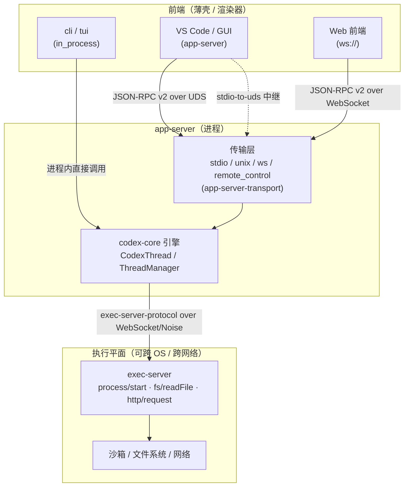


> 《Codex Agent / Harness 深度解剖》系列 · 第 3 篇  
> 源码基准：OpenAI Codex（Apache-2.0，Rust monorepo）`codex-rs/protocol/src`、`codex-rs/app-server-protocol/src`、`codex-rs/*-transport`  
> 阅读方式：本文由直觉到实现逐步推进，不分层级，可随读随停。

---

# 3\. 运行时与协议：把"大脑"从"壳"里抽出来

> 一句话：**harness 真正的功夫，不在调模型，而在让同一颗推理引擎** `codex-core` **既能在终端里跑、也能被 VS Code / Web 远程驱动、还能把"执行命令"甩到另一台机器上——靠的不是复制引擎，而是用一层强类型协议 + 可插拔传输，把"引擎"和"壳"彻底切开。**

---

## 从"一个 agent 要伺候多少种前端"说起

设想你造了一颗很聪明的"大脑"。问题来了：它得同时伺候终端用户（CLI/TUI）、IDE 插件（VS Code）、网页（Web），有的还跑在云上。如果每种前端都重写一遍引擎逻辑，维护会变成噩梦。

**Agent 系统的复杂度，80% 不在模型调用本身，而在"把模型塞进各种前端、各种执行环境、各种信任边界里"。** Codex 的答案是：把"引擎"与"壳"物理切开。

引擎层只有一个 crate：`codex-core`（`core/src/lib.rs`，`//! Root of the codex-core library`）。它对外只暴露少量入口类型：

-   `CodexThread`（`core/src/lib.rs:29` 再导出，定义于 `codex_thread.rs:182`）——一个持久会话（thread）的句柄，驱动一轮轮 turn；

-   `ThreadManager`（`core/src/thread_manager.rs:194`）——创建 / 恢复 / 销毁 thread 的管理器；

-   `ModelClient` / `ModelClientSession`（`core/src/client.rs:273` 等）——与推理后端（Responses API / Realtime）的连接。

注意 `core` 库开头那行硬约束（`core/src/lib.rs:6`）：

```rust
#![deny(clippy::print_stdout, clippy::print_stderr)]
```

> 库代码禁止直接写 stdout/stderr，所有用户可见输出必须走 TUI / tracing 等抽象。

这正是分层的第一性原理：**引擎不知道自己被谁驱动、向谁输出**。它只通过枚举产生事件、消费操作。于是同一颗 `codex-core` 可以有无数种"活法"：

-   本地 CLI（`cli`）和 TUI（`tui`）直接 `in_process` 把 core 跑在进程内（`app-server/src/in_process.rs:355` 的 `start(...)`）；

-   远程 GUI / IDE 插件通过 `app-server` 把 core 包成网络服务，前端用 JSON-RPC 客户端连上来；

-   执行侧（真跑命令、读写文件的沙箱）还能进一步拆到 `exec-server`，与推理侧跨机运行。

一句话收口：**协议是引擎与世界的契约，传输是契约的搬运工，前端只是契约的渲染器**。没有这层，每多一个前端就重写一遍引擎；有了这层，Codex 才能用同一颗 core 同时服务终端、VS Code 扩展和云端 Web。

---

## 协议不是一层，是三层契约

Codex 的通信自上而下可以抽象为三层，它们职责分明又彼此正交：

1.  **前端** **↔** **app-server 协议**（对外 SDK 面）：JSON-RPC v2 风格（`app-server-protocol`），前端用 `codex-client` / `codex-api` 这类 SDK 收发；

2.  **harness 内部协议**（引擎 ↔ 前端 的语义面）：强类型 `Op`（操作）与 `EventMsg`（事件）枚举（`protocol/src/protocol.rs`），与具体传输无关；

3.  **exec 协议**（引擎 ↔ 执行器 的执行面）：`exec-server-protocol` 定义的一组 `process/*`、`fs/*`、`http/*` JSON-RPC 方法，引擎用它远程驱动沙箱。

它们的关系见下图：



要点：**同一份** `codex-core`**，前端差异只在"壳"**；而 `core` 与 `exec-server` 之间又是一层独立网络协议，使得"推理在哪台机器、执行在哪台机器"可以自由组合。

---

## 把协议落进枚举：为什么是强类型而非松散 JSON

`protocol/src/protocol.rs` 是整个 harness 的语义中枢。它用两个枚举定义引擎与前端之间的全部交互：

-   `Op`（`protocol.rs:522`，至 679 行）：客户端 → 引擎的**操作**；

-   `EventMsg`（`protocol.rs:1279`，至 1486 行）：引擎 → 客户端的**事件流**。

两者都派生 `#[derive(Serialize, Deserialize, JsonSchema, TS)]`——同一份 Rust 定义既能序列化上 wire，又能自动生成 JSON Schema 与 TypeScript 类型（`generate_json` / `generate_ts`，见 `app-server-protocol/src/lib.rs:8-14`），前后端永远对得上号。

### `Op`——客户端发往引擎的操作

关键变体（行号取自 `protocol.rs`）：

| 变体 | 行号 | 语义 |
| --- | --- | --- |
| `Interrupt` | 525 | 中止当前 turn（引擎回 `TurnAborted`） |
| `UserInput { items, final_output_json_schema, thread_settings, .. }` | 550 | 用户本轮输入，可带 JSON Schema 约束与 thread 设置覆盖 |
| `ExecApproval { id, turn_id, decision }` | 580 | 批准 / 拒绝一条命令执行（`ReviewDecision`） |
| `PatchApproval { id, decision }` | 590 | 批准 / 拒绝代码补丁 |
| `ResolveElicitation` / `UserInputAnswer` / `RequestPermissionsResponse` / `DynamicToolResponse` | 598/612/620/628 | 解析 MCP 询问、用户提问、权限请求、动态工具回调 |
| `Compact` | 647 | 请求压缩上下文（"Compaction"） |
| `ApproveGuardianDeniedAction` | 665 | 用户手动放行 Guardian 已拒绝的动作 |
| `RunUserShellCommand { command }` | 675 | `!cmd` 触发的一次性用户 shell |
| `ThreadRollback { num_turns }` | 659 | 回退最近 N 个用户 turn |
| `RefreshMcpServers` / `ReloadUserConfig` | 636/642 | 重载 MCP 工具、热更配置 |

> **关于命名，源码中诚实地标注一下**：当前代码里**没有**名为 `ExecCommandApproval` 或 `SpawnAgent` 的 `Op` 变体——命令批准实际是 `Op::ExecApproval`；而 `ExecCommandApproval*`（如 `ExecCommandApprovalParams`）只是 `app-server-protocol` v1 那一层 **JSON-RPC 参数**的命名。`SpawnAgent` 仅作为 `CollabAgentTool::SpawnAgent`（`legacy_events.rs`）与 `items.rs` 的输入项出现，并非引擎操作。子代理的生命周期通过 `EventMsg::SubAgentActivity` 上报、用 `SubAgentSource::ThreadSpawn`（`protocol.rs:2825`）建模，而非一个 `Op::SpawnAgent`。

### `EventMsg`——引擎发往客户端的事件流

这是一条**有方向的、强类型的流式协议**。关键变体：

| 变体 | 行号 | 语义 |
| --- | --- | --- |
| `Error(WarningEvent)` / `Warning` | 1281/1285 | 执行失败 / 警告（turn 仍可继续） |
| `TurnStarted`（`serde rename="task_started"`） | 1323 | 一轮开始（兼容 v1 线格式） |
| `TurnComplete`（`rename="task_complete"`） | 1332 | 一轮结束，带 `duration_ms` / `time_to_first_token_ms` |
| `AgentMessage` / `AgentMessageContentDelta` | 1339/1458 | 文本输出与增量增量 |
| `ExecCommandBegin/OutputDelta/End` | 1384/1387/1392 | 命令执行生命周期与流式子输出（即"ToolCall"的执行形态） |
| `ExecApprovalRequest`（`ExecApprovalRequestEvent`, `approvals.rs:226`） | 1397 | 向用户弹出命令批准请求 |
| `GuardianAssessment`（`GuardianAssessmentEvent`, `approvals.rs:179`） | 1412 | Guardian 自动审批审查的结构化结论（`status`/`risk_level`/`rationale`/`action`） |
| `ContextCompacted`（`ContextCompactedEvent`） | 1315 | 上下文被压缩（"Compaction"事件） |
| `SubAgentActivity`（`SubAgentActivityEvent`） | 1485 | 子代理活动，携带 `agent_path` 与 `kind`（`Started/Interacted/Interrupted`，`protocol.rs:4325`） |
| `ItemStarted`/`ItemCompleted`/`RawResponseItem` | 1453/1454/1450 | 细粒度 response item 生命周期 |
| `McpToolCallBegin/End`、`WebSearchBegin/End`、`ImageGenerationBegin/End` | 1371-1381 | 各类工具调用的起止 |
| `HookStarted/HookCompleted` | 1455/1456 | Hook 生命周期 |

**为什么用强类型枚举而非松散 JSON？** 三个工程收益：

1.  **单一事实源 + 自动双端类型**：`Op`/`EventMsg` 派生 `TS`，`app-server-protocol` 直接 `generate_ts()` 产出前端类型，Rust 改了类型，TS 必须跟着改，否则编译 / CI 失败。

2.  **wire 兼容由 schema 演进控制**：如 `TurnStarted` 用 `#[serde(rename="task_started", alias="turn_started")]`（`protocol.rs:1322`）做 v1→v2 重命名兼容；`ExecApprovalRequestEvent` 同时支持 `environmentId` 与 `environment_id`（`approvals.rs:251-257`）别名。这是松散 JSON 手写解析很难系统保证的。

3.  **穷尽匹配即正确性**：前端 `match event_msg { ... }` 必须覆盖所有变体，新增事件类型编译器会强制你处理，避免"加了事件前端静默忽略"的回归。

---

## app-server-protocol：对外 JSON-RPC v2 风格

`app-server` 把 `codex-core` 包成可被远程前端驱动的服务。它与前端之间用 **JSON-RPC v2 风格**协议，但做了刻意偏离——文件头明写（`rpc.rs:1-2`）：

```rust
//! We do not do true JSON-RPC 2.0, as we neither send nor expect the
//! "jsonrpc": "2.0" field.
```

借 JSON-RPC 的"请求 / 响应 / 通知 / 错误"四件套形态，但省略 `jsonrpc` 版本字段以减负担。核心类型（`rpc.rs`）：

-   `RequestId`（`:17`，`untagged` 枚举，`String | Integer`）——请求标识；

-   `JSONRPCMessage`（`:37`，`untagged`）——`Request | Notification | Response | Error` 四种消息联合；

-   `JSONRPCRequest { id, method, params, trace }`（`:46`），注意带 `trace: Option<W3cTraceContext>`（`:53`），为分布式追踪预留；

-   `JSONRPCError { error: JSONRPCErrorError, id }`（`:76`）。

方法层分 `v1` 与 `v2` 两套（`lib.rs:20-42` 全量 re-export）：v1 有 `InitializeParams` / `ExecCommandApprovalParams`（注意这是参数名，对应内核 `Op::ExecApproval`）/ `GetAuthStatusParams` 等；v2 拆得更细，`protocol/v2/` 下按领域分文件（`turn.rs`、`thread.rs`、`mcp.rs`、`fs.rs`、`process.rs`、`review.rs`……）。事件映射集中在 `event_mapping.rs`（`lib.rs:16`），负责把 `EventMsg` 翻译为前端 JSON-RPC 通知。

---

## codex-client / codex-api：两套客户端 SDK

-   `codex-client`（`codex-rs/codex-client/src/lib.rs`）是 HTTP 传输基座：对外导出 `sse_stream`（`:9`）、`run_with_retry` / `RetryPolicy` / `backoff`（`:5-8`）、`RequestTelemetry`（`:10`），并重导出 `codex_http_client` 的 `HttpClient` / `RequestBuilder`（`:11-13`）。它自带 SSE 解析（`sse.rs`）与重试（`retry.rs`）。`ReqwestTransport` / `TransportError` 这两个类型**定义在本 crate内、由** `codex-api` **再导出**（`codex-api/src/lib.rs:18-19` 的 `pub use codex_client::*`），并非 `codex-client` 自身 lib 再导出——接入时别找错地方。

-   `codex-api`（`codex-rs/codex-api/src/lib.rs`）是更高层的业务能力客户端：导出 `ResponsesClient`、`RealtimeWebsocketClient`、`SearchClient`、`ImagesClient`、`MemoriesClient`、`ModelsClient`、`RealtimeCallClient`（`:50-71`），以及 `ResponsesApiRequest` / `ResponseStream` / `ResponseEvent`（`:39-41`）。它内部 `pub use codex_client::*`，构建在 `codex-client` 之上。

两者定位：`codex-client` **是"传输 + 重试"的管道，**`codex-api` **是"业务能力"的客户端**。`app-server` 走另一条路——它自己实现 JSON-RPC 服务，不经过 `codex-api`。所以"协议"在 Codex 里至少两副面孔：给应用厂商的 JSON-RPC（app-server-protocol），和给直接调 OpenAI 后端的 `codex-api`。

---

## 传输层：UDS / WebSocket / stdio-to-uds 的分工

`app-server` 启动时由 `--listen` 决定传输（`app-server/src/main.rs` 注释明列）：

```plain
stdio:// (default) · unix:// · unix://PATH · ws://IP:PORT · off
```

实现分散在三处：

-   `app-server-transport`（`app-server-transport/src/lib.rs`）提供 `AppServerTransport`（`lib.rs:10`）与多个 acceptor：`start_stdio_connection`、`start_websocket_acceptor`、`start_control_socket_acceptor`、`start_remote_control`（`:30,31,28,29`）。底层 `transport/` 目录分 `stdio.rs` / `unix_socket.rs` / `websocket.rs` / `remote_control/` 四种实现。

-   `uds`（`uds/src/lib.rs`）：跨平台异步 Unix Domain Socket 封装，`UnixListener::bind` / `UnixStream::connect`（`:35,:54`），并对 socket 目录强制 `0o700` owner-only 权限（`lib.rs:100`），保证本地控制通道不被其他用户窃听。

-   `stdio-to-uds`（`stdio-to-uds/src/lib.rs`）：一个极简中继——`run(socket_path)` 把 stdin/stdout 与 UDS 双向拷贝（`:12-46`）。用途：前端（如 IDE 扩展）只能喂 stdin，它把字节流透明转发到 app-server 的 UDS，从而复用同一套 JSON-RPC 解析。

分工一句话：**stdio 给"同源进程"前端、UDS 给"同机本地"前端（且默认锁权限）、WebSocket 给"跨网络"前端、stdio-to-uds 是两者的桥**。

```mermaid
flowchart LR
    A["前端进程"] -->|stdin/stdout| B["stdio-to-uds 中继"]
    B -->|UDS| C["app-server (UDS acceptor)"]
    D["同机 IDE 扩展"] -->|UDS 0o700| C
    E["远程 Web / 浏览器"] -->|WebSocket (TLS)| F["app-server (ws acceptor)"]
    G["远程控制端"] -->|remote_control| C
    C -->|进程内| H["codex-core"]
```

---

## 推理-执行分离：exec-server 可跨 OS / 跨网络

Codex 最被低估的设计是：**执行平面（跑命令、读写文件）与推理平面（调模型、管对话）是两套独立协议，且执行平面可以跑在另一台机器上**。

`exec-server-protocol`（`exec-server-protocol/src/protocol.rs`）定义了一组 JSON-RPC 方法常量（`protocol.rs:21-54`）：

```plain
process/start · process/read · process/write · process/signal
process/terminate · process/output · process/exited · process/closed
fs/readFile · fs/open · fs/readBlock · fs/writeFile · fs/walk · ...
http/request · http/request/bodyDelta · capabilityRoots/discoverV1
```

注意 `http/request`（`:52`）意味着连"在这个执行环境里发 HTTP"也走 exec 协议——推理端不直接触网，全部由执行端代理，信任边界非常干净。而 `exec-server` 的客户端传输明确支持 **WebSocket + Noise handshake** 两种远程连接（`exec-server/src/client_transport.rs` 的 `ExecServerReconnectStrategy::WebSocket` 与 `::NoiseRendezvous`），连接目标是远程云环境注册表（`exec-server/src/remote.rs` 的 `run_remote_environment`）。

**结论**：app-server（推理）与 exec-server（执行）之间是一条带 TLS/Noise 的 WebSocket。本地 IDE 连本地或远程 app-server，app-server 再把命令 / 文件 / HTTP 甩给另一台（可以是不同 OS 的）exec-server 去落地——沙箱、凭据、网络策略全部留在执行侧。

---

## 与 LSP / MCP 的设计哲学对照

Codex 的协议设计并非孤例，放在"语言服务器协议 LSP"与"模型上下文协议 MCP"的坐标系里更好理解：

| 维度 | Codex 协议（Op/EventMsg + app-server JSON-RPC） | LSP（Language Server Protocol） | MCP（Model Context Protocol） |
| --- | --- | --- | --- |
| 分层目标 | 解耦"Agent 引擎"与"任意前端/执行环境" | 解耦"编辑器"与"语言智能" | 解耦"LLM 应用"与"外部工具/数据源" |
| 消息模型 | 双向：客户端发 `Op`，引擎推 `EventMsg` 流 | 双向 JSON-RPC：请求/响应/通知 | 双向 JSON-RPC：tools/resources/prompts |
| 类型风格 | Rust 枚举强类型 + 自动生成 TS/Schema | JSON + 独立 TS 类型（手写对齐） | JSON Schema 描述 tool input |
| 传输 | stdio / UDS / WebSocket / remote（可插拔） | 主要 stdio（也可 WebSocket） | stdio / SSE / 可流式 HTTP |
| 兼容性策略 | `serde rename`/`alias` 做 v1→v2 演进 | 版本协商 + 方法级可选性 | capability negotiation |
| 执行隔离 | 独立 `exec-server` 跨网络执行（进程/文件/HTTP 代理） | 无（语言服务同机进程） | 工具在 server 侧执行，但无沙箱/跨机概念 |
| 角色对应 | 引擎=server，前端=client，**exec=远端server** | 语言服务=server，编辑器=client | MCP server=工具提供方，LLM app=client |

可迁移的洞见：**LSP 证明"编辑器不该内建语言智能"，MCP 证明"LLM 不该内建工具"，Codex 进一步证明"Agent 引擎不该内建前端，也不该内建执行环境"**。三者是一脉相承的"能力外置 + 协议中介"哲学。

---

## 心智模型

> **core 是一颗"只吃枚举、只吐枚举"的纯语义核；协议是它和外部世界签的契约；传输是契约的搬运工；exec-server 是契约延伸到另一台机器的执行手脚。**

-   **三层协议**：前端↔app-server（JSON-RPC v2）、harness 内部（`Op`/`EventMsg` 强类型枚举）、exec（`process/*` `fs/*` `http/*`）。

-   **两个方向**：`Op` 是"你让引擎做什么"，`EventMsg` 是"引擎告诉你发生了什么"，二者穷尽即正确。

-   **两种分离**：进程内 `in_process`（快）、网络 `app-server`（远）——前端差异只在壳；推理侧 `codex-core` 与执行侧 `exec-server` 再分离——信任边界外置。

-   **一个纪律**：`#![deny(print_stdout)]` 把"引擎无 IO 副作用"变成编译期物理约束，比"约定别乱打印"可靠得多。

**一句话观点**：Codex 把"运行时 + 协议"做成了分层可插拔的一等公民——换前端不碰引擎、换执行环境不碰引擎、换传输不碰协议。要扩展 Codex 的"接入面"，几乎一定是在 `app-server-protocol` / `app-server-transport` / `exec-server` 这几层动刀，而不是回 `codex-core` 改逻辑。

---

## 自测题（检验你是否真懂）

1.  为什么说 `codex-core` 的 `#![deny(print_stdout)]` 是"分层的第一性原理"？它堵住了什么坑？

2.  `Op` 和 `EventMsg` 为什么要分两个枚举、且都用强类型而非松散 JSON？如果只用一份动态 JSON 会怎样？

3.  用户提示里提到的 `Op::ExecCommandApproval` 和 `Op::SpawnAgent` 在源码里存在吗？命令批准和子代理分别靠什么机制表达？

4.  `app-server-protocol` 号称 JSON-RPC v2，却故意省略了 `jsonrpc` 字段——这是个 bug 还是设计取舍？它保留了 JSON-RPC 的哪四件套？

5.  `stdio-to-uds` 这种几十行的中继，为什么能让"只会喂 stdin"的前端复用完整协议栈？推理侧与执行侧分离（exec-server）又解决了什么信任问题？

---

## 延伸阅读（结合网络讲解）

-   **Language Server Protocol 官方规范**（"编辑器不该内建语言智能"的协议先河）：microsoft.github.io/language-server-protocol

-   **Model Context Protocol 官方文档**（"LLM 不该内建工具"的统一协议）：modelcontextprotocol.io

-   **JSON-RPC 2.0 规范**（Codex app-server 协议的形态来源，注意它省略了 `jsonrpc` 字段）：jsonrpc.org/specification

-   **Codex Harness 系列·第 2 篇 Agent Loop**（`Op::Interrupt` / `EventMsg` 在循环里的角色）：同目录 `agent-loop.md`

-   **Codex Harness 系列·第 4 篇 上下文工程**（`EventMsg::ContextCompacted` / `Op::Compact` 的来龙去脉）：同目录 `context-engineering.md`

---

## 关键符号速查

| 符号 | 位置 |
| --- | --- |
| `Op` 枚举 | `codex-rs/protocol/src/protocol.rs:522` |
| `EventMsg` 枚举 | `codex-rs/protocol/src/protocol.rs:1279` |
| `SubAgentSource::ThreadSpawn` | `codex-rs/protocol/src/protocol.rs:2825` |
| `SubAgentActivityKind` | `codex-rs/protocol/src/protocol.rs:4325` |
| `GuardianAssessmentEvent` | `codex-rs/protocol/src/approvals.rs:179` |
| `ExecApprovalRequestEvent` | `codex-rs/protocol/src/approvals.rs:226` |
| `JSONRPCRequest` / `JSONRPCMessage` | `codex-rs/app-server-protocol/src/rpc.rs:46/37` |
| `generate_ts` / `generate_json` | `codex-rs/app-server-protocol/src/lib.rs:8-14` |
| `ReqwestTransport` / `TransportError` | 定义于 `codex-client`，由 `codex-api/src/lib.rs:18-19` 再导出 |
| `sse_stream` / `run_with_retry` / `RetryPolicy` | `codex-rs/codex-client/src/lib.rs:9/8/6` |
| `AppServerTransport` | `codex-rs/app-server-transport/src/lib.rs:10` |
| `UnixListener::bind` / `UnixStream::connect` | `codex-rs/uds/src/lib.rs:35/54` |
| `stdio_to_uds::run` | `codex-rs/stdio-to-uds/src/lib.rs:12` |
| `EXEC_METHOD` / `FS_READ_FILE_METHOD` / `HTTP_REQUEST_METHOD` | `codex-rs/exec-server-protocol/src/protocol.rs:21/31/52` |
| `in_process::start` | `codex-rs/app-server/src/in_process.rs:355` |
| `#![deny(print_stdout)]` | `codex-rs/core/src/lib.rs:6` |
| `CodexThread` / `ThreadManager` | `codex-rs/core/src/lib.rs:29` / `codex-rs/core/src/thread_manager.rs:194` |

