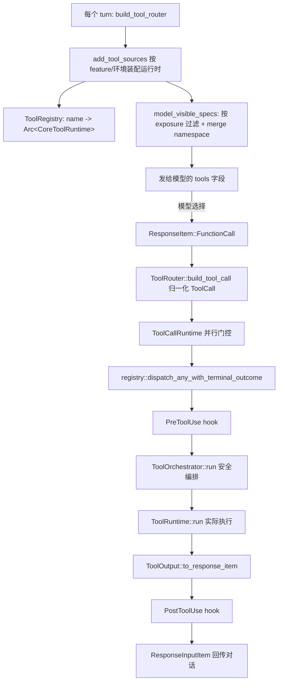
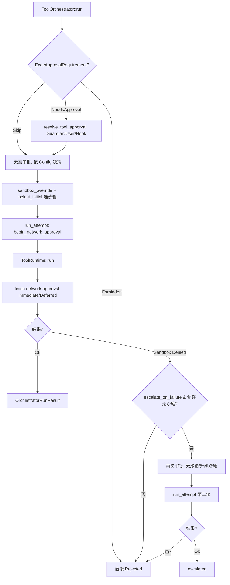


> 《Codex Agent / Harness 深度解剖》系列 · 第 4 篇  
> 源码基准：OpenAI Codex（Apache-2.0，Rust monorepo）`/Users/pelhans/project/codex`  
> 阅读方式：本文由直觉到实现逐步推进，不分层级，可随读随停。

---

# 4 . 工具层：注册表、路由与安全编排

> 一句话：**工具是模型的"手和脚"**——它决定了 agent 能"动"什么，以及"动"的时候有多安全。

---

## 把工具想成模型的"手和脚"

想象一个困在玻璃房里的大脑：它思维敏捷，能读能算，却碰不到房间外的任何东西。LLM 就是这个大脑——它本身只能吐 token，读写文件、跑命令、查网页、调外部系统，全靠 harness 给它接上的"手和脚"。工具接上之后，模型才真正能"做事"。

所以工具层决定了 agent 的两道边界：

```plain
能力边界：工具集合 = 模型的"动作空间"
          动作空间越粗（一条命令、一个 patch），模型离"自己动手"越近；
          动作空间越碎，模型要用几十步推理去拼装一个本应原子的操作。

风险边界：工具是有副作用的
          shell 能删库，apply_patch 能改源码，web_search 会外发数据。
          工具层必须回答：谁来批准？在何种隔离里执行？失败了怎么办？
```

Codex 把这两件事拆进了两块职责清晰的代码：

-   `codex-rs/tools/src/`：与模型对话的**工具抽象**（一个工具长什么样、它的 schema、它的输出），与具体执行无关，可被其他 crate 复用。

-   `codex-rs/core/src/tools/`：把抽象**落进运行时**——注册、路由、并行门控、安全编排（审批→沙箱→执行→沙箱拒绝重试→网络审批）、结果回传。

先立住一个贯穿全文的观点：**Codex 把"批准"和"执行"彻底解耦**。`ToolExecutor` 上只有 `handle`，没有 `call_with_approval`；审批是在 `ToolOrchestrator::run` 里以"包裹"方式注入的。于是同一个工具既能跑在"永不询问"的 CI 模式，也能跑在"每次都问"的交互模式，工具实现本身一行都不用改。理解了这点，后面所有源码都会变得好懂。

---

## 一个工具长什么样：从契约到运行时

先从"模型眼里的一个工具"说起。它大致等于四样东西：**名字 + 描述 + 输入 schema + 一段能跑的逻辑**。Codex 把这套契约拆成两层——对模型可见的"说明书"和真正干活的"脚"。

### 模型的"脚"：`ToolExecutor`

核心契约在 `codex-rs/tools/src/tool_executor.rs:49-69`：

```rust
pub trait ToolExecutor<Invocation>: Send + Sync {
    fn tool_name(&self) -> ToolName;
    fn spec(&self) -> ToolSpec;
    fn exposure(&self) -> ToolExposure { ToolExposure::Direct }
    fn search_info(&self) -> Option<ToolSearchInfo> { /* 由 spec 派生 */ }
    fn supports_parallel_tool_calls(&self) -> bool { false }
    fn handle(&self, invocation: Invocation) -> ToolExecutorFuture<'_>;
}
```

这里有个值得记住的细节：**没有** `call` **/** `call_with_approval`（源码中确实未见这类方法）。真正干活的是 `handle`（`tool_executor.rs:68`），它返回一个 boxed future：`ToolExecutorFuture = Pin<Box<dyn Future<Output = Result<Box<dyn ToolOutput>, FunctionCallError>> + Send + 'a>>`（`tool_executor.rs:10-11`）。批准逻辑不在这个接口上，而在编排层包裹它——这正是上面说的"解耦"。

`exposure()` 控制工具对模型的**可见性**（`tool_executor.rs:14-36`），是 Codex 很巧妙的设计：

-   `Direct`：直接出现在模型可见工具列表；

-   `Deferred`：先不暴露，只进 `tool_search` 的可发现池（省 token）；

-   `DirectModelOnly`：只给模型、不进 code-mode 嵌套工具面；

-   `Hidden`：只为分发注册、对模型不可见（遗留 shell 工具 `add_dispatch_only`，`spec_plan.rs:698`）。

### 模型的"说明书"：`ToolDefinition` / `ToolSpec` / JSON Schema

`ToolDefinition`（`codex-rs/tools/src/tool_definition.rs:7-13`）是工具元数据的中间表示：

```rust
pub struct ToolDefinition {
    pub name: String,
    pub description: String,
    pub input_schema: JsonSchema,
    pub output_schema: Option<JsonValue>,
    pub defer_loading: bool,
}
```

真正序列化给 OpenAI Responses API 的是 `ToolSpec`（`codex-rs/tools/src/tool_spec.rs:19-53`），它是一个带 `type` tag 的枚举：

```rust
pub enum ToolSpec {
    Function(ResponsesApiTool),        // 普通 function calling
    Namespace(ResponsesApiNamespace),  // 命名空间，把多个 tool 合并成一个 namespace 调用
    ToolSearch { execution, description, parameters }, // 延迟发现
    WebSearch { external_web_access, indexed_web_access, filters, ... }, // 托管联网搜索
    Freeform(FreeformTool),            // 自由格式（如 code-mode 的"代码即工具"）
}
```

参数用的 **JSON Schema 子集**由 `JsonSchema`（`codex-rs/tools/src/json_schema.rs:41-74`）描述，刻意只覆盖 OpenAI Structured Outputs 支持的子集（`type`、`description`、`enum`、`items`、`properties`、`required`、`additionalProperties`、`anyOf/oneOf/allOf`、`$defs` 等）。注意 `strict` 字段（`responses_api.rs:29-31` 的 TODO 提示仍待做校验）：开启时要求 `required` 覆盖全部 `properties`——这正是 Codex 收敛"模型乱填参数"风险的方式。`create_tools_json_for_responses_api`（`tool_spec.rs:79-90`）把 `Vec<ToolSpec>` 直接序列化成请求体。

### 工具"说出来的话"：`ToolOutput`

工具产物不是裸字符串，而是实现了 `ToolOutput` 的对象（`codex-rs/tools/src/tool_output.rs:16-53`）。几个关键方法：

-   `to_response_item(call_id, payload) -> ResponseInputItem`：把结果转成回传给模型的 `FunctionCallOutput`（或 `McpToolCallOutput`、`ToolSearchOutput`）。

-   `contains_external_context()`：标记结果是否来自外部上下文（如联网），用于在 `memories.disable_on_external_context` 开启时禁止沉淀记忆（在 `registry.rs:731-739` 实际消费）。

-   `post_tool_use_response()` / `post_tool_use_id()` / `post_tool_use_input()`：把结果投递给 `PostToolUse` hook 的标准契约。

通用实现 `JsonToolOutput`（`tool_output.rs:92-162`）把任意 JSON 包成 `FunctionCallOutputBody::Text`，并负责遥测预览的截断（2 KiB / 64 行，`tool_output.rs:254-292`）。

> 把"模型可见输出"和"hook 可见输出"用同一个 trait 的不同方法分开，是 Codex 比裸 `String` 返回高明的地方——hook 既能看到稳定结构，又不会被迫暴露给模型。

---

## 注册表与路由：从"名字"到一次执行

描述层和运行时层靠两个数据结构粘合：`ToolRegistry`（名字→运行时）和 `ToolRouter`（名字→模型可见 Spec + 分发入口）。

`ToolRegistry`（`codex-rs/core/src/tools/registry.rs:326-328`）本质是一个 `HashMap<ToolName, Arc<dyn CoreToolRuntime>>`。`CoreToolRuntime`（`registry.rs:52-149`）是 core 层对 `ToolExecutor<ToolInvocation>` 的扩展，额外挂载了 hook 载荷构造、参数流 diff 消费（`create_diff_consumer`，支撑流式参数）、以及 `matches_kind`（区分 `Function` / `ToolSearch` 等 payload 类型）。

注册在 `from_tools`（`registry.rs:336-347`）完成：遍历所有运行时，按 `tool_name()` 装入 map，**重名即报错**（`error_or_panic`），迫使工具命名全局唯一。

当模型真的点名要调某个工具，分发入口 `dispatch_any_with_terminal_outcome`（`registry.rs:427-708`）按顺序做这些事：

1.  查表取运行时，取不到则返回 `RespondToModel`（不支持的工具不让会话崩）；

2.  `matches_kind` 校验 payload 兼容；

3.  `notify_tool_start` 通知生命周期；

4.  **PreToolUse hook**（`registry.rs:517-561`）：可被 hook 拦截或改写输入；

5.  调用 `handle_any_tool`（`registry.rs:724-749`）→ `tool.handle(invocation)`；

6.  遥测、外部上下文检查、`PostToolUse hook`（可拦截或改写回传给模型的响应）；

7.  通过 `AnyToolResult::into_response`（`registry.rs:172-180`）转成 `ResponseInputItem`。

`ToolRouter`（`codex-rs/core/src/tools/router.rs:38-41`）持有 `registry` 与 `model_visible_specs` 两份东西。前者分发，后者发给模型的 `tools` 字段。`build_tool_call`（`router.rs:128-176`）把 API 返回的 `ResponseItem::FunctionCall / ToolSearchCall / CustomToolCall` 归一化成统一的 `ToolCall { tool_name, call_id, payload }`。

注册表不是手工填的，而是在每个 turn 由 `build_tool_router` → `build_tool_specs_and_registry`（`spec_plan.rs:158-211`）**按能力与策略动态装配**（`add_tool_sources`，`spec_plan.rs:608-648`）：

-   `add_shell_tools`（`spec_plan.rs:665-707`）：根据 `shell_type_for_model_and_features` 决定注册 `ExecCommandHandler`（unified exec）还是 `ShellCommandHandler`，legacy shell 工具以 `Hidden` 仅保留分发（`spec_plan.rs:698`）。

-   `add_core_utility_tools`（`spec_plan.rs:731-822`）：按 feature flag 选择性注册 `PlanHandler`、`RequestPermissionsHandler`、`ApplyPatchHandler`、`ViewImageHandler`、`CurrentTimeHandler` 等。

-   `add_collaboration_tools`（`spec_plan.rs:824-911`）：按 `MultiAgentVersion` 注册 V1/V2 多 agent 工具，V2 下 spawn 等以 `Deferred` 暴露（配合 tool\_search）。

-   `add_mcp_resource_tools` / `add_extension_tools` / `add_dynamic_tools`：把 MCP、扩展、动态工具接进来。

-   `hosted_model_tool_specs`（`spec_plan.rs:301-331`）：仅在本地不跑 Responses Lite 时，把 `web_search` 等托管工具以 `ToolSpec::WebSearch` 注入（实现见 `hosted_spec.rs:14-46`）。

最后 `build_model_visible_specs_and_registry`（`spec_plan.rs:243-281`）按 `exposure` 过滤出对模型可见的 spec，并把同命名空间的工具 `merge_into_namespaces`（`spec_plan.rs:539-583`）合并。

### 延迟发现：tool\_search 与 deferred 工具

Codex 不把所有工具一次性塞给模型。被标成 `Deferred` 的工具会进入 `tool_search` 的可发现池：`append_tool_search_executor`（`spec_plan.rs:962-994`）收集所有 `Deferred` 运行时的 `search_info()`（文本来自 `tool_search.rs:67-94` 的 `default_tool_search_text`，把名字、描述、参数 schema 拼成可检索文本），构建一个 `ToolSearchHandler`。模型先用 `tool_search` 检索，命中后再真正调用——典型的\*\*省 context 的"工具即检索"\*\*策略。



---

## 并行执行：一把读写锁做门控

并行不是靠线程池，而是靠一把 `RwLock`：`ToolCallRuntime` 持有 `parallel_execution: Arc<RwLock<()>>`（`codex-rs/core/src/tools/parallel.rs:42-49`）。在 `handle_tool_call_with_source`（`parallel.rs:94-202`）里：

```rust
let _guard = if supports_parallel {
    Either::Left(lock.read().await)   // 多个并行工具可同时持读锁
} else {
    Either::Right(lock.write().await) // 非并行工具独占写锁，串行化
};
```

`supports_parallel_tool_calls()` 由每个运行时自行声明（默认 `false`，`tool_executor.rs:64-66`；经 `ExposureOverride` 对 `Hidden` 强制关闭，`registry.rs:271-273`）。也就是说：**声明可并行的工具并发跑，未声明的工具被写锁强制串行**。同时 `tokio::select!` 处理取消（`cancellation_token.cancelled()`），对 `waits_for_runtime_cancellation` 的工具允许先完成清理再返回 `AbortedToolOutput`（`parallel.rs:160-199`）。这是一个把"并发安全"责任下推给工具作者、用锁做全局保证的务实设计。

---

## 安全编排：Orchestrator::run 的流水线

这是整篇文章的"心脏"。`ToolOrchestrator::run`（`codex-rs/core/src/tools/orchestrator.rs:136-514`）把一次工具调用编排成：

> 审批 → 选择沙箱 → 尝试执行 →（沙箱拒绝则）升级/无沙箱重试 → 网络审批结算

文件头注释（`orchestrator.rs:1-8`）点明：**no re-approval on retry thanks to caching**（重试因缓存而无需重新审批）。

**阶段一：审批**（`orchestrator.rs:151-225`）。先根据工具声明的 `exec_approval_requirement`（`sandboxing.rs:340-342`，默认回退 `default_exec_approval_requirement`）决定三类要求（`ExecApprovalRequirement` 枚举，`sandboxing.rs:156-175`）：

-   `Skip { bypass_sandbox, proposed_execpolicy_amendment }`：跳过审批（如 `Never` 策略或策略已放行）；

-   `NeedsApproval { reason, .. }`：必须审批；

-   `Forbidden { reason }`：直接拒绝（`return Err(ToolError::Rejected(...))`，`orchestrator.rs:198-200`）。

需要审批时调用 `resolve_tool_apporval`（`approvals.rs:191-273`），按 `ApprovalReviewer`（Guardian / User，`approvals.rs:132-150`）路由：Guardian 走自动审阅，User 走 `start_approval_async`。审批前还跑 permission-request hook（`approvals.rs:203-230`），hook 可直接 Allow/Deny。审批结果有缓存：`ApprovalStore` + `with_cached_approval`（`sandboxing.rs:41-117`）以序列化 key 存 `ApprovedForSession`，所以同会话内重复调用不会反复弹窗。

**阶段二：首轮尝试**（`orchestrator.rs:227-291`）。根据 `sandbox_override_for_first_attempt`（`sandboxing.rs:242-271`）与 `SandboxManager::should_sandbox` / `select_initial` 选出 `SandboxType`（如 Linux 下 landlock/bwrap）。构造 `SandboxAttempt`（`sandboxing.rs:408-425`，含沙箱类型、权限 profile、cwd、workspace\_roots、网络代理等），交给 `run_attempt`。

**阶段三：**`run_attempt` **内含网络审批**（`orchestrator.rs:56-134`）。`run_attempt` 在执行前先 `begin_network_approval`（`orchestrator.rs:66`）。网络审批两种模式（`NetworkApprovalMode`，`network_approval.rs:49-53`）：`Immediate`（执行后立即 `finish_immediate_network_approval`）或 `Deferred`（执行成功才 `finish_deferred_network_approval`）。随后才真正 `tool.run(req, &attempt_with_network_approval, &attempt_tool_ctx)`（`orchestrator.rs:104-106`）。

**阶段四：沙箱拒绝 → 升级/无沙箱重试**（`orchestrator.rs:293-499`）。若首轮返回 `ToolError::Codex(Sandbox(SandboxErr::Denied {..}))`：

-   若工具 `escalate_on_failure()` 为 `false`（默认 `true`，`sandboxing.rs:371-373`），直接返回拒绝；

-   若 `unsandboxed_execution_allowed` 为 `false` 且非网络场景，拒绝（保留拒绝理由，`orchestrator.rs:373-382`）；

-   否则需要**一次新的审批**（除非 `should_bypass_approval`，`orchestrator.rs:395-422`），再跑第二轮：**无沙箱或升级后的沙箱**（取决于 `unsandboxed_allowed` 与网络上下文）；

-   成功则记为 `escalated`，失败再返回 `denied`。

这套逻辑体现了核心安全哲学：**默认在沙箱里跑；沙箱拦了，绝不悄悄提权，除非经过一次新的、明确的审批**，且"拒绝原因"要能区分是文件系统还是网络策略（`network_approval_context`，`orchestrator.rs:383-391`）。



---

## 内置工具与"破坏性"判定

Codex 的内置工具几乎都在 `codex-rs/core/src/tools/handlers/` 下，由 `spec_plan.rs` 按能力装配。下表给出主要工具及其职责与是否破坏性：

| 工具（Handler） | 暴露名 / 命名空间 | 职责 | 破坏性？ | 管控方式 |
| --- | --- | --- | --- | --- |
| `ShellCommandHandler` / `ExecCommandHandler`（`unified_exec`） | `shell_command` / `exec_command`(+`write_stdin`) | 执行任意 shell 命令/进程 | **是**（可删库、改系统） | 沙箱 + 审批 + 网络策略 |
| `ApplyPatchHandler` | `apply_patch` | 以 patch 形式原子改文件 | **是**（改源码） | 逐文件审批 key（`ApprovalAction::ApplyPatch`，`approvals.rs:45-51`）+ 沙箱 |
| `ViewImageHandler` | `view_image` | 读图给模型看 | 否（只读） | 沙箱只读 |
| `CurrentTimeHandler` / `SleepHandler` | `current_time` / `sleep` | 取时间 / 休眠 | 否 | — |
| `PlanHandler` | `plan` | 写入/更新计划 | 否（元数据） | — |
| `RequestUserInputHandler` | `request_user_input`（`DirectModelOnly`） | 向用户提问 | 否（交互） | — |
| `RequestPermissionsHandler` | `request_permissions` | 运行时请求额外权限 | 否（但提权） | 受 `exec_permission_approvals` feature 约束 |
| `ToolSearchHandler` | `tool_search` | 延迟发现 Deferred 工具 | 否 | — |
| `WebSearch`（托管） | `web_search` / `web.run` | 联网搜索 | 否（但外发） | 托管 + 网络审批 |
| `McpHandler` / MCP Resource 工具 | 各 MCP server 命名空间 | 调用外部 MCP 工具/读资源 | 视 `destructive_hint` | 见下 |
| 多 agent 工具（`SpawnAgent*` 等） | `agent` / 自定义 ns | 派生子 agent | 否（但派生成本） | 受 `multi_agent_version` 限制 |
| 动态/扩展工具（`DynamicToolHandler` / `ExtensionToolAdapter`） | 按 spec | 插件/扩展注入 | 视实现 | 受扩展机制管控 |

**关于"破坏性(destructive)"的精准说法**：在 Codex 中，内置的 `shell`/`apply_patch` 等高危工具**没有布尔** `destructive` **标志位**，它们的破坏性由"沙箱 + 审批 + 网络策略"这一通用管线统一管控。真正出现 `destructive` 概念的是**外部工具**：

-   MCP 工具：`annotations.destructive_hint` 被读取（`mcp_tool_call.rs:180`、`2161-2173`），缺失时默认视为 `true`（`mcp_tool_call.rs:2173`）。

-   App 连接器工具：由配置 `destructive_enabled`（`config/src/types.rs:415-470`）控制是否允许默认开启，据此评估。

所以准确结论是：**Codex 用"管道化管控"代替"工具自带破坏性标签"来处理内置工具；破坏性标签只用于约束外部（MCP / 连接器）工具**。这是更可扩展的取向——新增一个能删库的工具，不需要新写一个 flag，只要它走同一套 `ToolRuntime` 就行。

> 源码中未见独立的内置"文件读取 / 文件搜索"工具。Codex 的文件读写与搜索全部通过 `shell_command` / `unified_exec` 在沙箱内用 `cat`/`grep`/`find` 等完成；`web_search`/`file_search` 等"检索类"能力以托管 Responses API 工具或 MCP 资源工具形式提供，而非 core 内置 handler。

---

## 设计哲学：粗粒度"代码即工具" vs 细粒度 function calling

这是 Codex 与很多"细粒度工具党"最不同的地方。两种取向：

-   **细粒度 function calling**：把一个动作拆成很多小工具，例如 `read_file(path)`、`list_dir(path)`、`edit_line(file, line, content)`、`search_in_file(...)`。优点是单步安全、可审计；缺点是**动作空间爆炸**，模型要用几十步才能"改一个 bug"，每一步都有出错与上下文膨胀的累积风险。

-   **粗粒度（代码即工具）**：给模型一个能跑任意代码的工具（`shell_command` / `unified_exec` / `apply_patch`），让它自己用代码解决问题。Codex 明显偏向前者，证据遍布代码：核心执行单元是"一条命令 / 一个 patch"，而非"一个文件操作原语"；`apply_patch` 用统一 diff 格式一次性改多文件（对应 `ApprovalAction::ApplyPatch` 的 `Vec<PathUri> files`，`approvals.rs:49`）；code-mode 下更极端——`CodeModeExecuteHandler` 把"执行一大段代码"做成单个嵌套工具（`spec_plan.rs:523-534`，`Freeform` 格式）。

**为什么偏向前者？** 对一个以"写代码、改代码、跑代码"为核心的 coding agent，语言（shell/Python/diff）本身就是最通用、最高表达力的"工具协议"。与其造 100 个低层原语，不如给模型一个能表达任意组合的高层工具，再用**沙箱 + 审批**把风险锁死。细粒度工具把"安全"从 harness 上移到"工具设计"上，结果往往是工具越多、漏洞面越大。Codex 把安全收敛到一条管线（见上节），工具越粗，这条管线的复用价值越高。

当然代价是：**粗粒度工具对审批与沙箱的要求更苛刻**——你没法靠"这个工具只是读"来放松管控，因为一条 shell 既能读也能删。这正是 Codex 必须做"逐次审批 + 沙箱拒绝升级"的根本原因。

---

## 统一抽象对照：Claude / OpenAI / MCP / Codex

四类体系在"工具"上的抽象高度同构，Codex 的 `ToolExecutor` 是其中最"分层"的一个——把 Spec、Runtime、Orchestration 拆得很干净：

| 维度 | Anthropic Claude Tool use | OpenAI function calling | MCP（Model Context Protocol） | **Codex **`ToolExecutor` |
| --- | --- | --- | --- | --- |
| 工具描述 | `tools[]`：`name/description/input_schema`（JSON Schema） | `tools[]`：`type=function`，`function.{name,description,parameters}` | `tools/list` 返回 `name/description/inputSchema` + `annotations` | `ToolSpec`（`Function`/`Namespace`/`WebSearch`/`Freeform`）+ `JsonSchema` |
| 调用 | `tool_use` block + `tool_use_id` | `function` role message + `tool_call_id` | `tools/call` JSON-RPC | `ResponseItem::FunctionCall` → `ToolCall` → `ToolInvocation` |
| 结果回传 | `tool_result` block | `tool` role message | `tools/call` 返回 `content/isError` | `ToolOutput::to_response_item` → `ResponseInputItem::FunctionCallOutput` |
| 破坏性/风险元数据 | 无显式字段（靠 prompt） | 无 | `annotations.destructive_hint` | 内置工具靠管线管控；外部 MCP 复用 `destructive_hint`，连接器用 `destructive_enabled` |
| 审批/安全 | 无标准层（应用自管） | 无标准层 | 无标准层（server 自管） | **内建**：`ExecApprovalRequirement` + `ToolOrchestrator` + 沙箱 |
| 命名空间/分组 | 无 | 无 | server 即分组 | `Namespace`（`ToolSpec::Namespace`）+ code-mode 嵌套 |
| 延迟/可发现 | 全量给模型 | 全量给模型 | 全量 list | `Deferred` + `tool_search` 检索发现 |
| 流式参数 | 不支持 | 不支持 | 部分 | `ToolArgumentDiffConsumer`（`registry.rs:146-148`） |

结论：四者在"工具描述 = 名字+描述+JSON Schema"上已事实趋同；分水岭在**安全编排是否内建**——Claude/OpenAI/MCP 都把审批与隔离留给应用层，而 Codex 把它固化进 `ToolOrchestrator`，并用 `ToolExecutor` 的 `exposure` / `supports_parallel_tool_calls` 等钩子把"可见性、并行性、可发现性"也标准化了。

---

## 心智模型

> **工具层 = 一张"名字→运行时"的注册表 + 一条"模型可见 Spec"的路由 + 一段"审批→沙箱→执行→重试→网络审批"的安全编排。** 抽象与执行分离，审批再与执行分离，于是同一套工具既能跑 CI 也能跑交互。

-   **三层心智**：描述层（`ToolSpec`/`JsonSchema`）对模型可见、运行时层（`ToolExecutor`/`CoreToolRuntime`）真正干活、编排层（`ToolRegistry`/`ToolRouter`/`ToolOrchestrator`）把名字翻译成带安全兜底的副作用。

-   **解耦是主旋律**：`ToolExecutor` 只有 `handle`，审批是 `ToolOrchestrator` 包裹进来的——换策略不必改每个工具。

-   **并行靠锁不靠池**：`RwLock<()>` 让可并行工具并发、不可并行工具串行。

-   **默认最小权限 + 显式升级**：沙箱拒绝不是失败，是"请重新审批再无沙箱/升级沙箱"的信号。

-   **粗粒度 + 强管控 > 细粒度 + 弱管控**（针对 coding agent）：语言即工具协议，安全锁进管线。

可迁移到你自己做 agent 框架的几点经验：

1.  **把"批准"从工具方法里拿掉**，否则换策略就得改每个工具。

2.  **用"管线"统一管控风险**，而不是给每个工具打风险标签——扩展性强得多。

3.  **可见性、并行性、可发现性都要可声明**，`Deferred` + `tool_search` 是省 context 的成熟套路。

4.  **沙箱拒绝即升级信号**：默认沙箱跑，被拒→重新审批→无沙箱/升级沙箱再试，且"无沙箱"必须重新过审。

5.  **粗粒度工具 + 强管控**更适合 coding agent；把表达能力交给代码，把安全锁进管线。

---

## 自测题（检验你是否真懂）

1.  为什么说 `ToolExecutor` 上没有 `call_with_approval` 反而是优点？它把"批准"放在了哪一层？

2.  `ToolRegistry` 重名即报错，这个设计在解决什么问题？

3.  `supports_parallel_tool_calls()` 默认 `false`，配合 `RwLock<()>` 是怎么保证"没声明的工具被串行化"的？

4.  `ToolOrchestrator::run` 里，沙箱拒绝后为什么还要"再次审批"才能无沙箱重跑？直接提权不行吗？

5.  Codex 内置工具没有 `destructive` 布尔字段，它靠什么区分"这个工具危不危险"？

---

## 延伸阅读（结合网络讲解）

-   **Building Agents with Model Context Protocol**（工具/资源/提示的统一抽象）：modelcontextprotocol.io

-   **Anthropic Tool Use 文档**（Claude 的 `tools[]` 与 `tool_result`）：docs.anthropic.com/en/docs/build-with-claude/tool-use

-   **OpenAI Functions / Tools 指南**（Responses API 的 function calling）：platform.openai.com/docs/guides/function-calling

-   **Codex Harness 官方讲解（Agent Loop / 工具编排）**：agent.csdn.net

-   **上一篇：Agent 循环**（`harness-series/agent-loop.md`）、**上下文工程**（`harness-series/context-engineering.md`）

---

## 关键符号速查

| 符号 | 位置 |
| --- | --- |
| `ToolExecutor` trait | `codex-rs/tools/src/tool_executor.rs:49` |
| `ToolExecutorFuture` | `codex-rs/tools/src/tool_executor.rs:10` |
| `ToolExposure` 枚举 | `codex-rs/tools/src/tool_executor.rs:14` |
| `ToolDefinition` | `codex-rs/tools/src/tool_definition.rs:7` |
| `ToolSpec` 枚举 | `codex-rs/tools/src/tool_spec.rs:19` |
| `create_tools_json_for_responses_api` | `codex-rs/tools/src/tool_spec.rs:79` |
| `JsonSchema` | `codex-rs/tools/src/json_schema.rs:41` |
| `ToolOutput` trait | `codex-rs/tools/src/tool_output.rs:16` |
| `JsonToolOutput` | `codex-rs/tools/src/tool_output.rs:92` |
| `ToolRegistry` | `codex-rs/core/src/tools/registry.rs:326` |
| `CoreToolRuntime` trait | `codex-rs/core/src/tools/registry.rs:52` |
| `dispatch_any_with_terminal_outcome` | `codex-rs/core/tools/registry.rs:427` |
| `ToolRouter` | `codex-rs/core/src/tools/router.rs:38` |
| `build_tool_call` | `codex-rs/core/src/tools/router.rs:128` |
| `build_tool_router` | `codex-rs/core/src/tools/spec_plan.rs:158` |
| `add_tool_sources` | `codex-rs/core/src/tools/spec_plan.rs:608` |
| `append_tool_search_executor` | `codex-rs/core/src/tools/spec_plan.rs:962` |
| `ToolCallRuntime` + `parallel_execution` | `codex-rs/core/src/tools/parallel.rs:42` |
| `ToolOrchestrator::run` | `codex-rs/core/src/tools/orchestrator.rs:136` |
| `run_attempt`（含网络审批） | `codex-rs/core/src/tools/orchestrator.rs:56` |
| `ExecApprovalRequirement` | `codex-rs/core/src/tools/sandboxing.rs:156` |
| `SandboxAttempt` | `codex-rs/core/src/tools/sandboxing.rs:408` |
| `resolve_tool_apporval` | `codex-rs/core/src/tools/approvals.rs:191` |
| `NetworkApprovalMode` | `codex-rs/core/src/tools/network_approval.rs:49` |
| `create_web_search_tool` | `codex-rs/core/src/tools/hosted_spec.rs:14` |

