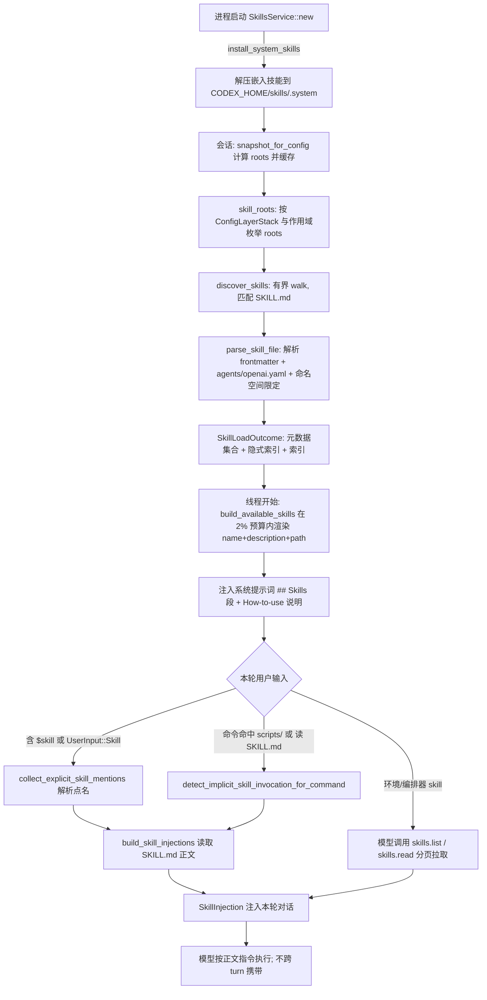


> 一句话：**Skill = 一个可复用能力包（指令 + 脚本 + 资源），让 agent 不改核心就获得新能力；而它能否"被看见、被用对、不撑爆上下文"，靠的是一套分级加载 + 预算裁剪 + 确定性触发的协同机制。**

## 从"给同事一本操作手册"说起

想象你带一位能力很强、但刚接手项目的同事。他懂编程、会查文档，却不知道"怎么给咱们内部 API 签名""怎么把制品发到那个私有插件市场"。你不会每次开会都把两百页手册念一遍——又贵又吵，还干扰他处理别的活。

Agent 也一样。**模型的知识是静态、通用的，而任务世界是动态、专用、长尾的。** 把"某内部 CLI 的正确参数组合"全塞进系统提示词，既昂贵又污染每一个无关会话的上下文。

Codex 的解法是 **Skill（技能）**：一个自包含的能力包——以 `SKILL.md` 为入口的**指令 + 脚本（**`scripts/`**） + 资源（**`references/`**、**`assets/`**）**。它在不改核心代码的前提下，让 agent 在"遇到相关任务"时获得新的程序性知识。

先澄清一个常见误解：`web_search`、`shell` 在 Codex 里**不是 Skill，而是 Tool（工具）**——前者解决"能调用什么能力"，Skill 解决"该怎么做"。内置的 `imagegen`、`skill-creator`、`openai-docs`、`review-agent`、`plugin-creator`、`skill-installer` 才是真正的 Skill（`codex-rs/skills/src/assets/samples/`）。Skill 与 Plugin 则是**内容单元与容器**的关系（后文详述）。

## 为什么不能把技能全塞进上下文：渐进式披露

几百个 Skill 的正文若一次性注入，会瞬间撑爆窗口、挤掉对话历史与真正的用户请求。这背后有个朴素道理：skill-creator 自己的 `SKILL.md` 就告诫——**"context window is a public good"（上下文窗口是公共品）**。无关指令还会稀释注意力、降低模型遵循正确流程的概率。

Codex 因此采用 **Progressive Disclosure（渐进式披露）**：先给"目录"，后给"正文"。

1.  **元数据层（始终可见、极廉价）**：会话开始只把每个 skill 的 `name` + `description` + `path` 注入系统提示词，让模型"知道有哪些能力可用"。

2.  **正文层（按需注入）**：只有当用户点名（输入里写 `$skill-name` 或选中 `UserInput::Skill`），或模型判断任务"明显匹配"某条 description 时，才读取该 `SKILL.md` 完整正文。

元数据层还有硬预算：默认占上下文窗口 **2%**（token）或回退 **8000 字符**（`render.rs:19` `SKILL_METADATA_CONTEXT_WINDOW_PERCENT = 2`、`render.rs:18` `DEFAULT_SKILL_METADATA_CHAR_BUDGET = 8000`）。但在进入预算算法之前，每条 description 还会先被单独截断到 `MAX_DEFAULT_CONTEXT_SKILL_DESCRIPTION_CHARS = 1024` 字符并补 `...`（`render.rs:20-21`、`render.rs:537` `truncate_default_context_skill_description`）——这是"单条安全线"，预算算法处理的才是"总量安全线"。超出总量预算时先截断 description，再丢弃低优先级 skill。

## 一个技能长什么样：SKILL.md 与元数据

一个 skill 是个目录，入口必须是 `SKILL.md`（`core-skills/src/loader.rs:139` `const SKILLS_FILENAME = "SKILL.md"`）。它含 **YAML frontmatter** 与正文，frontmatter 经 `parse_skill_frontmatter_metadata_inner`（`loader.rs:744`）用 `serde_yaml` 解析；若第三方写成 `description: Build for AWS: ECS` 这类带冒号的散文，`repair_frontmatter_scalar_fields`（`loader.rs:1077`）会做行级兜底：逐行扫描，遇到 `key: value` 且 value 里含有空格后接 `:`（如 `AWS: ECS`）或形似流标量的片段，就把整段 value 单引号包裹再交给 `serde_yaml`（`loader.rs:1136-1157`）。注意这个修复是**行级、保守**的——它只改写被判定为"看起来像 YAML 但其实是散文"的标量，其它真正非法的 YAML 仍会原样报错，不会悄悄吞掉。

最小化 frontmatter（取自 `skill-creator/SKILL.md`）：

```yaml
---
name: skill-creator
description: Guide for creating effective skills. This skill should be used when users want to create a new skill...
metadata:
  short-description: Create or update a skill
---
# Skill Creator
... 正文指令 ...
```

`name` **与** `description` **必填**（缺 `description` 直接报 `MissingField`，`loader.rs:783`）；`name` 缺省回退为父目录名（`loader.rs:794` `default_skill_name`，且会做 `sanitize_single_line` 把多余空白压成单空格）。长度有硬上限：`MAX_NAME_LEN=64`、`MAX_QUALIFIED_NAME_LEN=128`、`MAX_DESCRIPTION_LEN=1024`（`loader.rs:144-146`）——注意 qualified name（插件命名空间限定后的全名）单独给了 128 上限，因为要容纳 `namespace:name`。

除 frontmatter，还有可选富元数据 `agents/openai.yaml`（`loader.rs:141-142` `SKILLS_METADATA_DIR="agents"`、`SKILLS_METADATA_FILENAME="openai.yaml"`），声明 UI 呈现信息（`display_name`/`icon`/`default_prompt` 等）。它们最终被解析进 `SkillMetadata`（`codex-rs/skills/src/model.rs:8`）——整个子系统的**核心元数据结构体**：

```rust
// codex-rs/skills/src/model.rs:8
pub struct SkillMetadata {
    pub name: String,
    pub description: String,
    pub short_description: Option<String>,
    pub interface: Option<SkillInterface>,       // 来自 agents/openai.yaml
    pub dependencies: Option<SkillDependencies>,  // 声明依赖的工具
    pub policy: Option<SkillPolicy>,              // 是否允许隐式调用 / 产品门控
    pub path_to_skills_md: AbsolutePathBuf,       // 指向声明该 skill 的 SKILL.md
    pub scope: SkillScope,                        // User / Repo / System / Admin
    pub plugin_id: Option<String>,
    pub remote_plugin_id: Option<String>,
}
```

`interface` 的解析走 `resolve_interface`（`loader.rs:878`）：图标路径必须落在 skill 的 `assets/` 下，或用 `..` 回退到插件级 `assets/`（`loader.rs:982` `resolve_asset_path` + `loader.rs:1031` `resolve_plugin_shared_asset_path`），否则整条 `interface` 被丢弃但**不影响 SKILL.md 本身加载**——这是典型的 fail-open。`policy` 经 `resolve_policy`（`loader.rs:937`）原样搬入 `SkillPolicy`：

```rust
// codex-rs/skills/src/model.rs:62
pub struct SkillPolicy {
    pub allow_implicit_invocation: Option<bool>,
    // TODO: Enforce product gating in Codex skill selection/injection instead of only parsing and
    // storing this metadata.
    pub products: Vec<Product>,
}
```

`SkillDependencies`/`SkillToolDependency`（`model.rs:80-93`）把 skill 与所需工具绑定——这正是后文协作关系的落地：

```rust
// codex-rs/skills/src/model.rs:80-93
pub struct SkillDependencies { pub tools: Vec<SkillToolDependency> }
pub struct SkillToolDependency {
    pub r#type: String,        // 例如 "function" / "mcp"
    pub value: String,         // 工具名或标识
    pub description: Option<String>,
    pub transport: Option<String>,  // 例如 "sse" / "stdio"
    pub command: Option<String>,    // 本地命令
    pub url: Option<String>,        // 远程地址
}
```

`SkillMetadata::allows_implicit_invocation()`（`model.rs:23`）取 `policy.allow_implicit_invocation`，缺省为 `true`——也就是说默认所有 skill 都可被隐式触发，除非显式关掉。

## 技能是怎么被找到的：Discovery 与命名空间

发现从 `SkillsService`（`core-skills/src/service.rs:71`）开始，`snapshot_for_config`（`service.rs:132`）按 `Config` 计算 roots 并缓存（缓存 key 含 roots 与 skill 配置规则，`service.rs:318` `config_skills_cache_key`），最终落到 `loader.rs` 的 `skill_roots`（`loader.rs:240`）。

roots 按\*\*配置层（ConfigLayerStack）**与**作用域（SkillScope）\*\*枚举（`loader.rs:292` `skill_roots_from_layer_stack_inner`）：

| 来源 | 路径 | `SkillScope` | 代码位置 |
| --- | --- | --- | --- |
| 项目配置层 | `<config_folder>/skills` | `Repo` | `loader.rs:308` |
| 用户安装技能 | `$HOME/.agents/skills` | `User` | `loader.rs:335` |
| 嵌入的系统技能 | `$CODEX_HOME/skills/.system`（二进制 `include_dir!` 解压，`skills/src/lib.rs:22,44`） | `System` | `loader.rs:349` |
| 系统配置层 | `/etc/codex/skills` | `Admin` | `loader.rs:359` |
| 插件携带的技能 | `PluginSkillRoot`（`loader.rs:269`） | `User`（命名空间限定） | `loader.rs:269` |
| 仓库 `.agents/skills` | 从 cwd 上溯到项目根（`loader.rs:383` `repo_agents_skill_roots`） | `Repo` | `loader.rs:383` |

每个 root 用 `discover_skills`（`discovery.rs:54`）做**有界遍历**，限制写在 `WalkOptions`（`discovery.rs:65-84`）里：`max_depth`（递归模式 `MAX_SCAN_DEPTH=6`，插件 `DirectChildren` 模式为 2，`discovery.rs:69-72`）、`max_directories = MAX_SKILLS_DIRS_PER_ROOT=2000`、`max_entries = MAX_SKILLS_ENTRIES_PER_ROOT=20000`（`discovery.rs:73-74`；后者常量实际定义在 `discovery.rs:17`）。遍历跳过隐藏目录（`HiddenDirectoryPolicy::Skip`，但隐藏目录之上仍可经可见别名到达），并对 `User/Repo/Admin` 作用域**跟随目录软链**、对 `System` 作用域**忽略软链**（`loader.rs:539-542`）——系统技能是被信任的嵌入内容，不值得为它承担软链逃逸风险。

匹配到 `SKILL.md` 即记为 `DiscoveredSkill`（`discovery.rs:43`），再经 `parse_skill_file`（`loader.rs:695`）产出 `SkillMetadata`，聚合成 `SkillLoadOutcome`（`core-skills/src/model.rs:25`）。`SkillLoadOutcome` 不止一份技能列表，它还带着 `disabled_paths`、`skill_root_by_path`、以及两张隐式触发索引（后文详述，`model.rs:32-33`）——它是后续所有渲染与触发的"单一事实源"。

### 同名技能与作用域：谁覆盖谁

加载完成后，同名技能到底谁"赢"？这要分两种场景看。

**目录可见性（预算裁剪时谁先被丢）**：渲染目录时 `ordered_skills_for_budget`（`render.rs:901`）按 `prompt_scope_rank`（`render.rs:912`）排序：

```rust
// render.rs:912
fn prompt_scope_rank(scope: SkillScope) -> u8 {
    match scope {
        SkillScope::System => 0,   // 最高优先级
        SkillScope::Admin  => 1,
        SkillScope::Repo   => 2,
        SkillScope::User   => 3,   // 最低优先级
    }
}
```

所以排序后顺序是 `System < Admin < Repo < User`，预算不够时从 `User` 这一端开始裁。注意：**同作用域内同名技能不会互相"覆盖"，它们会并列出现**——Codex 不在加载期做"后者覆盖前者"的消重，而是把消重责任交给模型与显式点名路径。

**显式点名（谁被选中执行）**：在 `collect_explicit_skill_mentions` → `select_skills_from_mentions`（`injection.rs:367`）里，纯文本 `$name` 匹配前会数 `skill_name_counts`；若同名出现不止一次（`skill_count != 1`）或撞上 connector（`connector_count != 0`），就直接跳过（`injection.rs:433`）——即"同名歧义 → 谁都不自动选"，逼你用精确路径或限定名点名。这避免了"用户写 `$search`，结果两个插件各有一个 `search` 却被随机选错"的事故。

**插件命名空间限定**则是从根上消除冲突的机制。`SkillNamespaceResolver`（`loader/namespace.rs:25`）沿着技能路径向上找最近的合法插件清单，把插件名作为命名空间前缀：

```rust
// core-skills/src/loader/namespace.rs:176
fn qualify(&self, base_name: &str) -> String {
    match self {
        ResolvedSkillNamespace::Plain => base_name.to_string(),
        ResolvedSkillNamespace::Plugin(ns) => format!("{ns}:{base_name}"), // 例: sample:search
    }
}
```

在 `load_skills_under_root` 中，解析出的 `name` 会被 `namespace_resolver.for_skill(...).qualify(...)` 改写（`loader.rs:678-681`），随后按 `MAX_QUALIFIED_NAME_LEN=128` 校验。命名空间优先级（`namespace.rs:20-24`）为：显式提供的命名空间 > 最深匹配的规范软链/嵌套插件根 > 扫描根继承的命名空间。于是不同插件里的 `search` 会变成 `sample:search` 与 `other:search`，全局唯一、不再歧义，也无需在加载期互相覆盖。

## 渐进式加载：目录常驻、正文按需

**第一步——目录注入（会话开始）**：`session/mod.rs:3373` 调 `build_available_skills`（`render.rs:155`），按 `default_skill_metadata_budget`（`render.rs:138`）的 2%/8000 字符预算，只取 `allowed_skills_for_implicit_invocation()`（`core-skills/src/model.rs:45`，即 `is_skill_enabled && allows_implicit_invocation`）的 `name/description/path`，渲染成 `## Skills` 段，由 `AvailableSkillsInstructions`（`core/src/session/mod.rs:3380`）拼进系统提示词，并附 **"How to use skills"** 说明（`render.rs:30`）。其中触发规则至关重要：

> *"If the user names a skill (with* `$SkillName` *or plain text) OR the task clearly matches a skill's description shown above, you must use that skill for that turn. Multiple mentions mean use them all. Do not carry skills across turns unless re-mentioned."*（`render.rs:31`）

也就是说，**"基于 description 匹配"交给 LLM 自己读目录判断，不是向量检索/embedding 匹配**——这是 Codex 与某些"自动语义召回 skill"实现的本质差异。Codex 把匹配权交给模型，仅在**命令层**做确定性隐式触发（见下）。`Do not carry skills across turns` 这句也提前点出了正文层注入的生命周期约束（见下一节）。

### 预算降级算法：从完整渲染到逐字符分摊

目录渲染的核心在 `render_skill_lines_from_lines`（`render.rs:319`），它是一个**三档降级**的状态机。先看骨架（已精简注释）：

```rust
// render.rs:319
fn render_skill_lines_from_lines(skill_lines, total_count, budget) -> (Vec<String>, SkillRenderReport) {
    let full_cost = skill_lines.iter().fold(0, |u, l| u.saturating_add(l.full_cost(budget)));
    if full_cost <= budget.limit() {
        // 档一：全部完整渲染
        return (render full, report(omitted=0, truncated=0));
    }
    let minimum_cost = skill_lines.iter().fold(0, |u, l| u.saturating_add(l.minimum_cost(budget)));
    if minimum_cost <= budget.limit() {
        // 档二：够放最小行，于是把剩余预算逐字符分摊给 description
        let rendered = render_lines_with_description_budget(budget, &skill_lines, budget.limit()-minimum_cost);
        return (rendered, report(truncated));
    }
    // 档三：连最小行都放不下，按优先级（System→User）只保留最小行，其余整条丢弃
    render_minimum_skill_lines_until_budget(budget, skill_lines, total_count)
}
```

-   **档一（充足）**：每条渲染为 `- {name}: {description} (file: {path})`（`render.rs:524`）。

-   **档二（仅够最小行）**：先把每条压缩成最小行 `- {name}: (file: {path})`（`render.rs:520`），再把"省下来的预算"按字符分配给各条 description。分配算法 `render_lines_with_description_budget`（`render.rs:599`）非常巧妙——**一次只给一条技能加一个字符，循环到预算耗尽**：

```rust
// render.rs:615（节选）
loop {
    let mut changed = false;
    for (index, line) in budget_lines.iter().enumerate() {
        if char_allocations[index] >= line.description_char_count { continue; }
        let next_cost = line.extra_costs[char_allocations[index]+1];
        let delta = next_cost - current_extra_costs[index];
        if delta <= remaining {
            char_allocations[index] += 1; remaining -= delta; changed = true;
        }
    }
    if !changed { break; }
}
```

这种"逐字符轮流喂"的好处是：**短 description 一旦喂满就自然退出，它剩下的份额会流给长 description**，而不是把固定配额卡死在每条上（测试 `budgeted_rendering_redistributes_unused_description_budget` 专门验证：短 skill 拿到 `x`、长 skill 拿到 `abcdefgh`，而不是机械平分）。

-   **档三（极端）**：`render_minimum_skill_lines_until_budget`（`render.rs:376`）按排序后的顺序（即 `System` 先、`User` 后）逐个塞最小行，预算一满就停止，剩下的整条计入 `omitted_count`。注意它**不会**为了塞进低优先级而丢高优先级——因为排序在前，高优先级早就被收下了。

此外还有一层**别名优化**：当绝对路径很长（典型是插件缓存里的深路径），`build_aliased_available_skills`（`render.rs:654`）会先算一个 `### Skill roots` 别名表（`- \`r0\` = \`/Users/x/.codex/plugins/cache/...\``），把路径写成` r0/skill-x/SKILL.md`，再比较"别名版"与"绝对路径版"谁让更多技能入围 / 更少 description 被截；只有别名更好时才用（`render.rs:870 aliased\_render\_is\_better\`）。这等于在预算里又挤出一块空间，但代价是多一段说明文字。

当发生截断或丢弃时，渲染器会产出告警：平均截断超过 100 字符就给 `SKILL_DESCRIPTION_TRUNCATED_WARNING`（`render.rs:24`，token 预算版带 "2%" 字样，`render.rs:25`）；有整条被丢则给 `Exceeded skills context budget. All skill descriptions were removed and N additional skills were not included...`（`render.rs:26` + `render.rs:219`）。告警作为 `WarningEvent` 发给前端（`session/mod.rs:3384`），让用户知道"有些技能看不见了，关掉不用的技能/插件能腾出空间"。

**第二步——正文注入（turn 内、按需）**：用户输入含 `$skill-name` 或 `UserInput::Skill` 时，`collect_explicit_skill_mentions`（`injection.rs:160`）解析点名的 `SkillMetadata`（结构化 `UserInput::Skill` 先按路径精确匹配，再扫描文本里的 `$name` 与 `[$name](path)` 链接，`injection.rs:202-214`）；`session/turn.rs:657` 调 `build_skill_injections`（`injection.rs:72`）**真正读取 SKILL.md 正文**（`injection.rs:94` `fs.read_file_text`），封装成 `SkillInjection { name, path, contents }`（`injection.rs:27`）。其中同一个 turn 内若扩展已注入过该 host 正文，会用 `InjectedHostSkillPrompts`（`injection.rs:39`）去重，避免 legacy 路径重复发送。环境/编排器托管的 skill 则走 `skills.list`/`skills.read` 工具分页拉取，且主 agent 必须**完整读取、禁止外包给子代理总结**（`render.rs:1003` `skill_usage_instructions_require_complete_main_agent_reads` 测试强约束：断言说明文字里必须含有 "read its `SKILL.md` completely"、"continue until EOF"、"Do not delegate reading, summarizing, or interpreting skill instructions" 等句，且不得出现 "Read only enough to follow the workflow"）。



### 正文注入后去了哪里：SkillInjection 的生命周期

`build_skill_injections` 在 `turn.rs:657` 返回后，每一项 `SkillInjection` 被 `SkillInstructions::from(skill)` 转成 `ContextualUserFragment`，再收集为 `ResponseItem`（`turn.rs:671-674`）。关键点在于：

-   **它进的是"用户侧片段"（user-role fragment）**，作为本轮请求的一部分发给模型——不是系统提示词，也不是长期记忆。

-   **不跨 turn 携带**。上一节 how-to-use 里的 "Do not carry skills across turns unless re-mentioned" 正是这个约束的体现：正文只在被点名/命中的那一轮出现，下一轮模型要再用就得再点一次。这既防止上下文被历史 skill 正文持续污染，也保证"用过即弃"的可观测性。

-   **主 agent 必须整篇读、禁止外包子代理总结**（`render.rs:1003`）。原因在 `SkillInterface`/指令正文里常含**程序性知识**——精确的命令序列、参数顺序、文件路径。这类知识一旦让子代理"读一遍再总结"给主 agent，二次转述极易丢细节或改语义，等于把"操作手册"降级成"听同事口头转述"。所以 Codex 用测试把"完整读、自己读"钉死在指令文案里，并明确允许子代理只做"task work"（真正执行），而非"读/总结指令"。

隐式触发命中的技能同样走 `SkillInvocation { invocation_type: InvocationType::Implicit }`（`injection.rs:97-104` 是 `Explicit`；`core/src/skills.rs:64-71` 是 `Implicit`）计入遥测，但正文是否注入仍取决于该 skill 是否真的被读——触发只是"记账 + 提示"，不是"自动把正文塞进上下文"。

## 隐式触发：命令级确定性通道

除模型主动选，Codex 还有确定性通道——用户跑了某脚本/读某篇文档，其实就在用某 skill。`finalize_skill_outcome`（`service.rs:344`）预建 `implicit_skills_by_scripts_dir` 与 `implicit_skills_by_doc_path` 两张索引（`invocation_utils.rs:10` `build_implicit_skill_path_indexes`）；命令执行时 `detect_implicit_skill_invocation_for_command`（`invocation_utils.rs:31`）做检测：

```rust
// invocation_utils.rs:31
pub fn detect_implicit_skill_invocation_for_command(outcome, command, workdir) -> Option<SkillMetadata> {
    let workdir = canonicalize_if_exists(workdir);
    let tokens = tokenize_command(command);            // shlex 分词
    if let Some(c) = detect_skill_script_run(outcome, tokens, workdir) { return Some(c); }
    detect_skill_doc_read(outcome, tokens, workdir)
}
```

-   **跑脚本**：`script_run_token`（`invocation_utils.rs:51`）识别 runner 是否在白名单 `python/python3/bash/zsh/sh/node/deno/ruby/perl/pwsh`（`invocation_utils.rs:52-53`），且下一个非 `-` 开头参数以 `.py/.sh/.js/.ts/.rb/.pl/.ps1` 结尾（`invocation_utils.rs:55`）；`detect_skill_script_run`（`invocation_utils.rs:83`）把脚本路径相对 workdir 规范化后，**沿祖先目录上溯**，只要有祖先落在 `implicit_skills_by_scripts_dir` 索引里（即某 skill 的 `scripts/` 目录），就命中该 skill（`invocation_utils.rs:92-96`）。

-   **读文档**：`detect_skill_doc_read`（`invocation_utils.rs:101`）用 `parse_command_impl` 解析出 `ParsedCommand::Read { path }`，把路径规范化后去 `implicit_skills_by_doc_path` 索引查——命中即"用户正在读某 skill 的 `SKILL.md`"（`invocation_utils.rs:106-112`）。

命中后回到 `core/src/skills.rs:51` 的 `maybe_emit_implicit_skill_invocation`：它先构造 `seen_key = "{scope}:{path}:{name}"` 并插入本 turn 的 `implicit_invocation_seen_skills` 集合（`skills.rs:80-88`）；`insert` 返回 `false` 表示本轮已经记过，**直接 return 去重**。只有首次命中才发 OpenTelemetry 计数（`codex.skill.injected`，`invoke_type=implicit`，`skills.rs:107-115`）并上报 analytics（`skills.rs:116-126`）。这让"被使用那一刻"就能记账，而不依赖模型是否自觉点名——同时也保证同一条命令同 turn 内不会被重复计。

## 内置的 core-skills 与 fingerprint 机制

随二进制**嵌入**的系统技能来自 `codex-rs/skills/src/assets/samples/`，构建期经 `include_dir!`（`skills/src/lib.rs:22`）打进可执行文件，首次启动由 `install_system_skills`（`skills/src/lib.rs:44`）解压到 `$CODEX_HOME/skills/.system`。关键在它**不会每次启动都重写**——靠一个 fingerprint marker：

```rust
// skills/src/lib.rs:44
pub fn install_system_skills(codex_home) -> Result<()> {
    let dest_system = system_cache_root_dir(codex_home);          // CODEX_HOME/skills/.system
    let marker_path = dest_system.join(".codex-system-skills.marker");
    let expected = embedded_system_skills_fingerprint();         // 对嵌入内容算指纹
    if dest_system.is_dir() && read_marker(&marker_path).is_ok_and(|m| m == expected) {
        return Ok(());                                           // 指纹一致 → 直接跳过
    }
    if dest_system.exists() { fs::remove_dir_all(dest_system)?; } // 旧版本残留 → 清掉
    write_embedded_dir(&SYSTEM_SKILLS_DIR, &dest_system)?;        // 重新解压
    fs::write(marker_path, format!("{expected}\n"))?;            // 写新指纹
    Ok(())
}
```

指纹怎么来？`embedded_system_skills_fingerprint`（`lib.rs:77`）遍历整个嵌入目录：每个**文件**用 `DefaultHasher` 对内容求 hash，每个**目录**只记路径；把所有 `(path, content_hash)` 排序后，连同 salt `"v1"`（`lib.rs:27`）一起喂进同一个 `DefaultHasher`（`lib.rs:82-88`，`collect_fingerprint_items` 见 `lib.rs:91-108`）。于是：

-   **冷启动 / 升级后**：嵌入内容变了 → 指纹变 → marker 不匹配 → 删除旧 `.system` 并重写，marker 更新。

-   **热重启（无版本变化）**：指纹一致 → 直接 return，零磁盘写入。

这同时解释了"为什么能避免重复解压"和"如何随版本更新"——版本升级改变嵌入字节，字节改变指纹，指纹驱动一次性的重新解压。可用 `bundled` 开关关闭（`service.rs:99` 关闭时调 `uninstall_system_skills`，`service.rs:169` 也会在 roots 里剔除 `System` 作用域）。几个代表：

| 技能 | 用途 | 携带资源 |
| --- | --- | --- |
| `skill-creator` | 创建/更新 skill 的方法论 | `SKILL.md` |
| `imagegen` | 生成/编辑图像 | `scripts/image_gen.py`、`references/`、`assets/` |
| `openai-docs` | 检索 OpenAI/Codex 文档 | `scripts/fetch-codex-manual.mjs`、`references/` |
| `plugin-creator` | 创建插件 | `scripts/create_basic_plugin.py`、`references/` |

注意它们都是**指令+脚本型**能力，不是工具——"能力"最终借道 `shell` 运行脚本或调外部 API 实现。

## Skill 与 Tool、MCP、Plugin 的关系

三者职责分层：

-   **Tool**："能调用"的原子能力（函数/命令/MCP 调用）。`web_search`、`shell` 是典型工具。

-   **MCP**：Tool 的一种来源协议——经 MCP Server 暴露的工具集合。

-   **Skill**："怎么做"的程序性知识（指令），可通过 `SkillDependencies` 声明依赖哪些工具/MCP server。

一句话：**Skill 是"剧本"，Tool 是"演员"，Plugin 是"集装箱"。** 例如 `imagegen` 的 `SKILL.md` 指导模型"运行 `scripts/image_gen.py`"（借道 `shell`）或调图像 API；Skill 本身不被注册为工具，而是被读取后**改写模型的下一步行为**。

往深一层看协作落地：

**依赖声明（**`SkillDependencies`**）**。skill 在 `agents/openai.yaml` 的 `dependencies.tools` 里列出它期望存在的工具，`SkillToolDependency`（`model.rs:85-93`）用 `type/value/transport/command/url` 描述。例如一条 `type: mcp, value: <server-name>, transport: sse` 表示该 skill 假定某个 MCP server 已连上。但要看清边界：这些字段目前**只是声明/文档**，并不在 skill 选择或注入期做硬门控——`SkillPolicy.products` 旁就有 `TODO: Enforce product gating ... instead of only parsing and storing this metadata`（`model.rs:65-66`）。也就是说 Codex 现在"解析并携带"依赖信息，执行期的可用性仍靠模型按指令自行调用、调用失败再降级。

**分发单元（**`Skill ⊂ Plugin`**）**。插件通过 `PluginSkillRoot`（`loader.rs:269`）把技能带进来，每个 root 携带 `plugin_identity`、`plugin_namespace`、`plugin_root`、`discovery_mode`。加载时目录软链策略随作用域而变（`loader.rs:539-542`），且插件 skill 的路径必须落在插件根目录内（`loader.rs:589-601`，`DirectChildren` 模式下 `!path.starts_with(plugin_root)` 直接丢弃）——防止插件用软链或 `..` 逃逸去读宿主任意文件。插件清单上的 `has_skills` 标志（`core/src/plugins/discoverable.rs:49`，由 `plugin_skill_roots(...).is_empty()` 计算，`core-plugins/src/loader.rs:1336`）只是给 UI/遥测用的"这个插件含不含技能"提示，与真正的发现过程无关。除了技能，同一插件还能注册 MCP Server、暴露 App Connector（`render.rs:33` 里 "orchestrator resource" / "custom resource" 的访问机制即源于此）——Tool/MCP 与 Skill 是同一集装箱里的不同货品，但 Skill 是唯一需要"被完整读取"的程序性知识。

## 横向对照表

| 维度 | **Codex Skills** | **Claude Skills（Agent Skills）** | **OpenAI custom instructions** |
| --- | --- | --- | --- |
| 入口格式 | `SKILL.md` + frontmatter（必填 `name`/`description`）+ 可选 `agents/openai.yaml` | `SKILL.md` + frontmatter（`name`/`description`） | 自由文本，无结构化 frontmatter |
| 发现机制 | 多 root 有界遍历（项目/用户/系统/插件/`.agents`），`MAX_SCAN_DEPTH=6`、`MAX_SKILLS_DIRS_PER_ROOT=2000`、`MAX_SKILLS_ENTRIES_PER_ROOT=20000`（`discovery.rs:17,69,73`） | 项目/用户目录递归查找 `SKILL.md` | 设置中粘贴，无发现过程 |
| 加载策略 | 双层：元数据常驻（2% 预算，单条先截 1024）+ 正文按需 | 类似渐进式：目录常驻，正文按需 | 始终全量注入 |
| 触发方式 | `$skill`、模型匹配 description、命令隐式触发（脚本/读文档） | 模型据 description 自动选用 | 无条件全量生效 |
| 与工具关系 | `SkillDependencies` 声明依赖工具/MCP（目前仅声明未硬门控） | 可调用 Tools/MCP；skill 本身是知识 | 无 |
| 作用域 | `User/Repo/System/Admin` + 插件命名空间限定（`ns:name`） | 项目级/用户级 | 用户级/组织级 |
| 预算保护 | 显式 char/token 预算 + 单条 1024 截断 + 逐字符分摊 + 优先级裁剪 + 别名压缩 | 依赖模型上下文管理，无显式预算 | 无 |
| 同名冲突 | 纯名歧义→不自动选；插件命名空间彻底消歧 | 层级覆盖 | 无 |

> 注：Claude Skills 与 OpenAI custom instructions 的描述为业界通行实现，非引自本仓库源码；Codex 侧每一格均可在上文找到对应 `file:line`。

## 心智模型

> **Skill = "目录常驻 + 正文按需" 的两层架构，把"知识扩展"与"上下文成本"解耦；再用作用域优先级、预算降级、命名空间与确定性触发四条约束，把"扩展半径"关进可控的笼子里。**

-   **两条上下文**：元数据（常驻、廉价、有 2% 预算、单条先截 1024）vs 正文（按需、`$skill` 点名或模型判 description 触发，正文只在当轮出现）。

-   **匹配权给模型，触发权留一份给确定性逻辑**：不做 embedding 召回，但命令级行为（跑 `scripts/` 脚本、读 `SKILL.md`）做可观测、可去重的隐式触发。

-   **预算是一等公民的三档状态机**：充足→完整渲染；仅够最小行→逐字符分摊 description（短的自然退出、长的拿盈余）；连最小行都不够→按 `System<Admin<Repo<User` 优先级整条裁。外加别名压缩多挤一块空间。

-   **同名不覆盖，靠限定名与歧义拒选**：目录里同名并存、预算裁时高优先级先保；纯文本点名遇歧义则谁都不选，逼你用路径或 `ns:name`。

-   **Skill 是剧本、Tool 是演员、Plugin 是集装箱**：三者解耦，一次激活里协同；`SkillDependencies` 声明依赖但当前不硬门控。

-   **全文读取、禁止外包**：`SKILL.md` 必须主 agent 完整读，避免程序性知识二次失真。

可迁移经验：在你的 Agent/Harness 里设计"能力扩展"时，优先"目录 + 按需正文"而非"一次性全注入"；给元数据层一个可配置、可观测的预算（总量 + 单条双线）；把"何时激活"同时交给（a）模型基于 description 的语义判断与（b）一条确定性可观测触发；用命名空间而非覆盖来处理同名；并把 Skill（知识）、Tool（能力）、Plugin（分发）三者解耦——这会让系统在不牺牲上下文效率的前提下，获得近乎无限的扩展半径。

## 自测题（检验你是否真懂）

1.  为什么 `web_search`、`shell` 不是 Skill，而是 Tool？用一个例子说明"能力"与"怎么做"的区别。

2.  "渐进式披露"解决哪三个问题？2% / 8000 字符预算超标后，Codex 的三档降级分别做什么？为什么逐字符分摊比"每条固定配额"更优？

3.  "基于 description 匹配 skill"为什么交给模型判断、而非 embedding 检索？Codex 在哪儿保留了确定性的触发通道？隐式触发遇到同一命令同 turn 内重复执行，会被计几次？

4.  `name`/`description` 为什么必填？`agents/openai.yaml` 解析失败时会影响 `SKILL.md` 加载吗？图标路径不落在 `assets/` 会怎样？

5.  用"剧本/演员/集装箱"解释 Skill、Tool、Plugin 的关系；`SkillDependencies` 当前是"硬门控"还是"仅声明"？依据在哪一行？

6.  同名的两个 `search` 技能分别来自两个插件，为什么不会冲突？若两个**非插件**的裸名 `search` 都被模型看见，写 `$search` 会选中哪一个？为什么？

7.  `install_system_skills` 的 fingerprint 由什么算出？为什么"升级后自动重写、热重启零写入"？

8.  `SkillInjection` 进入的是哪条消息？它跨 turn 携带吗？为什么要求主 agent 整篇读、禁止子代理总结？

## 延伸阅读（结合网络讲解）

-   **Anthropic Agent Skills 文档**（SKILL.md 格式与 progressive disclosure 设计）：docs.claude.com/en/docs/agent-skills

-   **OpenAI Custom Instructions / 系统提示词最佳实践**：platform.openai.com/docs/guides/prompt-engineering

-   **The Anatomy of an Agent Loop**（能力扩展与上下文预算的工程权衡）：stevekinney.com/writing/agent-loops

-   **Codex Harness 系列前文**：Agent 循环（第 2 篇）、上下文工程（第 3 篇）、Plugin 与 MCP（前文）

## 关键符号速查

| 符号 | 位置 |
| --- | --- |
| `SkillMetadata` | `codex-rs/skills/src/model.rs:8` |
| `SkillMetadata::allows_implicit_invocation` | `codex-rs/skills/src/model.rs:23` |
| `SkillPolicy` / `allow_implicit_invocation` / `products`(含 TODO) | `codex-rs/skills/src/model.rs:62,65` |
| `SkillDependencies` / `SkillToolDependency` | `codex-rs/skills/src/model.rs:80,85` |
| `include_dir!` / `SYSTEM_SKILLS_DIR_NAME=".system"` / salt `"v1"` | `codex-rs/skills/src/lib.rs:22,24,27` |
| `install_system_skills` / marker 跳过逻辑 | `codex-rs/skills/src/lib.rs:44,51` |
| `embedded_system_skills_fingerprint` / `collect_fingerprint_items` | `codex-rs/skills/src/lib.rs:77,91` |
| `SKILLS_FILENAME="SKILL.md"` | `core-skills/src/loader.rs:139` |
| `MAX_NAME_LEN=64` / `MAX_QUALIFIED_NAME_LEN=128` / `MAX_DESCRIPTION_LEN=1024` | `core-skills/src/loader.rs:144-146` |
| `MAX_SCAN_DEPTH=6` / `MAX_SKILLS_DIRS_PER_ROOT=2000` | `core-skills/src/loader.rs:156-157` |
| `skill_roots` / `skill_roots_from_layer_stack_inner` | `core-skills/src/loader.rs:240,292` |
| 插件 root 注入 / 仓库 `.agents` root | `core-skills/src/loader.rs:269,383` |
| 插件路径必须落在插件根内 | `core-skills/src/loader.rs:589-601` |
| 命名空间限定 `qualify`（例 `sample:search`） | `core-skills/src/loader.rs:678` + `loader/namespace.rs:176` |
| `parse_skill_file` / `parse_skill_frontmatter_metadata_inner` | `core-skills/src/loader.rs:695,744` |
| `repair_frontmatter_scalar_fields`（带冒号散文兜底） | `core-skills/src/loader.rs:1077` |
| `resolve_asset_path`（图标限 `assets/`） | `core-skills/src/loader.rs:982` |
| `MAX_SKILLS_ENTRIES_PER_ROOT=20000` | `core-skills/src/loader/discovery.rs:17` |
| `discover_skills` / `WalkOptions` 有界遍历 | `core-skills/src/loader/discovery.rs:54,65` |
| `SkillLoadOutcome` / `allowed_skills_for_implicit_invocation` | `core-skills/src/model.rs:25,45` |
| `DEFAULT_SKILL_METADATA_CHAR_BUDGET=8000` / `SKILL_METADATA_CONTEXT_WINDOW_PERCENT=2` | `core-skills/src/render.rs:18-19` |
| `MAX_DEFAULT_CONTEXT_SKILL_DESCRIPTION_CHARS=1024` | `core-skills/src/render.rs:20` |
| `SKILLS_HOW_TO_USE_WITH_ABSOLUTE_PATHS`（含触发规则） | `core-skills/src/render.rs:30` |
| `default_skill_metadata_budget` / `build_available_skills` | `core-skills/src/render.rs:138,155` |
| `render_skill_lines_from_lines`（三档降级） | `core-skills/src/render.rs:319` |
| `render_minimum_skill_lines_until_budget` | `core-skills/src/render.rs:376` |
| `render_lines_with_description_budget`（逐字符分摊） | `core-skills/src/render.rs:599` |
| `prompt_scope_rank`（System<Admin<Repo<User） | `core-skills/src/render.rs:912` |
| `skill_usage_instructions_require_complete_main_agent_reads` | `core-skills/src/render.rs:1003` |
| `build_skill_injections` / `SkillInjection { name, path, contents }` | `core-skills/src/injection.rs:72,27` |
| 读取 SKILL.md 正文 | `core-skills/src/injection.rs:94` |
| `collect_explicit_skill_mentions` / 歧义拒选 | `core-skills/src/injection.rs:160,433` |
| `build_implicit_skill_path_indexes`（两张索引） | `core-skills/src/invocation_utils.rs:10` |
| `detect_implicit_skill_invocation_for_command` | `core-skills/src/invocation_utils.rs:31` |
| runner 白名单 / `detect_skill_script_run` / `detect_skill_doc_read` | `core-skills/src/invocation_utils.rs:52,83,101` |
| `SkillsService` / `snapshot_for_config` | `core-skills/src/service.rs:71,132` |
| `finalize_skill_outcome`（构建隐式索引） | `core-skills/src/service.rs:344` |
| 目录注入点 | `codex-rs/core/src/session/mod.rs:3373` |
| 正文注入点（`SkillInstructions::from`） | `codex-rs/core/src/session/turn.rs:657,671` |
| `maybe_emit_implicit_skill_invocation` / `seen_key` 去重 | `codex-rs/core/src/skills.rs:51,80` |
| 插件 `has_skills` 标志 | `codex-rs/core/src/plugins/discoverable.rs:49` |

