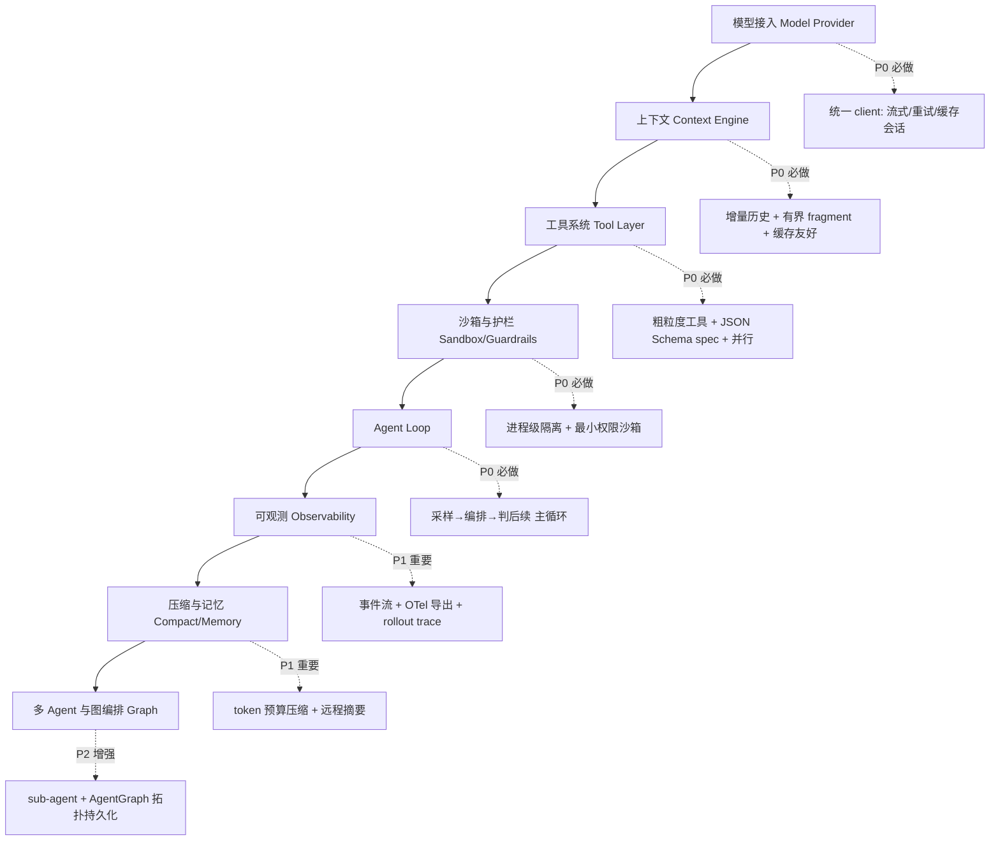
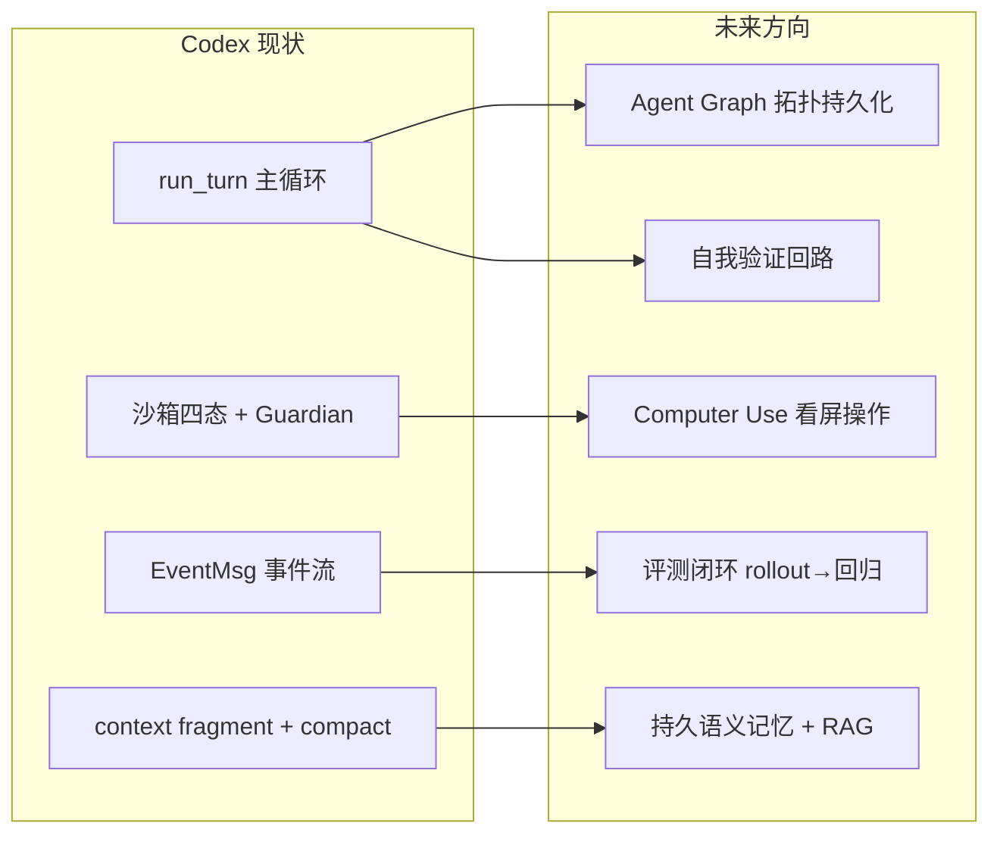
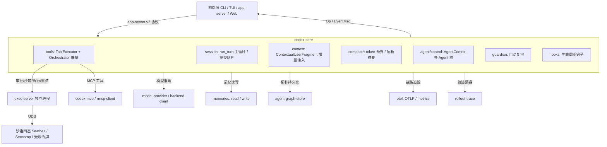


> 《Codex Agent / Harness 深度解剖》系列 · 第 14 篇（收官）  
> 源码基准：OpenAI Codex（Apache-2.0，Rust monorepo）`codex-rs/`  
> 阅读方式：本文由直觉到实现逐步推进，不分层级，可随读随停；所有路径与符号均可对应到本仓库具体文件与行号。

---

# 工程实践与未来：造你自己的 harness

> 一句话：**读完前 13 篇，你"看懂了" Codex；但只有当你能照着它的骨架从零搭一个，才真正"拥有"这套工程判断力。** 本篇把 Codex 当作一份已经验证过的 reference implementation，提炼出可迁移的原则、约定、坑，和一张能落地的路线图。

---

## 如果要从零造一个 harness，Codex 教会我们什么

想象你要给一位顶尖工程师配一台"能上路的车"：他负责想（推理），车负责跑（执行——敲命令、改文件、联网、请求批准）。这台车就是 **harness**。模型是大脑，harness 是身体与操作系统；二者通过一份结构化协议对话，大脑永远不碰宿主机的真实副作用（见《Harness 解剖学》）。

Codex 的厉害之处不在于它"想得更聪明"，而在于它把这套"身体"做成了开源范本：`codex-core` 负责思考与编排，真实命令跑在隔离的 `exec-server` 进程里，前端（CLI/TUI/桌面/Web）通过协议驱动同一个引擎。知道"它怎么做"和能"自己造一个"之间，差着一整套工程判断——沙箱怎么默认、上下文怎么不爆、长任务怎么不忘目标、多代理怎么不互相拖垮。

下面我们就顺着"原则 → 约定 → 踩坑 → 路线 → 借鉴 → 未来"这条自然坡度往下走。源码引用会穿插其中，想深读的人随时能 `grep` 到，只想拿结论的人也能带着清单走。

---

## 八条原则，每一条背后都有一段真实代码

这些不是格言，而是被 110+ 个 Rust crate 反复验证过的结构选择。它们从同一个直觉长出来：**让模型只做它擅长的事（推理与决策），把"动手"和"约束动手"全部收编进 harness。**

**① 推理与执行分离，且分离到进程级。** "推理系统结构性不能执行，执行系统结构性不能推理。"Codex 把这一条做到了进程边界：`codex-core` 推理，命令在独立 `exec-server` 里跑，二者经 UDS 通信（`codex-rs/exec-server/` + `codex-rs/uds/`）。即使 agent 进程崩溃，执行隔离依然在——这是"结构性不能执行"最硬的实现。

**② 上下文有界且增量。** 《上下文工程》里那条铁律值得背下来：**No history rewrite**（历史必须增量构建，不能整体重写）+ **No unbounded items**（每条注入项有硬上限）。落地是 `ContextualUserFragment` trait（`codex-rs/context-fragments/src/fragment.rs:46`）——所有注入片段都是 `core/context` 下的一个 struct，自带 `role()`/`markers()`/`body()`。增量保住 prompt 缓存命中，有界保住缓存不失效、窗口不爆。

**③ 工具粗粒度，让模型"写代码"而非"调 API"。** Codex 不把"改一行""读一个文件"做成几十个细碎工具，而是用 `shell` + `apply_patch` 两个原语覆盖绝大多数工程动作（`codex-rs/tools/`、`codex-rs/core/src/apply_patch.rs`）。每个工具是 `ToolExecutor<Invocation>` trait（`codex-rs/tools/src/tool_executor.rs:49`）的实例，自带 `ToolSpec`（名称/描述/JSON Schema）。工具面稳定、可移植，模型用"编程"表达意图。

**④ 能力渐进式加载。** 系统技能不全量塞进上下文。`skills` crate（`codex-rs/skills/src/model.rs`）用 `SkillPolicy`（隐式调用开关、`products` 门控）与 `SkillConfigRules`（按名称/路径启用禁用）控制注入，靠带 fingerprint 的 marker 文件避免每次启动重装——一种"按需点亮"的范式。

**⑤ 安全是纵深防御，不是一道闸门。** 沙箱四态 `SandboxType { None, MacosSeatbelt, LinuxSeccomp, WindowsRestrictedToken }`（`codex-rs/sandboxing/src/manager.rs:35`）+ `Guardian` 自动复审（`codex-rs/core/src/guardian/`，`strict_auto_review` 下强制 `ApprovalReviewer::Guardian`）+ 分层审批。被沙箱 `Denied` 时按策略**重试而非放行**——这才是"纵深"。

**⑥ 压缩保的是"目标"，不是"删东西"。** 上下文压缩的核心是保住任务目标。`run_turn` 在采样前先 `run_pre_sampling_compact()` 预估 token 并提前压（`turn.rs:851`）；接近上限触发 `auto_compact`；远程压缩（`compact_remote*.rs`）甚至把摘要发给更强的模型。压缩后发 `ContextCompacted`，但 `ThreadRollback` 只回退内存中的 user turn、不回滚磁盘改动——目标与副作用被清晰分开。

**⑦ 协议化解耦前端。** `codex-core` 不感知任何 UI。所有前端通过 `app-server` v2 协议（`<resource>/<method>`、camelCase、cursor 分页）驱动同一引擎；前端只渲染 `EventMsg` 与回送 `Op`（`protocol.rs:522`）。`app-server` 与 `exec-server` 甚至可跨操作系统运行。

**⑧ 可观测是闭环，不是日志。** 每次推理、每个工具调用、每帧流式输出，都对应 `EventMsg` 的一个变体（`protocol.rs:1279`）。`otel` crate 把关键路径导出到 OpenTelemetry；`rollout-trace` 把整轮 rollout 沉淀为可回放、可评测的轨迹。没有这层，agent 就是黑盒，你永远不知道它为什么"过早收工"。

---

## AGENTS.md：把架构约束写成机器可检查的清单

`AGENTS.md` 这份文件本身是"agent 如何安全地为这个仓库工作"的范本，值得所有 AI-native 团队抄作业。

它分两层约定。对**人类贡献者**：明确禁止触碰 `CODEX_SANDBOX_*` 环境变量（那是给运行 agent 用的沙箱信号）；强制 `just fmt` / `just test`；改 `ConfigToml` 必须 `just write-config-schema`；Rust 模块目标 < 500 LoC、超过 ~800 LoC 必须拆新模块——把"高频易冲突文件"的膨胀风险前置消灭。对**机器（agent）**：最精彩的是 "No history rewrite" 与 "No unbounded items"，并把"所有注入片段必须在 `core/context` 定义为 struct 并实现 `ContextualUserFragment`"立成硬规矩——你不能随手 `format!` 一段文本塞进上下文，必须结构化、可识别、可缓存。

最值得借鉴的一点：**把架构约束写成机器可检查的清单**。Codex 不靠文档呼吁，而是用 `argument_comment_lint`、`just fix`、`insta` 快照测试、CI 三平台校验把约定变成强制。你的 `AGENTS.md` / `CLAUDE.md` 不该只是散文，而应是一份"可被执行、可被 CI 校验"的协议。

---

## 踩过的坑：Codex 用代码量填过的坑

这些坑 Codex 用真金白银（代码量）填过，照着走能省你几个月。

-   **沙箱默认策略**：默认 `LinuxSeccomp`/`MacosSeatbelt` 不是可选项，而是基线。裸让模型跑 `shell` 是灾难源头。太严会误杀合法操作（访问 `/tmp`、写 home），太松形同虚设。Codex 的解法是 `policy_transforms.rs` 把权限画像翻译成最小必要参数，并在 `Denied` 时按策略**重试**（放宽网络/换类型）而非放行。教训：先默认收紧，再为误杀留可控逃生通道。

-   **限流**：模型 API 有 RPM/TPM 墙，主循环里并行工具调用（`supports_parallel_tool_calls()`）会把墙撞穿。`run_sampling_request` 内部的重试/退避必须和 token 预算联动。限流不是模型层的事，是 harness 必须内建的一等公民。

-   **上下文膨胀**：`additional_context` 这类注入项若不加约束会悄悄撑爆窗口——Codex 在 `additional_context.rs:5` 用 `MAX_ADDITIONAL_CONTEXT_VALUE_TOKENS = 1_000` 做中间截断。更隐蔽的膨胀来自缓存失效：任何频繁变动的注入项都会让 prompt cache 失效，等于每次全额付费。教训：注入项必须**稳定**且**有界**。

-   **长程任务遗忘**：这是 ReAct 式 loop 的先天缺陷。Codex 用 `auto_compact` + 远程压缩 + `ThreadRollback` 对抗窗口枯竭，但**没有** Anthropic 式"Initializer 建 feature list / Coding 写 progress 文件"的两段式（源码中未见持久化进度文件机制）。教训：长程任务需要"外部脑"（文件/状态机），这是自建时务必补的层。

-   **多代理协调成本**：`AgentControl`（`core/src/agent/control.rs:96`）支持 spawn 子 agent 树，但强依赖/共享上下文的编码任务并不适合多 agent——Codex 把它做成可选模式（`multi_agent_mode_instructions`）。教训：默认单 agent，多 agent 只在任务可独立切分时启用。

---

## 从零搭最小闭环：一条优先级路线

把 Codex 的能力按"先有 vs 可后补"拆开，得到这条路线。括号里是 Codex 对应实现，供对照选型。

**P0（没这些就不叫 agent）**：模型接入先接一家（OpenAI Responses / Anthropic / 本地 Ollama-LM Studio），但务必保留"流式 + 会话复用 + sticky 路由"三件事（Codex 用 `model-provider` + `backend-client` 抽象）；上下文直接照搬"增量、有界、稳定"三条纪律；工具从 `shell` + `file_edit`（对应 `apply_patch`）两个粗粒度原语起步，用 MCP（`codex-mcp/`）从第一天兼容生态；沙箱本地优先 Docker/seccomp/bwrap，**不要跳过**——它是 harness 与"脚本"的分水岭；Agent Loop 实现 `run_turn` 的 `loop{采样→编排→判后续}`，先不支持 plan 模式。

**P1（决定能不能上生产）**：可观测把每个 stage 发成事件接 OTel（没有这层你无法回答"它为什么失败"）；压缩实现基于 token 预算的 `auto_compact`，有余力再做远程摘要。

**P2（决定上限）**：记忆 `memories` crate 已是真实子系统（`read`/`write` 子模块，含 `citations.rs`/`guard.rs`/`phase1.rs`），说明 Codex 在补持久语义记忆层；多 Agent 与图 `agent-graph-store`（`AgentGraphStore`/`LocalAgentGraphStore`/`ThreadSpawnEdgeStatus`）已把"agent 父子拓扑"做成存储中立抽象，是图编排地基。

---

## 站在开源肩膀上：取哪一层

不同项目在各层各有可取，关键是"取哪一层"。

-   **LangGraph（图编排）**：最强在"控制流显式化"——节点/边/状态/checkpoint 把 agent 变成可持久化、可回放的状态机（呼应 `rollout-trace` 的 `reducer`/`bundle`）。可取：用图表达 agent 拓扑与长程 checkpoint；但不必照搬其"重框架"形态，Codex 证明 runtime+harness 一体也能很轻。

-   **Claude Agent SDK（runtime+harness 范本）**：与 Codex 同属 general-purpose harness，提供"思考抽象 + 工具 + HITL + 流式"的完整范本。可取：它的 SDK 形态最适合学习"如何把 harness 做成可被业务自由组装的层"。

-   **deepagents**：社区对长程/深度 agent 的实验，强化子代理与任务分解。可取：多 agent 任务切分经验；但注意 Codex 把它设为可选模式——强依赖任务别硬上多 agent。

-   **WorkBuddy / OpenClaw 生态**：走"嵌入办公生态 + 多连接器"路线（`codex-rs/connectors/` 是 Codex 对应物）。可取：连接器/插件贡献工具的生态化思路，以及"agent 嵌入真实工作流"的产品视角。

一句话：**Codex 给你 runtime+harness 的"怎么做"，LangGraph 给你控制流的"怎么画"，Claude Agent SDK 给你 harness 的"怎么封装"，生态项目给你"怎么接入真实世界"。**

---

## 往前看：五个值得投入的方向

基于源码中已出现与尚缺失的信号，列出五个前沿。

**① agent graph 化（已见地基）。** `agent-graph-store` 已把 thread-spawned agents 的 parent/child 拓扑做成存储中立抽象。下一步是把"任务依赖 DAG"显式化，让拓扑可持久化、可重放、可并行调度——从"树"走向"图"。

**② 持久语义记忆 / RAG（正在补）。** `memories` crate 的 `read`/`write` 子模块显示 Codex 已在构建带引用与护栏的记忆读写层，但仍是"年轻子系统"（注释里还有 TODO 未强制 product gating）。自建时建议把 RAG + 向量记忆做成一等公民，而非只靠 `web_search` 按需拉取。

**③ 评测闭环（已有原料，缺平台）。** `rollout-trace` 已能沉淀完整轨迹，`otel` 已能导出指标，缺的是把这些轨迹直接喂回评测集做回归比对的闭环。建议从第一天就把 rollout 落盘，未来接评测平台只是格式适配。

**④ 计算机使用（computer use）。** Codex 当前 terminal-native，靠 `shell`/`apply_patch` 操作世界。补齐"看屏幕→操作 GUI"会把 harness 从代码世界扩展到任意桌面应用——源码中未见成熟实现，是可前瞻投入的空白。

**⑤ 更强的自我验证。** 当前"正确性"主要靠工具返回 + 用户审批。更强的方向是把编译/测试/类型检查作为**自动验证回路**（`run_post_tool_use` hooks 是雏形，`core/src/hooks` + `hook_runtime.rs` 定义 `PostToolUse`/`PreCompact` 等事件），让 agent 在"声称完成"前先自我证伪。

---

## 收尾：全景能力地图 + 自建检查清单

**Codex 全景能力地图**（一张图看全 runtime + harness）：

**自建 harness 检查清单**（可执行的下一步）：

| 维度 | 必做项（P0） | 推荐项（P1+） | Codex 对照 |
| --- | --- | --- | --- |
| 模型接入 | 流式 + 会话复用 + 限流退避 | 多模型路由 / sticky 路由 | `model-provider`/`backend-client`/`client.rs` |
| 上下文 | 增量构建、单条≤10K、缓存友好 | prompt cache 命中率监控 | `context-fragments`/`message-history` |
| 工具 | 粗粒度原语 + JSON Schema + 并行 | 接入 MCP 生态 | `ToolExecutor`/`codex-mcp` |
| 沙箱 | 进程级隔离 + 最小权限 | 被拒重试而非放行 | `sandboxing`/`SandboxType` |
| Agent Loop | 采样→编排→判后续 | plan 模式 / 自我验证 | `run_turn`/`orchestrator.rs` |
| 安全 | 分层审批 + 沙箱 | Guardian 式自动复审 | `guardian`/`approvals` |
| 可观测 | 全量事件流 | OTel 导出 + rollout 落盘 | `EventMsg`/`otel`/`rollout-trace` |
| 压缩记忆 | token 预算自动压缩 | 远程摘要 + 持久语义记忆 | `compact*`/`memories` |
| 多 Agent | （先不做） | 可选模式 + 拓扑持久化 | `AgentControl`/`agent-graph-store` |
| 工程约定 | AGENTS.md 写成可校验清单 | CI 强制 lint/快照 | 根 `AGENTS.md` |

---

## 心智模型

> **造 harness 的本质，是把"模型只负责想、身体负责动手且被约束"这件事工程化成一个可替换、可隔离、可观测的闭环。**

-   八条原则都从同一直觉长出：模型只推理，harness 收编执行与约束。

-   优先级不是功能清单，而是风险顺序：先锁住"执行隔离"与"上下文有界"，再补可观测与记忆。

-   Codex 已经把最难的部分（沙箱、协议、编排、可观测）做成开源范本；剩下的，是你对"自己要解决的真实问题"的理解。

**给读者的下一步**：挑一个你最想自动化的工程任务，按上表 P0 列，从"模型接入→上下文→两个粗粒度工具→进程级沙箱→主循环"五步搭出最小闭环；然后立刻接 OTel 与 rollout 落盘——**没有可观测就没有可改进**。能稳定跑通一个任务后，再回头补压缩、记忆与多 Agent。

---

## 自测题（检验你是否真懂）

1.  推理-执行分离"到进程级"到底解决了什么？如果只在同一进程里用函数调用隔离，会缺哪一层保护？

2.  为什么"上下文有界"要落在每个片段内部（如 AdditionalContext 1K 截断），而不是只靠一个全局窗口上限？

3.  沙箱把一次命令 `Denied` 后，Codex 为什么选择"重试而非放行"？这背后是哪条原则？

4.  长程任务里，Codex 用 `auto_compact` + `ThreadRollback` 仍没解决什么？自建时该补哪一层"外部脑"？

5.  为什么"可观测"被放在 P1 而非可后补的 P2？没有它，你会在哪个环节彻底失明？

---

## 延伸阅读（结合系列与网络讲解）

-   **Harness 解剖学（本系列第 1 篇）**：framework / runtime / harness 的分层心智模型与 Codex crate 地图

-   **Agent 循环（第 2 篇）**：`run_turn` 三层循环与"模型驱动编排"

-   **上下文工程（第 3 篇）**：`ContextualUserFragment` + `WorldState` 的增量/有界/diff 哲学

-   **Claude Code 最佳实践**（CLAUDE.md 怎么写、context window 是头号资源）：code.claude.com/docs/zh-CN/best-practices

-   **Lessons from building Claude Code: Prompt caching is everything**：claude.com/blog/lessons-from-building-claude-code-prompt-caching-is-everything

-   **ReAct 论文**（Thought-Action-Observation 的理论起源）：Yao et al., 2022

---

## 关键符号速查（系列各篇）

| 符号 | 位置 | 出自篇目 |
| --- | --- | --- |
| `run_turn` | `codex-rs/core/src/session/turn.rs:153` | 2. Agent 循环 |
| `EventMsg` | `codex-rs/protocol/src/protocol.rs:1279` | 2. Agent 循环 / 12. 可观测 |
| `ContextualUserFragment` trait | `codex-rs/context-fragments/src/fragment.rs:46` | 3. 上下文工程 |
| `WorldStateSection` trait | `codex-rs/core/src/context/world_state/mod.rs:205` | 3. 上下文工程 |
| `ToolExecutor<Invocation>` | `codex-rs/tools/src/tool_executor.rs:49` | 4. 工具层 |
| `SandboxType` | `codex-rs/sandboxing/src/manager.rs:35` | 8. 安全自治 |
| `SkillPolicy` | `codex-rs/skills/src/model.rs` | 6. Skills |
| `AgentControl` | `codex-rs/core/src/agent/control.rs:96` | 10. 多代理编排 |
| `Orchestrator::run` | `codex-rs/core/src/tools/orchestrator.rs:136` | 10. 多代理编排 |
| `rollout-trace` / `otel` | `codex-rs/rollout-trace/src/`、`codex-rs/otel/src/` | 12. 可观测 |
| `agent-graph-store` | `codex-rs/agent-graph-store/` | 10. 多代理编排 / 本篇 |
| `memories` crate | `codex-rs/memories/src/` | 9. 长程作业 / 本篇 |

---

*注：本文所有路径与符号均可在* `/Users/pelhans/project/codex` *仓库核对；凡源码未直接印证的表述（如 computer use 成熟度、持久进度文件机制）已明确标注"源码中未见"。*

