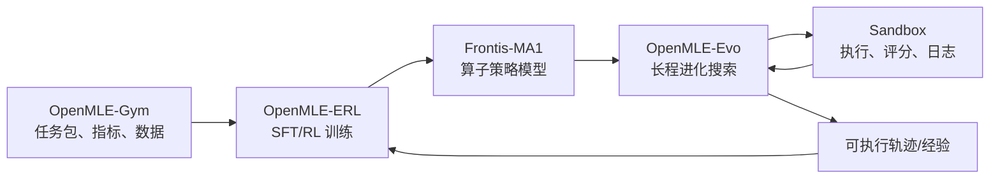
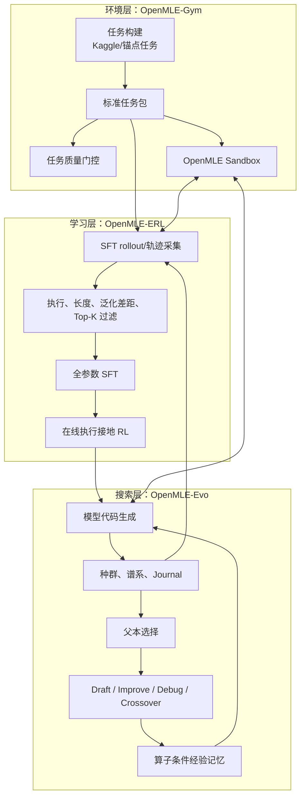
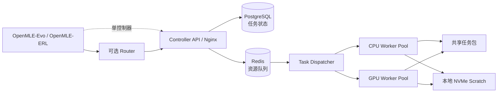
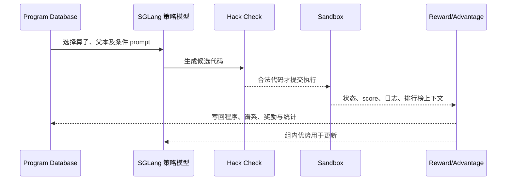
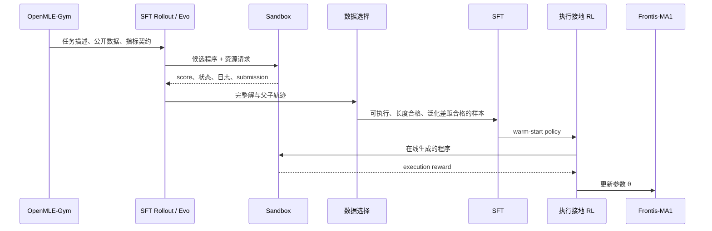
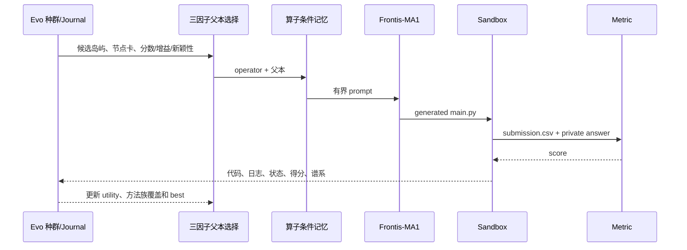

**范围**：本文结合论文 *Frontis-MA1: Training an AI4AI Model towards Recursive Self-Improvement in Machine Learning Engineering*（arXiv:2607.28568v1）与当前仓库源码进行梳理。本文讨论的是在**可执行机器学习工程（MLE）**这一受限领域中，如何构造“面向递归自我改进（RSI）”的工程闭环；并不将其表述为已实现通用人工智能的无限递归自我改进。
>
> **版本与边界**：仓库是可运行的公开实现及适配版本。模型权重、完整训练语料、历史 checkpoint、全部任务包、私有榜单资产、沙箱部署及凭据均为外部输入，因而源码结构能说明机制和运行接口，但不能单独保证严格复现实验数值。

---

## 目录

1. [执行摘要](#1-执行摘要)
2. [问题定义：RSI、AI4AI 与可执行进化](#2-问题定义rsi-ai4ai-与可执行进化)
3. [总体方案：OpenMLE 三层闭环](#3-总体方案openmle-三层闭环)
4. [统一动作空间：四类程序进化算子](#4-统一动作空间四类程序进化算子)
5. [OpenMLE-Gym：可验证环境与沙箱层](#5-openmle-gym可验证环境与沙箱层)
6. [OpenMLE-ERL：执行接地的 SFT 与 RL 学习层](#6-openmle-erl执行接地的-sft-与-rl-学习层)
7. [OpenMLE-Evo：经验驱动的长程搜索层](#7-openmle-evo经验驱动的长程搜索层)
8. [端到端时序、数据流和控制流](#8-端到端时序数据流和控制流)
9. [论文设计到仓库实现的映射](#9-论文设计到仓库实现的映射)
10. [实验设计、结果与正确解读](#10-实验设计结果与正确解读)
11. [工程特性、风险和局限](#11-工程特性风险和局限)
12. [可演进方向与落地建议](#12-可演进方向与落地建议)
13. [复现与阅读路线](#13-复现与阅读路线)

---

## 1. 执行摘要
OpenRSI github 链接：https://github.com/FrontisAI/OpenRSI
OpenRSI 将“AI 改进 AI（AI4AI）”转化为一个可运行、可测量、可归因的 MLE 闭环。其关键不是让模型一次性生成更长的训练代码，而是同时具备以下能力：

1. **将任务变成可验证环境**：任务包含公开数据、私有答案、指标与资源约束；候选代码必须在隔离执行环境中生成提交文件并由任务指标实际评分。
2. **将一次生成变成程序种群搜索**：在候选程序之间维护谱系，通过从头生成、改进、调试和重组不断扩展程序空间。
3. **将搜索经验反哺模型训练**：从高质量的可执行程序和有效变换轨迹提取 SFT 监督；再以真实执行得分做 RL 奖励，训练模型成为更好的“变异引擎”。
4. **让训练与推理使用同一动作接口**：`Draft / Improve / Debug / Crossover` 同时用于离线数据构造、在线 RL rollout 和测试时长程进化。这个接口一致性是论文所谓 meta-evolution 闭环的工程抓手。

OpenMLE 是这一闭环的三层实现：

| 层 | 仓库模块 | 主要职责 | 产出/反馈 |
|---|---|---|---|
| 环境层 | `OpenMLE-Gym` | 任务包构建、质量检查、分布式沙箱执行与自动评分 | 结构化执行状态、日志、得分、失败类型 |
| 学习层 | `OpenMLE-ERL/SFT`、`OpenMLE-ERL/RL` | 采集和筛选可执行轨迹，SFT 热启动，执行接地 RL | Frontis-MA1 风格的算子策略 |
| 搜索层 | `OpenMLE-Evo` | 利用训练后的模型进行长程、多分支、经验增强的程序搜索 | 高分候选程序、经验卡、搜索日志与最终提交 |

闭环可以简化为：



其中，`Sandbox` 在源码归属上是 `OpenMLE-Gym/openmle-sandbox`，但在运行时同时服务于 ERL 的数据采集/RL 与 Evo 的测试时搜索。

---

## 2. 问题定义：RSI、AI4AI 与可执行进化

### 2.1 从 Evolution 到 RSI 的机制层级

论文没有把当前系统直接宣称为通用 RSI，而是给出递进层级：

| 层级 | 核心机制 | 在 OpenRSI 中的对应程度 |
|---|---|---|
| Evolution | 变异与选择：生成候选，按效果保留 | 完整实现 |
| Self-Evolution | 使用自身执行产生的经验继续改进 | 通过执行日志、程序数据库和后续变换实现 |
| Meta-Evolution | 使用进化轨迹训练未来的改进器 | 通过 SFT/RL 训练共享算子策略实现 |
| RSI | 改进后的系统持续改进产生后继系统，且改进能力本身持续增强 | 论文将其视为长期目标，尚未声称完全解决 |

仓库根目录 README 明确指出，OpenRSI 从 **Meta-Evolution** 开始：在有界、可执行领域中训练 improver，而不是宣称通用递归自我改进已经完成。这个限定非常重要：当前递归性主要体现为“**搜索产经验 → 经验训练模型 → 更强模型再搜索**”，而不是系统自由修改自己的全部训练算法、模型架构和基础设施。

### 2.2 可执行进化问题形式化

对任务 \(\tau\)，系统持有任务描述、可见数据、提交约定、私有评测器和资源预算。第 \(t\) 步：

1. 搜索器选择算子 \(a_t\) 与父程序上下文 \(c_t\)；
2. 策略模型生成候选程序：
   \[
   p_t \sim g_\theta(\cdot \mid \tau, a_t, c_t)
   \]
3. 沙箱执行候选程序，产生提交及日志；
4. 任务评测器返回原始指标，按优化方向归一为回报：
   \[
   s_t = R_\tau(E(p_t,\tau))
   \]
5. 搜索器将候选、父子关系、得分、失败与方法特征写入种群/经验存储；
6. 在固定预算内输出最优候选 \(p^*\)。

区别于仅靠模型自评或文本偏好的代码 Agent，此方案将**真实性信号**落在可执行评测上：代码是否运行、提交格式是否正确、私有标签上的指标是多少、是否超时，都会改变后续选择和训练数据。

### 2.3 Meta-Evolution 的学习目标

论文给出基于可执行样本的加权行为克隆形式：

\[
\mathcal{L}_{evo}(\theta) = -\mathbb{E}_{i}\left[w(s_i)\log g_\theta(p_i\mid\tau_i,a_i,c_i)\right]
\]

其中 \(w(s_i)\) 表示由执行质量导出的样本权重。工程上分两阶段落地：

- **SFT**：保留通过执行、得分和泛化过滤的完整解与轨迹步骤，让模型学会有效的操作条件生成；
- **RL**：从当前模型重新采样，将真实执行结果映射为奖励，以组内优势信号强化更有效的变异。

这意味着模型不只学习“竞赛解长什么样”，还学习“给定父程序、执行反馈和选择的算子，下一步应如何变换”。

---

## 3. 总体方案：OpenMLE 三层闭环

### 3.1 逻辑架构



### 3.2 运行时职责边界

- **Gym** 提供“任务是真实可验证的”前提：任务包、指标和执行后端。
- **ERL** 负责“模型能否从执行经验中学会更好的变异”：不仅训练通用编码能力，而是训练固定的演化原子算子。
- **Evo** 负责“如何在单个任务上有效花费有限推理和执行预算”：控制种群、父本、上下文、记忆、并发、检查点与最终选择。
- **Frontis-MA1** 是学习层产物、搜索层的生成内核；它不是单独脱离 harness 的一发式评测模型。

### 3.3 为什么需要三层解耦

将环境、学习、搜索拆分有三项工程收益：

1. **可验证性**：任务评测和模型生成解耦，降低模型自报成绩或提示词污染风险。
2. **可替换性**：同一 Sandbox 可以由 SFT、RL、Evo 复用；同一 Evo 也可切换 MLE-Bench 与 NatureBench 适配器。
3. **可归因性**：固定搜索框架换模型，可以估计 post-training 增益；固定模型换搜索框架，可以估计系统/搜索增益。

其代价是部署复杂度较高：每层都有独立 Python 环境、配置、外部数据与服务依赖。

---

## 4. 统一动作空间：四类程序进化算子

### 4.1 算子定义

| 算子 | 输入状态 | 目标 | 典型价值 |
|---|---|---|---|
| `Draft` | 任务描述、数据说明、约束 | 从零生成完整可执行方案 | 初始化可行解与方法多样性 |
| `Improve` | 一个正向父程序、得分/反馈/记忆 | 对有效分支做增量优化 | 调参、特征、验证、集成、鲁棒化 |
| `Debug` | 失败或低质量程序、错误日志 | 修复执行或提交问题 | 将不可用分支转为可继续演化的父本 |
| `Crossover` | 两个父程序及其互补信息 | 重组两个分支的有效部分 | 跨方法族/分支整合，跳出局部最优 |

它们既是模型训练时的条件动作，也是推理搜索中的决策动作。这种同构关系是整套设计最关键的接口契约。

### 4.2 代码实现位置

- 测试时提示词分派：`OpenMLE-Evo/tts_search/prompt_builder.py`。
  - `draft` 无父本；
  - `improve/debug` 强制要求一个 `parent_program`；
  - `crossover` 强制要求两个父本。
- AIRA-Evo 运行时算子：`OpenMLE-Evo/third_party/aira-evo/src/dojo/core/solvers/operators/` 下的 `draft.py`、`improve.py`、`debug.py`、`crossover.py`。
- 训练期 Program Database：`OpenMLE-ERL/RL/program_database.py`；其 `Program.generation_mode` 记录算子类型，`parent_id`、`parent_code` 记录谱系。
- SFT/在线 RL 的操作概率在论文配置中为：Draft 0.50、Improve 0.17、Debug 0.17、Crossover 0.16；仓库的 [`docs/training.md`](docs/training.md) 对该配置作了摘要。

### 4.3 算子空间为何比“反复写代码”更强

四类算子显式区分不同的信息状态：

- 没有可信可行解时，应 `Draft` 扩大探索；
- 有可行且有希望的父本时，应 `Improve` 增强利用；
- 有错误日志时，应 `Debug`，而不是让模型重新猜一个完整方案；
- 两条分支各有有效成分时，应 `Crossover`，避免只沿单链局部搜索。

因此，系统不是把历史文本简单拼接到 prompt 中，而是先做**状态识别与操作选择**，再按操作构造有界上下文。

---

## 5. OpenMLE-Gym：可验证环境与沙箱层

### 5.1 目标和任务包契约

`OpenMLE-Gym` 负责把 Kaggle 风格竞赛及其他来源转换为可标准化、可执行的 MLE 任务包。其主 CLI 为 `openmle-task`，源码入口位于 `OpenMLE-Gym/openmle_gym/cli.py`。

一个最小任务包约定为：

```text
task-name/
├── data/
│   ├── public/              # Agent 可访问训练/测试数据
│   └── private/
│       └── test_answer.csv  # 评测答案
└── utils/
    └── metric.py            # 任务指标
```

`metric.py` 必须提供：

- `validate_submission(...)`：检查文件结构、ID、列名、行数等提交契约；
- `evaluate(...)`：以私有 ground truth 和候选预测计算有限数值分数。

`OpenMLE-Gym/openmle-sandbox/node_workers/read_and_metric.py` 会动态寻找同时实现这两个方法的指标类，先验证再评分，并以 `##SCORE##<value>` 标记输出，便于调度器提取。

### 5.2 任务构建和质量门控

论文报告总任务池为 5,758 个质量门控任务：

| 来源 | 数量 | 用意 |
|---|---:|---|
| Curated Anchors | 156 | 高质量人工挑选锚点 |
| Kaggle Dataset tasks | 3,362 | 扩展数据和任务覆盖 |
| Kaggle Competition tasks | 2,240 | 利用竞赛规约和公开榜单证据 |
| 合计 | 5,758 | 可执行 MLE 任务环境 |

代码侧工作流为：

1. `build`：从 Kaggle slug 构建任务包；底层 `builder_core/` 使用 LangGraph 任务构建管线；
2. `metric-check`：对 sample submission 运行任务指标；
3. `overview`：抽取任务元信息；
4. `evaluate`：执行结构与质量检查；
5. `leaderboard`：按需下载公开榜单。

`openmle-task` 支持每任务独立子进程、并发和超时；可使用 `--execution-mode isolated` 在 Docker/Podman 中运行生成的 prepare/metric 代码，禁止网络、限制文件系统与资源。这样避免某个坏任务导致整个构建批次失败。

论文中的质量门控从任务有效性、数据充分性、是否使用原始数据、复杂度、数据质量等维度筛选，仅接受推荐且 metric 有效的任务。公开仓库保留了构建、元数据和评估管线；完整任务资产则以外部数据集形式发布。

### 5.3 分布式 Sandbox 架构

`OpenMLE-Gym/openmle-sandbox` 是同时服务 Evo 和 ERL 的执行/评分后端：



核心职责如下：

| 组件 | 作用 |
|---|---|
| FastAPI API | 鉴权、任务提交、查询、日志与取消接口 |
| PostgreSQL | 任务行、状态和结果持久化 |
| Redis | 按 CPU/GPU 资源类型与优先级排队 |
| Dispatcher | 预留空闲 Worker、stage 代码、执行、评分、回收资源 |
| AIO Sandbox Worker | 容器内 shell 执行及隔离能力 |
| Router（可选） | 多控制器路由、job-to-controller 路由持久化、状态聚合 |
| NFS/共享目录 | 任务包、作业 envelope、评测代码、缓存共享 |
| 本地 NVMe | 活跃任务代码、submission、stdout 的高速 scratch |

一次作业的关键时序：

1. 客户端以 `POST /api/v1/jobs` 发送代码和任务路径；
2. API 校验 `X-API-Key`、资源类型、优先级、超时和幂等性；
3. 代码以 `main.py` 存入作业 envelope，任务记录进入 PostgreSQL，队列项进入 Redis；
4. Dispatcher 从 CPU/GPU 队列选择任务并预留 Worker；
5. Worker 以 `DATA_DIR=<task-package>/data/public` 执行候选代码，代码需生成 `submission.csv`；
6. 同一 Worker 用私有答案和 `metric.py` 运行 `read_and_metric.py`；
7. Dispatcher 解析评分、保存 stdout/结果/时间戳，释放 Worker；
8. 客户端轮询 `/api/v1/jobs/{job_id}` 或读取日志。

顶层状态包括 `queued/running/completed/failed/cancelled`；更细粒度结果包括 success、code missing、code execution error、submission missing、metric/answer missing、scoring failed、timeout 和 sandbox unconfirmed。这个错误分类为 Debug 算子及 RL 奖励处理提供了结构化状态，而非只返回一段自然语言报错。

### 5.4 安全边界的准确理解

Sandbox 是必要工程措施，但不能被误读为绝对安全边界。公开 README 特别说明：任务包中 `data/private` 是评测约定；默认共享文件系统挂载在此快照中不天然等价于硬安全隔离。实际生产部署仍需根据租户隔离、容器权限、挂载、网络、密钥和数据访问策略强化边界。

---

## 6. OpenMLE-ERL：执行接地的 SFT 与 RL 学习层

### 6.1 模块分工

`OpenMLE-ERL` 分为独立运行环境和边界的两个阶段：

| 子模块 | 关键目录 | 输入 | 输出 |
|---|---|---|---|
| SFT | `OpenMLE-ERL/SFT/` | 并行完整解、进化轨迹、任务元信息 | 过滤后的监督对话与 SFT checkpoint |
| RL | `OpenMLE-ERL/RL/` | SFT 初始策略、任务、Sandbox 反馈、Program DB | 执行奖励优化后的策略 checkpoint |

顶层 `OpenMLE-ERL/README.md` 将流程概括为：Gym 任务 → SFT rollout/选择 → 监督 warm start → 执行接地 RL → Frontis-MA1 供 Evo 使用。

### 6.2 SFT：从可执行经验构造监督信号

论文的 SFT 数据来自两条互补路径：

1. **Parallel path**：独立采样完整 `Draft` 方案，提供从任务到端到端代码的直接学习；
2. **Evolutionary path**：从演化树提取有效的 `Draft/Improve/Debug/Crossover` 转换，学习“在特定父本和反馈下怎样改”。

论文最终报告（精确去重、32,768 token 全消息长度过滤后）为 26,259 条样本：17,245 条完整回复和 9,014 条轨迹步骤；算子分布为 Draft 19,436、Improve 1,741、Crossover 742、Debug 4,340。仓库 `docs/training.md` 记录了这一论文口径。

需要注意 `OpenMLE-ERL/SFT/README.md` 还列出了源发布管线的 17,344 + 9,230 = 26,574 样本计数。两者不是可直接混用的结果：前者是论文最终语料口径，后者是公开 rollout/SFT 源发布中展示的管线规模。技术报告、实验表和复现时必须标明所采用的口径与过滤阶段。

SFT 数据生产管线的具体实现位于 `OpenMLE-ERL/SFT/tts_search/data_produce/pipeline.py`：

```text
collect_sft_rows
  → token length filter
  → valid-test relative gap annotation/filter
  → per-task Top-K selection and reward deduplication
  → alignment dataset writer
```

其默认过滤约束为：

- 只接受已评分、非负奖励、反馈成功的样本；
- 最大 chat-template token 数为 32,768；
- 默认 validation/test 相对差距阈值为 0.12；
- 每任务取 Top-4；
- 使用 reward 去重。

这体现出两个训练原则：**代码能跑不代表应进入监督集**，以及**仅优化公开验证分数而对私有结果泛化差的样本不应强化**。

### 6.3 RL：真实执行分数而非语言偏好

RL 的单样本闭环为：



`OpenMLE-ERL/RL/docs/usage.md` 对应的五步语义是：Program DB 选状态/造 prompt → SGLang 生成代码且 hack-check → Sandbox 执行 → score 与榜单上下文塑形奖励 → 持久化 DB 与训练指标。

训练运行时主要入口：

- `train_with_patch.py`：同步训练入口；
- `train_async_with_patch.py`：异步训练入口；
- `fully_async_rollout.py`：完全异步 rollout；
- `program_database.py`：已执行程序、父本采样与属性统计；
- `reward_func_utils.py`：Sandbox 调用、得分/奖励处理、代码审查；
- `adaptive_reward_advantage_utils.py`：动态归一化和熵优势。

### 6.4 自适应奖励归一化

不同任务的指标尺度、方向和可达范围不同。固定理论上界/排行榜上界可能使当前策略采到的所有样本都拥挤在很小奖励区间。因此论文将 score 先按方向统一，再使用历史分数和当前 group 构造动态边界。

公开实现 `adaptive_reward_advantage_utils.py` 中：

- 先用 `signed_score` 统一 higher-is-better 方向；
- `compute_adaptive_bound_pair(...)` 支持 `top1_top8`、`top1_top16`、top-1 对全体均值/中位数、理论边界等模式；
- 取最佳 \(B_{dyn}\) 与第 \(K\) 名 \(W_{dyn}\)（论文默认语义为 top-1/top-16），并可通过 `lower_shift_ratio` 将下界向下扩展；
- 使用 `score2reward(...)` 完成奖励映射。

概念上可写为：

\[
r_{base}(\tilde{s}) = \operatorname{clip}\left(
\frac{\tilde{s}-W_{dyn}}{B_{dyn}-W_{dyn}},0,1
\right)^\alpha
\]

其中 \(\alpha\) 是幂次放大系数。动态边界的目的不是篡改排名，而是在当前可达区域内维持奖励分辨率，让“略优于当前前沿”的样本得到可学习差异。

### 6.5 熵优势（Entropic Advantage）

标准组归一化优势在少数最优样本与大量一般样本并存时，上尾信号可能不足。实现 `compute_ttt_entropic_advantages(...)`：

1. 对组内 reward 通过二分搜索求 \(\beta\)，使诱导分布与均匀分布的 KL 近似目标值（默认 \(\log 2\)）；
2. 对每样本使用 leave-one-out 归一化：

\[
A_i^{ent}\approx
\frac{\exp(\beta r_i)}{\frac{1}{G-1}\sum_{j\ne i}\exp(\beta r_j)}-1
\]

这会强化真正更优的候选，同时通过固定 KL 目标避免温度无限尖锐。论文报告该设计让最佳候选的优势信号显著增强，并带来更高的组最佳奖励和奖牌率。

### 6.6 异步 rollout 与掉队者问题

MLE 代码执行时长高度不均：简单 tabular 任务与大型训练任务之间差异很大，同步训练会受最慢任务拖累。异步版本提前启动下一轮生成并在完整 group 可用后训练；完全异步路径可进一步通过 buffer 消费已完成组。

论文报告同步约 97.0 分钟/step、异步约 50.8 分钟/step，即 1.91 倍加速。源码 `train_async_with_patch.py` 明确将下一 rollout 在当前训练前启动，并按 `update_weights_interval` 控制安全权重同步。

### 6.7 训练期父本选择与防作弊

训练 Program Database 除 score/reward 外保存：执行状态、耗时、访问次数、子代 reward 方差、exploit/explore/cooling 系数、算子、父代码、元数据与 hack 标志。其目标是同时：

- 利用已证明高质量的父本；
- 探索子代不确定但潜在收益高的父本；
- 对频繁访问的节点降温，避免单个 incumbent 垄断预算。

另一个关键机制是 reward hacking 检查。`reward_func_utils.py` 构造 LLM judge 提示，检查随机猜测、常量预测、硬编码规则、未使用数据、未训练模型、伪造 hold-out validation 等行为。判为作弊的候选不应消耗昂贵 Sandbox 执行，论文口径对其赋负奖励。这一环节承认：只要优化器面对不完整的评测接口，就会存在投机优化压力。

---

## 7. OpenMLE-Evo：经验驱动的长程搜索层

### 7.1 定位与运行形态

`OpenMLE-Evo` 是测试时搜索与评估系统，统一承载：

- MLE-Bench 适配器：`scripts/evaluate_airaevo.py`；
- NatureBench Lite-v2 适配器：`scripts/evaluate_naturebench.py`；
- 标准同步与异步多 GPU 执行配置；
- vendored AIRA-Dojo/AIRA-Evo 运行时；
- Sandbox、prompt、经验记忆、并发与配置代码。

其配置位于 `OpenMLE-Evo/tts_search/configs/`，输出通常写入 `outputs/<experiment>/<date>/<time>/`，包含 `stat.json`、最终有效代码、提交代码、步级制品、checkpoint、`summary.csv` 和 runner manifest。

### 7.2 种群、岛屿和 Journal

Evo 的基础运行时在 `OpenMLE-Evo/third_party/aira-evo/`。程序节点通过代码、父子谱系、评价值和工作流状态组织为搜索图；Solutions Database 以 island 组织节点，防止整个搜索只集中于一个小区域。

每个节点至少需要表达：

- `id`、代码、父节点、生成算子；
- 自验证指标与外部执行/官方分数（诊断）；
- 运行时间、日志、状态；
- 方法特征、经验卡与排名；
- 是否是当前 best 或新 best。

一个特别重要的公开实现决策是：`experience.py` 的 `compute_parent_utilities(...)` 注释明确说明，父本选择遵循 Journal 中的**自验证指标**，Sandbox/raw 分数保留作诊断，默认不把测试反馈泄漏给搜索控制器。这是避免以隐藏 test score 直接优化父本选择的基本实验纪律；只有明确打开 legacy 配置时才允许信任模型自报验证分数等不同模式。

### 7.3 双层经验表示

论文把可复用搜索证据分为两层：

1. **节点经验卡（Experience Card）**：附着于单个节点，包含身份与谱系、观测得分、资源核算、计划/分析摘要、方法族、相对父本增益、新颖性、排名等；
2. **任务级经验板（Strategy Board）**：聚合整个任务已评估节点，描述当前最优、方法族覆盖、失败模式、进展、拓扑和预算审计。

对应实现集中于 `OpenMLE-Evo/third_party/aira-evo/src/dojo/solvers/evo/experience.py`：

- 自动从 import/code 检测 `method_family_auto`；
- 统计 family 出现次数，生成 `novelty_score`；
- 维护卡片、策略板以及关系节点；
- 按算子构造经验记忆。

这比将完整历史对话无差别地追加到 prompt 更适合长程搜索，因为信息可结构化、可审计，也可在有需要时惰性检索。

### 7.4 三因子父本选择

论文的测试时父本选择不是单看当前 score，而是计算：

\[
U_i=\lambda_s\tilde{s}_i+\lambda_\Delta\tilde{\Delta}_i+\lambda_n\nu_i
\]

\[
P(i\mid\mathcal I)=
\frac{\exp(U_i/\tau)}{\sum_{j\in\mathcal I}\exp(U_j/\tau)}
\]

其中：

- \(\tilde{s}_i\)：归一化质量，偏向强解；
- \(\tilde{\Delta}_i\)：相对最强父本的正向增益，偏向持续进步的分支；
- \(\nu_i=1/\sqrt{1+N_{f_i}}\)：方法族新颖性，偏向尚未被过度采样的思路。

默认论文权重为 score/gain/novelty = 1.0/0.6/0.3。源码 `compute_parent_utilities(...)` 可见同构逻辑：

- 归一化 `score_component`；
- 从父本计算 `delta_component`；
- 按先前同 family 节点数计算 `novelty_component`；
- 加权得到 `utility` 后经 softmax 给出采样概率。

`evo.py` 再用该概率在选中 island 内无放回选择一或两个父本；若没有足够合格父本或采样耗尽，则退化为新的 `Draft`，从而保证搜索韧性。

### 7.5 算子条件的有界记忆

`build_operator_experience_memory(...)` 仅在 Improve、Debug、Crossover 等确实需要上下文的操作时构造经验，不为 Draft 附加节点记忆。它按操作选择不同局部证据：

| 算子 | 检索重点 |
|---|---|
| Draft | 不依赖已有程序记忆，保留初始多样性 |
| Improve | 选中父本、若干祖先、同父 sibling、任务级摘要 |
| Debug | 当前错误节点、相同错误签名的历史、最近修复尝试 |
| Crossover | 两个父本各自祖先/兄弟与方法互补性 |

实现支持 `ancestor_k`、`sibling_k`、related-card 上限和 sibling 排名权重，避免把全量历史塞入上下文。论文报告相对原 AIRA-Evo，Improve 平均 prompt 长度大幅下降且长尾更短；这正是“结构化存储 + 惰性合成 + 操作条件检索”的系统效果。

### 7.6 标准与 Evo-Max 执行 profile

`OpenMLE-Evo/docs/overview.md` 指出标准和异步多 GPU profile 共用 journal、checkpoint、memory、parent selection 和输出实现：

| Profile | 调度 | 执行后端 | 主要目标 |
|---|---|---|---|
| Standard | 同步 generation/search | `SANDBOX_URL` 或单机适配 | 简化运行、基线评估 |
| MLE-Bench Multi-GPU | async steady-state | `SANDBOX_ROUTER_URL` | 以并发执行减少资源闲置 |
| NatureBench Standard | 同步 | Docker 或 SCM adapter | 跨基准评估 |
| NatureBench Multi-GPU | async steady-state | SCM 资源/GPU 池 | 多 worker 长程搜索 |

论文中 **OpenMLE-Evo-Max** 不是新的代码目录，而是 Evo 内的增强 profile：在固定总 Sandbox 计算预算下，加入与 MLE-Bench 不重叠的经验先验和异步多 GPU 搜索。它是端到端系统增强，不能误记为纯模型能力提升。

---

## 8. 端到端时序、数据流和控制流

### 8.1 离线训练闭环



### 8.2 测试时搜索闭环



### 8.3 关键数据对象

| 数据对象 | 主要字段 | 生命周期 |
|---|---|---|
| Task package | public/private data、`metric.py`、约束 | Gym 构建，供训练/搜索执行 |
| Job | code、资源类型、状态、日志、score | API/Redis/Dispatcher/Worker |
| Program node | code、score、reward、parents、operator、metadata | RL DB 或 Evo Journal |
| Experience card | 谱系、方法族、增益、失败/资源/语义摘要 | Evo 搜索过程中累积 |
| Strategy board | best、覆盖、失败、预算、拓扑 | 任务级搜索状态 |
| SFT row | 对话、算子状态、执行质量、任务元数据 | 收集、过滤、训练 |
| RL rollout group | 同 prompt 多样本、奖励、优势 | 生成、执行、组内优化 |

---

## 9. 论文设计到仓库实现的映射

| 论文机制 | 代码/配置落点 | 实现解读 |
|---|---|---|
| OpenMLE 三层栈 | 根 `README.md`；三个顶层目录 | Gym/ERL/Evo 清晰分仓，依赖与运行边界独立 |
| 四个统一算子 | `OpenMLE-Evo/tts_search/prompt_builder.py`；AIRA operators；ERL Program DB | 同一动作命名贯穿 SFT、RL 与搜索 |
| 任务构建与质量检查 | `OpenMLE-Gym/openmle_gym/cli.py`、`builder_core/`、`metadata_pipeline/` | `build/overview/metric-check/evaluate/leaderboard` 形成任务流水线 |
| 可执行反馈 | `openmle-sandbox/node_controller`、`node_workers/read_and_metric.py` | 代码执行、提交验证、私有评分、日志与错误状态结构化返回 |
| SFT 数据生产 | `SFT/tts_search/data_produce/pipeline.py`；`scripts/sft_data_selection/` | 收集→长度→泛化差距→Top-K→对齐数据集 |
| SFT 训练 | `SFT/slime/`、`slime_scripts/` | 基于 vendored SLIME 的 30B/35B 全参数训练发射器 |
| 执行接地 RL | `RL/train*_with_patch.py`、`RL/reward_func_utils.py` | 生成、hack 检、Sandbox、奖励、DB 回写、参数更新 |
| 动态奖励边界 | `RL/adaptive_reward_advantage_utils.py` | 动态 best/worst 计算和 score-to-reward 映射 |
| 熵优势 | 同上 `compute_ttt_entropic_advantages` | KL 控制的指数重加权、leave-one-out baseline |
| 异步训练 | `RL/fully_async_rollout.py`、`train_async_with_patch.py` | generation/execution 与训练解耦，降低尾延迟 |
| 演化存储和谱系 | `Evo/.../dojo/solvers/evo/evo.py`、Journal | 岛屿、节点、父子关系、算子与 checkpoint |
| 经验卡与经验板 | `Evo/.../dojo/solvers/evo/experience.py` | 自动方法族、增益、新颖性、任务板、上下文合成 |
| 三因子父本选择 | `experience.py:compute_parent_utilities` | score + delta + novelty → softmax 概率 |
| 操作条件记忆 | `experience.py:build_operator_experience_memory`；Improve/Debug/Crossover operator | 按需检索局部谱系与相邻证据，控制上下文长度 |
| 多 GPU 长程搜索 | `Evo/tts_search/airaevo_concurrency.py`、`aira_evo_async_resources.py`、执行配置 | 标准与异步 profile 共用搜索逻辑，只替换资源编排 |

### 9.1 “设计存在”与“公开可复现”的区别

下列内容在论文有明确统计/配置描述，但仓库并不完整打包：

- 原始训练数据、全量样本和最终选择清单；
- 训练权重与历史 checkpoint；
- 全量任务数据和私有评测答案；
- 真实集群、NFS、GPU Worker、模型服务、密钥；
- 论文实验产物和精确环境版本。

因此正确结论是：**仓库公开了关键机制、接口、调度与可运行骨架，以及部分示例/验证路径；严格复现需要补齐外部 artifact。**

---

## 10. 实验设计、结果与正确解读

### 10.1 MLE-Bench Lite 主实验

论文主评测使用官方 22 任务 MLE-Bench Lite split，通常为每任务 12 小时、单张 RTX 4090、12 GB VRAM 上限、三次独立运行。指标均为越高越好：

- **Valid Rate**：22 个任务中得到有效提交的平均数量；
- **Medal Average**：获得 Kaggle medal 的任务比例；
- **Human Rank**：最终提交超过的人类排行榜参与者比例。

仓库 `docs/results.md` 给出的受控主表：

| 模型 | Harness | Valid Rate | Medal Average | Human Rank |
|---|---|---:|---:|---:|
| Qwen3-30B-A3B-Thinking-2507 | OpenMLE-Evo | 17.33/22 | 34.85% | 0.5573 |
| Frontis-MA1-30B | OpenMLE-Evo | 21.67/22 | 53.03% | 0.7055 |
| Frontis-MA1-30B | OpenMLE-Evo-Max | 22.00/22 | 66.67% | 0.8053 |
| Qwen3.6-35B-A3B | OpenMLE-Evo | 19.67/22 | 39.39% | 0.5828 |
| Frontis-MA1-35B | OpenMLE-Evo | 21.67/22 | 60.61% | 0.7647 |
| Frontis-MA1-35B | OpenMLE-Evo-Max | 22.00/22 | 71.21% | 0.8126 |

正确归因：

- **模型训练增益**：在 OpenMLE-Evo 固定时，35B 的 Medal Average 为 39.39% → 60.61%（+21.22pp）；30B 为 34.85% → 53.03%（+18.18pp）。
- **端到端系统增益**：60.61% → 71.21% 来自 Evo-Max 引入的独立经验先验和异步搜索等系统改变，不能说成单纯模型训练带来的 +31.82pp。
- **模型–harness 绑定**：这些是模型与指定搜索框架、任务、执行预算共同构成的结果，不是“一次 API 调用”的裸模型分数。

### 10.2 搜索效率对比

同模型、同 seed、同任务预算的 66 个匹配 task-run 中，论文/仓库结果显示：

| 指标 | Original AIRA-Evo | OpenMLE-Evo | 变化 |
|---|---:|---:|---:|
| 总模型 tokens | 129.3M | 75.3M | -41.7% |
| Prompt tokens | 83.5M | 41.5M | -50.3% |
| 已评估节点 | 3,430 | 3,004 | -12.4% |
| 新 best 验证更新 | 229 | 246 | +7.4% |
| 每百万 token 新 best 更新 | 1.77 | 3.27 | +84.3% |
| 产生新 best 的 Improve | 44/931 | 72/769 | 4.73% → 9.36% |

这组结果支持的是“有界记忆、进度/新颖性选择和定向操作提高 token 使用效率”。它主要是 token/context/验证进展度量，不应直接等价为固定倍数的真实墙钟加速。

### 10.3 长程案例的机制含义

论文分析的两个案例：

| 任务 | 验证 Human Rank | Held-out Human Rank | Medal | 后期 Improve/Crossover 贡献的验证增益 |
|---|---:|---:|---|---:|
| `leaf-classification` | 0.7713 | 0.9455 | Bronze | 85.0% |
| `mlsp-2013-birds` | 0.7284 | 0.8889 | Silver | 91.9% |

这些轨迹说明，后期价值并不只来自继续生成更多 Draft；先 Debug 获得可执行支点、在不同分支试验，再由 Improve/Crossover 汇合互补信息，可以主导最终提升。但它们是机制 case study，不是新的总体统计显著性证明。

### 10.4 NatureBench Lite 迁移

在固定 10 任务 NatureBench Lite 子集、禁用 web search、四小时预算下：

| 模型 | Harness | Surpass-SOTA | Match-SOTA |
|---|---|---:|---:|
| Frontis-MA1-35B | OpenMLE-Evo NatureBench adapter | 30% (3/10) | 70% (7/10) |
| Qwen3.6-35B-A3B | 同 adapter | 20% (2/10) | 50% (5/10) |
| Qwen3.6-35B-A3B | Original AIRA-Evo | 10% (1/10) | 20% (2/10) |

它初步支持模型层与框架层都能迁移到竞赛 MLE 之外；但样本数只有 10，不能推广成对完整 NatureBench 或一般科学自动化的充分证明。

---

## 11. 工程特性、风险和局限

### 11.1 已解决或显式缓解的问题

| 问题 | 机制 |
|---|---|
| 代码执行不稳定 | 独立作业、CPU/GPU 队列、超时、Worker 回收、结果状态机 |
| 单次提示词上下文无限膨胀 | 经验卡/策略板 + 操作条件惰性检索 |
| 只利用高分 incumbent 导致早熟 | 增益、新颖性、岛屿和 fresh Draft 回退 |
| 各任务指标尺度和方向不同 | signed score + 自适应奖励边界 |
| group RL 上尾样本优势不足 | KL 受控的 entropic advantage |
| 最慢执行任务拖慢训练 | 异步 rollout 和 steady-state 多 worker |
| 评测投机/随机提交 | LLM hack check + 执行前拦截 + 负奖励 |
| 隐藏评分泄漏到控制器 | 默认以自验证指标做父本选择，raw/official score 用于诊断 |

### 11.2 论文明确的能力边界

1. **研究品味仍不足**：当前奖励强调“是否可跑、分数多高”，较少学习研究方向是否长期有前景、可泛化或稳健。
2. **外部 harness 与通用 Agent 尚未统一**：算子空间便于训练和评估，但也限制了模型能主动提出的行动种类。
3. **AI4AI 覆盖面较窄**：当前主要改进外部 MLE 制品，不等于模型能端到端改进大模型训练、数据、架构与部署。
4. **进化系统本身大体固定**：被进化的主要对象是候选程序，搜索控制器、算子集、奖励、记忆 schema 和资源策略仍主要由人设计。
5. **经验信号利用仍有限**：父本选择主要用质量/增益/新颖性；大量文本、失败、资源和谱系信号没有学习成端到端的搜索策略。

### 11.3 对生产落地的附加风险

- **评测过拟合与数据泄漏**：必须在任务划分、训练语料、公开榜单与私有答案之间维持严格去重和权限边界。
- **LLM judge 误判**：hack-check 可降低明显投机，但自身可能带来 false positive/false negative，建议保留审计日志、抽样复核和可配置阈值。
- **代码安全**：模型生成代码属于不可信输入，容器隔离、最小权限、只读数据、禁网、资源限额、密钥隔离和审计不能只依赖任务约定。
- **成本与调度**：高方差训练时长、GPU 资源碎片、NFS 瓶颈、模型服务吞吐和远端评测排队都会改变实际性价比。
- **搜索结果不可解释性**：Crossover 的最终代码可能融合多个复杂分支，必须保留父子谱系、prompt、环境版本、代码 diff、分数和运行日志以支持复盘。

---

## 12. 可演进方向与落地建议

### 12.1 从固定启发式到可学习搜索控制器

当前父本 utility 的 \(\lambda_s,\lambda_\Delta,\lambda_n\) 是固定或人工配置。后续可：

- 根据任务模态、剩余预算、当前种群多样性和历史成功率学习动态权重；
- 将算子选择、父本选择、并发资源分配联合建模为 contextual bandit 或 RL；
- 把“哪类经验对下一步有预测力”作为显式学习目标，而不是仅人工制定检索表。

### 12.2 提升经验的因果与跨任务复用质量

- 为每次变换保存结构化 diff、方法变更标签、执行环境和消融结果；
- 将经验区分为任务局部技巧、模态技巧、算法家族技巧与通用工程技巧；
- 引入跨任务检索，但以任务/评测基准去重和时间切分防止 benchmark contamination；
- 对 Crossover 建立“组件来源—收益”归因，避免仅凭最终分数错误归功。

### 12.3 更可靠的奖励与验证协议

- 多种私有切分、鲁棒性评测和资源惩罚共同进入 reward；
- 将运行时间、显存、依赖复杂度、可维护性作为多目标而非只看 leaderboard score；
- 将 hack check 与静态分析、数据访问审计、网络审计和动态污点检测组合；
- 对 reward model/judge 采取版本化、校准和人工抽检。

### 12.4 把“改进系统”也纳入被改进对象

接近更强 RSI 的必要但困难的下一步包括：

1. 允许系统安全地提议并评测新的 prompt、记忆 schema、搜索策略、算子组合和资源分配策略；
2. 用受控元评测判断这些“搜索器变更”是否跨任务提升，而非在单一基准过拟合；
3. 对 search controller、训练配方、数据选择策略实行版本化 A/B 评估和可回滚发布；
4. 保持人类定义的安全边界、预算、测试集隔离和上线审核。

这才是从“程序级自改进”走向“改进过程级自改进”的关键路径。

---

## 13. 复现与阅读路线

### 13.1 推荐阅读顺序

1. 根目录 [`README.md`](README.md)：理解 OpenRSI 定位、三层栈和结果边界；
2. [`docs/training.md`](docs/training.md)、[`docs/results.md`](docs/results.md)：核对论文口径、训练统计和实验结果；
3. [`OpenMLE-Gym/README.md`](OpenMLE-Gym/README.md) 与 [`openmle-sandbox/README.md`](OpenMLE-Gym/openmle-sandbox/README.md)：理解任务和真实执行；
4. [`OpenMLE-ERL/SFT/README.md`](OpenMLE-ERL/SFT/README.md) 与 `tts_search/data_produce/`：理解监督数据如何被筛出；
5. [`OpenMLE-ERL/RL/docs/usage.md`](OpenMLE-ERL/RL/docs/usage.md)、`adaptive_reward_advantage_utils.py`：理解 RL 奖励、优势和异步；
6. [`OpenMLE-Evo/docs/overview.md`](OpenMLE-Evo/docs/overview.md)、`third_party/aira-evo/.../experience.py` 与 `evo.py`：理解搜索、记忆与父本选择；
7. `OpenMLE-Evo/benchmarks/naturebench_local_quick/`：运行一个本地小型案例，观察完整轨迹。

### 13.2 最小验证路径

不具备生产级 Sandbox、任务和模型服务时，可先做低成本结构验证：

- Gym：运行保留的三任务 `metric-check/overview/evaluate` smoke；
- Evo：遵循根 README 的 NatureBench local quick `--smoke`，只生成并评测一个候选；
- RL：先执行 `PRECHECK_ONLY=1` 检查路径、网络、数据 manifest 和配置，再做低 rollout-size 的异步 smoke；
- 全程记录模型版本、任务版本、评测器版本、容器镜像、随机种子和配置快照。

### 13.3 复现实验的必要外部条件

要接近论文结果，至少需要：

- 对应 Frontis-MA1 或基线模型 checkpoint 与稳定模型服务；
- 精确的 MLE-Bench/NatureBench 任务包、评测版本和数据版本；
- GPU/CPU Worker、共享存储、数据库、Redis、网络与 Docker/AIO Sandbox 部署；
- 训练期数据、严格的 evaluation dedup、完整配置和足够预算；
- 与论文相同或可比的搜索时长、显存限制、并发度及重复次数。

---

## 结论

OpenRSI 的核心贡献不是单个模型、单次工具调用或单一搜索算法，而是构造了一条具有共同接口的可执行闭环：

> **可验证任务环境 → 真实执行反馈 → 程序进化轨迹 → 执行接地训练 → 更强的算子策略 → 更有效的长程搜索 → 新经验。**

在当前实现中，RSI 的“递归”主要通过 meta-evolution 表现：系统利用自身在 MLE 任务上产生的可验证经验，训练未来更会改程序的模型，再由该模型提升下一轮搜索。四算子统一、Sandbox 执行、经验卡/策略板、三因子选择、动态奖励与异步调度共同把这个概念转化为可部署的工程系统。

同时，正确评价该系统必须保留边界：它是面向 MLE 的受限、评测驱动的 AI4AI 研究栈；它展示了模型学习和搜索系统的互补增益，但尚未解决通用、开放域、无限递归的自我改进问题。未来真正更强的 RSI，需要在严格安全和评测约束下，让搜索策略、经验利用、奖励模型以及更大范围的 AI 开发流程本身也成为可验证的改进对象。