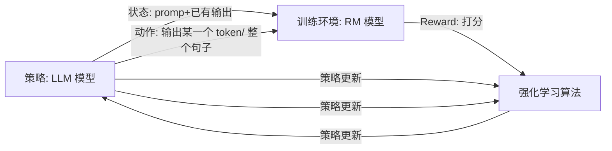


# 背景

经过预训练和 SFT 后，大语言模型具备了解决各种任务的通 用能力和指令遵循能力，但是同时也可能生成有偏见的、冒犯的以及事实错误的 文本内容。这些潜在的有害行为，可能在下游应用中产生严重的影响与危害，进 一步被恶意使用者进行放大与利用。因此，在大语言模型的学习过程中，如何**确保大语言模型的行为与人类价值观、人类真实意图和社会伦理相一致**成为了一个关键研究问题，通常称这一研究问题为人类对齐(Human Alignment)。

与预训练和指令微调不同，人类对齐需引入全新的评估标准，如有用性、诚实性和无害性。

-   有用性. 在实际应用中，大语言模型需要提供有用的信息，能够准确完成任 务，正确理解上下文，并展现出一定的创造性与多样性。模型应尽量以简洁、高 效的方式协助用户完成任务。当任务描述存在歧义或涉及背景信息时，模型应具 备主动询问并获取任务相关信息的能力，同时具有一定的敏感度、洞察力和审慎 态度。由于用户意图的多样性，有用性这一对齐标准仍然难以进行统一的定义与 刻画，需要根据不同的用户进行确定。
-   诚实性. 模型的输出应具备真实性和客观性，不应夸大或歪曲事实，避免产 生误导性陈述，并能够应对输入的多样性和复杂性。在人机交互过程中，大语言 模型应向用户提供准确内容，还应适当表达对于输出信息的不确定性程度，以避 免任何形式的误导。本质上，这要求模型了解自身的能力和知识水平。与有用性 和无害性相比，诚实性是一个更为客观的标准，对人类标注的依赖相对较少。
-   无害性. 大语言模型应避免生成可能引发潜在负面影响或危害的内容。在处 理敏感主题时，模型应遵循道德标准和社会价值观，从而消除冒犯性与歧视性。此 外，模型需要能够检测到具有恶意目的的查询请求。当模型被诱导执行危险行为 (如犯罪行为)时，应直接予以拒绝。然而，何种行为被视为有害，很大程度上取 决于大语言模型的使用者、用户问题类型以及使用大语言模型的背景。

# 直观感受

> [[细(戏)说\]RLHF场景下的PPO算法的来龙去脉](https://zhuanlan.zhihu.com/p/631338315)

对应关系如上图所示：

-   策略：LLM模型本身，输入是状态，输出是所有可选的动作(token)的概率
-   状态：用户的输入和LLM已经解码出来的那部分内容的组合
-   动作：模型输出的token
-   环境：reward model，输入是状态，也就是prompt加已的经解码的内容，输出是奖励分数r
-   奖励：reward model给出的评价分数，也可以看做是人类对当前模型输出的评价，是一个客观的值

整体流程文字表述就是：首先让策略模型根据用户输入生成每个动作（token）的概率分布。然后，我们不是总是选择概率最高的动作，而是通过随机采样来选择一个动作，这样可以让模型探索不同的行为。每次动作执行后，我们根据奖励模型来评估这个动作的好坏，同时策略模型也会更新到新的状态。如果整个序列生成结束时，累积的奖励很高，我们就用策略梯度方法来更新模型参数，增加生成好回答的概率。如果奖励不好，我们就调整参数，减少生成这个回答的概率。策略模型的目标是找到最优的参数设置，使得整个序列的累积奖励最大化。

# RLHF

由于对齐标准难以通过形式化的优化目标进行建模，因此研究人员提出了基 于人类反馈的强化学习(Reinforcement Learning from Human Feedback, RLHF)，引 入人类反馈对大语言模型的行为进行指导。

RLHF 首先需要收 集人类对于不同模型输出的偏好，然后使用收集到的人类反馈数据训练奖励模型， 最后基于奖励模型使用强化学习算法(例如 Proximal Policy Optimization, PPO [51]) 微调大语言模型。

RLHF 算法系统主要包括三个关键组成部分：

-   需要与人类价值观对齐的模型
-   基于人类反馈数据学习的奖励模型：奖励模型的作用是为强化学习过程提供指导信号，反映了人类对于语言模 型生成文本的偏好，通常以标量值的形式呈现。奖励模型既可以采用人类偏好数 据对已有的语言模型继续微调，也可以基于人类偏好数据重新训练一个新的语言 模型。
-   用于训练大语言模型的强化学习算法：目前，PPO 算 法是一种被广泛用于人类对齐的强化学习算法

## RLHF 的关键步骤

[RLHF 技术详解](https://huggingface.co/blog/zh/rlhf)

### 奖励模型训练

1.  RM 的训练是 RLHF 区别于旧范式的开端。这一模型接收一系列文本并返回一个标量奖励，数值上对应人的偏好。比如构造 prompt 数据集，然后大模型生成，人工对大模型生成结果排名，将排名转化为标量分数，来训练奖励模型。

1.  模型选择：RM 可以是另一个经过微调的 LM，也可以是根据偏好数据从头开始训练的 LM。比如 OpenAI 用了 175B 的LM 和 6B 的RM、DeepMind 使用了 70B 的 Chinchilla 模型分别作为 LM 和 RM，一种直觉是，偏好模型和生成模型需要具有类似的能力来理解提供给它们的文本。）
2.  训练文本：人工标注、对话数据采样。比如构造 prompt 数据集，然后大模型生成，人工对大模型生成结果排名
3.  获取训练奖励数值：
4.  对 LM 生成的回答进行排名，比如用 ELO 系统建立一个完整的排名。再将排名结果归一化为训练用的标量奖励值

1.  如何将排名转化为分数？一种可能的方案是：$分数 = \frac{R - R_{min}}{R_{max} - R_{min}} \times 分数范围$，其中 R 是ELO 排名，Rmin 和 Rmax 是所有参与者中最低和最高的排名，分数范围是希望将排名映射到的范围。

5.  训练 loss：一般采用对比式，即排名高的得分要尽可能比排名低的得分高

1.  

### 强化学习训练

从通用强化学习角度看：假设参数为 $\theta$的策略模型做出决策轨迹$\tau = \{a_{1}, a_{2}... \}$的概率为$P_{\theta}(\tau)$，该决策轨迹在最终状态能够累计获得的奖励为 $R(\tau) = \sum_{t=1}^{T}r_{t}$，其中 $r_{t}$是第 t 个token 生成时得到的奖励分。则强化学习的目标就是最大化获得的奖励$\argmax_{\theta}\sum_{\tau}R(\tau)P_{\theta}(\tau)$

策略梯度是一种基础的强化学习算法，通过计算目标函数的梯度（上面的最大化奖励），来更新参数。

先计算梯度$\nabla J(\theta) = \sum_{\tau}R(\tau)\nabla P_{\theta}(\tau)$，然后更新参数 $\theta \leftarrow \theta + \eta \nabla J(\theta)$

#### PPO

近端策略优化(Proximal Policy Optimization, PPO)算法是强化学习领域的一 种重要优化方法，主要用于训练能够根据外部环境状态做出行为决策的策略模型。

PPO 算法在策略梯度算法的基础上，主要使用优势估计来更加准确的评估决策轨 迹能获得的奖励，使用了重要性采样来进行离线策略训练。此外，为了保证重要 性采样的稳定性，PPO 算法通过在目标函数中加入了梯度裁剪以及相关的惩罚项 来减小采样误差。

#### 优势估计

为了能够更好地计算在状态$s_{t}$做出决策$a_{t}$时的奖励分数，PPO 引入了优势函数$\hat{A}_{t}$来估算奖励分数。优势函数的计算方式为

$\hat{A}_{t} = Q(s_{t}, a_{t}) - V(s_{t}) ~~~ 公式(1)$

其中

-   $Q(s_{t}, a_{t})$表示当前状态$s_{t}$选取特定决策$a_{t}$时的奖励分数，一般情况下，Q 可以基于奖励模型计算获得
-   $V(s_{t})$表示从当前状态$s_{t}$开始所有决策能得到的奖励的期望值。需要一个评价模型给出。评价模型可以使用奖励模型来进行初始化，随着 PPO 过程中策略模型的训练而进行动 态调整。

优势函数的作用是引导模型从当前能做出的所有决策中挑选最佳的决策。通过将决策的奖励与期望奖励做差，产生较低奖励的决策将会得到一个负的优势值，而产生较高奖励的决策会得到一个正的优势值。这些相对较差的决策就会被抑制，同时鼓励策略模型产生收益更高的决策。因此，优势函数可以帮助策略模型学习在众多决策中做出更好的选择。

#### 重要性采样

重要性采样(Importance Sampling)是一种通用的采样技术，通 过使用在一个分布 𝑝 上采样得到的样本，来近似另一个分布 𝑞 上样本的分布。主要 用于分布 𝑞 难于计算或者采样的情况。

假设需要求解变量 x 在分布 q 上函数 f(x) 的期望是$E_{x\sim q}[f(x)]$，重要性采样首先将期望转化为积分的形式，然后建立分布 p 和分布 q 之间的关系

$$
\begin{aligned}
E_{x\sim q}[f(x)] &= \int q(x)·f(x) dx \\
&= \int \frac{p(x)}{p(x)} q(x)·f(x) dx \\
&= \int p(x)·[\frac{q(x)}{p(x)}·f(x)] dx = E_{x\sim p}[\frac{q(x)}{p(x)}·f(x)]
\end{aligned}
$$

中，𝑝(𝑥) 和 𝑞(𝑥) 分别表示变量 𝑥 在 𝑝 和 𝑞 这两个分布中出现的概率。经过推导，可以看到分布 𝑞 上的函数期望，可以通过在分布 𝑝 上进行采样并 𝑞(𝑥) 且乘以系数$\frac{q(x)}{p(x)}$计算进行估计。

在离线策略的强化学习训练中，需要使用策略模型 $\pi_{old}$与环境进行交互并采样决策轨迹，使用采样得到的决策轨迹近似估算策略模型$\pi_{\theta}$与环境交互时能获得的奖励的期望。

所以使用重要性采样，优势估计 A 可以转化为 $E_{a_{t}\sim \pi_{\theta}}[\hat{A}_{t} ] = E_{a_{t}\sim \pi_{\theta_{old}}}[\frac{\pi_{\theta}(a_{t}|s_{t}) }{\pi_{old}(a_{t}|s_{t})}\hat{A}_{t} ]$

但重要性采样保证了分布 p 和分布 q 的期望是一致的，但方差无法保证。因此为了保证重要性采样算法的稳定性，需要让两个分布 p 和 q 尽可能相似，二者的方差尽可能接近。所以可以加上基于 KL 散度的约束来限制策略模型的更新幅度。具体函数为

$$
E_{a_{t}\sim \pi_{\theta}}[\hat{A}_{t} ] = E_{a_{t}\sim \pi_{\theta_{old}}}[\frac{\pi_{\theta}(a_{t}|s_{t}) }{\pi_{old}(a_{t}|s_{t})}\hat{A}_{t} -\beta KL[\pi_{old}(|s_{t}), \pi_{\theta}(|s_{t}) ]]
$$

其中，𝛽 是一个超参数，在策略模型的优化过程中针对训练情况可以进行动态调 整。当 KL 散度的值较小时，适当调小 𝛽 的取值，策略模型可以针对性的更新参 数以产生更好的策略;当 KL 散度的值较大的时候，适当调大 𝛽 的取值，从而减 少策略模型的更新程度。

### 完整 PPO 算法训练流程

1.  首先使用经过监督微调的大语言模型作为初始化策略模型$\pi_{\theta}$和$\pi_{old}$（两个SFT 后的 LLM 模型）
2.  将策略模型 $\pi_{old}$与环境进行交互，生成决策轨迹（生成一系列的 token）
3.  估计优势函数，来衡量实际奖励与期望奖励之间的差异

1.  Q 可以使用奖励模型计算获得
2.  V 通过评价模型获得，评价模型可以使用奖励模型来进行初始化，随着 PPO 的训练逐步优化

4.  计算 loss $L^{KLPEN}(\theta) = \hat{E}_{t}[\frac{\pi_{\theta}(a_{t}|s_{t})  }{\pi_{old}(a_{t}|s_{t})}\hat{A}_{t} - \beta KL[\pi_{old}(·|s_{t})， \pi_{\theta}（·|s_{t})    ]   ]$，用梯度上升更新策略模型的参数
5.  

  

# DPO（直接偏好优化）

直接偏好优化(Direct Preference Optimization, DPO)是一种不需要强化学习 的对齐算法。由于去除了复杂的强化学习算法，DPO 可以通过与有监督微调相似 的复杂度实现模型对齐，不再需要在训练过程中针对大语言模型进行采样，同时 超参数的选择更加容易。

由于奖励建模的过程较为复杂，需要额外的计算开销，DPO 算法的主要思想 是在强化学习的目标函数中建立决策函数与奖励函数之间的关系，以规避奖励建 模的过程。形式化地，DPO 算法首先需要找到奖励函数$r(x,y)$与决策函数$\pi_{\theta}(y|x)$之间的关系，即使用$\pi_{\theta}(y|x)$来表示$r(x,y)$，最终得到训练目标和决策函数 $\pi_{\theta}(y|x)$间的关系。这样，大语言模型 就能够通过与强化学习等价的形式学习到人类的价值观和偏好，并且去除了复杂的奖励建模过程。

首先 PPO 算法的优化目标为

$$
E_{a_{t}\sim \pi_{\theta}}[\hat{A}_{t} ] = E_{a_{t}\sim \pi_{\theta_{old}}}[\frac{\pi_{\theta}(a_{t}|s_{t}) }{\pi_{old}(a_{t}|s_{t})}\hat{A}_{t} -\beta KL[\pi_{old}(|s_{t}), \pi_{\theta}(|s_{t}) ]]
$$

使用 r(x,y) 替换$\frac{\pi_{\theta}(a_{t}|s_{t}) }{\pi_{old}(a_{t}|s_{t})}\hat{A}$，并对式子进行简化，得到简化后的优化目标

$$
L(\theta) = \max_{\pi_{\theta}}E_{x\sim D, y\sim \pi_{\theta}}[r(x,y) ] - \beta KL[\pi_{\theta}(y|x), \pi_{old}(y|x) ]
$$

直接求导计算最优解比较困难，因此继续简化，先把 KL 散度拆开（第一步把 $\pi_{\theta}(y|x)$转化为期望消掉了，第二步除以$\beta$，然后乘上-1）

$$
\begin{aligned}
L(\theta) &= \max_{\pi_{\theta}}E_{x\sim D}E_{y\sim \pi_{\theta}}[r(x,y) - \beta \log\frac{\pi_{\theta}}{\pi_{old}}  ] \\
& = \min_{\pi_{\theta}}E_{x\sim D}E_{y\sim \pi_{\theta}}[ \log\frac{\pi_{\theta}}{\pi_{old}} - \frac{1}{\beta}r(x,y) ] \\
&=\min_{\pi_{\theta}}E_{x\sim D}E_{y\sim \pi_{\theta}}[ \log\frac{\pi_{\theta}}{\pi_{old}} - \log\exp(\frac{1}{\beta}r(x,y)) ] \\
&= \min_{\pi_{\theta}}E_{x\sim D}E_{y\sim \pi_{\theta}}[ \log\frac{\pi_{\theta}}{\pi_{old}\exp(\frac{1}{\beta}r(x,y))} ] \\
&= \min_{\pi_{\theta}}E_{x\sim D}E_{y\sim \pi_{\theta}}[ \log\frac{\pi_{\theta}}{\frac{1}{Z(x)}\pi_{old}\exp(\frac{1}{\beta}r(x,y))} - \log Z(x)]
\end{aligned}
$$

其中 $Z(x) = \sum_{y}\pi_{old}(y|x)exp(\frac{1}{\beta}r(x,y))$ 是一个配分函数，它只与 x 和 旧的决策函数$\pi_{old}$有关。

为了表示方便，我们用$\pi^{*} = \frac{1}{Z(x)}\pi_{old}\exp(\frac{1}{\beta}r(x,y))$来进行简化表示。上面的公式简化成（期望消掉会出现一个$\pi_{\theta}(y|x)$，这样就能拼出来一个 KL 散度）

​$\begin{aligned} J &=\min_{\pi_{\theta}}E_{x\sim D}E_{y\sim \pi_{\theta}}[ \log\frac{\pi_{\theta}}{\pi^{*}} - \log Z(x)]\\ &= \min_{\pi_{\theta}}E_{x\sim D}[ KL[\pi_{\theta},\pi^{*}] - \log Z(x)] \end{aligned}$

Z 和最新的策略无关，因此最优的策略$\pi_{r}$需要和$\pi^{*}$一致才可以。所以有等式（记住我们的目标，消灭r）

$$
\pi_{r} = \pi^{*} = \frac{1}{Z(x)}\pi_{old}\exp(\frac{1}{\beta}r(x,y))
$$

对它两侧取对数并移项展开有

$$
\pi_{r} = \pi^{*} = \frac{1}{Z(x)}\pi_{old}\exp(\frac{1}{\beta}r(x,y))
$$

​$\log(\pi_{r}) = \log( \frac{1}{Z(x)}\pi_{old}\exp(\frac{1}{\beta}r(x,y)) )$

$$
\log(\pi_{r}) - \log(\frac{1}{Z}) - \log(\pi_{old}) = \log(exp(\frac{1}{\beta})
$$

$$
r(x,y) = \beta\log(\frac{\pi_{r}}{\pi_{old}}) + \beta\log(Z)
$$

  

考虑奖励建模时使用的公式

$$
\begin{aligned}
P(y^{+} > y^{-}|x) &= \frac{exp(r(x,y^{+}) }{exp(r(x,y^{+}) + exp(r(x,y^{-}) } \\
&= \frac{1}{ 1 + \frac{\exp(r(x,y^{-})  }{ \exp(r(x,y^{+}) } } \\
&= \frac{1}{ 1 + \frac{\beta\log(\frac{\pi_{r}(y^{-}|x) }{\pi_{old}(y^{-}|x) }) + \beta\log(Z))  }{ \beta\log(\frac{\pi_{r}(y^{+}|x) }{\pi_{old}(y^{+}|x) }) + \beta\log(Z))  } } \\
&= \frac{1}{1+ \exp \beta( \log(\frac{\pi_{r}(y^{-}|x) }{\pi_{old}(y^{-}|x) })  - \log(\frac{\pi_{r}(y^{+}|x) }{\pi_{old}(y^{+}|x) })   ) } \\
&= \sigma(\beta( \log(\frac{\pi_{r}(y^{-}|x) }{\pi_{old}(y^{-}|x) })  - \log(\frac{\pi_{r}(y^{+}|x) }{\pi_{old}(y^{+}|x) })   )
 \end{aligned}
$$

可以看到，配分函数 Z 被消除掉了。通过建模人类偏好数据，最终优化目标函数可以写作

$$
L(\theta) = -E_{(x,y^{+},y^{-})\sim D}[ log \sigma(\beta( \log(\frac{\pi_{r}(y^{-}|x) }{\pi_{old}(y^{-}|x) })  - \log(\frac{\pi_{r}(y^{+}|x) }{\pi_{old}(y^{+}|x) })  )  ]
$$

# DPO VS PPO

-   DPO 需要算力更少
-   DPO 更容易受偏好数据质量影响，特别的质量还不如采样质量时。

# SFT VS RLHF

SFT：

-   优点

-   提高大语言模型在各种基准测试中的性能
-   增强大语言模型在不同任务上的泛化能力
-   提升大语言模型在专业领域的能力

-   缺点

-   当数据超出大语言模型的知识范围时，模型易产生幻觉
-   通过对教师模型的蒸馏，会增加学生模型出现幻觉的可能性
-   不同标注者对实例数据标注的差异，会影响 SFT 的学习性能
-   指令数据的质量会影响大语言模型的训练效果

RLHF：

-   优点

-   进一步增强模型的能力，提高模型有用性
-   有效减轻大语言模型出现有害响应的可能性
-   有效减轻大语言模型出现幻觉的可能性
-   偏好标注可以减轻示例生成过程中的不一致情况

-   缺点

-   训练样本使用效率较低
-   训练过程不稳定，训练过程对超参数敏感
-   依赖强大的 SFT 模型进行热启动

# 知识补充

## 优势函数具体怎么估计

  

## GAE

  

## Actor-Critic

### Critic 模型的更新

现在比如我们侧 Critic 预测的叫$V_{old}$，利用 TD(0) 公式可以更新得到$V_{new}$（这个 $V_{new}$可以用来帮助 Critic 更新参数帮助下一轮效果更好）。

$$
V(S_{t ~new}) \leftarrow V(S_{t~old}) + \alpha[ R_{t+1} + \gamma V_{old}(S_{t+1}) - V(S_{t~old}) ]
$$

进而得到优势函数，Actor 按照Critic部分得到的价值引导策略函数参数θ的更新。通过策略梯度更新 $\theta$。至于 Critic 的更新就用 MSE loss (V old 和 V new 间的 gap)

## on-policy VS off-policy

-   on policy：和环境交互的agent和要学习的agent是一个agent。过程就是使用一个θ来求得一大堆的数据，之后更新这个θ1，但是得到θ1之后之前的θ就是错的，所以要用θ1来重新获得一大堆数据
-   off policy：和环境交互的agent和要学习的agent不是一个agent。

