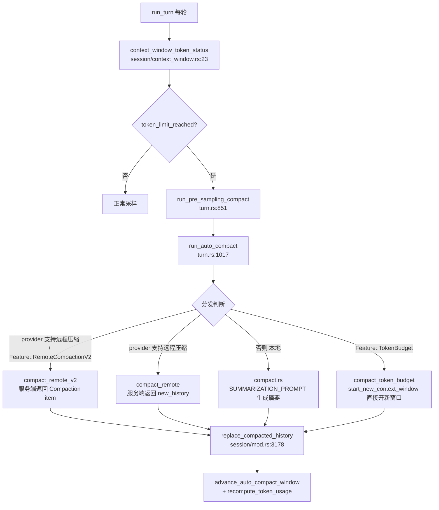
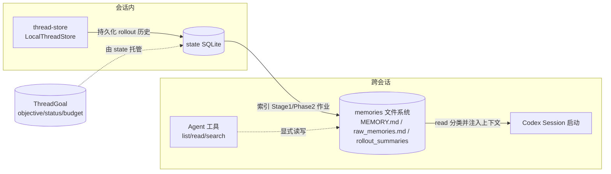


> 《Codex Agent / Harness 深度解剖》系列 · 第 4 篇  
> 源码基准：OpenAI Codex（Apache-2.0，Rust monorepo）`codex-rs/core/src`、`codex-rs/state`、`codex-rs/thread-store`、`codex-rs/memories`、`codex-rs/ext/memories`  
> 阅读方式：本文由直觉到实现逐步推进，不分层级，可随读随停。

---

# 4\. 长程作业：压缩、目标与记忆

> 一句话：**一个能跑一百轮的 Agent，不靠更大的上下文窗口，而靠"会压缩、记得住目标、跨会话留记忆"这三件套。** 窗口是固定的，任务却可能很长——这道裂缝，就是长程作业的全部难点。

---

## 从一次"做不完"的任务说起

想象你让一位远程工程师重构一个模块。他不会十分钟内交差，而是：读代码、改一处、`cargo test`、看报错、再改、再测……一轮又一轮。把这位工程师换成 Codex，每一轮的**工具输出、代码 diff、报错回灌**都会塞进它的上下文窗口。而窗口是有上限的——它等于 `model_context_window`。

于是矛盾出现了：

-   **上下文会溢出。** 几十轮之后，活跃上下文顶到天花板，再发请求直接被拒（`ContextWindowExceeded`）。

-   **目标会丢失。** 最容易在压缩时被牺牲的，恰恰是"我到底在干什么"——而这是长程作业存活的唯一凭依。

-   **成本会失控。** 轮数越多 token 越贵，必须有一道树级（会话树）的总闸来封顶。

Codex 的解法不是"把窗口做大"，而是三件正交的事：**压缩（compaction）** 在每轮按预算触发，把历史瘦身成摘要 + 受控保留；**记忆（memory）** 把跨会话的经验沉淀成文件，启动时注入；**目标与预算（goal + rollout budget）** 用 `ThreadGoal` 记住"当前在干什么、花了多少"，用 `RolloutBudget` 在会话树级别卡住总成本。

下面从最直觉的部分讲起，再滑向源码。

---

## 压缩的本质：何时压、怎么压

压缩要回答的其实只有一个问题：**怎么在丢掉历史细节的同时，把"任务语义"留下来。**

Codex 把它拆成两个独立决策，这一点值得先记住——"什么时候压"和"怎么压"是分开计算的。

**何时触发（When）。** 每轮采样前后都会调用 `context_window_token_status`（`session/context_window.rs:23`）算出一个 `token_limit_reached: bool`。关键不是"满了才压"，而是"缓冲后的预算线到了就压"：

```rust
// session/context_window.rs:77-78
let token_limit_reached = buffered_auto_compact_limit
    .is_some_and(|limit| auto_compact_scope_tokens >= limit)
    || full_context_window_limit_reached;
```

注意 `buffered_auto_compact_limit` 是**缓冲后**的预算线——它由 `model_auto_compact_token_limit`（context\_window.rs:43）加上 `auto_compact_fallback_buffer_tokens`（context\_window.rs:66-72）构成。所以压缩会在"真正满"之前提前发生，给降级留余量。`auto_compact_scope_tokens` 还受 `AutoCompactTokenLimitScope`（Total / BodyAfterPrefix）控制，后者只统计前缀之后的"正文"，把 system prompt 等固定开销排除在预算之外。直接拿 `>= window` 当触发器是新手常犯的错误——压完立刻又满，会陷入循环崩溃。

**怎么压（How）。** 四条路线，运行时按 feature flag 与 provider 能力分发（见 `run_auto_compact`，`session/turn.rs:1017`）：本地启发式摘要、远程 v1、远程 v2、以及一条干脆不生成摘要的 token-budget 重置路线。

---

## 四条压缩路线，运行时按能力分发

触发点在两个循环位置：

-   **采样前（PreTurn）**：`run_pre_sampling_compact`（`session/turn.rs:851`）算状态，若 `token_limit_reached` 就调 `run_auto_compact(..., CompactionReason::ContextLimit, CompactionPhase::PreTurn)`（turn.rs:874-875）。

-   **采样后轮转（MidTurn/PostTurn）**：`turn.rs:385` 决定 `should_roll_over = needs_follow_up && (take_new_context_window_request() || token_limit_reached)`——模型还想继续、且预算已到，就开新窗口继续。

-   **模型降级 / 兼容哈希变更（PreTurn 前置）**：`maybe_run_previous_model_inline_compact`（`turn.rs:919`）在切换更小上下文窗口模型、或压缩兼容哈希变化时，用上一模型的上下文先压一遍。



四条路线对比：

| 路线 | 入口 / 文件 | 摘要来源 | 保留内容 | 何时启用 |
| --- | --- | --- | --- | --- |
| 本地启发式 | `run_inline_auto_compact_task` `compact.rs:111` | 客户端再采样一次（用 `SUMMARIZATION_PROMPT`，compact.rs:54） | **全部用户消息**（截断到 `COMPACT_USER_MESSAGE_MAX_TOKENS=20_000`，`compact.rs:56`）+ 摘要 | provider 不支持远程压缩 |
| 远程 v1 | `run_inline_remote_auto_compact_task` `compact_remote.rs:50` | 服务端 `/responses/compact` 端点 | 服务端给的 `new_history`，本地 `should_keep_compacted_history_item`（compact_remote.rs:336）过滤掉 developer/system/工具调用 | `supports_remote_compaction()` 且未开 v2 |
| 远程 v2 | 同入口 `compact_remote_v2.rs:61` | 服务端返回单个 `ResponseItem::Compaction`（`encrypted_content`） | 本地额外保留 user/developer/system 前缀消息，截断到 `RETAINED_MESSAGE_TOKEN_BUDGET=64_000`（`compact_remote_v2.rs:56`）+ compaction item | `Feature::RemoteCompactionV2` |
| Token-budget 重置 | `run_inline_auto_compact_task` `compact_token_budget.rs:52` | **无摘要** | 直接 `start_new_context_window`（compact_token_budget.rs:82），丢弃历史、注入新窗口 | `Feature::TokenBudget` |

> 关键观察：本地路线的策略 `CompactionStrategy::Memento`（`compact.rs:465`）保留"全部用户消息 + 摘要"，远程路线保留"服务端精选的摘要 item + 受控前缀"。两者都通过 `InitialContextInjection`（`compact.rs:67`）决定是否把 world\_state/初始上下文重新注入——MidTurn 压在最后一条真实用户消息之前注入，PreTurn/Manual 则不注入、让下一轮自然重注（见 compact.rs:67 附近注释）。

本地路线的摘要生成在 `run_compact_task_inner_impl`（`compact.rs:240`）：把当前历史 + 压缩 prompt 作为一次普通采样，取最后一条 assistant 消息当 `summary_text`，再 `build_compacted_history`（`compact.rs:611`）组装成"用户消息列表 + 摘要"的新历史；`drain_to_completed`（`compact.rs:687`）复用单个 `client_session` 以便重试时保持 sticky routing。远程 v2 的保留逻辑在 `build_v2_compacted_history`（`compact_remote_v2.rs:439`）：先 `is_retained_for_remote_compaction_v2` 只留 `user|developer|system`，再过 `should_keep_compacted_history_item` 丢弃工具调用/函数输出，最后 `truncate_retained_messages_for_remote_compaction`（`compact_remote_v2.rs:478`）按 64k 预算从最新消息向前保留。压缩完成后统一走 `Session::replace_compacted_history`（`session/mod.rs:3178`，原文档误记为 compact.rs/compact\_remote.rs 内），并 `advance_auto_compact_window` 推进窗口号、`recompute_token_usage` 重算 token。压缩结束还会发一条 Warning（`compact.rs:389`）：多次压缩会累积误差，建议新开 thread。

---

## 压缩也会失败：模型降级回退

远程压缩端点会失败——限流、窗口超限、模型降级都可能发生。`run_auto_compact` 准备了一个 `fallback_step_context`：只有当错误属于 `should_retry_with_current_model`（`compact_model_fallback.rs:9`）枚举的类型时，才用**当前模型**重试一次，并上报 `record_model_fallback`（`compact_model_fallback.rs:22`）。这个枚举含有的错误（`compact_model_fallback.rs:14-16`）包括 `ContextWindowExceeded`、`UsageLimitReached`、`ServerOverloaded`。它解决的正是一个真实场景：上一模型上下文更大、压缩请求切到更小的新模型上失败——此时必须回退到当前模型或本地摘要，否则长程任务会在压缩这一步硬崩。

---

## 记忆：会话内 vs 跨会话，两套各管各的

压缩是**会话内**上下文管理，记忆是**跨会话**语义沉淀。两者职责不同，Codex 用三层分离把它们切开。

-   `thread-store`**（会话持久化底座）**：定义与存储无关的线程持久化接口 `ThreadStore`（`thread-store/src/store.rs:40`），实现有 `LocalThreadStore`（落本地，local/mod.rs:86）与 `InMemoryThreadStore`（in\_memory.rs:435）。它负责 thread 的 create / resume / append / archive / fork（见 store.rs:53-187 的方法签名）。一句话：它管"这一轮对话怎么存下来"。

-   `state`**（元数据 / 索引层）**：开头就是一句 `//! SQLite-backed state for rollout metadata.`（`state/src/lib.rs:1`）。它从 JSONL rollout 抽取元数据写入本地 SQLite，并 re-export 出 `ThreadGoal`（`lib.rs:49`）、`GoalStore`（`lib.rs:61`）、`MemoryStore`（`lib.rs:63`）。一句话：它给 rollout 建索引，并托管跨会话的"目标"与"记忆作业"状态。

-   `memories`**（跨会话语义记忆，蒸馏管线）**：拆成 `read` 与 `write` 两个 crate。`write` 在启动期跑一条流水线——`phase1` 对每个 rollout 抽取原始记忆，`phase2` 整合，产物落到 `raw_memories.md` 与 `rollout_summaries/` 目录（`memories/write/src/lib.rs:37-38` 的常量、lib.rs:28/30 的同步函数）。`read` 则按路径分类这些文件：`memories_usage_kinds_from_command`（`memories/read/src/usage.rs:29`）区分 `MEMORY.md`（usage.rs:51）、`raw_memories.md`（usage.rs:55）等类型，并由 `core/src/memory_usage.rs:16` 在会话上下文里把它们按类呈现。

-   `ext/memories`**（Agent 可显式操作的记忆工具）**：这是一套以扩展形式挂载的工具——`list` / `read` / `search` / `add_ad_hoc_note`（`ext/memories/src/lib.rs:18-22`）。其中 `search` 的描述是"Search Codex memory files for **substring matches**"（`ext/memories/src/tools/search.rs:61`），匹配模式 `SearchMatchMode` 只有 `Any` / `AllOnSameLine` / `AllWithinLines`（`ext/memories/src/backend.rs:102-109`）——纯子串/关键词，没有任何 embedding 或向量相似度。



**Codex 是否有"持久语义记忆 / RAG"？——诚实结论：持久语义记忆有，但源码中未见向量 / embedding 检索（即经典 dense RAG 没有）。**

`memories` 的 `write`+`read` 确实实现了跨会话记忆：Phase1 用模型从每个 rollout 抽取 markdown 原始记忆，Phase2 整合，`read` 在启动时把 `raw_memories.md` 等文件**整体注入**系统上下文（并带 usage 分类与引用追踪）。`ext/memories` 则再补一套 Agent 可主动调的 `search` 工具。但检索方式无论是"整文件注入 + 路径分类"还是"子串匹配"，都**不是基于 embedding 的 dense retrieval / 向量库**——所以它更接近"文件化长期记忆 + 启动注入 + 关键词工具"，而非语义向量 RAG。若你的产品需要精准语义召回，这是 Codex 当前源码里明确可补强的一个位。

---

## 目标与预算：让 Agent 记得"自己在干嘛、花了多少"

-   `ThreadGoal`**（state 模型）**：`state/src/model/thread_goal.rs:61` 定义 `ThreadGoal { objective, token_budget, tokens_used, ... }`；`status` 是枚举 `ThreadGoalStatus`（thread\_goal.rs:14），含 `BudgetLimited`（:19），且 `BudgetLimited | Complete` 为终态（:40）。`GoalStore`（`state/src/lib.rs:61`，实现在 runtime）负责增删改与核算（`GoalAccountingMode` / `GoalAccountingOutcome`，lib.rs:59-60）。**这就是 agent 跨轮"当前目标"的持久真相源。**

-   `tasks`**（core/src/tasks/）**：会话内任务以 `SessionTask` trait（`tasks/mod.rs:214`）抽象，`RegularTask` / `CompactTask` / `ReviewTask` / `UserShellCommandTask` 各自实现 `run`。`CompactTask::run`（`tasks/compact.rs:27`）就是手动 `/compact` 的入口，按 feature 分发到上面四条压缩路线；任务在后台 tokio 任务上跑，`on_task_finished`（`tasks/mod.rs:580`）统一收尾、刷 rollout、发指标。

-   `RolloutBudget`**（core/src/rollout\_budget.rs）**：会话树级成本闸。`record_usage`（`rollout_budget.rs:44`）加权累计 `output_tokens * sampling_token_weight + non_cached_input * prefill_token_weight`，与 `config.limit_tokens` 比较，越界返回 `true`（停，rollout\_budget.rs:51）。`pending_reminder`（`rollout_budget.rs:54`）按 `reminder_at_remaining_tokens` 阈值档位生成提醒，让模型在预算耗尽前主动收尾或开新 thread。

-   **目标不丢的三重保险**：① `ThreadGoal` 持久化 objective；② 压缩摘要（本地）或 compaction item（远程）把任务上下文带入新窗口；③ system 指令 / `AGENTS.md` 在每窗口重注。三者叠加，长程作业不会因压缩而"忘了自己在干嘛"。

---

## 与 Claude Code 的压缩 / 记忆对照

| 维度 | OpenAI Codex（源码所见） | Claude Code（公开行为，供对照） |
| --- | --- | --- |
| 触发时机 | 采样前（`run_pre_sampling_compact`，turn.rs:851）+ 采样后轮转（`token_limit_reached`）；缓冲预算线提前触发 | `/compact` 手动；接近上下文上限时自动压缩 |
| 压缩路线 | 4 条：本地摘要 / 远程 v1 / 远程 v2 / token-budget 重置，按 provider+feature 分发 | 主要本地摘要（让模型总结对话），无服务端 compact 端点 |
| 压缩内容 | 本地保留全部用户消息(≤20k)+摘要；远程 v2 保留前缀(≤64k)+服务端 Compaction item | 生成对话摘要替换历史 |
| 模型降级 | `should_retry_with_current_model` 用当前模型重试压缩（`compact_model_fallback.rs`） | 未显式建模压缩期模型降级 |
| 长程预算 | `RolloutBudget`（加权 token，树级封顶）+ `ThreadGoal.token_budget` | 无对应公开机制 |
| 跨会话记忆 | `memories` 蒸馏管线（Phase1→Phase2→`raw_memories.md`）+ `ext/memories` 工具；启动注入 + 子串搜索 | `CLAUDE.md` + `memory/`（用户/自动记忆），手动 `/memory` 维护 |
| 检索方式 | 整文件注入 + 路径分类 + **子串搜索（未见向量/RAG）** | 文件载入上下文（同样非 dense retrieval） |
| 目标持久化 | `ThreadGoal`（objective/status/budget）存 state SQLite | 无独立"目标"对象，靠 memory 文件表达 |

> 共性：两者都是**文件化长期记忆 + 启动注入**，都不是 embedding RAG；压缩都以"本地摘要"为基线。差异：Codex 把压缩做成了**多策略 + 服务端端点 + 预算闸 + 目标对象**的工程化体系，Claude Code 更轻量、更依赖用户主动维护记忆文件。

---

## 可迁移的经验

1.  **把"何时压"和"怎么压"解耦。** `context_window_token_status` 只算 `token_limit_reached`，`run_auto_compact` 只选路线。状态计算与策略分发分离，新增一条压缩路线（比如接你自己的压缩模型）几乎零成本。

2.  **压缩要"留提前量"。** 缓冲预算线（scope limit + fallback buffer）让压缩在真正溢出前发生，是避免"压完即满、循环崩溃"的关键。

3.  **摘要不是唯一答案。** token-budget 路线干脆不生成摘要，只开新窗口 + 预算提醒。对成本敏感、目标可被 system prompt 兜住的任务，这往往更稳。

4.  **远程压缩必配降级。** `should_retry_with_current_model` 告诉我们：服务端端点会失败，必须准备 fallback（当前模型 / 本地摘要），否则长程任务会在压缩这一步硬崩。

5.  **记忆与压缩是两件事。** 压缩是会话内上下文管理；记忆是跨会话语义沉淀。Codex 用 `thread-store`（存对话）、`state`（建索引/管目标）、`memories`+`ext/memories`（提炼/注入/检索）分层——这个边界值得照搬。

6.  **把"目标"当一等公民。** `ThreadGoal` 带 `objective`、`status`、`token_budget`、`tokens_used`，让 agent 的"当前在干什么、花了多少、是否到顶"可观测、可恢复。长程 Agent 没有目标持久化，等于没有记忆的工人。

7.  **诚实面对 RAG 缺口。** 当前记忆是整文件注入 + 子串搜索，没有向量检索。若场景记忆规模大、需要精准召回，应在 `memories/read` 或 `ext/memories` 层补一套 embedding 检索——这是源码明确留下的演进位。

> 一句话收束：Codex 对长程作业的解法是\*\*"预算驱动的压缩 + 文件化的跨会话记忆 + 持久化的目标对象"\*\*三件套。压缩保住上下文不溢出，记忆保住经验不丢失，目标保住方向不迷路——三者合起来，才是一个能真正跑完"一百轮"的 Agent。

---

## 自测题（检验你是否真懂）

1.  为什么说"何时压"和"怎么压"必须解耦？如果把它们写在一个函数里，会损失什么？

2.  缓冲预算线（`scope limit + fallback buffer`）解决了什么具体问题？直接拿 `>= window` 当触发器会怎样？

3.  本地路线和远程 v2 路线在"保留内容"上有什么本质区别？为什么远程路线敢只留一个加密的 Compaction item？

4.  `should_retry_with_current_model` 覆盖哪些错误类型？它解决的是哪种真实故障场景？

5.  本文反复强调"记忆与压缩是两件事"——请各用一句话说明 `thread-store`、`state`、`memories`、`ext/memories` 各自管什么。

6.  Codex 的"持久语义记忆"到底存不存在？它和经典 RAG 的差距在哪？

---

## 延伸阅读（结合网络讲解）

-   **Codex 官方架构文档**（Agent/Harness 总览，含 compaction 与 memory 设计）：`codex-rs/CODEX_AGENT_ARCHITECTURE.md`

-   **Context Engineering for Claude**（"context window 是头号资源"、memory 文件怎么写）：code.claude.com/docs/zh-CN/best-practices

-   **Lessons from building Claude Code: Prompt caching is everything**（静态在前动态在后、别中途改 prompt）：claude.com/blog/lessons-from-building-claude-code-prompt-caching-is-everything

-   **ReAct 论文**（Thought-Action-Observation，长程"行动-观察"的思想源头）：Yao et al., 2022

-   **本系列前文**：`agent-loop.md`（turn 生命周期）、`context-engineering.md`（片段拼装与 AGENTS.md）

---

## 关键符号速查

| 符号 | 位置 |
| --- | --- |
| `context_window_token_status` | `codex-rs/core/src/session/context_window.rs:23` |
| `run_pre_sampling_compact` | `codex-rs/core/src/session/turn.rs:851` |
| `run_auto_compact` | `codex-rs/core/src/session/turn.rs:1017` |
| `maybe_run_previous_model_inline_compact` | `codex-rs/core/src/session/turn.rs:919` |
| `run_inline_auto_compact_task`（本地） | `codex-rs/core/src/compact.rs:111` |
| `run_inline_remote_auto_compact_task`（v1） | `codex-rs/core/src/compact_remote.rs:50` |
| `run_inline_remote_auto_compact_task`（v2 入口） | `codex-rs/core/src/compact_remote_v2.rs:61` |
| `run_inline_auto_compact_task`（token-budget） | `codex-rs/core/src/compact_token_budget.rs:52` |
| `should_retry_with_current_model` | `codex-rs/core/src/compact_model_fallback.rs:9` |
| `replace_compacted_history` | `codex-rs/core/src/session/mod.rs:3178` |
| `ThreadStore` trait | `codex-rs/thread-store/src/store.rs:40` |
| `LocalThreadStore` / `InMemoryThreadStore` | `codex-rs/thread-store/src/local/mod.rs:86` / `in_memory.rs:435` |
| `ThreadGoal` | `codex-rs/state/src/model/thread_goal.rs:61` |
| `GoalStore` / `MemoryStore` | `codex-rs/state/src/lib.rs:61` / `:63` |
| `SessionTask` trait / `on_task_finished` | `codex-rs/core/src/tasks/mod.rs:214` / `:580` |
| `CompactTask::run` | `codex-rs/core/src/tasks/compact.rs:27` |
| `RolloutBudget::record_usage` | `codex-rs/core/src/rollout_budget.rs:44` |
| `memories_usage_kinds_from_command` | `codex-rs/memories/read/src/usage.rs:29` |
| 记忆工具 `search`（子串匹配） | `codex-rs/ext/memories/src/tools/search.rs:61` |

