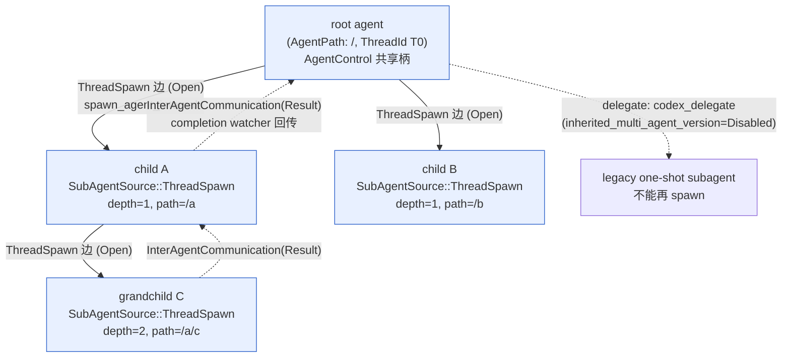
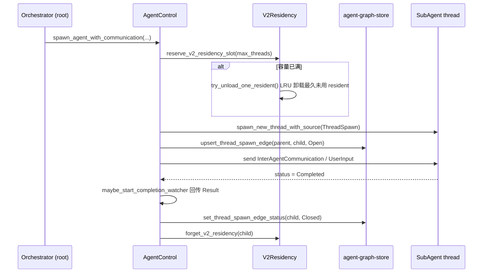


> 《Codex Agent / Harness 深度解剖》系列 · 第 4 篇  
> 源码基准：OpenAI Codex（`codex-rs`，Apache-2.0）。涉及 `core/src/agent/`、`core/src/agent_communication.rs`、`core/src/codex_delegate.rs`、`agent-graph-store/`、`protocol/src/protocol.rs`。所有结论均对应真实文件与符号，未查到的以"源码中未见"标注。  
> 阅读方式：本文由直觉到实现逐步推进，不分层级，可随读随停。

---

> 一句话：**一个 agent 干不完、或干起来太贵时，就把活拆给多个 agent——但"拆"本身也要成本，Codex 的解法是把协调收拢到一个共享控制柄 + 一张可持久化的 agent 图上。**

---

## 从"一个项目经理带团队"说起

想象你是项目经理，手上压着一个大需求：改 30 个文件的 API、顺手写测试、还要调研一个不确定的第三方库。你有两个选择：

-   **自己闷头干**：上下文越堆越长，中途换个思路就得在几千行历史里翻；

-   **拆给组员**：张三专门调研库、李四改 API、王五写测试，你只负责收口。

后者就是"多代理"的直觉来源。在 Codex 里，一个 agent 本质就是上两篇讲的"思考→行动→观察"循环；当任务超出单条上下文、需要并行探索、或要把"大胆试错"和"稳妥落地"两种风险偏置分开时，把工作派给多个子 agent 是自然选择：

-   **任务分解**：orchestrator（总控 agent）把大任务切成子任务，分别派给专精的子 agent，避免把所有中间产物塞进同一条上下文。

-   **上下文隔离（context isolation）**：每个子 agent 拥有独立 `ThreadId`、独立会话状态与（可选）独立角色，子任务的失败与噪声不污染主链路。

-   **并行探索**：多个子 agent 可同时探索不同文件树、验证不同假设，再由主 agent 收敛。

但多代理不是银弹——这一点 Codex 源码反复透露。**编码（code-writing）任务未必适合多 agent**：

-   派生子 agent 有硬上限。`reserve_spawn_slot`（`registry.rs:80`）在 `max_threads` 命中时返回 `AgentLimitReached`（`registry.rs:86`），`try_increment_spawned`（`registry.rs:263`）用 CAS 抢槽；深度也受 `exceeds_thread_spawn_depth_limit`（`registry.rs:75`）约束。

-   子 agent 的上下文是父线程的 **fork（复制历史）**。`spawn_forked_thread`（`control/spawn.rs:564`）要先 flush 父 rollout 再裁剪，是实打实的 I/O 与 token 成本。

-   经典 `delegate` 路径会显式写 `inherited_multi_agent_version: Some(MultiAgentVersion::Disabled)`（`codex_delegate.rs:143`）——被委托的子 agent 自己不能再 spawn，是一道刻意的"单跳"边界。

-   V2 模式下，活跃 agent 超出容量会被 LRU 卸载（`residency.rs:117` `try_unload_one_resident`）——"常驻多 agent"是有代价的资源调度。

> 一句话直觉：多代理的收益来自**隔离与并行**，成本来自**协调、上下文 fork 与生命周期管理**。Codex 不"无脑铺开 agent 图"，而是在一个共享控制平面（`AgentControl`）上，用显式的边（spawn / message）与持久化拓扑（`agent-graph-store`）把成本管起来。

---

## 三层抽象：控制柄、消息、拓扑

把 Codex 的多代理能力拆开看，其实是一种天然的三层：

1.  **控制平面（control plane）**：`AgentControl`（`control.rs:96`）是整棵 agent 树的控制柄。它"每棵 root thread/session 树至多创建一个"，然后被克隆、**共享**给该 root 派生出的每一个子 agent（`control.rs:89-94`）。内部持有 `AgentRegistry`（存活 agent 表）、`V2Residency`（V2 常驻容量）、`RolloutBudget`（预算）与 `Weak<ThreadManagerState>`（回指全局线程管理器，避免引用环）。

2.  **通信平面（communication plane）**：`InterAgentCommunication`（`protocol.rs:731`）是 agent 之间传递的"消息"原语，带 `author` / `recipient` / `other_recipients` / `content`（及可选 `encrypted_content`）和 `trigger_turn` 标志。跨 agent 提交走 `AgentControl::send_inter_agent_communication`（`control.rs:168`）。

3.  **拓扑平面（topology plane）**：`agent-graph-store` crate 把"谁 spawn 了谁"持久化为有向边（`ThreadSpawnEdgeStatus::Open/Closed`，`types.rs:7`），节点是 `ThreadId`，边是 spawn/依赖关系。

版本维度上，`MultiAgentVersion`（`protocol.rs:3023`）枚举 `Disabled | V1 | V2`：

-   **V1 / Disabled**：以 `codex_delegate` 为代表的"父拥有子会话 IO"的线性 orchestrator，`maybe_start_completion_watcher` 用 `inject_user_message_without_turn` 把子 agent 完成消息塞回父线程（`control.rs:518`）。

-   **V2**：引入 `AgentPath`（路径化身份）、`agent-graph-store` 持久拓扑、`V2Residency` 容量调度，子 agent 通过 `InterAgentCommunication` 的 `Result` 事件回传完成状态（`control.rs:493`）。

版本解析在 `ThreadManagerState::effective_multi_agent_version_for_spawn`（`thread_manager.rs:1330`），优先用 `config.multi_agent_version_override()`，否则从父线程继承（`initial_multi_agent_version_for_spawn`，`thread_manager.rs:1351`）。

---

## AgentControl：整棵 agent 树共享的柄

```rust
// core/src/agent/control.rs:96
#[derive(Clone, Default)]
pub(crate) struct AgentControl {
    session_id: SessionId,                          // 整棵树共享同一 session id
    manager: Weak<ThreadManagerState>,              // 弱引用，避免引用环
    state: Arc<AgentRegistry>,                       // 该 root 树作用域内的 agent 表
    v2_residency: Arc<V2Residency>,                  // V2 常驻容量（LRU）
    agent_execution_limiter: Arc<AgentExecutionLimiter>,
    rollout_budget: Arc<RolloutBudget>,              // 会话级 rollout 预算
}
```

几个要点：`session_id` 注释（`control.rs:97-98`）明确"同一 root 派生的每个 sub-agent 共享同一个 session ID"；`manager` 用 `Weak` 是为了打破 `ThreadManagerState -> CodexThread -> Session -> SessionServices -> ThreadManagerState` 的引用环（`control.rs:100-102`）；`state: Arc<AgentRegistry>` 是**共享可变注册表**——所有子 agent 的注册/注销都落到同一张表，这正是"共享会话状态"的落地。

`AgentRegistry`（`registry.rs:24`）的核心是一张 `agent_tree: HashMap<String, AgentMetadata>`（`registry.rs:31`），以 `AgentPath` 字符串为键。`AgentMetadata`（`registry.rs:37`）携带 `agent_id / agent_path / agent_nickname / agent_role`。`reserve_spawn_slot`（`registry.rs:80`）在 `max_threads` 命中时返回 `AgentLimitReached`——这是多代理的规模护栏。

---

## mod spawn：怎么派生子 agent

`control/spawn.rs` 的入口是 `spawn_agent_internal`（`control/spawn.rs:365`），它决定是 **fork 父上下文**（`SpawnAgentForkMode`，`control.rs:63`：`FullHistory` / `LastNTurns(n)`）还是全新线程。fork 路径 `spawn_forked_thread`（`control/spawn.rs:564`）会：

1.  `parent_thread.ensure_rollout_materialized()` + `flush_rollout()` 先把父历史落盘；

2.  `keep_forked_rollout_item`（`control/spawn.rs:47`）裁剪历史——只保留 `system/developer/user` 角色与 `assistant` 的 `FinalAnswer` 阶段，丢弃 `FunctionCall`/`ToolSearchCall` 等中间工具调用，也丢弃 `InterAgentCommunication` 项；

3.  若是 `LastNTurns`，调用 `truncate_rollout_to_last_n_fork_turns` 只保留最近 n 个 turn（`control/spawn.rs:626`）；

4.  对 V2 还会过滤掉父线程注入的 `usage_hint` 提示文本（`control/spawn.rs:638`），并在 FullHistory 下追加子 agent 专属的 `subagent_usage_hint_text`（`control/spawn.rs:686`）。

子 agent 的初始输入由 `SpawnInitialInput`（`control/spawn.rs:20`）区分：`UserInput`（普通 prompt）或 `InterAgentCommunication`（V2 通信派生，把消息与上下文绑定提交）。spawn 完成后写入拓扑边：

```rust
// core/src/agent/control/spawn.rs:521
self.persist_thread_spawn_edge_for_source(
    new_thread.thread.as_ref(), new_thread.thread_id, notification_source.as_ref()
).await;
```

`persist_thread_spawn_edge_for_source`（`control.rs:676`）调用 `agent_graph_store().upsert_thread_spawn_edge(parent, child, Open)`（`control.rs:695`）把派生关系落库。于是 `SubAgentSource::ThreadSpawn` 自然织出一棵树：



---

## 跨 agent 怎么说话：InterAgentCommunication

```rust
// protocol/src/protocol.rs:731
pub struct InterAgentCommunication {
    pub id: Option<ResponseItemId>,
    pub author: AgentPath,
    pub recipient: AgentPath,
    pub other_recipients: Vec<AgentPath>,
    pub content: String,
    pub encrypted_content: Option<String>,     // 可选加密
    pub trigger_turn: bool,                      // 是否触发接收方开新一轮
}
```

提交入口 `send_inter_agent_communication`（`control.rs:168`）先做容量检查 `ensure_execution_capacity_for_turn_start`，再走 `state.send_op(agent_id, Op::InterAgentCommunication { communication })`（`control.rs:211`）。每条通信都带 `AgentCommunicationContext`（`agent_communication.rs:26`），其 `kind` 是 `AgentCommunicationKind { Spawn, Message, Followup, Result }`（`agent_communication.rs:7`）——"这是 spawn 时的消息 / 普通消息 / 追问 / 结果回传"。

V1 下，父对子的"监控"靠 `maybe_start_completion_watcher`（`control.rs:439`）：它对子线程 `subscribe_status`，等 `is_final` 后，对 V2 子 agent 构造 `InterAgentCommunication::new(child_path, parent_path, …, Result)` 回传（`control.rs:500`）；对非 V2 则用 `inject_user_message_without_turn` 把通知文本塞回父线程（`control.rs:518`）。这就是 V1（线性注入）与 V2（结构化消息）两种协作范式。

---

## 另一种委托：codex\_delegate

除了 `AgentControl` 的 spawn，还有一条并行的 `codex_delegate.rs`，偏 **one-shot / interactive 子会话**：

-   `run_codex_thread_interactive`（`codex_delegate.rs:81`）启动一个 `Session::spawn`，传入父的 `agent_control`（`codex_delegate.rs:125`）、`inherited_exec_policy`（`codex_delegate.rs:130`），并显式 `inherited_multi_agent_version: Some(MultiAgentVersion::Disabled)`（`codex_delegate.rs:143`）。

-   `run_codex_thread_one_shot`（`codex_delegate.rs:206`）在之上立即 `io.submit(Op::UserInput { items, … })`（`codex_delegate.rs:236`）发起一次性任务，并把 `TurnComplete`/`TurnAborted` 桥接到 `Op::Shutdown`（`codex_delegate.rs:262`）。

-   输出经 `forward_events`（`codex_delegate.rs:290`）转发给调用方；**审批不向调用方透传**——子 agent 的 `ExecApprovalRequest` / `ApplyPatchApprovalRequest` / `RequestPermissions` / `RequestUserInput` 都被拦截，转交 `parent_session` 处理（`codex_delegate.rs:330/344/357/371`）。启用 Guardian 自动审批时走 `routes_approval_to_guardian`，以 `GuardianApprovalRequestSource::DelegatedSubagent`（`codex_delegate.rs:547/659/778`）标记来源。安全边界牢牢收束在父会话。

---

## agent-graph-store：从线性 orchestrator 走向 agent 图

`agent-graph-store` 这个独立 crate 是本篇最有"演进意图"的信号。它定义存储中立的 trait：

```rust
// agent-graph-store/src/store.rs:17
pub trait AgentGraphStore: Send + Sync {
    fn upsert_thread_spawn_edge(&self, parent_thread_id: ThreadId, child_thread_id: ThreadId, status: ThreadSpawnEdgeStatus) -> …;
    fn set_thread_spawn_edge_status(&self, child_thread_id: ThreadId, status: ThreadSpawnEdgeStatus) -> …;
    fn list_thread_spawn_children(&self, parent_thread_id: ThreadId, status_filter: Option<ThreadSpawnEdgeStatus>) -> …;
    fn list_thread_spawn_descendants(&self, root_thread_id: ThreadId, status_filter: Option<ThreadSpawnEdgeStatus>) -> …;
}
```

边带生命周期状态 `ThreadSpawnEdgeStatus { Open, Closed }`（`types.rs:7`）——子 agent 关闭后边标 `Closed`，但拓扑不丢。`LocalAgentGraphStore`（`local.rs:12`）是 SQLite 实现。`restore_v2_agent_metadata`（`control/spawn.rs:128`）与 `resume_agent_from_rollout`（`control/spawn.rs:717`）都基于这个 store 做 **BFS 恢复整棵 agent 树**（`list_thread_spawn_descendants`），甚至只走 `Open` 边恢复存活分支。

**设计意图**：V1/Disabled 的 `codex_delegate` 是"父持有子 IO 的线性编排器"——子会话是父的一次性调用，拓扑随进程消亡。而 V2 + agent-graph-store 把编排器升级为**持久化的 agent 图**：节点=agent（`ThreadId`/`AgentPath`），边=spawn 与依赖（`Open/Closed`），图可跨会话恢复、可分页查询子孙、可施加容量调度（`V2Residency`）。



---

## 协作活动的可观测面：Collab / SubAgent / Guardian 事件

`EventMsg` 枚举（`protocol.rs:1279`）暴露了多代理活动的可观测面：

-   `CollabAgentSpawnBegin` **/** `CollabAgentSpawnEnd`（`protocol.rs:1464/1466`）：协作 agent 生命周期起止；`CollabAgentSpawnBeginEvent`（`protocol.rs:4217`）带 `call_id`。

-   `CollabAgentInteractionBegin` **/** `End`（`protocol.rs:1468/1470`）：一次交互的起止。

-   `CollabWaitingBegin` **/** `End`（`protocol.rs:1472/1474`）：sender 等待一组 receiver；`CollabWaitingBeginEvent`（`protocol.rs:4344`）带 `receiver_thread_ids` / `receiver_agents: Vec<CollabAgentRef>`（`protocol.rs:4353`），`End` 带回 `agent_statuses`（`protocol.rs:4368`）。

-   `CollabCloseBegin/End`**、**`CollabResumeBegin/End`（`protocol.rs:1476-1482`）：协作会话的关闭与恢复。

-   `SubAgentActivity`（`protocol.rs:1485`）：V2 路径化子 agent 的活动事件，`SubAgentActivityEvent`（`protocol.rs:4332`）含 `agent_thread_id` / `agent_path` / `kind: SubAgentActivityKind { Started, Interacted, Interrupted }`（`protocol.rs:4325`）。

-   `GuardianAssessment`（`protocol.rs:1412`）：Guardian 自动审批的评审事件，与 `codex_delegate` 里的 `GuardianApprovalRequestSource::DelegatedSubagent` 呼应——多代理场景下的安全护栏。

配合 `ThreadGoalUpdated`（`protocol.rs:1363`）与 `ThreadGoal`（`protocol.rs:4070`，含 `objective` / `status` / `token_budget`），每个 agent 节点都可有独立目标与预算——这正是"agent 图"中节点自治的语义支撑。

---

## 横向对照

| 维度 | Codex（本仓库） | Anthropic sub-agents / agent graph | AutoGen |
| --- | --- | --- | --- |
| 核心抽象 | `ThreadId` + `AgentPath` 节点；spawn/消息为边 | 父 agent 用 tool 派生 sub-agent；agent graph 为编排层 | `Agent`/`AssistantAgent` + `GroupChat`/`Swarm` |
| 控制平面 | `AgentControl` 单例共享整棵树（`control.rs:96`） | 父 agent 自带 sub-agent 管理能力 | `GroupChatManager` 协调多 agent |
| 通信原语 | `InterAgentCommunication`（`protocol.rs:731`） | tool 输入输出 / handoff | agent 间消息广播 + 群聊 |
| 拓扑持久化 | `agent-graph-store` 有向边 `Open/Closed`（`store.rs:17`） | 运行时会话，重启后通常由上层重建 | 内存对象图 |
| 上下文策略 | fork 父历史并裁剪（`keep_forked_rollout_item`，`control/spawn.rs:47`） | 子 agent 独立上下文，显式上下文传递 | 全共享对话历史 |
| 安全边界 | 子 agent 审批回交父 `parent_session`；delegate 禁再 spawn（`codex_delegate.rs:143`）；Guardian | sub-agent 默认独立权限，handoff 上下文可控 | 依赖 `GroupChat` 配置 |
| 规模护栏 | `AgentLimitReached` + 深度限制 + V2 LRU 卸载 | 由模型/产品层约束 | 靠并发管理 |
| 版本演进 | `MultiAgentVersion::V1/V2` 明确两代 | 持续产品迭代 | 框架版本演进 |

---

## 心智模型

> **多代理 = 一棵以** `AgentControl` **为共享柄、以** `agent-graph-store` **为持久拓扑的 agent 图。节点（**`ThreadId`**/**`AgentPath`**）= 带目标的自治 agent，边（**`ThreadSpawn` **/** `InterAgentCommunication`**）= 显式、可持久、带生命周期的派生与消息。**

-   **共享柄 + 弱引用回指**：`AgentControl` 用 `Arc` 在子树内共享状态、用 `Weak` 打破引用环（`control.rs:103`）。自建多 agent 系统时，控制平面的生命周期管理是第一步。

-   **显式拓扑边 + 持久化**：把"谁 spawn 谁"落库成带状态的边，让 agent 图可恢复、可查询、可审计。

-   **上下文 fork 必须裁剪**：`keep_forked_rollout_item` 只留终态答案与系统提示，是多 agent 性价比的关键工程细节。

-   **安全边界上收**：子 agent 的危险操作审批一律回交父会话，被委托的子 agent 显式 `Disabled` 禁止再 spawn。

-   **容量即一等公民**：无论 `AgentLimitReached`、深度限制还是 V2 LRU 卸载，都说明"能 spawn"与"该 spawn"是两回事——这也正是"编码任务未必适合多 agent"的边界判断。

---

## 自测题（检验你是否真懂）

1.  为什么"派生子 agent"本身有成本？Codex 用哪三处机制给多代理踩刹车？

2.  `AgentControl` 为什么用 `Weak<ThreadManagerState>` 而不是 `Arc`？不用会怎样？

3.  `keep_forked_rollout_item` 为什么只保留 `FinalAnswer` 阶段的 assistant 项、丢弃工具调用项？

4.  V1（`inject_user_message_without_turn`）与 V2（`InterAgentCommunication::Result`）在"子 agent 完成回传"上有何本质区别？

5.  `agent-graph-store` 把拓扑持久化成"边"，相比把子任务关系埋在内存变量里，带来了什么能力？

---

## 延伸阅读

-   **Anthropic — Introducing sub-agents / agent graph**（sub-agent 派生与编排层设计）：claude.com/blog

-   **AutoGen（Microsoft）多 agent 编排**：microsoft.github.io/autogen/

-   **ReAct 论文**（多 agent 协作的思想源头之一）：Yao et al., 2022

-   **Codex 本仓源码**：`codex-rs/core/src/agent/`、`codex-rs/agent-graph-store/`、`codex-rs/protocol/src/protocol.rs`

---

## 关键符号速查

| 符号 | 位置 |
| --- | --- |
| `AgentControl` | `codex-rs/core/src/agent/control.rs:96` |
| `send_inter_agent_communication` | `codex-rs/core/src/agent/control.rs:168` |
| `maybe_start_completion_watcher` | `codex-rs/core/src/agent/control.rs:439` |
| `persist_thread_spawn_edge_for_source` | `codex-rs/core/src/agent/control.rs:676` |
| `AgentRegistry` / `reserve_spawn_slot` | `codex-rs/core/src/agent/registry.rs:24,80` |
| `exceeds_thread_spawn_depth_limit` | `codex-rs/core/src/agent/registry.rs:75` |
| `spawn_agent_internal` / `spawn_forked_thread` | `codex-rs/core/src/agent/control/spawn.rs:365,564` |
| `keep_forked_rollout_item` | `codex-rs/core/src/agent/control/spawn.rs:47` |
| `restore_v2_agent_metadata` | `codex-rs/core/src/agent/control/spawn.rs:128` |
| `InterAgentCommunication` | `codex-rs/protocol/src/protocol.rs:731` |
| `AgentCommunicationKind` | `codex-rs/core/src/agent_communication.rs:7` |
| `run_codex_thread_one_shot` / `forward_events` | `codex-rs/core/src/codex_delegate.rs:206,290` |
| `AgentGraphStore` trait | `codex-rs/agent-graph-store/src/store.rs:17` |
| `ThreadSpawnEdgeStatus` | `codex-rs/agent-graph-store/src/types.rs:7` |
| `V2Residency` / `try_unload_one_resident` | `codex-rs/core/src/agent/control/residency.rs:18,117` |
| `CollabWaitingBeginEvent` / `SubAgentActivityEvent` | `codex-rs/protocol/src/protocol.rs:4344,4332` |

