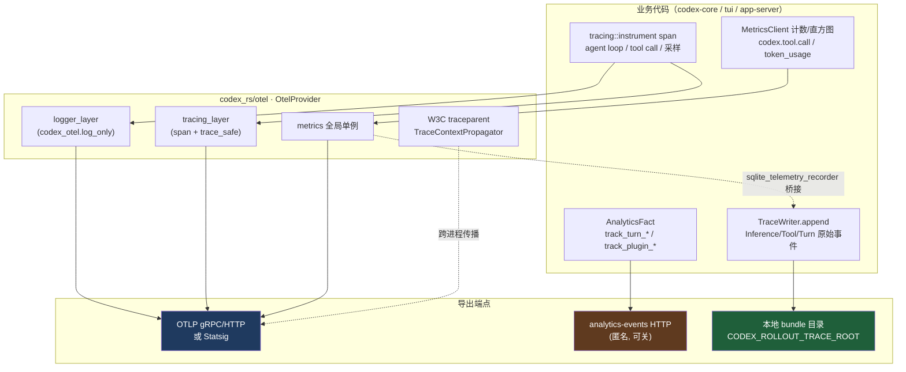
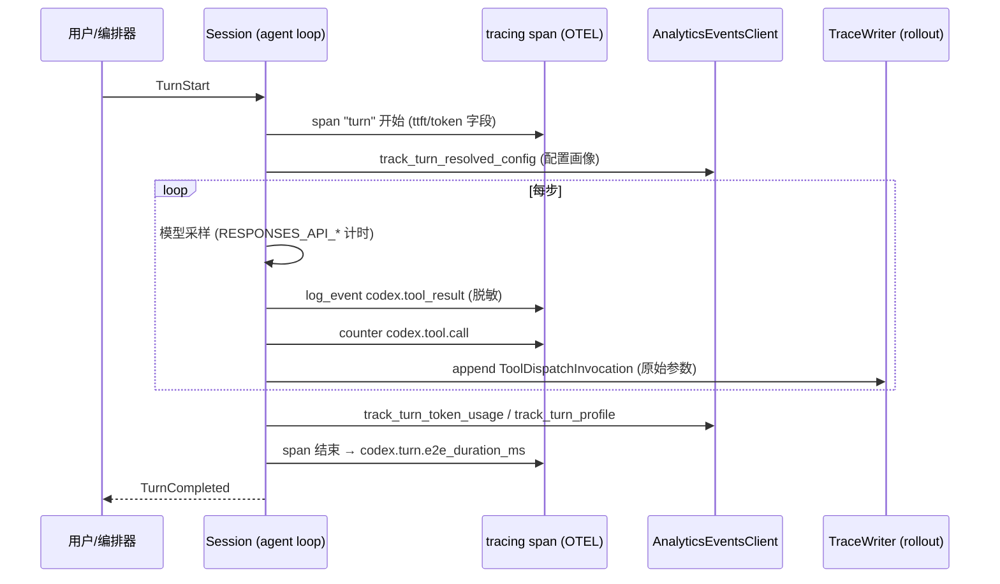


> 《Codex Agent / Harness 深度解剖》系列 · 第 N 篇  
> 源码基准：OpenAI Codex（Apache-2.0，Rust monorepo，`/Users/pelhans/project/codex`）  
> 关键 crate：`codex-rs/otel`、`codex-rs/analytics`、`codex-rs/rollout-trace`、`codex-rs/core/src/otel_init.rs`  
> 阅读方式：本文由直觉到实现逐步推进，不分层级，可随读随停。

---

# N. 可观测性与遥测：让 agent“看见”系统

> 一句话：**传统软件的可观测性是为 SRE 准备的“事后显微镜”，而 agent 的可观测性是给黑盒决策本身装上的“行车记录仪”——它既要在诡异行为发生后回放“为什么”，也要在运行中量化“花了多少、卡在哪”。**

---

## 从“agent 是个黑盒”说起

传统服务出问题时，SRE 打开 Grafana 看 trace 和 metric，定位是哪条请求变慢了。这套心智模型成立的前提是：**程序逻辑是确定的**——你知道代码写了什么，只是不知道运行时哪条路径被踩中。

LLM agent 打破了这个前提。一次 `codex` 会话里，第 3 步调了 `shell`、第 7 步调了 `apply_patch`、第 12 步因为工具返回格式不对“幻觉”出一个不存在的文件路径——这些“执行逻辑”是模型在运行时生成的，是**概率性的、不可从源码反推的**。没有可观测性，你既答不出“它为什么这么做”，也答不出“它到底做了什么”：改掉的代码、跑过的命令、消耗的 token，全都散落在一次概率性推理的烟雾里。

所以 agent 的可观测性至少有四重价值，权重和传统服务很不一样：

-   **决策回放（Replay）**：把一次 rollout 完整录下来——用户意图、每轮采样输入/输出、每次工具调用的参数与结果、token 消耗、延迟分布——才能复现一个诡异行为。这是调试 agent 的“核心调试器”，比打断点更有用，因为 bug 不在代码里，在模型的一次采样里。

-   **成本与延迟治理**：`codex.turn.e2e_duration_ms`、`codex.tool.call.duration_ms` 这些指标，让“这次任务花了多少钱、卡在哪个工具”变成可量化、可告警的对象。

-   **评测与数据飞轮**：轨迹（rollout trace）= 评测数据 = 未来微调/对齐的训练数据。可观测性基建直接决定数据飞轮的质量。

-   **（初级的）自我纠错**：agent 能否读取自己的遥测来调整行为，是“元认知”的雏形（文末点到为止）。

Codex 的设计哲学很明确：**可观测性不是事后补的日志，而是与 harness 控制流同构的第一等基础设施。** 三条性质不同的数据流被刻意分开又相互印证——OpenTelemetry（标准可观测性协议）、analytics（产品级匿名遥测）、rollout-trace（本地/评测级轨迹）。理解了它们的边界，整套设计就通了。

---

## 三条各自的管道：OTEL / analytics / rollout-trace

Codex 把“遥测”拆成三条语义不同的管道，而不是一股脑写进同一个日志系统：

| 数据流 | 承载 crate | 标准 | 默认去向 | 主要消费者 |
| --- | --- | --- | --- | --- |
| **Trace / Log / Metric** | `codex-rs/otel` | OpenTelemetry（OTLP / W3C traceparent） | 关闭；用户配置 OTLP 端点或 Statsig 后导出 | SRE / 可观测性后端 |
| **Anonymous usage analytics** | `codex-rs/analytics` | 自有 JSON-RPC 事件协议 | **默认开启**（可关闭） | OpenAI 产品团队 |
| **Rollout trace bundle** | `codex-rs/rollout-trace` | 自有 append-only JSONL + 载荷目录 | **关闭**；设 `CODEX_ROLLOUT_TRACE_ROOT` 后本地落盘 | 评测 / 回放 / 数据飞轮 |

一个关键洞察：**前两者在进程内解耦，但 metrics 的导出被刻意与 analytics 的开关耦合**（见 `core/src/otel_init.rs:70-77`）。这既是隐私取舍，也是实现巧思——后面展开。

---

## OpenTelemetry：把 `tracing` 门面桥接到标准协议

Codex 的全部业务代码通过 `tracing` 门面埋点，而 `codex-otel` 只负责把它桥接到 OTEL 标准。初始化入口在 `core/src/otel_init.rs` 的 `build_provider`：它把应用级 `Config` 翻译成 `codex_otel::OtelSettings`，再交给 `OtelProvider::from` 真正构建 SDK 对象。

```rust
// core/src/otel_init.rs:16-95（节选）
pub fn build_provider(
    config: &Config,
    service_version: &str,
    service_name_override: Option<&str>,
    default_analytics_enabled: bool,
) -> Result<Option<OtelProvider>, Box<dyn Error>> {
    // ...to_otel_exporter 把 Config 的 exporter 种类映射成 SDK exporter
    let exporter        = to_otel_exporter(&config.otel.exporter);
    let trace_exporter  = to_otel_exporter(&config.otel.trace_exporter);
    // ↓ 注意：metrics 导出受 analytics 开关控制
    let metrics_exporter = if config.analytics_enabled.unwrap_or(default_analytics_enabled) {
        to_otel_exporter(&config.otel.metrics_exporter)
    } else {
        OtelExporter::None
    };
    OtelProvider::from(&OtelSettings { /* ... */ })
}
```

`OtelProvider`（`codex-rs/otel/src/provider.rs:58`）聚合了四个可选句柄：`logger`、`tracer_provider`、`tracer`、`metrics`。`from`（provider.rs:84）的逻辑值得细读：

-   如果 exporter / trace\_exporter / metrics\_exporter **全是 None**，直接返回 `Ok(None)` 并清空进程级 tracestate 全局状态（provider.rs:90-96）。这是性能与隐私的双重保险——没开就不安装任何全局 subscriber。

-   只要 trace 启用，就**先校验 span attributes 与 tracestate 合法性**再安装 SDK（provider.rs:102-105）。注释写得很直白：provider 安装的是“不可回滚”的进程级 OTEL 全局状态，所以必须在任何副作用之前校验。

-   通过 `global::set_tracer_provider` 与 `global::set_text_map_propagator(TraceContextPropagator::new())` 安装 W3C trace context 传播器（provider.rs:143-146），跨进程的 trace 上下文（traceparent）能自动随请求传播。

最实用的是**导出过滤的两个 Layer**（`logger_layer` / `tracing_layer`，provider.rs:164-186）：

```rust
// codex-rs/otel/src/provider.rs:192-198
pub fn log_export_filter(meta: &tracing::Metadata<'_>) -> bool {
    is_log_export_target(meta.target())        // 仅 codex_otel.log_only / .network_proxy 等
}
pub fn trace_export_filter(meta: &tracing::Metadata<'_>) -> bool {
    meta.is_span() || is_trace_safe_target(meta.target())  // span 一律导出；事件看 target 前缀
}
```

Codex 用 `tracing` 的 **target 命名空间**做了权限分级：`codex_otel.log_only.*` 只进日志、不进 trace；`codex_otel.trace_safe.*` 才能进 trace。这是一个很实用的工程约定——**不是所有日志都该进 trace，含敏感参数的日志必须被 target 前缀拦在 trace 之外**。

### 埋点长什么样：agent loop / 工具调用 / 模型采样

全局搜 `tracing::instrument` 与 `tracing::span` 就能定位关键埋点。举几个例子：

-   **Agent loop / Session 控制流**：`core/src/session/mod.rs` 与 `core/src/session/turn.rs` 大量使用 `#[tracing::instrument(...)]`。例如 `merge_connector_selection`（session/mod.rs:1272，带 `connector_count` 字段）、`build_extension_turn_input_items`（turn.rs:733，带 `user_input_count`）、`track_turn_resolved_config_analytics`（turn.rs:796，带 `input_count`）。这些 span 把“一轮 turn 内部如何拼装上下文”暴露成可追踪的层级结构。

-   **工具调用埋点（最关键）**：`otel/src/events/session_telemetry.rs` 的 `SessionTelemetry::tool_result_with_tags`（session\_telemetry.rs:1101）同时做三件事——① 累加 `codex.tool.call` 计数与 `codex.tool.call.duration_ms` 直方图；② `log_event!` 写一条 `codex.tool_result` 日志（含 `arguments`/`output`，注意这是 `log_only` 命名空间，不进 trace）；③ `trace_event!` 写一条 trace-safe 的 span 事件（只含长度/行数，不含原文，避免敏感数据出网）。源码见 session\_telemetry.rs:1117-1145。

-   **模型采样埋点**：`otel/src/metrics/names.rs` 定义了极其细粒度的采样指标：`codex.responses_api_inference_time.duration_ms`、`codex.responses_api_engine_iapi_ttft.duration_ms`（首 token 延迟）、`codex.responses_api_engine_iapi_tbt.duration_ms`（token 间延迟）等（names.rs:13-23），以及 `codex.turn.ttft.duration_ms` / `codex.turn.e2e_duration_ms`（names.rs:24-26）。这些把“网络往返”与“引擎内部延迟”彻底解耦——正是定位“到底是模型慢还是网络慢”的利器。

-   **启动与进程级**：`core/src/otel_init.rs:97` 的 `record_process_start` 调用 `codex_otel::record_process_start_once` 记录 `codex.process.start`。

> 一个可迁移的经验：`tracing` 的 `target` + `fields` 机制被 Codex 玩出了“数据分级”的味道。任何人想在自家 agent 里加遥测，第一件事应该是**约定 target 命名空间与字段脱敏规则**，而不是随手 `info!`。

### 指标侧：全局单例 + Timer 模式

指标核心是 `codex-rs/otel/src/metrics/mod.rs` 的全局 `MetricsClient`：

```rust
// codex-rs/otel/src/metrics/mod.rs:24-33
static GLOBAL_METRICS: OnceLock<MetricsClient> = OnceLock::new();
pub(crate) fn install_global(metrics: MetricsClient) { let _ = GLOBAL_METRICS.set(metrics); }
pub fn global() -> Option<MetricsClient> { GLOBAL_METRICS.get().cloned() }
```

业务代码用 `codex_otel::start_global_timer(name, &tags)`（otel/src/lib.rs:70）拿一个 `Timer`，drop 时自动记录耗时；若全局未安装则返回 `MetricsError::ExporterDisabled`——意味着**埋点代码在遥测关闭时零成本**（返回 Err 而非 panic）。指标名集中在 `metrics/names.rs`（60+ 常量），从 `codex.tool.call` 到 `codex.goal.budget_limited`、`codex.guardian.review.duration_ms`、`codex.startup.phase.duration_ms`，几乎覆盖了 agent 生命周期的每个阶段。

---

## analytics：默认开、可关的匿名遥测

`codex-rs/analytics` 与 OTEL **完全平行**，它发的是“产品级匿名事件”，而非标准可观测性信号。架构是一个 **fact → reducer → track event** 的管道：

-   业务代码调用 `AnalyticsEventsClient::track_*`（`analytics/src/client.rs`，如 `track_turn_token_usage`、`track_plugin_used`、`track_guardian_review` 等）投喂一个 `AnalyticsFact`（枚举定义于 facts.rs:364）。

-   fact 被送进 `tokio::spawn` 的队列（`AnalyticsEventsQueue::new`），由一个常驻 `AnalyticsReducer` 聚合并产出 `TrackEventRequest`（`analytics/src/events.rs:62` 枚举了 30+ 种事件：SkillInvocation、TurnEvent、GuardianReview、Compaction、McpToolCall……）。

-   最终 `send_track_events`（client.rs:599）通过 HTTP POST 到 `{base_url}/codex/analytics-events/events`。

**隐私开关是这里最该讲清的设计**：

```rust
// analytics/src/client.rs:211-222
pub fn new(auth_manager: Arc<AuthManager>, base_url: String, analytics_enabled: Option<bool>) -> Self {
    let destination = AnalyticsEventsDestination::from_base_url(base_url);
    Self {
        queue: (analytics_enabled != Some(false))   // ← 只有显式 false 才关闭
            .then(|| AnalyticsEventsQueue::new(Arc::clone(&auth_manager), destination)),
    }
}
```

要点：

-   **默认开启，显式** `Some(false)` **才关闭**。`analytics_enabled` 来自 `Config`（由 `[analytics] enabled` 解析）。不同入口有不同默认值：TUI 交互式 `codex` 默认 `true`，而 `app-server` 远程控制默认 `false`。

-   **API key 用户的事件被裁剪**：`send_track_events`（client.rs:611）中，若 `auth.is_api_key_auth()`，则只保留 `can_send_with_api_key_auth` 的事件；若连 Codex 后端都不用，则直接 `return`，**一条都不发**（client.rs:613-615）。这是把“匿名遥测”与“企业/自托管部署”的边界代码化。

-   **调试期可落盘不联网**：`CODEX_ANALYTICS_EVENTS_CAPTURE_FILE` 环境变量在 debug 构建下让事件写本地文件、禁用网络发送，既方便开发者验证又不泄露数据。

事件 schema 之详尽令人咋舌：`CodexTurnEventParams`（events.rs:871）携带 `input_tokens`/`output_tokens`/`sampling_ms`/`tool_blocking_ms`/`total_tool_call_count` 等几十个字段。换句话说，**analytics 是一套“产品视角的 agent 行为画像”**，与 OTEL 的工程视角互补。

---

## rollout-trace：既能回放、也能当可观测数据

`codex-rs/rollout-trace` 是 Codex 对“决策回放”的终极回答。它定义了一套**本地 trace bundle 格式**，与 OTEL/analytics 都不同：默认关闭，仅当设置 `CODEX_ROLLOUT_TRACE_ROOT` 时启用（`rollout-trace/src/thread.rs:44、101-107`）。

写入端 `TraceWriter`（`rollout-trace/src/writer.rs:36`）的设计非常“抗崩溃可观测”：

-   维护一个 `trace.jsonl` 追加日志 + `payloads/` 目录，`append_with_context`（writer.rs:114）以**单调递增 seq** 写入 `RawTraceEvent`，每个事件引用一个载荷文件（`RawPayloadRef`）。

-   关键正确性约定（writer.rs:97-106 注释）：**先写 payload 文件，再写引用它的 event**，这样即使回放被打断，也绝不会指向一个还没写出来的载荷。

-   `lock_inner`（writer.rs:136）在 mutex poison 时调用 `into_inner` 而非 panic——注释直说：在“正是我们要调试的那次会话”里，丢弃 writer 会丢掉后续所有诊断事件，不可接受。

这些原始事件（如 `InferenceStarted`/`InferenceCompleted`/`CodexTurnStarted`/`ToolDispatchInvocation`）通过 `replay_bundle` 还原成结构化的 `RolloutTrace`（含 `inference_calls`、`codex_turns`、`threads` 等）。**这套 bundle 既是评测回放的输入，也是离线可观测性（在 Jaeger 之外自建 viewer）的数据源**——一条数据，两种用途。

更有意思的是它与 metrics 的**桥接**：`core/src/otel_init.rs:104` 的 `install_sqlite_telemetry` 把 `codex_rollout::sqlite_telemetry_recorder(metrics, originator)` 装进进程 DB。即 rollout-trace 写入时顺手把遥测指标喂回 OTEL metrics 客户端——可观测性最后又回到了可观测性。

---

## 三类遥测如何协同：一张流向图、一段 turn

把上面三条管道放进一张图，能看清它们如何在进程内分流：



一轮 turn 内部，三类遥测是这样咬合的：



---

## agent 能读自己的遥测来自我纠错吗？

严格讲，Codex 当前**并没有**让模型在线读取自己的 OTEL trace 来实时纠错——这是诚实的边界，**源码中未见** agent 在推理循环里回灌遥测日志的路径。但它已经埋下了“元认知”的种子：

1.  **目标预算自监控**：`codex.goal.budget_limited` / `codex.goal.usage_limited`（names.rs:38-39）与 `CodexGoalEvent`（events.rs:847）把 token 预算与耗时预算作为一等信号暴露。Guardian 复核、`goal` 中止逻辑可基于这些指标提前收手——这是“agent 基于遥测自我约束”的最直接体现。

2.  **错误闭环**：`track_turn_codex_error`（client.rs:401）与 `CodexTurnEventParams.turn_error`（events.rs:901）把失败类型（含 HTTP 状态码）结构化记录，配合 `codex.compaction` 事件，可在多轮中“学到”某类工具调用容易失败。

3.  **rollout 回放驱动评测**：轨迹本身不直接喂给运行中的模型，但离线回放（`replay_bundle`）产出的 `RolloutTrace` 是评测与回归的燃料——可观测性在这里转化为“下一代 agent 的能力”。

观点：agent 自我纠错不应走“把原始 trace 塞回 prompt”的朴素路线（token 成本与噪声都不可接受），而应走 Codex 这种**结构化、聚合、阈值化**的元信号路线——这正是可观测性架构对 agent 智能的反哺。

---

## 与 LangSmith、Claude 的可观测方案对照

| 维度 | **Codex（OpenAI）** | **LangSmith（LangChain）** | **Claude / Anthropic** |
| --- | --- | --- | --- |
| 协议底座 | OpenTelemetry（OTLP + W3C traceparent），自建 `codex-otel` 桥 | 自建 LangSmith 平台，兼容 OTEL 导出 | OTEL 兼容 + 平台级 trace（Claude Code 内部遥测） |
| Trace 粒度 | tracing span + rollout-trace 原始 bundle（双轨） | LLM 调用 / chain / tool 级 run tree | turn / tool_use / 子 agent 级 |
| 指标体系 | 60+ 命名指标（`codex.tool.call` 等），全局 `MetricsClient` | 平台内 latency/token/cost 看板 | 平台内 token、cache、延迟 |
| 匿名遥测 | 独立 analytics crate，**默认开、可关**，API key 用户裁剪 | 可选使用数据，可在组织设置关闭 | 依账户/企业策略，可关 |
| 数据分级 | `tracing` target 命名空间（log_only / trace_safe）实现脱敏 | 依赖平台权限与脱敏配置 | 平台侧脱敏 |
| 轨迹用途 | 评测回放（`replay_bundle`）+ 可观测性双用 | 评测、调试、数据集生成 | 评测与对齐 |
| 本地可观测 | `CODEX_ROLLOUT_TRACE_ROOT` 本地落盘，零网络 | 需连 LangSmith 云端（可自建） | 多依赖云端 |
| 跨进程传播 | `TraceContextPropagator` 全程注入 | 平台 SDK 自动 | SDK 自动 |

核心差异：**Codex 把“标准可观测性（OTEL）”“产品遥测（analytics）”“本地评测轨迹（rollout-trace）”三件事明确分离又用代码边界钳死**，而 LangSmith 更偏向“一个平台统一解决”。前者对自托管/隐私敏感场景更友好，后者对“开箱即用的调试体验”更顺手。

---

## 心智模型与可迁移经验

> **可观测性 = 为黑盒决策建立的一套可回放、可量化、可分级、可关闭的事实记录系统。**

-   **可观测性要和产品遥测解耦**。Codex 用三个 crate 把“工程信号 / 产品信号 / 评测信号”拆开，避免一股脑把用户数据送进 SRE 的 Grafana，也避免把运维指标当成产品 KPI。自建设计时先想清“这条数据的消费者是谁”。

-   **用** `tracing` **的 target 命名空间做数据分级**，比在每处手写 `if sensitive` 更可靠。`codex_otel.log_only` vs `codex_otel.trace_safe` 是值得抄的作业。

-   **埋点要“零成本可关”**。`MetricsClient::global()` 返回 `Option`、关闭时 `start_global_timer` 直接返回 `ExporterDisabled`，埋点代码无需到处判空。

-   **metrics 导出与隐私开关耦合是合理取舍**：Codex 让 `metrics_exporter` 受 `analytics_enabled` 控制（otel\_init.rs:70），因为这两类数据在合规上同源。设计自己的开关时，明确“哪些信号属于同一信任边界”。

-   **轨迹（rollout）是评测与可观测性的同一份真理源**：`TraceWriter` 先写载荷后写引用的设计、poison 时不丢事件的执念，都说明“回放可靠性”优先级高于“写入性能”。如果你的 agent 要建数据飞轮，这一步不能省。

-   **agent 自我纠错走“结构化元信号”而非“原始 trace 回灌”**：把 token 预算、错误类型、延迟阈值作为可被策略读取的信号，比把日志塞回 prompt 更可扩展。

> 一句话：在 agent 系统里，可观测性不是“加几个日志”。Codex 的 `otel` / `analytics` / `rollout-trace` 三件套，就是这套哲学的工业级范本。

---

## 自测题（检验你是否真懂）

1.  为什么 agent 的可观测性和传统服务的可观测性，前提假设不一样？“黑盒决策”带来哪四重价值？

2.  Codex 为什么把遥测拆成 OTEL / analytics / rollout-trace 三条管道，而不是统一写日志？

3.  `tracing` 的 `target` 命名空间（log\_only / trace\_safe）解决了什么具体问题？如果不这么做会怎样？

4.  `metrics_exporter` 为何受 `analytics_enabled` 控制？这一耦合在隐私上意味着什么？

5.  `TraceWriter` 为什么“先写 payload 再写引用它的 event”？mutex poison 时它为什么不 panic？

---

## 延伸阅读（结合网络讲解）

-   **OpenTelemetry 官方文档**（OTLP、W3C traceparent、tracing subscriber 模型）：opentelemetry.io/docs

-   **The Anatomy of an Agent Loop**（理解“工具调用 = 还没干完”的循环本质，本系列第 2 篇的延伸）：stevekinney.com/writing/agent-loops

-   **LangSmith 文档**（run tree、评测与数据集生成的一站式平台视角）：docs.smith.langchain.com

-   **Claude Code 最佳实践**（平台侧 trace 与脱敏、context window 是头号资源）：code.claude.com/docs/zh-CN/best-practices

-   **ReAct 论文**（Thought-Action-Observation，agent 决策可观测性的思想源头）：Yao et al., 2022

---

## 关键符号速查

| 符号 | 位置 |
| --- | --- |
| `build_provider` | `codex-rs/core/src/otel_init.rs:16` |
| `record_process_start` | `codex-rs/core/src/otel_init.rs:97` |
| `install_sqlite_telemetry` | `codex-rs/core/src/otel_init.rs:104` |
| `OtelProvider` / `OtelProvider::from` | `codex-rs/otel/src/provider.rs:58` / `:84` |
| `log_export_filter` / `trace_export_filter` | `codex-rs/otel/src/provider.rs:192` / `:196` |
| `tool_result_with_tags` | `codex-rs/otel/src/events/session_telemetry.rs:1101` |
| `GLOBAL_METRICS` / `MetricsClient` | `codex-rs/otel/src/metrics/mod.rs:24` |
| 指标名常量 | `codex-rs/otel/src/metrics/names.rs`（`codex.tool.call` 等 60+） |
| `AnalyticsEventsClient::new` | `codex-rs/analytics/src/client.rs:211` |
| `send_track_events` | `codex-rs/analytics/src/client.rs:599` |
| `track_turn_codex_error` | `codex-rs/analytics/src/client.rs:401` |
| `TrackEventRequest` 枚举 | `codex-rs/analytics/src/events.rs:62` |
| `AnalyticsFact` 枚举 | `codex-rs/analytics/src/facts.rs:364` |
| `TraceWriter` | `codex-rs/rollout-trace/src/writer.rs:36` |
| `CODEX_ROLLOUT_TRACE_ROOT` | `codex-rs/rollout-trace/src/thread.rs:44` |
| `merge_connector_selection` | `codex-rs/core/src/session/mod.rs:1272` |
| `build_extension_turn_input_items` | `codex-rs/core/src/session/turn.rs:733` |
| `track_turn_resolved_config_analytics` | `codex-rs/core/src/session/turn.rs:796` |

---

*全文结论均对应真实源码路径、行号与符号；未在源码中发现的断言已明确标注“源码中未见”。*

