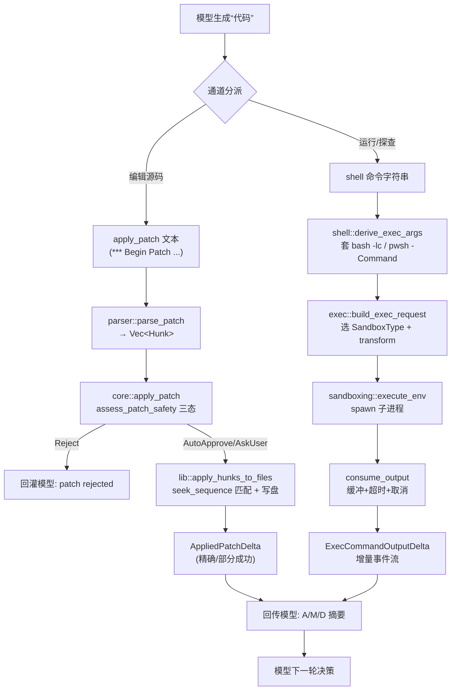


> 《Codex Agent / Harness 深度解剖》系列 · 第 4 篇  
> 源码基准：OpenAI Codex（Apache-2.0，Rust monorepo）`codex-rs/`  
> 阅读方式：本文由直觉到实现逐步推进，不分层级，可随读随停。

---

# 4\. 代码即工具：把"写代码"做成模型的一等工具

> 一句话：**与其给模型几十个细粒度函数，不如直接让它写代码。** 模型负责"用代码表达意图"，Harness 负责"把代码安全、可观测地执行掉"——工具越少，模型越在它最擅长的分布上工作。

---

## 从"给模型一堆细粒度函数"说起

想象你招了一位高级工程师。最直觉的训练方式是：把他要做的每件事都拆成按钮——`read_file(path)`、`search_code(query)`、`replace_line(...)`、`run_test(...)`——然后教他"先看哪个、再按哪个"。这套"细粒度 function-calling"在"订机票、查天气"这类外部能力上完全合理，但放到 **coding agent** 上会立刻撞墙：

1.  **工具表爆炸**。一个真实仓库涉及读、写、搜、重命名、跑命令、看输出、跑测试……每种操作都做成独立 function，工具表会膨胀到几十上百个，挤占上下文、稀释模型对"该用哪个"的判断力。

2.  **组合性极差**。真实任务往往是"先 sed 改一处、再 grep 确认、最后 make"——这是一段**程序**，不是一次 function 调用。用 function 拼，必须把控制流（循环、条件、管道）翻译成一连串离散调用，模型容易在中间步骤丢失状态。

3.  **模型天然擅长生成代码**。LLM 在海量代码上训练，生成 `shell` 命令、`diff` 是它的本能；反而"在 N 个 JSON-schema 工具里选一个并填参数"是后天的、易错的分布外任务。

所以 Codex 的答案很干脆：**把"写代码"本身做成一等公民的工具**。模型不再调用几十个细粒度函数，而是直接产出两种"可执行代码"——

-   `apply_patch`：一段声明式的"文件编辑意图"（自研 patch 格式），由 Harness 安全落地到文件系统；

-   `shell` **/** `exec`：一段 shell 命令，由 Harness 在沙箱里执行并把输出回传。

于是工具数量被压到个位数，组合性交给图灵完备的 shell 与 diff，模型在其最擅长的代码分布上工作。下面从源码层面逐层解剖这条链路——先说"为什么是两条通道"，再说每条通道怎么落。

---

## 两条正交的代码通道

"代码即工具"由两条正交通道构成，区别只在"幂等 vs 有副作用"：

-   **声明式通道（**`apply_patch`**）**：模型描述"文件应该从什么样变成什么样"，不关心如何施加。Harness 做精确匹配后落地，失败时给出可逆、可审计的 delta。适合"编辑源码"这类幂等、需安全的操作。

-   **命令式通道（**`shell` **/** `unified_exec`**）**：模型直接写 shell 命令，Harness 在沙箱里 spawn 进程、缓冲输出、控制超时与取消。适合"运行、探查、构建、测试"这类有副作用、需交互的操作。

两者都经过统一的**审批（approval）→ 沙箱选择（sandbox）→ 执行 → 回传**流程，只是落到不同的执行后端。

---

## apply\_patch：让模型"描述想要的文件长什么样"

### 格式与标记

解析入口在 `codex-rs/apply-patch/src/parser.rs`。格式有一组显式标记常量（`parser.rs:37-45`）：

```rust
pub(crate) const BEGIN_PATCH_MARKER: &str = "*** Begin Patch";
pub(crate) const END_PATCH_MARKER: &str   = "*** End Patch";
pub(crate) const ADD_FILE_MARKER: &str    = "*** Add File: ";
pub(crate) const DELETE_FILE_MARKER: &str = "*** Delete File: ";
pub(crate) const UPDATE_FILE_MARKER: &str = "*** Update File: ";
pub(crate) const MOVE_TO_MARKER: &str     = "*** Move to: ";
pub(crate) const EOF_MARKER: &str         = "*** End of File";
pub(crate) const CHANGE_CONTEXT_MARKER: &str = "@@ ";
```

一个最小示例（`parser.rs:130` 的 `parse_patch` 单测语境下）：

```plain
*** Begin Patch
*** Update File: path/to/file.py
@@
 def f():
-    pass
+    return 123
*** End Patch
```

其中 `@@` 是"上下文锚点"（`UpdateFileChunk.change_context`，`parser.rs:115-128`），通常用类/函数签名把编辑定位到文件局部；`-`/`+`/`（空格）分别是删除、新增、上下文行。`Add File `/` Delete File `整文件增删，`Update File `+` \*\*\* Move to:\` 还能表达重命名。

解析结果是一个 `Hunk` 枚举（`parser.rs:64-82`）：

```rust
pub enum Hunk {
    AddFile    { path: PathBuf, contents: String },
    DeleteFile { path: PathBuf },
    UpdateFile { path: PathBuf, move_path: Option<PathBuf>, chunks: Vec<UpdateFileChunk> },
}
```

### 为什么自研格式，而不是统一 diff

这里有个很自然的疑问：**git 的 unified diff 不就能干这事吗？** 问题在于，unified diff 需要精确的**行号与上下文窗口**才能 apply；模型一旦把行号数错、或多/少贴了一行上下文，`git apply` 就整体失败，且错误难以恢复。

Codex 的自研格式把"位置"弱化为**语义锚点**——`@@` 后的函数签名 + 一小段 old\_lines，由 Harness 在文件里**搜索匹配**而非按行号定位。这一设计体现在 `lib.rs` 的 `compute_replacements`（`lib.rs:715-801`）：它不是 `patch` 程序那样死板对齐，而是对每个 chunk 调用 `seek_sequence::seek_sequence` 在 `original_lines` 中查找 `old_lines`。

更巧妙的是它对"末尾空行"的处理（`lib.rs:765-790`）：若直接匹配失败且 `old_lines` 以空串结尾，会去掉该尾空行重试——使"修改到文件末尾"也能稳定命中。匹配不到则明确报错 `ComputeReplacements`（`lib.rs:790`），**绝不强改**。

此外 `parser.rs:139-176` 的 `ParseMode::Lenient` 专门兜底 gpt-4.1 的怪癖：模型常把 patch 包成 heredoc（`<<'EOF' ... EOF`）当作 argv，`Lenient` 模式会剥掉 heredoc 标记再解析（`check_patch_boundaries_lenient`，`parser.rs:217-239`）。这是"为模型分布让步"的工程取舍。

### 落地与"精确 delta"

`apply_patch`（`lib.rs:276-312`）先 `parse_patch` 拿到 hunks，再 `apply_hunks_to_files`（`lib.rs:361-566`）逐文件写入。关键点在于它全程维护一个 `AppliedPatchDelta`（`lib.rs:183-215`），记录"已实际提交哪些变更"。因为写文件可能中途失败（磁盘满、权限不足），`try_write!` 宏在出错时会把 `delta.exact = false`（`lib.rs:378-388`），并在 `ApplyPatchFailure`（`lib.rs:249-273`）里携带这份 delta——**即便失败，也告诉上层"哪些已经落盘"**，便于前端渲染部分成功的 diff。

### 审批护栏

在 `core/src/apply_patch.rs`，`apply_patch`（`core/src/apply_patch.rs:34-75`）先用 `assess_patch_safety` 做安全评估，返回三态：`AutoApprove` / `AskUser` / `Reject`。被 `Reject` 时直接以 `FunctionCallError::RespondToModel("patch rejected: ...")` 回灌模型（`core/src/apply_patch.rs:71-73`），模型可自我纠正。

---

## shell / exec：把命令本身当工具

### 三个层次的分工

| 模块 | 职责 | 关键符号 |
| --- | --- | --- |
| `core/src/shell.rs` | 把"命令字符串"翻译成具体可执行 argv | `Shell::derive_exec_args`（`shell.rs:22-49`） |
| `core/src/exec.rs` | 单次命令的可移植执行：构建沙箱请求、spawn、缓冲输出、超时/取消 | `process_exec_tool_call`（`exec.rs:297`）、`build_exec_request`（`exec.rs:321`）、`exec`（`exec.rs:914`） |
| `core/src/unified_exec/` | 交互式、可复用、带审批与流式输出的进程编排 | `UnifiedExecProcessManager`（`mod.rs:146`）、`exec_command`（`process_manager.rs:423`） |

`shell.rs` 的 `derive_exec_args` 针对不同 shell 生成不同前缀：`bash/zsh/sh` 用 `-lc`/`-c`，PowerShell 用 `-NoProfile -Command`，Cmd 用 `/c`（`shell.rs:23-48`）。模型只需产出"命令正文"，Harness 负责套正确的解释器。

### 执行与回传

`exec.rs` 的 `process_exec_tool_call`（`exec.rs:297-317`）调用 `build_exec_request` 把 `ExecParams` 转成带沙箱的 `ExecRequest`，再交给统一执行路径 `crate::sandboxing::execute_env`。真正 spawn 在 `exec`（`exec.rs:914` 起）：用 `spawn_child_async` 起子进程（`exec.rs:942` 附近），随后 `consume_output`（`exec.rs:975-1112`）通过两个 `tokio::spawn` 的 `read_output` 任务分别读 stdout/stderr（`exec.rs:1114-1168`），边读边以 `ExecCommandOutputDelta` **事件流**增量回传模型，同时受 `EXEC_OUTPUT_MAX_BYTES`（`exec.rs:76`，与 unified\_exec 同为 1 MiB）上限约束，避免巨量输出 OOM。

超时与取消是 `consume_output` 的核心：`tokio::select!` 同时等"进程退出 / 超时 / 取消 / Ctrl-C"，超时则 `kill_child_process_group` 并合成退出码 `124`（`exec.rs:65` 定义 `EXEC_TIMEOUT_EXIT_CODE`、超时处见 `exec.rs:802` 附近赋值）。这正是"代码即工具"必须有的护栏——模型写的命令可能挂死或失控，Harness 必须有硬刹车。

### unified\_exec：交互与复用

`unified_exec` 是"命令即工具"的**进阶形态**：它把进程句柄存进 `ProcessStore`（`mod.rs:133-137`），支持 `write_stdin` 向运行中进程注入输入、复用同一 process\_id 多轮交互（`ExecCommandRequest` 含 `process_id`、`shell_mode`、`tty` 等，`mod.rs:91-120`）。常量集中定义了上限：`UNIFIED_EXEC_OUTPUT_MAX_BYTES = 1 MiB`（`mod.rs:71`）、`MAX_UNIFIED_EXEC_PROCESSES = 64`（`mod.rs:73`）、`DEFAULT_MAX_OUTPUT_TOKENS = 10_000`（`mod.rs:70`）。入口 `exec_command`（`process_manager.rs:423`）同样走"审批 → 选沙箱 → spawn PTY"的统一编排（模块注释见 `mod.rs:1-23`）。

### shell snapshot：跨调用的环境一致性

长链路里有个易忽视的细节：每次 `exec` 都是独立进程，上一条命令里 `export` 的环境变量默认不会带到下一条。Codex 用 **shell snapshot** 解决——`core/src/shell_snapshot.rs` 的 `ShellSnapshot::try_create` 在每轮开始前跑一段快照脚本（`capture_snapshot`），把当前 shell 的环境变量导出成 `.sh`/`.ps1` 文件，下一条命令启动时 `set -a; . snapshot; set +a` 即可恢复。**这是让"一连串 shell 命令"看起来像在同一个交互终端里的关键 glue。** 快照文件 `Drop` 时自动删除，保留期上限 3 天。

---

## code\_mode：用提示增强切换"写代码"工作态

`codex-rs/tools/src/code_mode.rs` 不是又一个执行后端，而是一个**提示增强层**。它把现有工具 spec 改写成"代码模式"版本：

-   `augment_tool_spec_for_code_mode`（`code_mode.rs:8-51`）遍历 `ToolSpec::Function / Freeform / Namespace`，用 `codex_code_mode::augment_tool_definition` 给每个工具描述**追加 code-mode 专属的 exec 示例**；

-   `collect_code_mode_tool_definitions`（`code_mode.rs:61-85`）从所有 spec 抽取出"可嵌套为代码模式"的工具定义并去重；

-   `code_mode_name_for_tool_name`（`code_mode.rs:155-163`）把命名空间工具映射成 `ns__tool` 形式的 code-mode 名。

其作用：当 session 进入 **code mode**（`app-server/src/message_processor.rs` 持有 `CodeModeSessionProvider`，`core/src/session/tests.rs` 用 `InProcessCodeModeSessionProvider`），Harness 给模型的工具描述里就被**塞进了"如何用 shell / apply\_patch 写代码"的样例**。换言之，code\_mode 代表的能力是：**让 agent 显式切换到"以生成代码为主要手段"的工作态**——不是新增一个工具，而是把"写代码"的语汇与示例前置进上下文，引导模型走 code-as-tool 路线。

---

## 范式对比：代码即工具 vs 细粒度 function-calling / GUI 点击

| 维度 | 代码即工具（Codex: apply_patch + shell） | 细粒度 function-calling | GUI 点击（Claude Computer Use） |
| --- | --- | --- | --- |
| 工具数量 | 个位数（patch / shell / 少量） | 几十~上百，易膨胀 | 虚拟鼠标/键盘原语（click/type/scroll） |
| 组合性 | 图灵完备（管道、循环、条件） | 依赖 Harness 编排控制流 | 依赖屏幕坐标，极难组合 |
| 模型擅长度 | 高（代码分布内） | 中（JSON-schema 填参易错） | 低（需"看懂屏幕"再做像素级操作） |
| 可观测/可审计 | 高（patch 是文本 diff，命令是显式字符串） | 中（每次调用有参数日志） | 低（依赖截图，难 diff） |
| 安全性 | 中（需沙箱/审批；命令可能危险） | 高（参数级约束） | 低（任意 GUI 操作，副作用广） |
| 适用场景 | 软件工程、终端可达的任务 | 结构化外部 API | 无 API 的桌面/网页遗留系统 |
| 失败恢复 | 易（delta 可回滚、命令可重跑） | 中 | 难（状态在屏幕外，难回退） |

结论：**能用代码表达的，就用代码即工具**；只在"没有 API、只能点界面"时才退守 GUI 路线。Codex 把工程能力压进两条代码通道，是对 LLM 分布最友好的设计。

---

## 风险与护栏（点到为止）

即便"代码即工具"高效，Codex 仍将其关在护栏内：

-   **审批**：`apply_patch` 经 `assess_patch_safety` 三态裁决（`core/src/apply_patch.rs:39-74`）；`exec`/unified\_exec 经 `ToolOrchestrator` 的 approval 流程（`unified_exec/mod.rs:4-10`）。

-   **沙箱**：`exec.rs` 的 `build_exec_request` 选 `SandboxType`（`exec.rs:350-356`）并 transform 成沙箱内的 argv；unified\_exec 在沙箱拒绝时按策略降级重试（`unified_exec/mod.rs:7-16`）。

-   **硬限制**：输出 1 MiB 上限、进程超时合成退出码 `124`、取消即 kill 进程组（`exec.rs:65,76,802`）。

-   **网络**：`NetworkProxy` + 受管网络策略约束出网（`exec.rs:358-364`）。

细节（execpolicy、沙箱后端、审批缓存）已超出本文范围，留待"安全自治"篇。

---

## 两条链路的执行全景




---

## 心智模型

> **"代码即工具" = 两条代码通道 + 一个统一护栏环。**

-   **两条通道**：声明式 `apply_patch`（锚点匹配、带精确 delta 的编辑）与命令式 `shell`/`unified_exec`（沙箱内、可流式、可取消的执行）。

-   **弱位置、强匹配**：编辑别让模型数行号，用语义锚点 + `seek_sequence` 让 Harness 负责脆弱的精确落地。

-   **提示增强而非新增工具**：code\_mode 把"写代码"的样例塞进工具描述，引导模型走 code-as-tool，不动执行链路。

-   **护栏不可省**：审批、沙箱、超时、输出上限、进程组 kill，是"把执行权交给模型生成的代码"的前提。

**一句话观点**：coding agent 的最高杠杆，不是给模型更多 API，而是把"写代码"本身变成工具——把意图交给模型，把执行与安全当 Harness 的本职。

---

## 自测题（检验你是否真懂）

1.  为什么"细粒度 function-calling"放到 coding agent 上会撞墙？三条理由分别是什么？

2.  Codex 的自研 patch 格式相比 unified diff，把"位置"从什么弱化成什么？为何更鲁棒？

3.  `AppliedPatchDelta` 在 `apply_hunks_to_files` 中途失败时起到什么作用？`exact` 字段为何重要？

4.  `consume_output` 用 `tokio::select!` 同时等哪几件事？超时为什么会合成退出码 `124`？

5.  code\_mode 是"新增了一个工具"还是"提示增强"？它靠改哪一层切换 agent 的工作态？

---

## 延伸阅读（结合网络讲解）

-   **ReAct 论文**（Thought-Action-Observation 的理论基础，本文"循环"思想的源头）：Yao et al., 2022

-   **The Anatomy of an Agent Loop**（"6 行循环"与各框架对比，理解 harness 为何做"重"）：stevekinney.com/writing/agent-loops

-   **Lessons from building Claude Code: Prompt caching is everything**（静态在前动态在后、别中途改 prompt）：claude.com/blog/lessons-from-building-claude-code-prompt-caching-is-everything

-   **Codex Harness 官方讲解（代码即工具入门）**：agent.csdn.net 系列

-   **apply-patch 官方 Lark 文法**（`parser.rs` 头部注释即该文法的 Rust 实现参照）：见 `codex-rs/apply-patch/src/parser.rs:1-23`

---

## 关键符号速查

| 符号 | 位置 |
| --- | --- |
| `Hunk` 枚举 | `codex-rs/apply-patch/src/parser.rs:64-82` |
| `UpdateFileChunk` | `codex-rs/apply-patch/src/parser.rs:115-128` |
| `parse_patch` | `codex-rs/apply-patch/src/parser.rs:130` |
| `compute_replacements` | `codex-rs/apply-patch/src/lib.rs:715-801` |
| `apply_patch` | `codex-rs/apply-patch/src/lib.rs:276-312` |
| `apply_hunks_to_files` | `codex-rs/apply-patch/src/lib.rs:361-566` |
| `AppliedPatchDelta` | `codex-rs/apply-patch/src/lib.rs:183-215` |
| `assess_patch_safety` 调用 | `codex-rs/core/src/apply_patch.rs:39-74` |
| `Shell::derive_exec_args` | `codex-rs/core/src/shell.rs:22-49` |
| `process_exec_tool_call` | `codex-rs/core/src/exec.rs:297` |
| `build_exec_request` | `codex-rs/core/src/exec.rs:321` |
| `exec` | `codex-rs/core/src/exec.rs:914` |
| `consume_output` | `codex-rs/core/src/exec.rs:975-1112` |
| `EXEC_TIMEOUT_EXIT_CODE` | `codex-rs/core/src/exec.rs:65` |
| `UnifiedExecProcessManager` | `codex-rs/core/src/unified_exec/mod.rs:146` |
| `ExecCommandRequest` | `codex-rs/core/src/unified_exec/mod.rs:91-120` |
| `exec_command` | `codex-rs/core/src/unified_exec/process_manager.rs:423` |
| `augment_tool_spec_for_code_mode` | `codex-rs/tools/src/code_mode.rs:8-51` |
| `collect_code_mode_tool_definitions` | `codex-rs/tools/src/code_mode.rs:61-85` |

