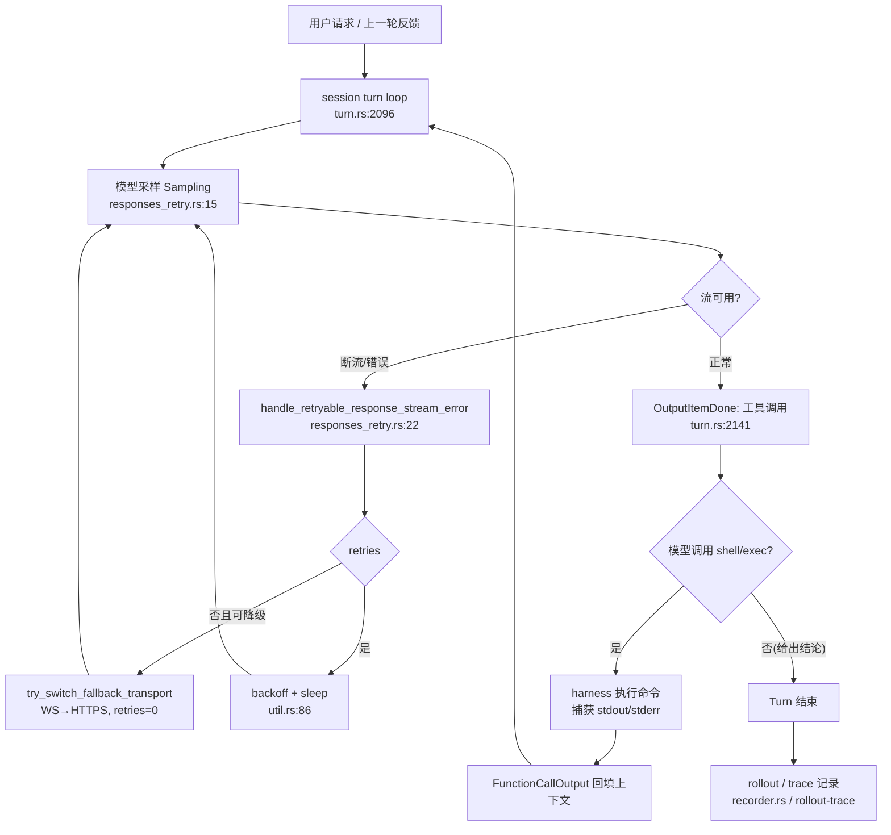


> 一句话：**LLM 会出错，所以 coding agent 必须能自己验证产出——编译、测试、运行，再基于反馈修正。** 有没有"产出 → 验证 → 修正"的闭环，是把一个玩具和一个工程助手分开的那条线。而要把这条闭环"做进工程里"，你还需要记录、预算、重试、截断四件套，否则闭环既不可复盘、也跑不稳。

---

## 从"一个会写错代码的工程师"说起

想象你让一位高级工程师修一个 bug。他不会"看一眼就写出正确答案"，而是：

```plain
理解问题（思考）
  → 跑测试看报错（行动）
  → 读报错、定位原因（观察）
  → 改代码（行动）
  → 再跑测试（观察）
  → ……直到测试全绿，对你说"修好了"
```

**自我验证就是把这位工程师的"跑—读—改"循环，变成了程序。** 模型负责"思考"，工具（shell、apply\_patch、exec）负责"行动"，工具的结果就是"观察"。三者不断循环，直到模型自己判定任务完成。

这个循环里最关键的直觉是：**工具结果会被重新喂回模型上下文。** 模型发出 `shell`/`exec` 调用 → harness 执行 → 捕获 stdout/stderr → 以 `FunctionCallOutput` 回填 → 模型读到编译错误/测试失败 → 产生修正补丁。这一来一回，让"验证"不再是人做的后置检查，而是 agent 自己的一拍。

但这里有一个必须记住、且容易被误读的边界：

> Codex **没有在 harness 里硬编码"自动跑测试"的逻辑**。验证动作本身是模型在 system prompt / 工具描述引导下**主动发起**的。

这与 Anthropic 的"subagent 自检"或某些框架的"钩子式测试"形成对照——Codex 把"是否验证、如何验证"交还给模型决策，harness 只负责提供可信的执行与记录能力。源码里唯一内置的"自动评审"是 `guardian`，但它做的是**权限 / 风险审批**（见 `core/src/guardian/mod.rs:1`："Guardian review decides whether an `on-request` approval should be granted automatically instead of shown to the user"，最终落到 `allow/deny` 结果），而非**代码正确性验证**——二者不可混淆。一个会"主动跑测试"的 agent，和一个"会拦下危险命令"的审批器，解决的是完全不同的问题：`guardian` 评估的是"这条命令该不该被执行"，而自我验证评估的是"执行结果对不对"。把前者当后者用，是评测设计里最常见的认知错位。

正因为验证是模型主动的、且可能反复横跳，才需要一整套基础设施来兜住它：让验证尝试本身不崩、让每次尝试可被记录、让无限重试有刹车。下面从这三条线铺开。

---

## 验证闭环的主心骨：turn 循环与回填

工具的"跑—读—改"发生在 turn 主循环里。Codex 把一次采样的事件流放在一个内层循环里逐条消费——`codex-rs/core/src/session/turn.rs:2096` 的 `loop { ... }`：

-   它逐条消费 `ResponseEvent`，在 `OutputItemDone` 分支（`turn.rs:2141`）处理模型产出的各类 item；

-   `FunctionCall` / `LocalShellCall` / `CustomToolCall` 在 `turn.rs:2198` 起的对应分支被解析、执行；

-   工具执行结果以 `FunctionCallOutput` 形式回填上下文，构成"产出—执行—反馈"闭环。

**验证（编译 / 测试 / 运行）正是这个闭环里模型主动发起的 shell/exec 调用，harness 不代劳判断。** 你让 Codex "把 auth 模块的测试修好"，真实跑起来大致是这样：

| 轮次 | 模型的动作 | 工具结果（观察） |
| --- | --- | --- |
| Turn 1 | 调用 shell 跑 `pytest` | 3 个用例失败，报错贴回上下文 |
| Turn 2 | 读 `auth.py` / `auth_test.py` | 拿到源码 |
| Turn 3 | 改代码 → 再跑测试 | 全部通过 |
| Final | 只回文本："已修复，测试全绿" | —（循环结束，控制权交还你） |

循环生死由模型自己掌控：只要它还想调工具，就"还没干完"；它只回纯文本，turn 才结束。把这张表记牢，下面所有源码细节都在回答同一个问题：**这个闭环在生产环境里，怎么才跑得稳？**

### 图 1：自我验证 / 重试闭环



> 关键观点：图 1 中"跑测试"那一步（J→K→L）完全是模型决策的产物，harness 只提供执行与回填通道。Codex 把"验证的主动性"交给模型，把"验证的可靠性（重试 / 记录 / 预算）"收归基础设施。

---

## 验证尝试本身也要有韧性：传输重试

当模型要发起一次推理来"思考如何验证"，或要执行远程 compaction 时，底层 Responses 流可能因网络抖动断开。若此时直接失败，整轮验证就丢了。Codex 在 `codex-rs/core/src/responses_retry.rs` 提供带退避的重试，并在穷尽重试后**自动切换传输协议**（WebSocket → HTTPS）——这是"验证闭环不掉链子"的底层保障。

统一入口是 `handle_retryable_response_stream_error(...)`（`responses_retry.rs:22`），它先判断当前重试的是哪类请求（`enum ResponsesStreamRequest { Sampling, RemoteCompactionV2 }`，`responses_retry.rs:15`）。逻辑分两支：

-   **协议级兜底**：`if *retries >= max_retries && client_session.try_switch_fallback_transport(...)`（`responses_retry.rs:31`）。若已到上限且能切换 fallback，就把 WebSocket 降级为 HTTPS，发一条 `WarningEvent`，并**重置** `retries = 0`（`responses_retry.rs:44`）——相当于换条路重走，而不是认输。注意这里把 `retries` 归零意味着新协议有完整的重试预算，避免"旧协议用光额度 → 切换后立刻失败"的不公平。

-   **指数退避**：否则若 `*retries < max_retries`（`responses_retry.rs:48`），递增计数后计算延迟：`let delay = err.retry_delay().unwrap_or_else(|| backoff(retry_count));`（`responses_retry.rs:51`）。优先尊重服务端返回的 `Retry-After`，否则用退避函数。

退避实现有两处，都是**指数退避 + 随机抖动**，避免重试风暴把服务端打爆：

-   `codex-rs/core/src/util.rs:86` `pub fn backoff(attempt)`：`exp = BACKOFF_FACTOR.powi(attempt-1)`（因子 2.0，定义在 `util.rs:7`），`base = INITIAL_DELAY_MS * exp`（基初延迟 200ms，定义在 `util.rs:6`），叠加 `rand::rng().random_range(0.9..1.1)` 抖动（`util.rs:89`）。也就是第 1 次约 200ms、第 2 次约 400ms、第 3 次约 800ms，逐次翻倍再乘 0.9~1.1 抖动。

-   `codex-rs/codex-client/src/retry.rs:38` `pub fn backoff(base, attempt)`：`exp = 2^(attempt-1)`，乘 `base` 再乘 0.9~1.1 抖动（`retry.rs:45`）。两处抖动范围完全一致，只是入参形态不同——前者是"固定初值 + 第几次"的便捷封装，后者把 base 暴露给调用方。

还通过 `sess.notify_stream_error(...)`（`responses_retry.rs:62`）向 UI 暴露"Reconnecting... n/max"，缓解"看似卡死"的体验；release 构建下隐藏首次 WebSocket 重试噪音（`report_error = retry_count > 1 || cfg!(debug_assertions) || !responses_websocket_enabled()`，`responses_retry.rs:56`）——因为首次 WS 重连多半是瞬时抖动，没必要惊动用户。退避够了 `tokio::time::sleep(delay).await`（`responses_retry.rs:69`）后返回 `Ok(())` 让调用方重试；彻底耗尽才返回 `Err(err)`（`responses_retry.rs:73`）。

把整条分支收成一张决策树，就是：

```plain
流错误到达
  │
  ├─ retries >= max_retries 且能切换 fallback?
  │     └─ 是 → 发 WarningEvent，retries = 0，换 HTTPS 重走（Ok）
  │
  ├─ retries < max_retries?
  │     └─ 是 → retries += 1；delay = Retry-After 或 backoff(retries)；
  │              （必要时 notify_stream_error）→ sleep(delay) → Ok（重试）
  │
  └─ 否（额度用尽且无法降级）→ Err(err)（交给上层判定 Failed）
```

这条树的核心设计哲学是\*\*"先换路、再退避、最后认输"\*\*：能用协议降级续命就不退避，能退避就不报错。验证闭环的每一次 sampling 都走这棵树，所以弱网下"跑测试"这一步也不会轻易整体失败。

---

## 让每次尝试都可评估：rollout 双管线

自我验证若不记录，就无法复盘、无法训练、无法回归。Codex 有两条互补的轨迹管线，热路径只依赖轻量写入，重语义投影留在核心之外：

-   **产品级 rollout**（`codex-rs/rollout/src/recorder.rs`）：把一次会话的 canonical 事件以 JSONL 持久化，`RolloutRecorder { tx, writer_task, rollout_path }`（`recorder.rs:85`）通过后台 `writer_task` 异步落盘，避免阻塞热路径；canonical 事件写入 `~/.codex/sessions/`，`Resume { path }`（`recorder.rs:111`）支持从历史恢复会话。rollout 可被 `jq`/`fx` 直接检查。

-   **诊断级 trace bundle**（`codex-rs/rollout-trace`）：面向"评测、复盘、训练数据"。其数据模型 `struct RolloutTrace`（`model/mod.rs:56`）是一张"对象图"——`threads`、`codex_turns`、`conversation_items`、`inference_calls`、`code_cells`、`tool_calls`、`terminal_sessions`/`terminal_operations`、`compactions`/`compaction_requests`、`interaction_edges`、`raw_payloads`（`model/mod.rs:71-89`）。

每个 `InferenceCall` 由 `StartedInferenceCall`（`reducer/inference.rs:22`）开始，记录 `thread_id`、`codex_turn_id`、`model`、`provider_name`、`request_payload`——即**每次采样尝试都被单独建模**，这正是"评估一次任务尝试轨迹"的原子单位。`RolloutTrace` 顶层还有 `status: RolloutStatus { Running | Completed | Failed | Aborted }`（`model/session.rs:15`），供评测判定成败。

归约入口 `replay_bundle(bundle_dir)`（`reducer/mod.rs:44`）确定性回放 `trace.jsonl` 原始事件，在循环里逐行 `reducer.apply_event(event)`（`reducer/mod.rs:78`），最后 `resolve_pending_spawn_edge_fallbacks()`（`reducer/mod.rs:83`）补全子 agent 边。这种"原始事件 append-only + 离线归约"的设计，使评测既能重跑又能演进 schema——把评测数据当"资产"而非"日志"。

### 产品级 rollout：canonical 事件如何落盘

先看热路径那一侧，因为它决定了"记录"这件事到底有多轻。`RolloutRecorder`（`recorder.rs:85`）只有三个字段：`tx: Sender<RolloutCmd>`、`writer_task: Arc<RolloutWriterTask>`、`rollout_path: PathBuf`。调用方从不在自己的线程里写文件，而是把事件塞进一个容量 256 的 mpsc 通道（`recorder.rs:892`），由 `tokio::task::spawn` 出来的后台任务（`recorder.rs:899`）独占文件句柄、异步落盘。三个命令覆盖了生命周期：`record_canonical_items`（`recorder.rs:926`）入队、`persist`（`recorder.rs:944`）/`flush`（`recorder.rs:965`）等 ack、`shutdown`（`recorder.rs:1067`）收尾。

这里有两点值得评测同学注意的"韧性细节"：

1.  **写失败是可重试的，不是致命的。** `RolloutWriterState::write_pending_with_recovery`（`recorder.rs:1651`）先写一次，失败就进入 recovery 模式（丢弃文件句柄、保留未写队列，`enter_recovery_mode` 在 `recorder.rs:1682`），再重开文件写第二次。只有两次都失败才向上报错。这意味着"磁盘瞬时不可写"不会让整段会话轨迹丢失——对离线评测的完整性是关键保障。

2.  **append 模式 + 换行补全。** 恢复会话时 `open_rollout_for_append`（`recorder.rs:1850`）以 `read(true).append(true)` 打开，并用 `ensure_rollout_is_newline_terminated`（`recorder.rs:1874`）保证文件末尾有换行，避免追加内容与前半段粘连成非法 JSONL。每行还带 `timestamp` 和 `ordinal`（`JsonlWriter::write_rollout_item`，`recorder.rs:1903`），`ordinal` 由 `RolloutOrdinalState` 单调推进（`recorder.rs:1750` 的 `advance()`），让"第几条事件"成为稳定序号，回放时可据此排序与去重。

这套机制合起来回答了"产品级 rollout 为什么能当可信数据源"：异步不挡热路径、失败可重试、append 不破坏既有内容、序号可排序。

### 诊断级 RolloutTrace：对象图逐字段走查

`RolloutTrace`（`model/mod.rs:56`）是一张**有向对象图**——顶层是多个 `BTreeMap<Id, Object>`，对象之间用 ID 互相引用。理解这张图，是理解"Codex 如何把一次 agent 运行变成可评测数据"的钥匙。下面把每个顶层字段走查一遍（行号均指 `model/mod.rs`）。

**身份与生命周期**

-   `schema_version: u32`（`:57`）：归约 schema 版本号。配合"离线归约"设计，旧 bundle 能用新 reducer 重跑，新 reducer 靠这个字段决定兼容策略。

-   `trace_id` / `rollout_id`（`:63` / `:65`）：注释说得很清楚——`rollout_id` 是产品级会话身份，`trace_id` 是这次诊断产物自己的身份。二者分离，意味着"同一会话可以产出多份不同视角的 trace"，而存储/回放身份不跟产品级会话身份耦合。

-   `started_at_unix_ms` / `ended_at_unix_ms`（`:66` / `:68`）：起止时间戳。`ended_at_unix_ms` 为 `None` 表示"仍在跑或 trace 不完整"——评测判定超时/中断时就看它。

-   `status: RolloutStatus`（`:69`）：整轮状态，`Running | Completed | Failed | Aborted`（`model/session.rs:15`）。这是评测的"成败总开关"。注意 `Aborted` 表示"被取消/提前停止"，与 `Failed`（操作失败）语义不同——评测时把二者都算"未完成"还是区分对待，取决于你想问什么问题。

-   `root_thread_id`（`:70`）：多 agent 树的根。所有子 agent 都通过边指回它。

**线程与激活**

-   `threads: BTreeMap<AgentThreadId, AgentThread>`（`:71`）：参与本次 rollout 的每个 agent（含根会话）一个 `AgentThread`。其字段里最该读懂的是 `origin: AgentOrigin`（`session.rs:55`）——`Root` 或 `Spawned { parent_thread_id, spawn_edge_id, task_name, agent_role }`。换句话说，谁是根、谁被谁 spawn、走哪条边、任务名是什么，全在这里。另一个关键字段是 `execution: ExecutionWindow`（`session.rs:74`）：每个 thread 有自己的起止与 `ExecutionStatus`（`:85`，含 `Running/Completed/Failed/Cancelled/Aborted`），**子线程可以独立于根 rollout 先结束**——评测"整轮完成"时不能简单看任一 thread 的结束。

-   `codex_turns: BTreeMap<CodexTurnId, CodexTurn>`（`:72`）：一次"runtime 对某 thread 的激活"。注释强调它**不是**用户/助手消息对，消息属于 `ConversationItem`（`session.rs:104`）。一个 turn 带着 `thread_id`、`execution`、`input_item_ids`（直接触发这次激活的对话项）。把 `codex_turns` 想成"runtime 的工作单元"，把 `conversation_items` 想成"对话内容"，二者通过 ID 关联而非嵌套。

**对话内容**

-   `conversation_items: BTreeMap<ConversationItemId, ConversationItem>`（`:73`）：归一化后的对话项。`ConversationItem`（`conversation.rs:26`）的字段值得细看：`role`（`conversation.rs:32`，System/Developer/User/Assistant/Tool）、`kind`（`conversation.rs:80`，Message/Reasoning/FunctionCall/FunctionCallOutput/…/CompactionMarker）、`body`（`:93`，有序的 `ConversationPart`：文本、摘要、加密推理、JSON、代码、超大负载引用）、`call_id`（`conversation.rs:41`，工具调用的模型可见 ID）、`produced_by: Vec<ProducerRef>`（`conversation.rs:43`）——这个 `ProducerRef`（`conversation.rs:146`）是图里的"因果指针"：`UserInput` / `Inference{...}` / `Tool{...}` / `CodeCell{...}` / `InteractionEdge{...}` / `Compaction{...}` / `Harness`。**一句话：任意一个对话项都能反查出它是谁生产的。** 这对评测极有用——你要统计"模型生成的 FunctionCall 里有多少最终失败"，沿着 `produced_by` 跳到 `InferenceCall` 即可。

**推理调用（评测的原子单位）**

-   `inference_calls: BTreeMap<InferenceCallId, InferenceCall>`（`:74`）：**这是评测的原子单位。** 完整 `InferenceCall`（`conversation.rs:161`，构造见 `reducer/inference.rs:80`）包含：`thread_id` / `codex_turn_id`（归属）、`model` / `provider_name`（用了哪个模型）、`response_id` / `upstream_request_id`（上游关联，支持 `previous_response_id` 续聊）、`request_item_ids` / `response_item_ids`（本次请求/响应涉及的对话项快照）、`tool_call_ids_started_by_response`（本次响应触发的工具调用）、`usage: Option<TokenUsage>`（`conversation.rs:186`，细分 `input_tokens`/`cached_input_tokens`/`output_tokens`/`reasoning_output_tokens`）、`raw_request_payload_id` / `raw_response_payload_id`（完整原始体放在 `raw_payloads` 里，这里只存引用）。

-   归约时 `start_inference_call`（`reducer/inference.rs:36`）会先做两条不变量校验：inference\_call\_id 不能重复（`:42`），且引用的 `codex_turn_id` 必须存在且 `thread_id` 匹配（`:57`、`:62`）。这保证了"图里没有悬空推理节点"。

-   如果某个 inference 在 turn 结束时还 `Running`，`close_running_inference_calls_for_turn_end`（`reducer/inference.rs:113`）会按 turn 终态把它收尾为 `Cancelled/Failed/Aborted`——防止图里出现"永远在跑"的幽灵节点。

**运行时对象（工具 / 代码单元 / 终端 / 压缩）**

-   `code_cells: BTreeMap<CodeCellId, CodeCell>`（`:76`）：模型用 `exec` 写的 JavaScript 单元。`CodeCell`（`runtime.rs:28`）记录 `source_js`、`execution`、`runtime_status`（`runtime.rs:56`，Starting/Running/Yielded/Completed/Failed/Terminated）、`nested_tool_call_ids`/`wait_tool_call_ids`（JS 里再调的工具）。注意 `yielded` 状态——JS 可以"先返回、后台继续跑"，所以 cell 的生命周期可能超出它所属的 tool call。

-   `tool_calls: BTreeMap<ToolCallId, ToolCall>`（`:77`）：**验证动作就落在这里。** `ToolCall`（`runtime.rs:115`）的 `kind`（`runtime.rs:168`）枚举了 `ExecCommand`、`WriteStdin`、`ApplyPatch`、`Mcp{...}`、`Web`、`ImageGeneration`、`SpawnAgent`、`AssignAgentTask`、`SendMessage`、`WaitAgent`、`CloseAgent` 等——其中 `ExecCommand` 正是"跑测试"，`ApplyPatch` 正是"改代码"。`requester`（`runtime.rs:157`）区分是模型直接调还是 code-cell 里的 JS 调；`model_visible_call_item_ids`/`model_visible_output_item_ids` 把工具与对话项连起来；`raw_invocation_payload_id`/`raw_result_payload_id` 指向完整调用与结果。评测"是否成功调用验证工具并收敛"，就是从这里数 `ExecCommand` 的成败。

-   `terminal_sessions` / `terminal_operations`（`:79` / `:81`）：终端进程与会话、以及每次命令/写 stdin/轮询操作。`TerminalOperation`（`runtime.rs:226`）带 `kind`（`runtime.rs:244`，ExecCommand/WriteStdin）、`request`（`runtime.rs:252`，含 `command`、`cwd`、`yield_time_ms`、`max_output_tokens`）、`result: Option<TerminalResult>`（`runtime.rs:274`，含 `exit_code`/`stdout`/`stderr`/`formatted_output`）。**关键提醒（源码注释也写了）**：`TerminalResult` 是 runtime 观察到的输出，不证明模型看到了同样的字节；模型真正看到的要经 `TerminalModelObservation`（`runtime.rs:289`）里的 `call_item_ids`/`output_item_ids` 跳回对话项。评测"测试是否真通过"时，应以 `exit_code` + 模型可见的 `FunctionCallOutput` 共同判定，不能只看一端。

-   `compactions` / `compaction_requests`（`:83` / `:85`）：上下文压缩检查点。`Compaction`（`runtime.rs:79`）记录 `marker_item_id`（历史被替换的边界）、`input_item_ids`/`replacement_item_ids`（替换前后的对话项）、`request_ids`（贡献此检查点的上游请求）。这跟"截断的语义边界"一节呼应——压缩是模型上下文预算的另一种体现，且它在对象图里有专门的一阶表示，便于评测分析"压缩是否丢掉了验证关键上下文"。

**边与原始负载**

-   `interaction_edges: BTreeMap<EdgeId, InteractionEdge>`（`:87`）：对象之间的**有向信息流边**。`InteractionEdge`（`runtime.rs:305`）有 `kind`（`runtime.rs:319`，SpawnAgent/AssignAgentTask/SendMessage/AgentResult/CloseAgent）、`source`/`target`（`TraceAnchor`，`runtime.rs:330`，可指向对话项/工具调用/线程）、`carried_item_ids`/`carried_raw_payload_ids`（边带的数据）。这是多 agent 评测的核心——你能画出"根 agent → spawn 子 agent → 子 agent 回传结果"的完整调用图。

-   `raw_payloads: BTreeMap<RawPayloadId, RawPayloadRef>`（`:89`）：所有大体积原始体（请求/响应/工具调用/终端结果）的引用索引，多数指向图对象之外的独立文件。设计意图是**让对象图保持轻量、可序列化，重负载走外置引用**——回放时 reducer 仅在需要时才 `read_payload_json`（`reducer/mod.rs:139`）按需读取。

把这张图合起来看：`conversation_items` **是内容，**`inference_calls` **是"思考"，**`tool_calls`**/**`code_cells`**/**`terminal_*` **是"行动"，**`interaction_edges` **是多 agent 的"通信"，**`compactions` **是上下文预算的"裁剪点"，**`raw_payloads` **是外置的"原始证据"。** 任何一个评测问题——"模型思考了几次""哪次工具失败""子 agent 回传了什么""压缩是否丢上下文"——都能在这张图里沿着 ID 跳着回答，而不必去解析一堆扁平日志。

### replay\_bundle 的确定性归约设计

上面那张图不是直接写出来的，而是**从 append-only 原始事件离线归约**出来的。`replay_bundle(bundle_dir)`（`reducer/mod.rs:44`）的骨架只有三步：

1.  读 `manifest.json`（`MANIFEST_FILE_NAME`）拿到 `trace_id`/`rollout_id`/`root_thread_id`/`started_at_unix_ms`，用它们 `RolloutTrace::new(...)` 起一个空图（`:49`）。

2.  逐行读 `trace.jsonl`（`RAW_EVENT_LOG_FILE_NAME`），每行 `serde_json` 解析成 `RawTraceEvent`，调 `reducer.apply_event(event)?`（`reducer/mod.rs:78`）。

3.  全量回放后，`reducer.resolve_pending_spawn_edge_fallbacks()?`（`reducer/mod.rs:83`）补全子 agent 边，返回 `reducer.rollout`。

为什么这套设计对评测是"资产级"而非"日志级"？三个要点：

-   **原始事件是 append-only，归约是纯函数。** 给定同一个 bundle，`replay_bundle` 永远得到同一张图（`BTreeMap` 保证确定性顺序）。这意味着你今天用 reducer v1 归约，明天换成 v2，结果可对比；旧数据不需要重采。

-   **schema 演进与重跑互不污染。** 原始事件只记录"发生了什么"；新字段、新语义全在 reducer 里。图对象加了 `compaction_requests` 这类新 map，老 bundle 重跑即可获得新视角，无需改历史文件。

-   **"先排队、后定边"解决乱序与依赖。** `TraceReducer`（`reducer/mod.rs:88`）持有多个 pending 队列：`pending_code_cell_starts`、`pending_code_cell_lifecycle_events`、`pending_agent_interaction_edges`（`:135`）等。原因在注释里写得很直白——core 可能在"流完成钩子记录响应 payload"之前就开始执行工具，或 V2 agent 工具的发件事件早于收件方把 mailbox 消息物化成对话项。reducer 把这些边"挂起"，等收件方出现再指向精确的模型可见 item，而不是粗粒度地指向整个线程。最后一步 `resolve_pending_spawn_edge_fallbacks` 正是处理"子 agent 在目标消息出现前就失败"的边界：只有全量回放后才知道哪些 spawn 投递需要回退到子线程兜底。

顺带一提 `apply_event`（`reducer/mod.rs:149`）对 `RawTraceEventPayload::Other` 是 `bail!("raw trace event has no reducer implementation")`（`reducer/mod.rs:475`）——即"来了一个 reducer 不认识的事件"会被当成错误，而不是静默丢弃。这是刻意的严格性：评测管线不允许"悄悄丢掉它看不懂的证据"。

---

## 给无限尝试装上刹车：预算与截断

模型可能陷入"修一个 bug 引入另一个 bug"的循环。Codex 用两样东西给"无限尝试"设限。

### RolloutBudget 的加权数学

**预算用加权 token，而非调用次数。** `struct RolloutBudget { state: OnceLock<Mutex<RolloutBudgetState>> }`（`rollout_budget.rs:16`），状态含 `weighted_tokens_used: f64`（`rollout_budget.rs:22`）。`record_usage(&usage)`（`rollout_budget.rs:44`）累加：

```rust
state.weighted_tokens_used += usage.output_tokens.max(0) as f64
    * state.config.sampling_token_weight
    + usage.non_cached_input() as f64 * state.config.prefill_token_weight;
// rollout_budget.rs:48-51
```

返回 `weighted_tokens_used >= limit_tokens`（`rollout_budget.rs:51`）表示预算耗尽。

**为什么 output 与 input 分开计？** 因为二者成本结构不同：`output_tokens` 是模型"生成"的（推理算力，通常更贵），`non_cached_input` 是"预填上下文"的（prefill，命中缓存的部分几乎免费，所以要剔除 `cached_input`）。用两个权重，就能把"让模型多想一会儿"和"把更多历史塞进上下文"按真实开销区分计价。配置形态 `struct RolloutBudgetConfig { limit_tokens, reminder_at_remaining_tokens, sampling_token_weight, prefill_token_weight }`（`config/mod.rs:1217`）。

**默认权重是多少？** 在 `config/mod.rs` 的解析里，两个权重若配置未给，则 `unwrap_or(1.0)`（`config/mod.rs:2832` 的 `sampling_token_weight`、`:2833` 的 `prefill_token_weight`）。也就是说**默认情况下 output 与 non-cached input 按 1:1 计入加权**——简单、可解释，且 `limit_tokens` 直接约等于"总 token 数"。注意 `RolloutBudgetConfig` 没有 `impl Default`，启用该特性时 `limit_tokens` 与 `reminder_at_remaining_tokens` 是**必填**的（缺失会报 `features.rollout_budget.limit_tokens is required`，`config/mod.rs:2794`）；权重才是可省、省则取 1.0。把权重调到比如 `sampling_token_weight = 1.5`、`prefill_token_weight = 0.2`，就等价于"更在意模型生成、几乎不计已缓存上下文"，适合长上下文场景。

**渐进提醒而非硬切断。** `pending_reminder(thread_id, window_id)`（`rollout_budget.rs:54`）按 `reminder_at_remaining_tokens` 阈值（`config/mod.rs:1219`）计算已越过的提醒档位：

```rust
let reminder_index = state.config.reminder_at_remaining_tokens
    .iter()
    .filter(|&&threshold| remaining_tokens <= threshold)
    .count() as i64;
// rollout_budget.rs:63-68
```

`deliveries: HashMap<ThreadId, ThreadBudgetDelivery>`（`rollout_budget.rs:24`）保证**每个 thread 都观察到它越过的最高档位**——多 agent 下子线程各自独立计提醒，不会因根线程已提醒过就漏掉子线程。`rearm_reminder(thread_id)`（`rollout_budget.rs:100`）则删除该 thread 的 delivery 记录，强制下一次采样前重述剩余额度（比如 fork 出新子线程时）。这套机制让模型在"快没钱了"时被温和提醒收尾，而不是突然被掐断——对"验证循环自然收敛"很重要。

### 截断的语义边界

长会话的 rollout 可能包含成百上千条 item，在 fork / 恢复 / 回放时需要裁剪，否则上下文与存储爆炸。`codex-rs/core/src/thread_rollout_truncation.rs` 提供多组函数，**核心思路是按"语义边界"裁，而不是简单"保留最后 N 条"**：

-   `user_message_positions_in_rollout(items)`（`thread_rollout_truncation.rs:39`）扫描用户消息标出"用户轮"边界；遇到 `ThreadRolledBack` 事件时回退已记录的边界（`thread_rollout_truncation.rs:51`）——`rollback.num_turns` 条用户轮被从索引里 `truncate` 掉，使索引反映"回滚后"的有效历史。

-   `truncate_rollout_before_nth_user_message_from_start(items, n)`（`thread_rollout_truncation.rs:136`）：在从第 n 个用户消息**之前**切断；`n == usize::MAX` 表示不截断。

-   `fork_turn_positions_in_rollout(items)`（`thread_rollout_truncation.rs:73`）与 `truncate_rollout_to_last_n_fork_turns(items, n)`（`thread_rollout_truncation.rs:241`）：按 fork-turn 边界裁剪。fork-turn 既包含真实用户消息，也包含 agent 间通信里 `trigger_turn == true` 的消息（`thread_rollout_truncation.rs:95`）——即"真实用户轮"或"agent 间触发轮"都算一个分叉点，保留最近 N 个分叉轮。

-   `truncate_rollout_after_turn_id` / `before_turn_id`（`thread_rollout_truncation.rs:162` / `:209`）：按显式持久化的 `TurnStarted` 边界精确分叉。前者保留到某 turn 结束（且该 turn 不能是 `InProgress`，否则报错 `:191`），后者切在指定 turn 之前。

裁剪动机有三，对应三种不同的工程问题：

**（a）回滚一致性**——`ThreadRolledBack` 要求索引用回滚后历史。Codex 支持"把最近 N 个用户轮从历史里摘掉重来"，如果截断还按原始流计数，就会把已被撤销的内容算进去，导致 fork 起点错位。源码在 `user_message_positions_in_rollout` 和 `fork_turn_positions_in_rollout` 两处都显式消费 `ThreadRolledBack`（`thread_rollout_truncation.rs:51`、`:105`），且回滚按"指令轮"计数，从最早的回滚边界开始 `retain`（`:120`）剔除非回滚后缀，而非朴素地截列表尾。

**（b）多 agent 分叉**——fork-turn 边界让子线程从正确起点重建。子 agent 的上下文起点不是"根会话第 N 条消息"，而是"它被 spawn 时那条触发消息"。`fork_turn_positions_in_rollout` 把 agent 间 `trigger_turn` 消息纳入边界（`thread_rollout_truncation.rs:95`），`truncate_rollout_to_last_n_fork_turns` 据此保留最近 N 个分叉轮（`thread_rollout_truncation.rs:250`），这样恢复/重放子线程时拿到的是"从它真正被触发那一刻起"的历史，而不是一整坨根历史。

**（c）上下文预算**——只保留最近若干轮，避免把整段历史塞回模型。这跟上面 `compactions` 是同一目标的两套手段：compaction 在 harness 内自动压缩上下文，truncation 在 fork/恢复时按边界裁剪要喂回的片段。二者都服务于"把高信号 token 子集喂给模型"。

把"截断"和"预算"放一起看：**预算是运行时的软上限（渐进提醒），截断是轨迹的硬裁剪（按语义边界）**，一个管"别跑太远"，一个管"别带太多"。

### 失败也要可诊断

会话初始化（读取 rollout 存储）若失败，错误必须 actionable。`map_session_init_error(err, codex_home)`（`session_rollout_init_error.rs:8`）把底层 `ThreadStoreError` 与 `std::io::Error` 映射为友好 `CodexErr`：`ThreadStoreError::Unsupported/Conflict` → 对应 `UnsupportedOperation` / `InvalidRequest`（`session_rollout_init_error.rs:14-19`）；IO 错误按 `ErrorKind` 给修复建议——权限拒绝提示 `sudo chown`（`session_rollout_init_error.rs:40`，明确拼出 `sudo chown -R $(whoami) <codex_home>`）、目录缺失（`:45`）、被文件占用（`:49`）、数据损坏（`:53`）等（`session_rollout_init_error.rs:39-62`）。这看似与"评测"无关，实则是**评估闭环的入口保障**：任何评测脚本面对初始化失败，都能拿到可读诊断而非裸堆栈。

---

## 诚实补一节：如何在 RolloutTrace 之上自建评测

前面走查的都是仓库**已有**的数据模型与机制。必须诚实说明：Codex 公开源码**没有**内置 SWE-bench 风格的评测套件（全文 `grep "SWE-bench|swe_bench"` 无匹配）。但 `RolloutTrace` 已经把"一次 agent 运行"结构化到了可以直接喂给离线评测的程度。下面是基于数据模型推导（**不是源码已有实现**）的可行思路，供你想自建时参考。

**1\. 判定"任务成败"用** `RolloutStatus` **+ 收敛性。** 最简单的一层：读 `RolloutTrace.status`（`model/session.rs:15`）。`Completed` 不等于"验证通过"，只等于"正常结束"；要结合"验证工具是否收敛"——在 `tool_calls`（`model/mod.rs:77`）里数 `kind == ExecCommand`（`runtime.rs:168`）的条目，看其 `execution.status`（`runtime.rs:126`，来自 `ExecutionStatus`）是否最终 `Completed`，且其 `TerminalResult.exit_code`（`runtime.rs:276`）为 0。一个粗糙但可用的 PASS 定义：

```plain
status == Completed
  && 存在至少一个 ExecCommand 且其 exit_code == 0（或测试命令报告通过）
  && 末次相关 ExecCommand 后没有再产生失败的 ApplyPatch
```

**2\. 把"一次尝试"当样本，用** `InferenceCall` **当原子单位做细分指标。** 遍历 `inference_calls`（`model/mod.rs:74`）：统计总采样次数、平均 `usage.output_tokens`、首次成功前的失败采样数、`Failed`/`Cancelled` 推理占比。跨样本聚合，就能画出"任务难度—采样次数"分布，定位哪些任务总在重试/预算耗尽。

**3\. 用** `interaction_edges` **+** `threads` **做多 agent 效率分析。** 沿 `SpawnAgent`/`AgentResult` 边（`runtime.rs:319`）重建调用树，统计子 agent 的 `execution` 时长、回传 `carried_item_ids` 体量，判断"分叉是否真的分摊了工作"还是"子 agent 在空转"。

**4\. 用** `compactions` **+** `truncate` **边界审计上下文策略。** 检查压缩检查点（`runtime.rs:79`）前后的 `input_item_ids`/`replacement_item_ids`，确认验证关键上下文（比如失败测试的输出）没被压缩丢掉；结合 `thread_rollout_truncation` 的 fork 边界，确认恢复起点合理。

**5\. 失败归因回到本文三条线。** 样本若"陷入重试"，看 `responses_retry` 是否触发了 WS→HTTPS 降级；若"预算耗尽"，调 `RolloutBudgetConfig` 权重；若"验证不收敛"，查 `tool_calls` 里 `ExecCommand` 的失败序列。这恰好把"评测发现的问题"映射回"可改的代码参数"，形成闭环。

这些思路的共同前提是：**先** `replay_bundle` **得到** `RolloutTrace`**，再对图做查询**，而不是去 grep 扁平 JSONL。图的 ID 引用让"跨对象跳转"成本极低，这正是 Codex 把轨迹建模成对象图、而非日志流的全部用意。

---

## 评测基础设施（源码所见）

Codex 仓库的测试分层清晰，但形态以**单元 / 集成测试**为主，**源码中未见针对 SWE-bench 类公开基准的评测入口**（全文 `grep "SWE-bench|swe_bench"` 无匹配）。

-   **单元测试**：各 crate 大量 `*_tests.rs`，如 `recorder_tests.rs`、`state_db_tests.rs`、`reverse_jsonl_scanner_tests.rs`（均在 `codex-rs/rollout/src/`）；`thread_rollout_truncation_tests.rs` 直接挂在 `thread_rollout_truncation.rs:278` 下；`inference_tests.rs` 挂在 `reducer/inference.rs:229` 下。

-   **集成 / 回归测试**：`codex-rs/core/tests/suite/` 含 `rollout_budget.rs`、`rollout_list_find.rs` 等端到端套件；`codex-rs/core/src/session/tests.rs` 内含大量 `loop { ... }` 驱动的会话级测试。

-   **对模型的回归**：`responses_retry_tests.rs`（`responses_retry.rs:106` 引入）验证重试 / 降级逻辑；`client_tests.rs` 验证客户端行为。这些测试默认走 mock / fake，未必每次都打真实模型——仓库以 `cfg(test)` 隔离，真实模型回归更可能由外部 CI 编排，源码内未见显式 harness。

诚实结论：**Codex 把"自我验证能力"内置进 agent 行为，但其公开源码未携带一个 SWE-bench 风格的评测套件。** 评测（若用于内部训练 / 对齐）更可能基于 `RolloutTrace` 数据模型离线进行——这正是该 trace 设计"面向评测与训练"的用意（`rollout-trace` crate doc）。引用任何基准前，先确认它在源码里是否真实存在。

---

## 评估闭环：自动化评测如何反哺 harness

把上面几条串起来，Codex 的评估闭环是：

1.  生产 / 评测中，每次 agent 运行产出 `RolloutTrace`（含 `inference_calls`、`tool_calls`、`status`）。

2.  离线评测按 `RolloutStatus` 与"是否成功调用验证工具并收敛"判定质量（见上节自建思路）。

3.  失败样本（陷入重试、预算耗尽、验证循环不收敛）定位到具体环节：`responses_retry` 退避参数、`rollout_budget` 权重、`thread_rollout_truncation` 裁剪策略。

4.  改进沉淀为代码（如退避抖动、fallback 传输、预算提醒档位），再由单元测试 / `*_tests.rs` 回归。

闭环的抓手是**结构化轨迹**——没有 `RolloutTrace`，评估无从量化；没有预算 / 截断，尝试不可控；没有重试兜底，验证本身不可靠；没有 `guardian`，危险命令无人把关（但它只管"该不该做"，不管"做对没做对"）。

---

## 横向对照表

| 维度 | OpenAI Codex（源码所见） | SWE-bench（外部基准） | Anthropic agent 评估 | LangSmith 评测 |
| --- | --- | --- | --- | --- |
| 验证主体 | 模型在 tool loop 主动调 shell/exec（`turn.rs:2096`） | 外部脚本跑 pytest / 单元测试判 FAIL_TO_PASS | subagent 自检 / 人工 rubric | 用户自定义 evaluator |
| 轨迹记录 | 双管线：JSONL rollout + `RolloutTrace`（`model/mod.rs:56`） | 仅最终 patch + 测试结果 | 会话 transcript | trace + 数据集 + 评分 |
| 轨迹模型 | 对象图：threads/turns/inference/tool/edge（`model/mod.rs:71-89`） | 扁平（patch + 状态） | 线性 transcript | trace + span |
| 重试/韧性 | `responses_retry.rs` 指数退避 + WS→HTTPS 降级 | 无（一次性） | 由实现决定 | 运行级重试 |
| 成本约束 | `rollout_budget` 加权 token + 提醒（`rollout_budget.rs:44`） | 限步/限时不透明 | 由实现决定 | 按 token 计费 |
| 多 agent | `interaction_edges` + `AgentOrigin`（`runtime.rs:305`/`session.rs:55`） | 不涉及 | 由实现决定 | 由实现决定 |
| 失败归因 | `session_rollout_init_error` 友好映射 | 二元成败 | 文本反馈 | 可观测面板 |
| 权限/风险 | `guardian` 审批 allow/deny（`guardian/mod.rs:1`） | 不涉及 | 由实现决定 | 由实现决定 |
| 公开评测套件 | **源码中未见 SWE-bench** | 本身是基准 | 内部 + 公开论文 | SaaS 平台 |
| 设计哲学 | harness 提供执行/记录/兜底，验证主动性归模型 | 纯离线任务集 | 强调可解释评估 | 平台化可插拔 |

---

## 可迁移经验

-   **验证主动性 vs 可靠性要分层**。Codex 把"要不要验证、怎么验证"交给模型（行为层），把"验证通道是否可靠、是否可观测、是否可控"收归基础设施。自建 agent 时，不要试图在 harness 里硬编码"自动跑测试"——那会剥夺模型的判断；应提供可信执行与反馈回填。`guardian` 这类审批器是必要的另一半，但别指望它替你验证正确性：它管"该不该执行"，不管"执行结果对不对"。

-   **为"每一次采样尝试"建模**。`InferenceCall` 作为 eval 原子单位（`conversation.rs:161`），使"模型思考了多少次、每次为何失败"可量化。这是任何 agent 评测的起点。

-   **把轨迹建成对象图，而非日志流**。`RolloutTrace` 用 `BTreeMap<Id, Object>` + ID 引用（`model/mod.rs:56-90`），让"跨对象跳转"成本极低：对话项经 `produced_by` 反查生产者，工具经 `ExecutionStatus` 判定成败，边重建多 agent 调用树。扁平日志做不到这种 O(1) 跳转式查询。

-   **append-only 原始事件 + 离线归约 = 可重跑的资产**。`replay_bundle`（`reducer/mod.rs:44`）的纯函数归约，让 schema 演进与历史重跑互不污染；"先排队后定边"机制（`reducer/mod.rs:135`）则优雅处理乱序与依赖。

-   **退避要带抖动、且要协议兜底**。`backoff` 的 0.9~1.1 抖动（`util.rs:89`） + `try_switch_fallback_transport` 的 WS→HTTPS 降级（`responses_retry.rs:31`，降级后 `retries=0` 重新计预算），是"验证闭环在弱网下不崩"的实战经验。

-   **预算用加权成本而非调用计数**。`output`（思考）与 `non_cached_input`（上下文）权重分离（默认各 1.0，`config/mod.rs:2832`）；用渐进提醒（`deliveries` 保证每 thread 都看到，`rollout_budget.rs:24`）而非硬切断，体验更顺。

-   **截断按语义边界，而非"保留最后 N 条"**。回滚一致性（`ThreadRolledBack`）、多 agent 分叉（`fork_turn_positions_in_rollout`）、上下文预算，是三种不同动机；朴素截断会破坏其中至少两种。

-   **诚实面对评估缺口**。Codex 公开源码未携带 SWE-bench 评测；真正的能力评测应建立在 `RolloutTrace` 之上离线完成，先 `replay_bundle` 再对图查询。

> 一句话：一个 coding agent 的价值，不只在"它能写出代码"，更在"它能证明自己写对了"。Codex 用"模型主动验证 + 基础设施兜底（重试 / 记录 / 预算 / 截断 / 友好报错 / 权限审批）"把这件事工程化——这是它最值得借鉴的纪律。

---

## 自测题（检验你是否真懂）

1.  为什么说 Codex 的"自我验证"不是 harness 里的一段硬编码逻辑？它把"要不要验证"交给了谁？`guardian` 能替代它做正确性验证吗，为什么？

2.  `responses_retry.rs` 里"协议级兜底"指什么？降级后为什么要把 `retries` 重置为 0？退避的初值与增长因子实际是多少（`util.rs:6-7`）？

3.  `RolloutTrace` 里哪个结构是"一次采样尝试"的原子单位？它记录了哪些字段，为什么 `produced_by`（`conversation.rs:43`）对评测有用？

4.  `RolloutBudget` 为什么用"加权 token"而不是"调用次数"计量成本？`sampling_token_weight` / `prefill_token_weight` 默认是多少，为什么把缓存命中输入排除在 prefill 之外？

5.  `thread_rollout_truncation` 为什么要按 `ThreadRolledBack` / fork-turn 边界裁剪，而不是简单"保留最后 N 条"？三种动机分别对应什么工程问题？

6.  `replay_bundle` 为什么把"原始事件 append-only + 离线归约"当成设计原则？`resolve_pending_spawn_edge_fallbacks`（`reducer/mod.rs:83`）在解决什么边界情况？

7.  如果要在 `RolloutTrace` 之上自建一个"测试是否通过"的 PASS 判定，你会查哪几个字段？为什么单看 `RolloutStatus == Completed` 不够？

---

## 延伸阅读（结合网络讲解）

-   **ReAct 论文**（Thought-Action-Observation，验证闭环的理论源头）：Yao et al., 2022

-   **Effective Context Engineering for AI Agents**（"最小的、高信号 token 集合"原则）：cc.deeptoai.com/docs/en/best-practices/effective-context-engineering-for-ai-agents

-   **Claude Code 最佳实践**（给 agent 验证方式、context window 是头号资源）：code.claude.com/docs/zh-CN/best-practices

-   **Lessons from building Claude Code: Prompt caching is everything**（静态在前动态在后）：claude.com/blog/lessons-from-building-claude-code-prompt-caching-is-everything

-   **SWE-bench**（Codex 公开源码未集成的外部基准，作对照参考）：github.com/princeton-nlp/SWE-bench

---

## 关键符号速查

| 符号 | 位置 |
| --- | --- |
| `RolloutRecorder { tx, writer_task, rollout_path }` | `codex-rs/rollout/src/recorder.rs:85` |
| `Resume { path }` | `codex-rs/rollout/src/recorder.rs:111` |
| 后台 writer / `record_canonical_items` / `flush` | `codex-rs/rollout/src/recorder.rs:899` / `:926` / `:965` |
| `RolloutTrace` 对象图 | `codex-rs/rollout-trace/src/model/mod.rs:56`（字段 `:57-90`） |
| `AgentThread` / `AgentOrigin` / `CodexTurn` | `codex-rs/rollout-trace/src/model/session.rs:33` / `:55` / `:104` |
| `ConversationItem` / `InferenceCall` / `TokenUsage` | `codex-rs/rollout-trace/src/model/conversation.rs:26` / `:161` / `:186` |
| `ToolCall` / `ToolCallKind` / `TerminalResult` / `InteractionEdge` | `codex-rs/rollout-trace/src/model/runtime.rs:115` / `:168` / `:274` / `:305` |
| `RolloutStatus` | `codex-rs/rollout-trace/src/model/session.rs:15` |
| `replay_bundle` / `apply_event` / `resolve_pending_spawn_edge_fallbacks` | `codex-rs/rollout-trace/src/reducer/mod.rs:44` / `:78` / `:83` |
| `StartedInferenceCall` / `start_inference_call` | `codex-rs/rollout-trace/src/reducer/inference.rs:22` / `:36` |
| `handle_retryable_response_stream_error` | `codex-rs/core/src/responses_retry.rs:22` |
| `ResponsesStreamRequest` | `codex-rs/core/src/responses_retry.rs:15` |
| `try_switch_fallback_transport` / `retries = 0` | `codex-rs/core/src/responses_retry.rs:31` / `:44` |
| `notify_stream_error` | `codex-rs/core/src/responses_retry.rs:62` |
| `backoff`（core）/ `INITIAL_DELAY_MS` / `BACKOFF_FACTOR` | `codex-rs/core/src/util.rs:86` / `:6` / `:7` |
| `backoff`（client） | `codex-rs/codex-client/src/retry.rs:38` |
| `RolloutBudget` / `record_usage` 加权公式 | `codex-rs/core/src/rollout_budget.rs:16` / `:44`（公式 `:48-51`） |
| `pending_reminder` / `deliveries` / `rearm_reminder` | `codex-rs/core/src/rollout_budget.rs:54` / `:24` / `:100` |
| `RolloutBudgetConfig` / 默认权重 1.0 | `codex-rs/core/src/config/mod.rs:1217` / `:2832-2833` |
| `user_message_positions_in_rollout` / `ThreadRolledBack` | `codex-rs/core/src/thread_rollout_truncation.rs:39` / `:51` |
| `fork_turn_positions_in_rollout` | `codex-rs/core/src/thread_rollout_truncation.rs:73` |
| `truncate_rollout_before_nth_user_message_from_start` | `codex-rs/core/src/thread_rollout_truncation.rs:136` |
| `truncate_rollout_after_turn_id` / `before_turn_id` | `codex-rs/core/src/thread_rollout_truncation.rs:162` / `:209` |
| `truncate_rollout_to_last_n_fork_turns` | `codex-rs/core/src/thread_rollout_truncation.rs:241` |
| `map_session_init_error` / `sudo chown` 建议 | `codex-rs/core/src/session_rollout_init_error.rs:8` / `:40` |
| `guardian` 审批（权限/风险，非正确性） | `codex-rs/core/src/guardian/mod.rs:1` |

