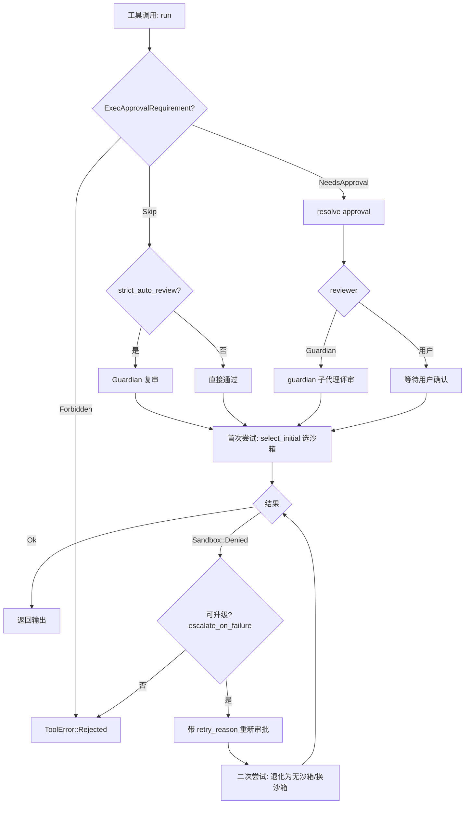
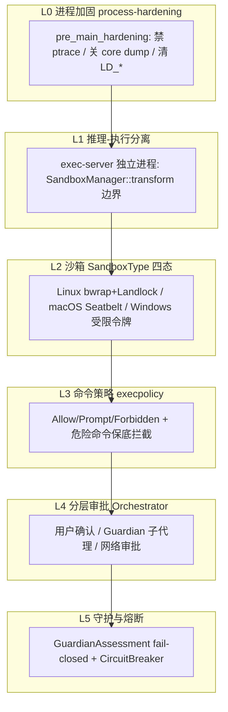


> 《Codex Agent / Harness 深度解剖》系列 · 第 4 篇  
> 源码基准：OpenAI Codex（Apache-2.0，Rust monorepo）`codex-rs/core`、`codex-rs/sandboxing`、`codex-rs/linux-sandbox`、`codex-rs/windows-sandbox-rs`、`codex-rs/process-hardening`、`codex-rs/ext/guardian`  
> 阅读方式：本文由直觉到实现逐步推进，不分层级，可随读随停。

---

> 一句话：**coding agent 要有用，就得被允许"自己敲命令"；可一旦它自己敲命令，就具备了搞垮你系统的能力。** 这两者之间的张力，是 Codex 整套安全设计的出发点。

---

## 从"一个会自己跑命令的同事"说起

想象你招了个特别能干的同事，你不在时他把活全干了。但他干活的方式是：在终端里敲命令。这意味着他能 `rm -rf`、`cat ~/.ssh/id_rsa`、把环境变量里的密钥 `curl` 到外网、访问内网里隔壁团队的数据库。

他干得好不好，取决于他"想不想作恶"——但你没法保证。他可能被一段恶意 prompt 诱导，可能自己算错了，可能只是手滑。所以问题从来不是"模型善良不善良"，而是：**一个被允许自动执行命令的程序，怎样才能把"手滑"的代价压到最小？**

Codex 给出的答案不是"相信模型不会做坏事"，而是**默认模型会出错、会被骗，于是用工程化的层层防线，把破坏半径锁死在沙箱里**。这一篇我们顺着"它要动手了 → 动手前被拦 → 动手时被关着 → 动手后还有人复核"的顺序，一路摸到源码。

---

## 第一道分水岭：把"想"和"做"拆进两个进程

最朴素的做法是：模型在一个进程里生成命令，同一个进程里直接 `execve` 把它跑掉。危险在于——一旦这个核心进程被某种方式攻陷，攻击者直接拿到的是宿主机的完整权限。

Codex 把"思考"和"动手"分到不同进程：

-   **app-server / session**：负责和模型对话、编排工具调用、推进 turn（这一层在前面《Agent 循环》里已经拆过）。

-   **exec-server（或等价执行边界）**：真正把命令跑起来的地方，沙箱变换就在这一层发生。

`sandboxing/src/manager.rs:112` 定义的 `SandboxExecRequest`，注释里把这件事说得很直白——它"只应在执行边界构造"：

```rust
// codex-rs/sandboxing/src/manager.rs:112
pub struct SandboxExecRequest { ... }
```

把"跑命令"隔离在 agent 核心之外，本身就是一种安全设计。哪怕模型产出了一条灾难性指令，它也要先穿过 `SandboxManager::transform`（`manager.rs:321`）这道边界，被映射成带沙箱参数的 `SandboxExecRequest` 之后才落地执行。推理侧不直持 `execve`，于是"核心进程被攻陷即宿主被攻陷"的风险被切掉了一截。

---

## 沙箱四态：给"做"套上笼头

命令终究要跑。沙箱就是给"跑命令"套上的笼头。Codex 用 `SandboxType` 枚举表达四种状态（`manager.rs:35`）：

```rust
// codex-rs/sandboxing/src/manager.rs:35
pub enum SandboxType {
    None,
    MacosSeatbelt,
    LinuxSeccomp,
    WindowsRestrictedToken,
}
```

选哪个，由 `get_platform_sandbox`（`manager.rs:60`）按平台决定：macOS 上用 Seatbelt，Linux 上用 Seccomp，Windows 仅在 `windows_sandbox_enabled` 时返回 `WindowsRestrictedToken`，其余一律 `None`。最终"这次调用要不要进沙箱"落在 `SandboxManager::select_initial`（`manager.rs:280`），它把 `SandboxablePreference::{Auto,Require,Forbid}` 映射到实际决策；`Auto` 时再委托 `should_require_platform_sandbox`（`manager.rs:303`）按文件系统策略、网络策略综合判断。

四个状态的实现各不相同，但默认姿态一致——**能限制就限制，限制不了宁可不放行**。

**Linux（**`LinuxSeccomp`**）**：名字叫 Seccomp，落地却是 **bubblewrap（用户命名空间）+ Landlock（文件系统访问策略）** 的组合，并非单纯 seccomp 系统调用。bwrap 由独立 crate `linux-sandbox` 提供，`sandboxing/src/landlock.rs:23` 的 `create_linux_sandbox_command_args_for_permission_profile` 把权限画像编译成启动参数；`bwrap.rs:74` 的 `system_bwrap_has_user_namespace_access` 探测用户命名空间能力，WSL1 不被支持（`manager.rs:217` 的 `Wsl1UnsupportedForBubblewrap`）。默认网络走托管代理，由代理做域名级 allowlist，而非裸奔出网。

**macOS（**`MacosSeatbelt`**）**：`seatbelt.rs:30` 把 `sandbox-exec` 的路径硬编码为 `/usr/bin/sandbox-exec`——故意不走 PATH，防止被一个同名的恶意 `sandbox-exec` 顶替。策略以内联常量形式存在（如 `MACOS_SEATBELT_BASE_POLICY`），网络侧区分 loopback 与代理端口（`seatbelt.rs:32` 的 `is_loopback_host`），精确放行。

**Windows（**`WindowsRestrictedToken`**）**：在 `sandboxing/src/windows.rs` 与 `windows-sandbox-rs/` 两个 crate 里落地。令牌裁剪、`WRITE_RESTRICTED` 令牌、deny-read ACE、以及 WFP（Windows Filtering Platform）网络封禁都在这。最关键的姿态是 `windows.rs` 里反复出现的 "refusing to run unsandboxed"：当受限令牌**无法直接**强制某些 deny-read / 拆分可写根限制时（如 `windows.rs:121`、`:132`、`:155`），它**拒绝退化为无沙箱执行**，而不是偷偷放行。

**最后一道地基——进程加固**：`codex-rs/process-hardening/src/lib.rs:12` 的 `pre_main_hardening`（用 `#[ctor]` 在 main 前执行）在 Linux/macOS 上 `prctl(PR_SET_DUMPABLE, 0)` 禁 ptrace 附加、关闭 core dump（`lib.rs:56`），并清掉 `LD_*` 环境变量（`lib.rs:60`）——即便链接器已忽略 `LD_PRELOAD`，仍做防御纵深。这是"即便沙箱逃逸也要付出代价"的物理层保险。

---

## 命令策略：哪些命令永远不许自动跑

进了沙箱，命令本身还得再过一道筛查。命令级策略由 `core/src/exec_policy.rs` 的 `ExecPolicyManager`（`exec_policy.rs:277`）负责，底层是 Starlark 规则，核心三态 `Decision::{Allow, Prompt, Forbidden}`。

关键逻辑在 `create_exec_approval_requirement_for_command`（`exec_policy.rs:312`）：

```rust
match evaluation.decision {
    Decision::Forbidden => ExecApprovalRequirement::Forbidden { reason: ... },
    Decision::Prompt    => /* 可能升级为 Forbidden，或 NeedsApproval */,
    Decision::Allow     => ExecApprovalRequirement::Skip { bypass_sandbox: ... },
}
```

危险命令的识别在 `dangerous_command_match_for_heuristics`（`exec_policy.rs:708`）：命中 `DangerousCommandMatch::ForcedRm`（`rm -f` 风格，实际匹配在 `exec_policy.rs:1082`）等模式，直接走拒绝/审批路径。`BANNED_PREFIX_SUGGESTIONS`（`exec_policy.rs:53`）列出一堆"永不作为自动允许建议前缀"的启动器（`sudo`、`bash -c`、`python -c`、`powershell -EncodedCommand`、`rm` …），防止把高危前缀写进自动豁免规则。

最反直觉也最重要的一条：**用户关掉审批，危险命令仍被保底拦截**。`AskForApproval::Never` 且命令危险时 → `Decision::Forbidden`（`exec_policy.rs:776`）。用户的"省事"偏好，不能推翻安全底线。

> 命令策略不是"白名单即安全"，而是"默认不信任 + 危险模式强制拦截 + 规则可叠加"。`Forbidden` 优先级高于用户的 `Never`，这是反直觉但正确的设计。

---

## 审批流：谁来决定放行

所有工具执行的最终出入口是 `core/src/tools/orchestrator.rs` 的 `ToolOrchestrator::run`（`orchestrator.rs:136`）。模块顶部注释把流程写得清楚：approval → select sandbox → attempt → 被拒时升级沙箱重试（靠缓存无需重复审批）。

### 一次执行的决策流



### 沙箱被拒后的重试

`orchestrator.rs` 里最精妙的失败处理：首次尝试返回 `Sandbox::Denied` 时——

-   若 `!tool.escalate_on_failure()` → 直接拒绝（`orchestrator.rs:336`）；

-   否则构造 `retry_reason`（网络被拦报 host，否则 `build_denial_reason_from_output`，`orchestrator.rs:529`），**并重新走一次审批**；

-   关键安全细节（`orchestrator.rs:395`）：若开了 `strict_auto_review`，沙箱内尝试的 Guardian 审批**不覆盖**"无沙箱重试"——重试必须重新过 Guardian，避免"用沙箱审批去换无沙箱执行"的越权；

-   重试阶段按 `unsandboxed_allowed` 与 `should_sandbox` 重新选 `retry_sandbox`。

### 网络审批

网络不是"能出网就出网"。流程由 `tools::network_approval` 驱动：运行中代理放行，再收尾。`begin_network_approval`（`tools/network_approval.rs:1060`）、`finish_immediate_network_approval`（`network_approval.rs:1114`）、`finish_deferred_network_approval`（`network_approval.rs:1129`）是真正实现，orchestrator 在 `orchestrator.rs:66` 调用、在 `:113-125` 按两种 `NetworkApprovalMode` 收尾。

> （注：旧版把这几个函数误归在 `orchestrator.rs`；实际它们定义在 `tools/network_approval.rs`，orchestrator 只是调用方。）

被拒消息在 `network_policy_decision.rs:46` 的 `denied_network_policy_message`：区分 `denied`（策略显式拒绝、不可从此 prompt 批准）、`not_allowed`（不在当前沙箱 allowlist）、`not_allowed_local`（私网/本地被拦）、`method_not_allowed`、`proxy_disabled` 等。被拒后可派生 `NetworkApprovalContext`（`network_policy_decision.rs:26`）走用户/Guardian 审批，并把 `NetworkPolicyAmendment` 转成 execpolicy 网络规则（`execpolicy_network_rule_amendment`，`network_policy_decision.rs:74`）。

### 文件写入安全（patch）

非命令类写操作走 `core/src/safety.rs` 的 `assess_patch_safety`（`safety.rs:32`），产出 `SafetyCheck::{AutoApprove, AskUser, Reject}`。核心约束 `is_write_patch_constrained_to_writable_paths`（`safety.rs:135`）：只有所有 patch 目标都在可写根内且能强制沙箱时，才 `AutoApprove`；注释还提醒要考虑硬链接逃逸（`safety.rs:64`），所以即便 patch 看似受限，仍放进沙箱执行。

---

## Guardian：让机器也来把一道关

当 `approvals_reviewer = "auto_review"` 时，审批不再只等人，而由一个**独立的 LLM 子代理会话**做风险评审。

接入点在 `ext/guardian/src/lib.rs:72` 的 `install`，它把 Guardian 注册为 Thread 生命周期贡献者，并持有 `agent_spawner` 用以 fork 专门的 guardian 子代理。评估契约是 `core/src/guardian/mod.rs:63` 的 `GuardianAssessment`：

```rust
// codex-rs/core/src/guardian/mod.rs:63
pub(crate) struct GuardianAssessment {
    pub(crate) risk_level: GuardianRiskLevel,
    pub(crate) user_authorization: GuardianUserAuthorization,
    pub(crate) outcome: GuardianAssessmentOutcome,   // Allow | Deny
    pub(crate) rationale: String,
}
```

评审在 `guardian/review.rs:633` 的 `review_approval_request`：先发 `EventMsg::GuardianAssessment{ status: InProgress }`（透明展示），再 `run_guardian_review_session_with_retry`（`review.rs:923`）跑评审。

**Fail-closed（失败即拒绝）是 Guardian 的底线：**

-   超时（`GUARDIAN_REVIEW_TIMEOUT` = 90s，`mod.rs:46`）→ 返回 `ReviewDecision::TimedOut`（按拒绝处理），并推送 `GuardianWarning`（`review.rs:481`）；

-   取消（`Cancelled`）→ `ReviewDecision::Abort`（`review.rs:518`）。

还有熔断器：`GuardianRejectionCircuitBreaker`（`mod.rs:71`）。连续 `MAX_CONSECUTIVE_GUARDIAN_DENIALS_PER_TURN = 3`（`mod.rs:48`）次拒绝即主动打断当前 turn，防止 agent 在 Guardian 反复拒绝时陷入死循环。

> Guardian 把"审批"从"一次性的人肉点击"升级为"带超时、可熔断、结构化输出的机器评审"。它和沙箱是正交的两层——沙箱管"能力边界"，Guardian 管"意图风险评估"。

---

## 把六层拼成纵深防御

任何一层失效，都有下一层兜底：



| 层 | 核心模块 | 主要符号 | 失败兜底 |
| --- | --- | --- | --- |
| 进程加固 | `process-hardening` | `pre_main_hardening` | ptrace/转储被禁，逃逸代价高 |
| 推理-执行分离 | `sandboxing::manager` | `SandboxExecRequest`, `transform` | 核心进程不直持 `execve` |
| 沙箱 | `sandboxing` / `linux-sandbox` / `windows-sandbox-rs` | `SandboxType`, `select_initial` | 无沙箱能力时策略/审批拒绝放行 |
| 命令策略 | `core::exec_policy` | `ExecPolicyManager`, `Decision` | 危险命令 `Forbidden` 高于 `Never` |
| 分层审批 | `core::tools::orchestrator` | `ToolOrchestrator::run`, `ApprovalReviewer` | sandbox-denied 重试仍须再审批 |
| 守护熔断 | `core::guardian` | `GuardianAssessment`, `CircuitBreaker` | 超时即拒、连续拒绝打断 turn |

---

## 和 Docker / Claude Code 对照

| 维度 | Codex（`codex-rs`） | Docker 全隔离 | Claude Code 权限模型 |
| --- | --- | --- | --- |
| 隔离粒度 | 进程级沙箱（命名空间/Landlock/Seatbelt/令牌），命令级 | 容器级（完整 OS 隔离、独立文件系统/网络栈） | 命令/文件/网络权限规则 + 可选沙箱 |
| 默认网络 | 托管代理 + 域名 allowlist（`network_policy_decision`） | 默认桥接可出网，需显式 `-p`/`--network none` | 可按权限允许/拒绝网络 |
| 危险命令处理 | `execpolicy` 危险模式保底 `Forbidden`，优先级高于用户 `Never` | 容器内有 root，靠镜像/策略约束 | 危险命令仍走权限确认/阻断规则 |
| 审批主体 | 用户 **或** Guardian 子代理（`auto_review`）；可熔断 | 无（运维侧人工） | 用户确认 + 权限规则 |
| 失败姿态 | fail-closed（超时拒、无沙箱能力时拒放行） | 取决于配置 | 默认询问用户 |
| 自愈/重试 | sandbox-denied 升级重试，但重新审批 | 无自动重试 | 手动重跑 |
| 适用场景 | 终端开发者本机自治 agent | 部署/CI/多租户 | 开发者本机 agent |

核心差异：**Docker 追求"强隔离"但牺牲了本机自治的轻量交互；Claude Code 偏向"用户确认的权限规则"；Codex 走的是"轻量沙箱 + 机器守门员 + fail-closed 策略"的中间路线**——既保留本机直接执行的体验，又把破坏半径压到沙箱内。

---

## 心智模型

> **安全自治 = 把"跑命令"收口到一个独立进程（L1），用沙箱套上笼头（L2），用命令策略拦死危险模式（L3），用分层审批兜底意图（L4），再用机器守门员 fail-closed 收尾（L5），最底下还有进程加固托底（L0）。任何单层被绕过，下一层仍在。**

可迁移的几点：

1.  **默认不信任模型，而不是默认信任用户偏好**——`Forbidden` 高于 `AskForApproval::Never`（`exec_policy.rs:776`），这条值得所有 agent 框架抄走。

2.  **推理-执行分离是最便宜的纵深**——把"跑命令"收口到 exec-server 的 `transform`，核心不被直接攻破。

3.  **沙箱要"失败即拒绝"，而非"失败即放行"**——Windows 无法强制限制时直接 `refusing to run unsandboxed`（`windows.rs:121`），`unsandboxed_allowed` 为假时 orchestrator 直接拒（`orchestrator.rs:373`）。降级路径一旦默认放行，沙箱就形同虚设。

4.  **机器守门员要 fail-closed + 有熔断**——Guardian 超时即拒（`review.rs:481`），连续 3 次拒绝打断 turn（`mod.rs:48`），避免 agent 与守门员互锁死循环。

5.  **审批与执行解耦但关联**——sandbox-denied 重试必须重新审批，尤其开了 `strict_auto_review` 时，沙箱内的 Guardian 审批不能"兑换"成无沙箱执行（`orchestrator.rs:395`）。

---

## 自测题（检验你是否真懂）

1.  为什么"把思考和动手拆进两个进程"本身就是一种安全设计？它防的是哪类风险？

2.  `SandboxType` 四个状态分别用什么技术实现？它们共同的默认姿态是什么？

3.  为什么 `AskForApproval::Never` 关掉审批后，危险命令仍被 `Forbidden` 拦截？这条设计反直觉在哪里？

4.  sandbox-denied 重试为什么"仍须重新审批"？`strict_auto_review` 在这里防的是什么越权？

5.  Guardian 的 fail-closed 体现在哪两处？熔断器为何要打断 turn 而不是一直重试？

---

## 延伸阅读（结合网络讲解）

-   **Codex 安全模型官方说明（sandbox / approval / network policy）**：github.com/openai/codex（`codex-rs` 各 crate 的 README 与 `docs/`）

-   **OpenAI Codex CLI 安全与权限（sandbox-exec、seccomp、Windows token）**：平台级沙箱实现对应 `codex-rs/{sandboxing,linux-sandbox,windows-sandbox-rs}`

-   **The Anatomy of an Agent Loop**（沙箱/审批与 agent 循环的关系）：stevekinney.com/writing/agent-loops

-   **深入理解 Agent Loop: 从 ReAct 到现代 AI Agent**（Claude/OpenAI Agents SDK 实现对照）：cnblogs.com/itech/p/20424166

-   **ReAct 论文**（Thought-Action-Observation 的理论起源）：Yao et al., 2022

---

## 关键符号速查

| 符号 | 位置 |
| --- | --- |
| `SandboxType` | `codex-rs/sandboxing/src/manager.rs:35` |
| `SandboxExecRequest` | `codex-rs/sandboxing/src/manager.rs:112` |
| `SandboxManager::select_initial` / `transform` | `codex-rs/sandboxing/src/manager.rs:280` / `:321` |
| `create_linux_sandbox_command_args_for_permission_profile` | `codex-rs/sandboxing/src/landlock.rs:23` |
| `MACOS_PATH_TO_SEATBELT_EXECUTABLE` | `codex-rs/sandboxing/src/seatbelt.rs:30` |
| `pre_main_hardening` | `codex-rs/process-hardening/src/lib.rs:12` |
| `ExecPolicyManager` | `codex-rs/core/src/exec_policy.rs:277` |
| `create_exec_approval_requirement_for_command` | `codex-rs/core/src/exec_policy.rs:312` |
| `dangerous_command_match_for_heuristics` / `ForcedRm` 匹配 | `codex-rs/core/src/exec_policy.rs:708` / `:1082` |
| `BANNED_PREFIX_SUGGESTIONS` | `codex-rs/core/src/exec_policy.rs:53` |
| `assess_patch_safety` | `codex-rs/core/src/safety.rs:32` |
| `ToolOrchestrator::run` | `codex-rs/core/src/tools/orchestrator.rs:136` |
| `begin_network_approval` / `finish_*_network_approval` | `codex-rs/core/src/tools/network_approval.rs:1060` / `:1114` / `:1129` |
| `denied_network_policy_message` | `codex-rs/core/src/network_policy_decision.rs:46` |
| `GuardianAssessment` | `codex-rs/core/src/guardian/mod.rs:63` |
| `GuardianRejectionCircuitBreaker` | `codex-rs/core/src/guardian/mod.rs:71` |
| `review_approval_request` | `codex-rs/core/src/guardian/review.rs:633` |
| `GuardianExtension::install` | `codex-rs/ext/guardian/src/lib.rs:72` |

