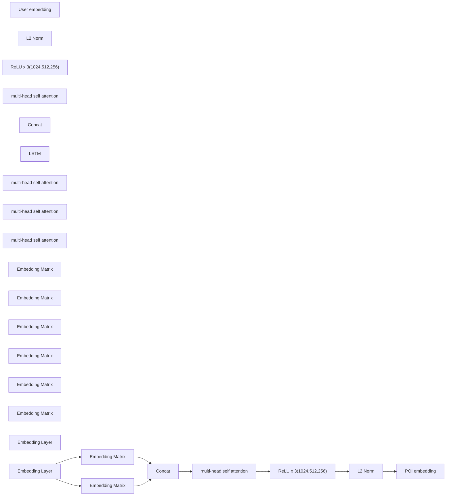


[https://zhuanlan.zhihu.com/p/676513444](https://zhuanlan.zhihu.com/p/676513444)

# 背景

酒店频道内**空搜场景（无query场景）流量较大，是非空搜（有query场景）的1.55倍，目前召回方式相对简单**（个性化召回[基于KV的过去消费+过去看过]+BS全城召回），异地空搜场景基于全城热门召回无法为用户准确推荐目标商家。特此优化基于用户实时行为召回：通过基于用户实时搜筛行为以及用户画像信息等数据进行用户个性化向量召回。

同时，推荐的访购率整体也比较低，远低于空搜和搜索场景 2% vs 8%，列表页 -> 详情页转化率也比较低（26% vs 75%)，虽然预期中也会比较低，但在个性化召回完善后，可以考虑将其复用到推荐场景，提升线上指标和用户体验。

# 目标

提升该场景下的用户访购率、订单

# 模型结构

# 调用链路

1.1 **user侧**：Lego调用TF Serving实时编码，user实时搜筛行为以及用户画像信息等数据的特征向量。

1.2 **索引侧**：构建向量检索索引；接入向量检索引擎HNSW算法提升检索效率。

1.3 **召回语法**：接入RecallAgent进行统一召回。

1.4 **doc侧**：利用Poker周期性更新poi语义向量（天级别更新）

# 特征

## User

1.  用户画像 （8 + 3\*3 = 17）

1.  用户是否有小孩、是否已婚、收入水平预测、注册天数、历史下单次数、常驻城市id、是否为新客、VIP 等级、常驻地区 geohash 5/6/7 、该 geohash 对应的消费人数、均价、历史最高消费额等信息

2.  用户统计类特征（10）

1.  用户消费历史特征：用户消费总订单数、距离最后一次消费的天数、距离第一次消费的天数、用户第一次消费和最后一次消费的间隔天数
2.  用户消费量：用户消费均价、用户平均每家店消费金额
3.  用户点击价格分段
4.  用户支付价格分段
5.  用户价格偏好

3.  用户实时行为序列（4\*3 + 4 = 16）

1.  最近 60 / 300s / 600 / 1800 s 的浏览/点击 支付的 POI list
2.  user 最后浏览的 1 / 5/ 10/ 30 个 POI 的 list

4.  用户历史行为序列(3\*3 = 9)

1.  最近 60/90/180 天内的点击 poi list
2.  最近 60/90/180 天内的点击 类别 list
3.  最近 60/90/180 天内的入住城市 id list

5.  历史 query（5+20=25）

1.  实时 1800s 内的全部 query（最多5个）
2.  90 天内的，按照时间由近到远排序，取最近的 20 个 query

## POI（52 个特征）

1.  POI 画像（9）

1.  POI id、是否14天内新开、graph embedding 特征、酒店类别、品牌id、星级、geohash 5/6/7

2.  POI 统计特征（7+6\*6 = 43）

1.  poi 总曝光次数、点击次数、付款次数、搜索点击率、曝光点击率、点击支付率、曝光支付率、近 7/14/30/60/90/180 天内的 下单订单数、支付订单数、支付间夜数、支付率、消费率、退款率

# 样本构建

1.  下单poi 为正样本，曝光未点击为难负样本，其余 in-batch 负采样作为简单负样本。

# 训练策略

采用对比学习的损失函数CoSENT对DNN模型进行训练

# 使用的召回策略

① **空搜空筛下的异地场景触发向量化召回**：非空搜空筛、非智能排序不触发向量召，并且在异地场景下生效；

② **ANN\_score卡控**：通过离线ANN\_score和hitrrate分析，ANN\_score大于0.3阈值的才进行召回，进一步提高精度；

③ **向量召回上限**：100，排在BS 召回前面

# 评估指标

1.  评估指标：Rrcall@K hiterate评估，离线评估 hitrate 约 0.1。分数阈值设置在 0.25（效果留存率为 93%）
2.  Benchmark构建：以北京市的有效poi作为候选集，选取下单于北京的queryid（页面城市为北京）作为ground truth，计算Recall@K召回率。
3.  线上收益：平均召回新增约 2%。

